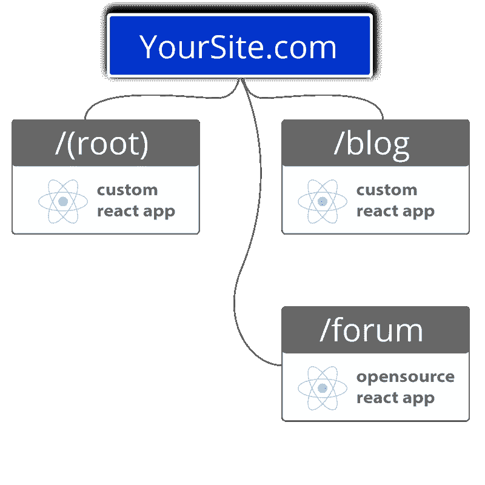

# 您应该使用模块化前端的 5 个理由

> 原文：<https://javascript.plainenglish.io/5-reasons-you-should-be-using-modular-frontends-bd8c90f1eabc?source=collection_archive---------11----------------------->

## 什么是模块化前端，它们给个人开发者和企业带来了什么好处？

单体建筑就像是 90 年代。

借助模块化前端架构步入 21 世纪 20 年代，一路收获所有回报。

在这篇文章中，我们将分解什么是模块化前端，然后给出它们给个人开发者和企业带来的好处。

# 模块化前端定义

在模块化方法中，我们使用“路线”,这允许你在每条路线下运行尽可能多的应用或页面。把路由想象成一个网站的子路径。由于它是完全模块化的，每个应用程序/页面都可以由一个开发人员或一个独立的团队创建。

例如，对于/blog 路径，您可以将多个不同的博客页面放在其内部/下面。比如:博客主页、blog1、blog2、blog3、另一个页面上的内容链接列表，甚至另一个页面上的照片库——都在/blog 路径下。

“一条路线下的每个应用/页面都是它自己的 NPM 包或 GitHub repo，”工程总监杰里米·汤姆林森解释道。“这意味着你可以使用不同的团队。也意味着不再堵！”

我们在您的域上独立托管每个路由、应用程序/页面。这意味着不再有子域，使你的网站更容易被客户找到，搜索引擎优化也更好。

对最终用户来说，所有的途径(博客、定价、文档等。)看起来好像所有东西都是用同一个整体代码库编写的。然而，它不是，这意味着代码库更小，因此更容易更新，替换，改变，缩放和修复错误！

# 使用模块化前端的优势

我们只是分享了使用模块化方法的一些好处，但这里有一个完整的列表:

## 单独、独立、较小的前端

我们并不反对 monolith——你可以在 Fathym 上托管 monolith 前端——但是较小的前端也有一定的优势。

例如，这意味着更小的增量部署。增量部署意味着部署时出现重大错误的可能性更小。

独立团队意味着一个团队不会等待另一个团队来发布他们的更新。团队合作让梦想成真，这种工作流程不仅有助于保持网站向前发展，还能让团队和谐地并肩工作。

## 多个团队同时从事他们自己的项目

企业几乎总是有多个目标，他们试图同时实现这些目标。

同样，网站也不再是简单的单页应用程序。

今天，网站几乎必须是复杂的，以满足目标并在客户访问时给他们留下深刻印象。

比方说，假设你是一名摄影师。你会想要一个主页，一个联系页面，一个时事通讯注册页面，一个你所有照片的画廊(当然)，可能还有一个卖照片的电子商务页面，一个有很多页面可以浏览你的作品的商店，等等。

或者你是一家专注于销售胶片相机的公司。这个电子商务页面/商店将包括你找到并出售的所有不同的、独特的相机，他们使用的所有胶片，甚至可能为摄影爱好者提供冲洗他们自己的胶片的设备。在这种情况下，你可能希望在你的网站上有一个地方供客户反馈评论，有一个页面列出并链接你所有的社交媒体账户，还有一个博客向你的客户提供更新。

无论您的团队是小是大，使用模块化前端意味着您可以分而治之。让一个营销团队为你的博客、商店商品和时事通讯服务。让工作人员中的摄影师分享新相机、胶片等的照片。也许一个会计需要看看销售，设定价格等等。

所有这些人都可以同时在他们自己的项目上工作，在他们自己的站点部分，而不会减慢彼此的速度。

想象一群蜜蜂。

在某些情况下，这些工蜂外出寻找它们能找到的最好的花粉，在近处和远处都有搜寻。每只工蜂都在完成自己的任务，然后它们带回来帮助整个蜂巢。

那些蜜蜂以模块化的方式工作，发现了“分而治之”的工作流程，我们也一样。

它允许更小的团队，像我们的(和你的！)，在短时间内完成大的任务和目标。

简单地说，模块化前端为 web 开发提供了一种更有效的方法。

## 允许根据需要扩展团队

模块化前端当然有助于扩展团队。

几乎没有人想永远做一个人的生意。我们想要成长、扩展和成功。

随着你的业务增长，你的网站需要有灵活性，能够随着业务的增长而扩展。

需要给你的网站添加一个新的页面或路径吗？模块化前端允许您随时这样做。因为路径和页面是独立的，这意味着你不需要考虑如何把它放入旧的、巨大的代码库中。

只需在 Fathym 平台中添加新路线，选择自己的冒险。使用[无代码工具，如 Plasmic](https://www.fathym.com/blog/articles/2022/august/2022-08-10-why-we-loved-using-plasmic-for-our-marketing-page) 创建令人惊叹的营销页面、博客等等。使用像 [Docusaurus](https://www.fathym.com/blog/articles/2022/march/2022-03-16-how-i-blog-in-markdown) 这样的低代码工具来创建教程或文档。或者使用 Svelte.js 之类的 JavaScript，从零开始创造一些耀眼的东西。

这取决于你。

## 更小、更有凝聚力的代码库

我们在之前的要点中提到了这一点，现在我们将深入探讨。

整体代码库通常臃肿、陈旧、难以使用。添加一个新的功能、页面或应用程序会带来巨大的麻烦和错误，甚至会毁掉整个网站。

默认情况下，模块化前端有更小的代码库:因为你只需要那个代码库来运行路由的*。*

更小的代码库也使每个代码更容易维护和更改。

它们给予开发者和公民开发者——取决于工具——重写、改变或增量更新前端部分的能力。这意味着修复漏洞或改变网站的部分功能*不会迫使整个网站停机维护。*

这是一个在模块化方法中只使用 React.js 的网站外观的例子。React 为网站的每条路线提供动力，你可能希望不同的代码库指向每条路线的特定目标。

# 具有一个框架的模块化前端

显然，您希望这个例子中的“根”有一个健壮、漂亮的 UI/UX。在你的网站上可能会有各种各样的其他网页的链接。博客有自己的标准；它需要有一个特定的用户界面/UX，一个令人愉快的设计，可点击的博客链接，搜索栏等。这个论坛是上面例子中三个论坛中最简单的一个。

在模块化前端中，为每一个单独的路由使用不同的、更小的代码库是值得的。

# 模块化前端中的组合方法

另一个选择是你可以在你的网站结构中使用任何你想要的高代码、低代码和无代码工具的组合。最终用户可能连一点线索都没有。

例如，你可以用 Plasmic(无代码工具)设计和编写主页，用 Gatsby(低代码)创建你的博客，用 Docusaurus(低代码)创建你的文档，用 React(高代码)从头开始创建你的管理员页面。

如果你不想从头开始建立一个博客，简单地即插即用盖茨比。docs 路线也是如此；Docusaurus 是一个简单直接的解决方案。

能够使用无代码工具也使团队中的“公民开发人员”能够做更多的事情。

# 模块化前端可视化

这个图形有助于将所有这些联系在一起。你不仅为网站使用了多种工具的组合，而且你可以看到团队的独立性是如何工作的，以及每个更新是如何不影响其他的。

# 结论

模块化前端既有趣又实用。它们强大而灵活。

你想如何建立你的前端的限制只是你的想象。

今天就在[Fathym.com 试试吧。](https://www.fathym.com/dashboard)

*最初发表于*[*【https://www.fathym.com】*](https://www.fathym.com/blog/articles/2022/october/2022-10-04-five-reasons-to-use-modular-frontends)*。*

*更多内容看* [***说白了。报名参加我们的***](https://plainenglish.io/) **[***免费周报***](http://newsletter.plainenglish.io/) *。关注我们关于* [***推特***](https://twitter.com/inPlainEngHQ) ，[***LinkedIn***](https://www.linkedin.com/company/inplainenglish/)*，*[***YouTube***](https://www.youtube.com/channel/UCtipWUghju290NWcn8jhyAw)*，以及* [***不和***](https://discord.gg/GtDtUAvyhW) *。对增长黑客感兴趣？检查* [***电路***](https://circuit.ooo/) *。***