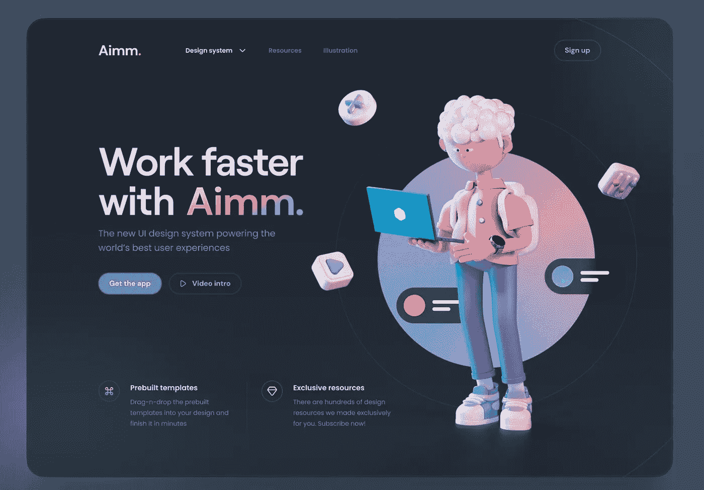
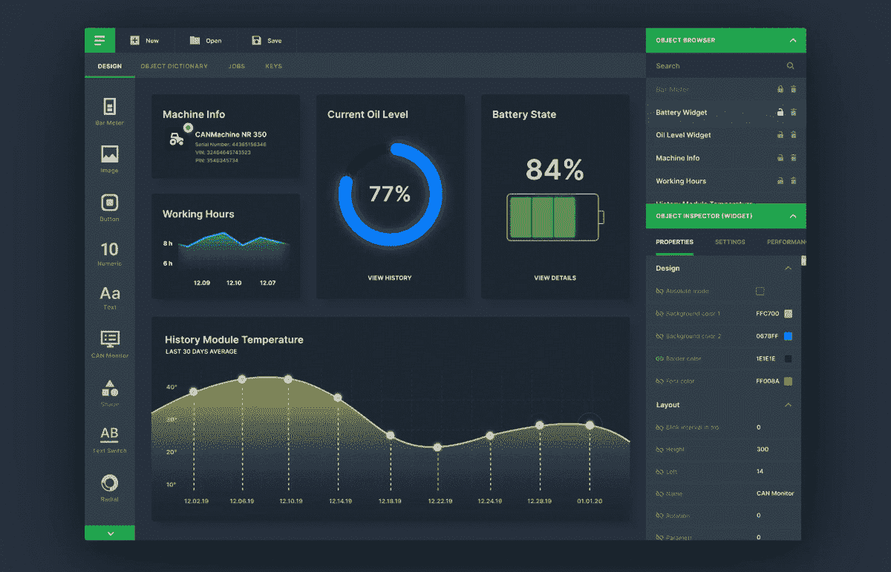
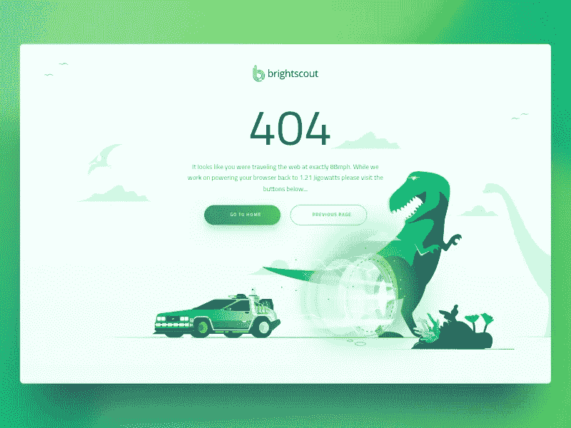
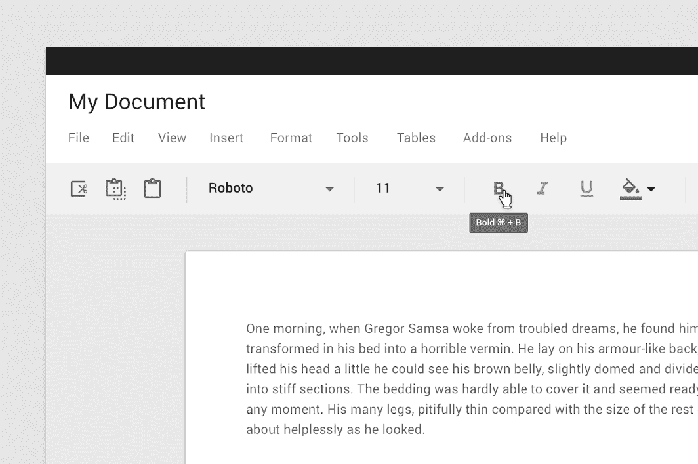
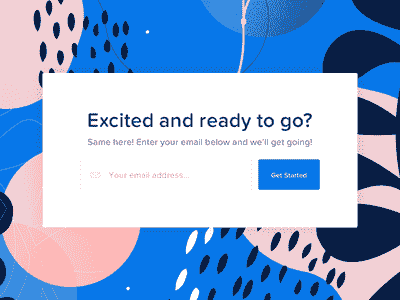

# 让你的网站脱颖而出的 5 件简单的事情

> 原文：<https://javascript.plainenglish.io/5-simple-things-you-can-do-to-make-your-website-standout-1e1eaf646b7b?source=collection_archive---------22----------------------->

## 简单但具有挑战性的事情，你可以实现创建独特的网站

Photo by [Ivana La](https://unsplash.com/@heyhoneybunny?utm_source=medium&utm_medium=referral) on [Unsplash](https://unsplash.com?utm_source=medium&utm_medium=referral)

通过访问丰富的在线资源，web 开发变得前所未有的简单。

从添加日历到支持黑暗模式，建网站变成了精挑细选一堆功能的过程。

然而，你的网站的一些特点可以使它真正的出众，你的用户肯定会记住这种体验。

以下是你可以实现的使你的网站与众不同的 5 个功能:

## 1.3D 文本和动画

Source: [Dribbble](https://dribbble.com/shots/16069705-Aimm)

3D 文本和动画已经流行了一段时间了。

利用它们可以给你的网站增加一个独特的方面，而且实现起来也并不困难。

然而，仅仅因为它不难实现，并不意味着它很容易添加到您的网站。我见过相当多的网站弄乱了 3D 文本，这使得这些网站看起来非常像 20 世纪 90 年代，而且格格不入。

## 2.夜间模式

Source: [Dribbble](https://dribbble.com/shots/8296286-Desktop-App-Dashboard-Dark-Mode)

除了为用户在弱光环境下使用网站提供更健康的解决方案之外，提供黑暗模式还可以让网站向用户传达更多的意义。

多年来，实现黑暗模式变得越来越容易，近年来更是如此。

像 YouTube 和 WhatsApp 这样的顶级应用程序已经在它们的应用程序中实现了黑暗模式，就我个人而言，从那以后我再也没有回头看。我在任何地方都使用深色模式，不仅因为我觉得它更美观，还因为它让阅读文本更容易。

此外，在 PWA 中实现黑暗模式是让他们感觉更自然的好方法。 [JavaScript 老师(隐姓埋名)](https://medium.com/u/6727c1eb71f8?source=post_page-----1e1eaf646b7b--------------------------------)在同样的上面写了一篇很优秀的博客。

## 3.Creative 404 页面和错误消息

Source: [Dribbble](https://dribbble.com/shots/4478310-Brightscout-404-Page-version-2).

当然，你的首要任务应该是确保你的用户不会得到 404 页面。

但是，即使他们真的登陆了，你也应该确保你的网站提供了一个好的、有创意的页面，并且与你网站的整体主题相一致。

首先，404 页面不应该只是白纸黑字写着错误代码。相反，它应该遵循网站的主题。

此外，提供一个简洁而有意义的信息以及 apt 网站的链接，比如主页，这是一个很好的方法来确保你的用户不会在登陆一个错误页面后离开你的网站。

除了提供定制的错误页面，实现现代的、用户友好的错误消息也是对您的站点的一个很好的补充。

使用符合[材料设计](https://mui.com/components/snackbars/)的吐司是向用户传达信息的一种干净的方式。

## 4.工具提示

[Source](https://material.io/components/tooltips)

工具提示是当用户与特定元素交互时出现在该元素周围的短消息。

它们是高度具体的和上下文相关的，并且只传达关于特定元素的信息。

如果你的应用程序提供了许多功能，工具提示可以让你更容易向用户传达各种元素的用途。

我见过相当多的提供各种功能的网站，但我经常不得不四处挖掘，找出所有元素的用例。

## 5.行动号召

Source: [Dribbble](https://dribbble.com/shots/3014164-Illustrative-Call-to-Actions).

行动号召是任何网站的关键部分。

网站是有特定目的的。它的目的可能是收集用户的电子邮件，用大量的博客吸引用户，或者像作品集这样简单的东西。

无论目的是什么，号召行动可能是一个重要的方面。它告诉用户下一步该做什么。

例如，在博客末尾放置另一个博客或时事通讯的链接，告诉用户作者希望他们跳转到下一个博客或注册时事通讯。

一个好的行动号召可以让初次访问者成为回头客，让他们疯狂浏览你网站的内容，从而增加你的网站流量。此外，行动号召的[效果也可以通过](https://blog.teknicks.com/how-to-measure-calls-to-action-with-google-analytics)来衡量。

## 最后的想法…

一个优秀的网站是一个简单的网站，成功地实现其目的。

然而，大多数最近创建的网站似乎已经实现了他们想要提供给用户的功能，然而他们并没有太多的吸引力。

保持网站流量和有机增长的一个好方法是通过给你的客户提供最新信息和关注可能对他们有帮助的小细节来重视他们。

此外，性能是决定网站成功的最重要因素之一。

如果你想阅读如何让你的网站加载更快，请查看我最近的博客。

 [## 如何用几行代码让你的网站速度提高 25 倍

### 疯狂减少数据加载时间。

javascript.plainenglish.io](/how-to-make-your-site-25x-faster-with-a-few-lines-of-code-e13056faac2a) 

如果你喜欢读这篇文章，考虑使用[我的推荐链接](https://medium.com/@anuragkanoria/membership)，这样你就可以通过点击[这里](https://medium.com/@anuragkanoria/membership)无限制地访问我的博客以及其他作者的博客。

*更多内容请看*[***plain English . io***](http://plainenglish.io/)*。报名参加我们的* [***免费周报***](http://newsletter.plainenglish.io/) *。在我们的* [***社区***](https://discord.gg/GtDtUAvyhW) *获得独家获得写作机会和建议。*