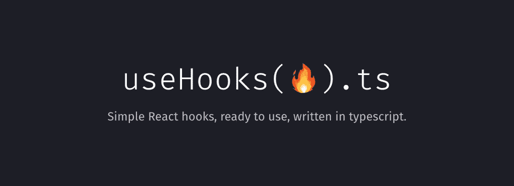

# 你应该已经在使用的 5 个小型和隐藏的 React 库

> 原文：<https://javascript.plainenglish.io/5-small-and-hidden-react-libraries-you-should-already-be-using-49c8725c492f?source=collection_archive---------0----------------------->

如果你像我一样，喜欢在 NPM 目录中寻找小宝石来改进你的开发过程，今天是你的幸运日。

我正在开始一个新的系列文章，其中我将展示一些我发现并每天都在使用的**小而不为人知的库**,这些库将为您省去许多麻烦。

所以，我们开始吧！

# 1.Urlcat

Urlcat 是一个很小的 Javascript 库，它使得构建 URL 非常方便，并且防止了常见的错误。

是的，你可以使用 URL API 来构建你的 URL。但是，你仍然需要为自己考虑一些细节，而不仅仅是建立 URL。

这就是我喜欢这个图书馆的原因。它只是“*即插即用***你不需要学习复杂的模式**或者在文档上花费数小时。

所以，可以试一试:[https://github.com/balazsbotond/urlcat](https://github.com/balazsbotond/urlcat)。

# 2.使用钩子-ts

如果你是 React 开发者，你用的是钩子(*我希望是*)。如果是这样的话，**可能很多时候你不得不为很小的东西创建一个定制的钩子**。例如，用于处理黑暗模式。或者用于窗口调整大小事件。或者很多其他案例。

UseHooks 是一个小型的库，拥有良好的编码、良好的文档记录和完全类型化的(对于 Typescript 用户来说是*)钩子，适用于所有这些小案例，所以您可以专注于项目本身。*

你可以在这里查看:[https://github.com/juliencrn/usehooks-ts](https://github.com/juliencrn/usehooks-ts)。

# 3.Logt

我喜欢到处都有日志，所以当需要知道发生了什么时，我可以检查它们。

而当我编写前端代码时，**我也想要那些日志**。但是有一些必要条件:

*   它必须是完全打字的(*所以我可以在打字稿中使用它而不会有任何头痛*
*   它一定很小
*   它必须有彩色标签(*所以我很快就知道日志类型*
*   它必须有日志级别
*   它必须有某种方法来根据条件隐藏一些日志(*比如它是否是生产版本*
*   必须有可能将这些日志发送到其他地方(就像发送给哨兵一样)

在花了很多时间研究(*并且差不多开始自己编一个*之后，我找到了符合我所有要求的 Logt，**，再加上几个。**

100%推荐！[https://github.com/sidhantpanda/logt](https://github.com/sidhantpanda/logt)

# 4.可加载组件

如果你试图优化你的 React 应用，**你可能使用 React.lazy** 和 Suspense 来延迟加载组件。

那很好。

但是还有更好的方法！比如这个图书馆。显然，在这篇文章中，我无法给出一个完整的解释，说明为什么你应该从 React.lazy 转到这个库，但是你可以随意查看作者的帖子。

基本上几个关键的东西就是**它支持 SSR** ( *服务器端渲染*)**库拆分**，甚至**全动态导入**。不错吧。

最棒的是。真的很好用。**几乎即插即用。**所以，试试吧！[https://github.com/gregberge/loadable-components](https://github.com/gregberge/loadable-components)

# 5.表情符号市场

在做不同的项目时，我总是要处理表情符号。这是现在到处都在使用的东西。而且我通常要在项目中添加一些表情符号选择器组件。

这并不复杂。但是你开始收到更多的要求:它必须**延迟加载表情符号**，它必须支持**国际化**，它必须允许**搜索**，它必须允许使用与**延迟**相同的查询文本…

这需要时间。我能做到。但是客户通常更希望我专注于项目本身。所以…我找到了这个小图书馆。漂亮又有用的一个。

我给你看看，表情集市！[https://github.com/missive/emoji-mart](https://github.com/missive/emoji-mart)

如果你和我一样，**你喜欢寻找这种小而有用的库**，易于使用并且完美地集成到你的项目中。所以，不用担心。我已经准备好分享一个大名单。这是这个系列的前 5 个。请务必**关注我**以便在我发布下一篇文章时得到通知！

同时…

# 🌎我们连线吧！

*   [推特:@thenaubit](https://twitter.com/thenaubit)

*更多内容请看*[***plain English . io***](https://plainenglish.io/)*。报名参加我们的* [***免费周报***](http://newsletter.plainenglish.io/) *。关注我们关于*[***Twitter***](https://twitter.com/inPlainEngHQ)[***LinkedIn***](https://www.linkedin.com/company/inplainenglish/)*[***YouTube***](https://www.youtube.com/channel/UCtipWUghju290NWcn8jhyAw)*[***不和***](https://discord.gg/GtDtUAvyhW) *。对增长黑客感兴趣？检查* [***电路***](https://circuit.ooo/) *。***