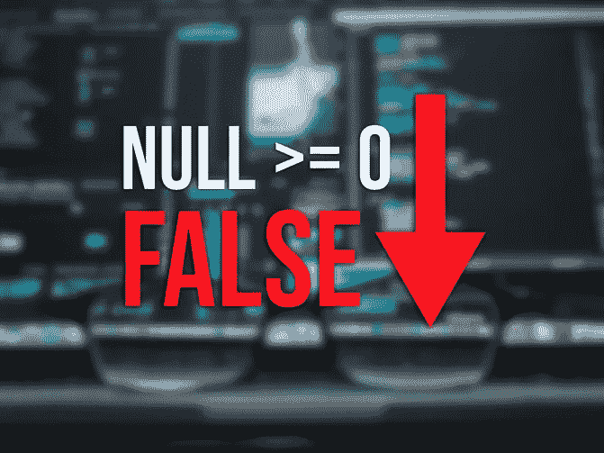
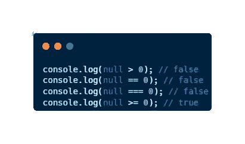
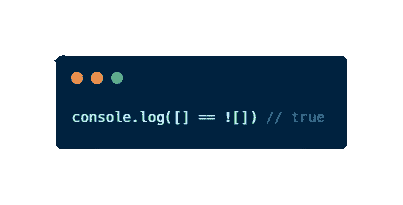
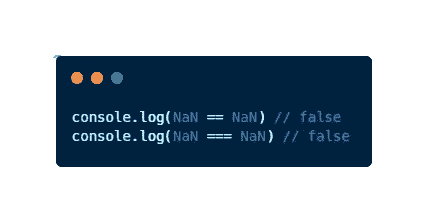
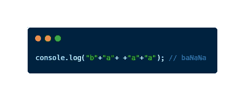
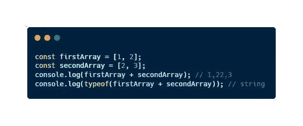

# JavaScript 做的 5 件你无法解释的奇怪事情

> 原文：<https://javascript.plainenglish.io/5-strange-things-javascript-does-that-you-wont-be-able-to-explain-481a792862cf?source=collection_archive---------14----------------------->

## JavaScript 做的一系列奇怪的事情，我还无法解释



我是一名后端开发人员，在一家基于 JavaScript 的公司工作。前几天，我对端点**的逻辑做了一些修改，修改了 null 和 0** 。我做了一些比较，发现了一个**的不协调**，这让我花了整个下午寻找解决这个“bug”的方法。

JavaScript 是一种有趣的语言，有着复杂怪异的东西。在我工作的最后几天里，我遭遇了一对这种奇怪的事情，我决定对这些奇怪的事情进行更多的搜索。事实上，这些事情并不神奇，每一个都有一个解释，在大多数情况下是一个复杂的解释。但是当你不知道解释的时候，它就变成了一个奇怪的轶事

*你在使用 JavaScript 时没有遇到过什么奇怪的事情吗？没问题！让我给你举几个例子来说明我所说的*

# 1.null ≥ 0 吗？

值 null 代表故意不存在任何对象值，所以如果我们有一个值为 0 的变量，如果我们将这个变量与 null 进行比较，null 应该为 false，但是比 0 更市长呢？



null ≥ 0 == false in JavaScript

# 2.和对面一样吗？

如果你在一个 var 中有一个值，很明显这个 var 和它本身不一样，不是吗？当我们讨论数组时，这并不容易



[ ] == ![ ] is true in JavaScript

# 3.你确定这是同一个值吗？

想象你有 5 个，你把它和另外 5 个比较。任何人都会怀疑输出会是真的，不是吗？如果你以这种方式思考，请小心，因为如果我们谈论的是南，那就不是真的。



NaN is not NaN in JavaScript

## 想了解更多关于 JavaScript 的知识吗？

那么这些有教育意义的文章你不能错过；)

[](/what-is-javascript-5-basic-features-that-define-this-amazing-language-9e12d273da8) [## JavaScript 是什么？定义这种神奇语言的 5 个基本特征

### 如果你想成为一名 JavaScript 开发者，你需要知道的 5 个基本特性。

javascript.plainenglish.io](/what-is-javascript-5-basic-features-that-define-this-amazing-language-9e12d273da8) [](/an-easy-and-general-approach-to-unit-tests-using-javascript-examples-1a29ba58c948) [## 使用 JavaScript 示例进行单元测试的简单通用方法

### 在不到 5 分钟的时间内发现一种可理解的方法，使用 JavaScript 进行单元测试，成为更好的…

javascript.plainenglish.io](/an-easy-and-general-approach-to-unit-tests-using-javascript-examples-1a29ba58c948) 

# 4.JavaScript 可以创建香蕉！

这是一个非常流行的 JavaScript 迷因，所以可能你已经知道了。然而，我发现有必要把它列入这个好奇的名单。

你知道吗，如果你在 JavaScript 中输入“a”+“b ”,输出将是“ab ”,因为我们可以使用+运算符来连接字符串，对吗？不总是！因为如果你试着连接像这样的东西:

```
"b"+"a"+ +"a"+"a"
```

你不会得到你所期望的…



Getting baNaNa in JavaScript

# 5.这不是对数组求和的正确方法

当你试图对 JS 中的两个数组求和时要小心。如果你是一个编程初学者，你可以尝试用 JavaScript 来做这件事，你会得到一个非常好的字符串



Obtaining a string from summing up two arrays in JavaScript

# 最后的想法

目前， **JavaScript 是最强大的语言之一**，尤其是当我们谈论 web 开发的时候。就像一个非常强大的工具，它也是一个**怪**。现在我已经用这种语言工作了一段时间，我发现它确实有很多**的巧妙之处**。

在这篇文章中，我们已经看到了 JavaScript 做的 5 件奇怪的事情，我仍然没有解释。我将在以后的文章中解释为什么会发生这些奇怪的事情，但今天只有你必须把它们视为奇闻来教导你办公室里的同事。我希望你和我一样对它们感兴趣。

你还知道其他的 JavaScript 奇闻吗？你用这种语言工作吗？

> *你是不是想买个* [*中等会员*](https://medium.com/@jesuslagares/membership) *？如果你想在媒体上获得最好的内容，考虑一下* [*使用我的推荐链接*](https://medium.com/@jesuslagares/membership) *。同样的价格，你会支持我的工作。*

# 结论👋

谢谢大家！非常感谢您阅读这篇文章。如果你想了解更多关于技术和发展的知识，别忘了跟我来。我很想知道你对此的看法，所以不要花花公子**写在评论里**，我会读给你听。

如果这篇文章已经帮助你记住了，你可以**为它鼓掌**并分享给你的同志们。

# 关于作者🤓

嗨！很高兴见到你！我是**杰西·拉加雷斯**。目前，我是一名后端软件工程师，正在加的斯大学完成我的计算机科学学位。

我的两大爱好是**技术**和**交流**，所以我会抓住一切机会谈论或撰写关于技术的文章。我喜欢把复杂的概念转换成每个人都能理解的简单概念。

# 想要连接吗？📲

📸[**insta gram**](https://instagram.com/jesuslagares_)**|**💼[**LinkedIn**](https://www.linkedin.com/in/jesus-lagares/)**|**📹[Youtube](https://www.youtube.com/c/Jes%C3%BAsLagares)|🐦 [**推特**](https://twitter.com/jesuslagares_)

📩**jesuslagaresgalan@gmail.com**

谢谢！❣️

*更多内容看* [***说白了。报名参加我们的***](https://plainenglish.io/) **[***免费周报***](http://newsletter.plainenglish.io/) *。关注我们关于* [***推特***](https://twitter.com/inPlainEngHQ)[***LinkedIn***](https://www.linkedin.com/company/inplainenglish/)*[***YouTube***](https://www.youtube.com/channel/UCtipWUghju290NWcn8jhyAw)*[***不和***](https://discord.gg/GtDtUAvyhW) *。对增长黑客感兴趣？检查* [***电路***](https://circuit.ooo/) *。*****