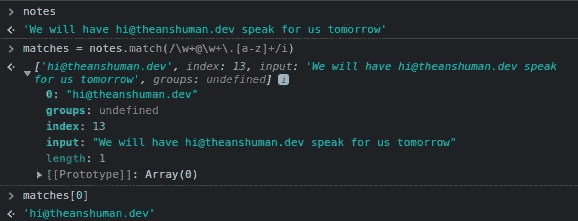
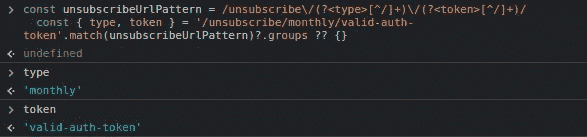
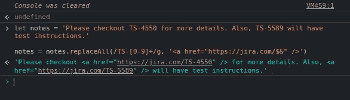
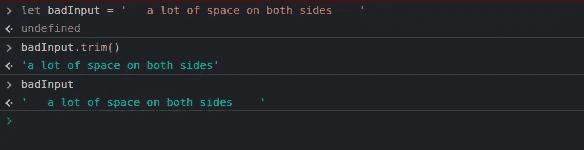

# 每个 JavaScript 开发人员都应该知道的 5 个字符串方法

> 原文：<https://javascript.plainenglish.io/5-string-methods-every-javascript-developer-should-know-272e3ccd4ee6?source=collection_archive---------14----------------------->

## 深入了解 JavaScript 中的 5 种字符串操作方法，让您的生活更轻松。


在所有编程语言中，处理字符串都是不可避免的，所以知道 JavaScript 提供了一些开箱即用的惊人的字符串操作函数是很棒的。

今天，我们将看到五个这样的字符串方法，让你的开发者生活变得简单。

# 包括()

最常见的问题之一是检查字符串是否包含某些单词或符号。例如，检查用户的电子邮件是来自 Gmail 还是 Hotmail。

`includes()`方法检查字符串是否包含所提供的子字符串。它返回一个布尔值。

```
let email = 'hi@theanshuman.dev'email.includes('gmail') // falseemail = 'sundar@gmail.com'email.includes('gmail') // true
```

**提示:**我们可以对上面的用例使用`endsWith`方法，使其更加高效。

# 匹配()

`match()`方法返回与提供的正则表达式模式匹配的子字符串的出现次数。

当我们不知道确切的字符串，但知道我们正在寻找的字符串的模式时，这是有用的。例如，我们不知道用户的电子邮件，但知道字符串中会提到一个电子邮件。



另一个很好的例子是用它来匹配正则表达式中的组。例如，我们有一个取消订阅的 URL，它包含新闻简报的类型和用户授权令牌。

`match()`方法使得从字符串中提取匹配组作为命名值变得非常容易。

```
const unsubscribeUrlPattern = /unsubscribe\/(?<type>[^/]+)\/(?<token>[^/]+)/

const { type, token } = url.match(unsubscribeUrlPattern)?.groups ?? {}
```



# replaceAll()

您一定遇到过在将文本呈现给用户视图之前希望更新文本的用例。例如，您在此发行说明中获得了一些*吉拉*门票号码，并且您想要创建链接，以便用户可以点击它们进行检查。

嗯，这正是`replaceAll()`能帮你的。它用第二个参数替换给定子字符串/正则表达式的所有实例。

```
let notes = 'Please checkout TS-4550 for more details. Also, TS-5589 will have test instructions.'

notes = notes.replaceAll(/TS-[0-9]+/g, '<a href="https://jira.com/$&" />')

// $& is used to insert the matched substring i.e. TS-4550
```



# 修剪()

当你验证表单输入时，用户倾向于在文本输入中留下不必要的空格，这种方法非常方便。

`trim()`方法删除字符串两端的空白并返回一个新的字符串，而不修改原来的字符串。



# toLowerCase()

您可能已经知道这一点，但是当您不知道来自另一端的值是否不区分大小写时，字符串比较可能会很痛苦。

实现这一点的最好方法是将值变成小写，这样两个值都符合相同的大小写。在比较服务器或客户端的值时，比如用户输入和数据库值，这非常方便。

```
const userEmail = // value from inputvalidateSignIn(userEmail.toLowerCase()) // to avoid case sensitive mis-matchfunction validateSignIn(email) {
    // check if email is available on back end
}
```

在上面的例子中，如果我们总是在注册和登录时向后端发送小写邮件，那么我们就可以从用户端避免区分大小写的值错误。

今天到此为止。希望这篇文章对你有帮助！这些是我的五大选择，如果你觉得我错过了一些重要的方法，请在下面随意评论。

更多此类内容，请在 [Twitter](https://twitter.com/sun_anshuman) 上关注我

*下次见！*


# 资源

[MDN 文档](https://developer.mozilla.org/en-US/docs/Web/JavaScript/Reference/Global_Objects/String)

*原载于 2022 年 3 月 7 日*[*https://theanshuman . dev*](https://theanshuman.dev/articles/5-string-methods-every-javascript-developer-should-know-o2d)*。*

*更多内容看* [***说白了就是***](https://plainenglish.io/) *。报名参加我们的**[***免费每周简讯***](http://newsletter.plainenglish.io/) *。关注我们* [***推特***](https://twitter.com/inPlainEngHQ) *和*[***LinkedIn***](https://www.linkedin.com/company/inplainenglish/)*。加入我们的* [***社区不和谐***](https://discord.gg/GtDtUAvyhW) *。**