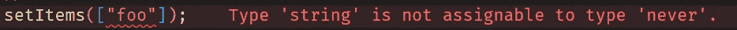

# 使用 React with TypeScript 的 5 个技巧

> 原文：<https://javascript.plainenglish.io/5-tips-for-using-react-with-typescript-a728e2905774?source=collection_archive---------6----------------------->

## 使用 React with TypeScript 时需要掌握的五个有用的技巧。


Photo by [DISRUPTIVO](https://unsplash.com/@sejadisruptivo?utm_source=medium&utm_medium=referral) on [Unsplash](https://unsplash.com?utm_source=medium&utm_medium=referral)

对于我的许多同事来说，创建一个 React 应用程序是他们使用 TypeScript 的第一步。他们中的大多数人也从未上过 TypeScript 课程，因为他们包含了太多不相关的信息，这一点我同意。当在特定的库或框架中编写时(例如，在 React 中)，您很可能不会使用 TypeScript 的许多功能。特别是当你是一个初学者，只写简单的网站时，这里有五个很酷的东西，你可以在编写 React 应用程序时利用它们！

## 1.通用组件和模糊性

泛型类型很神奇；它们让我们能够为任何问题创造通用的解决方案。看看这个列表:

```
interface TListProps<T> {
  items: T[];
  renderItem: (item: T) => JSX.Element;
}const List = <T,>({ items, renderItem }: TListProps<T>) => {
  return <>{items.map(renderItem)}</>;
};
```

在 TypeScript 中，这是一种非常常见的模式。如果对你来说是新的，试着记住它。我们输入一组项目。我们记住每个元素的类型，并将其存储到 t 中。`renderItem`函数独立于我们输入的列表，因此我们可以提供一个动态解决方案:想象我们输入一个字符串数组和一个对象数组——它们必须以不同的方式处理。以下是我们如何使用该组件的示例:

```
<List
  items={["one", "two"]}
  renderItem={(item) => <>{item}</>}
/>
```

在这种情况下，`renderItem`中的`item`将被自动输入为字符串。

当然，这实际上并没有什么作用。作为一个真正的列表，它缺少标记。我想保持这个例子简单，没有任何干扰。

除了通用组件的模式之外，这里还有一个值得注意的语法，我想让您知道。看看列表组件的定义:

```
const List = **<T,>**(...) => {
  return <>...</>;
};
```

我们写`<T,>`。如果您来自另一种使用泛型的编程语言，这看起来会很尴尬。在未来的 TypeScript 版本或设置中，您甚至可以省略逗号。你可以先试着不用它；如果 TypeScript 抛出一个错误，那是因为 TypeScript 认为`<T>`引用了一个 JSX 元素，并且正在寻找一个结束标记。为了消除歧义，我们加了一个逗号。通常，这表明我们需要两个泛型参数。如果我们从不添加第二个泛型参数，逗号将被忽略。这基本上是一个语法黑客。

## 2.使用 CSS / HTML 属性

当定义一个自定义组件时，有时我们希望能够应用外部样式，就像本地 JSX/HTML 元素一样。我们可以通过从 React 类型导入`CSSProperties`来实现这一点。

```
import { CSSProperties} from "react";interface TMyButtonProps {
  style: CSSProperties;
}const MyButton = ({ style }: TMyButtonProps) => <button style={style} />;
```

有了这个定义，我们可以在`MyButton`上使用 styles 属性，就像它是一个普通的 JSX/HTML 元素一样。换句话说，我们得到了样式的自动完成和类型检查。

但是我们甚至可以更进一步。我经常看到人们在自定义按钮上重新定义 HTML 属性。我们可以提供本机 HTML 按钮元素的所有可用属性。为了实现这一点，我们引入了`HTMLProps`类型。这是一个泛型，它希望我们传递想要从中获取属性的元素:

```
import { HTMLProps } from "react";const MyButton = (props: HTMLProps<HTMLButtonElement>) => ...
```

## 3.键入事件

类似于 CSS 和 HTML 属性，`@types/react`也公开事件类型。举个例子，

```
React.MouseEvent<HTMLButtonElement>
React.FormEvent<HTMLInputElement>
React.KeyboardEvent<HTMLInputElement>
```

使用这些类型将允许您在没有内联的事件函数上获得自动完成(内联函数不需要显式类型化)。

## 4.键入使用状态

使用 TypeScript 时，useState 挂钩是一个可以显式类型化的泛型函数。当无法推断出最终类型时，这很有用。例如，当你从一个空数组开始时。TypeScript 无法知道它将保存哪种类型的对象。TypeScript 会抱怨它:

```
const [items, setItems] = useState([]);//
setItems(["foo"]);
//
```



我有时会遇到这样的解决方案:

```
const [items, setItems] = useState([] as string[]);
```

虽然这样做可行，但最好使用通用参数:

```
const [items, setItems] = useState<string[]>([]);
```

尽管这两种方法都有效，但这是一种更干净的管理类型的方式。

## 5.导入非类型化模块

并不是你要导入的每个模块都有类型。幸运的是，在过去的几年中，TypeScript 的适应性有所增强，但是您可能仍然会不时地遇到不支持类型的模块。

您可以通过提供空声明来“关闭”类型检查:

```
declare module "name-of-untyped-module";
```

这将最终把整个模块类型化为`any`。

从我的经验来看，在管理了初始类型之后，对您的编码风格的大多数改进都可以通过掌握泛型来实现。如果您仍然对在代码库中使用泛型感到不舒服，那么有必要看一下整个主题。这个主题的第一步是研究常见的模式，就像我在本文第一部分提到的模式。

就这些了，伙计们！
感谢您的阅读！

*更多内容请看*[***plain English . io***](https://plainenglish.io/)*。报名参加我们的* [***免费周报***](http://newsletter.plainenglish.io/) *。关注我们关于*[***Twitter***](https://twitter.com/inPlainEngHQ)*和*[***LinkedIn***](https://www.linkedin.com/company/inplainenglish/)*。查看我们的* [***社区不和谐***](https://discord.gg/GtDtUAvyhW) *加入我们的* [***人才集体***](https://inplainenglish.pallet.com/talent/welcome) *。*