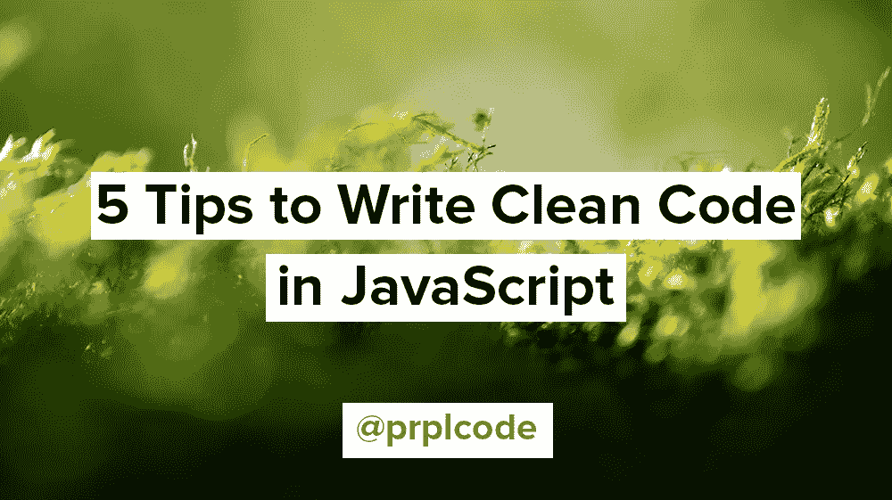

# 用 JavaScript 编写干净代码的 5 个技巧

> 原文：<https://javascript.plainenglish.io/5-tips-to-write-clean-code-in-javascript-25c3f66dd3aa?source=collection_archive---------8----------------------->

## 随着您对 JavaScript 越来越有经验，您应该知道一些关于如何编写干净代码的技巧和原则。



软件工程工艺是一个相对较新的工艺。医学工艺已经存在了几千年，而软件工程只是从 20 世纪 60 年代初才出现。我们都还在学习如何编写干净的代码。尽管有一些原则被社区广泛接受为最佳实践。

写干净的代码有很多原则，但是我决定把重点放在最重要的五条上。这些提示是建议，而不是严格的规则。实践这些原则，你的代码会更干净！

# 为什么干净的代码很重要

作为初学者，你的重点不一定是写干净的代码。你的重点应该是让代码工作，让你的测试通过。随着你越来越有经验，你可以开始专注于编写干净的代码。

在本文中，我将干净的代码定义为:

*   易于阅读
*   容易理解

干净的代码将帮助你跟上并维护代码库。**努力让你的代码更干净总是值得的，即使这会花更长的时间来写！**

# 用 JavaScript 编写干净的代码

和其他语言一样，JavaScript 也有其特殊之处。这些技巧不一定局限于 JavaScript，可以用于许多其他语言。

## 将幻数提取为常数

“幻数”是指直接在代码中使用的数字，没有任何上下文。它们没有意义，应该提取为具有有意义的变量名的常量。

**坏:**

```
const isOldEnough = (person) => {
  // What does 100 refer to? This is a so-called "magic number"
  return person.getAge() >= 100;
}
```

**好:**

```
const AGE_REQUIREMENT = 100; // Now we know what 100 refers toconst isOldEnough = (person) => {
  return person.getAge() >= AGE_REQUIREMENT;
}
```

## 避免布尔函数参数

布尔函数参数是一种典型的“代码味道”(打破了基本的编程标准)。这是因为它们缺乏意义。这表明你的函数不止做一件事，这是你应该避免的！

**坏:**

```
const validateCreature = (creature, isHuman) => {
  if (isHuman) {
    // ...
  } else {
    // ...
  }
}
```

**好:**

```
const validatePerson = (person) => {
  // ...
}const validateCreature = (creature) => {
  // ...
}
```

## 封装条件

长的条件语句很难读懂，因为你必须把它们都记在脑子里。通过将它们封装到一个函数或变量中，你的代码将更容易推理。

**坏:**

```
if (
  person.getAge() > 30 &&
  person.getName() === "simon" &&
  person.getOrigin() === "sweden"
) {
  // ...
}
```

**好:**

```
const isSimon =
  person.getAge() > 30 &&
  person.getName() === "simon" &&
  person.getOrigin() === "sweden";if (isSimon) {
  // ...
}// OR use a functionconst isSimon = (person) => {
  return (
    person.getAge() > 30 &&
    person.getName() === "simon" &&
    person.getOrigin() === "sweden"
  );
};if (isSimon(person)) {
  // ...
}
```

## 避免消极条件句

当你阅读代码时，否定条件句(“双重否定”)给你的大脑增加了一个额外的条件。你不会说“我不困”。你会说“*我困了*”。同样的做法也适用于代码！

**不好:**

```
const isCreatureNotHuman = (creature) => {
  // ...
}if (!isCreatureNotHuman(creature)) {
  // ...
}
```

**好:**

```
const isCreatureHuman = (creature) => {
  // ...
}if (isCreatureHuman(creature)) {
  // ...
}
```

## 不要使用 If 语句

这听起来可能很疯狂，但是听我说完！If 语句易于理解，但不具有伸缩性。一旦在同一个函数中有一两个以上的 if 语句，代码就很容易变得难以理解。

相反，请使用 switch 语句，或者如果可能的话，使用 Array、Set 或 Map 之类的数据结构。

**坏:**

```
const isMammal = (creature) => {
  if (creature === "human") {
    return true;
  } else if (creature === "dog") {
    return true;
  } else if (creature === "cat") {
    return true;
  }
  // ...return false;
}
```

**好:**

```
const isMammal = (creature) => {
  switch (creature) {
    case "human":
    case "dog":
    case "cat":
    // ...
      return true;
    default:
      return false;
  }
}// OR even better, use a data structureconst isMammal = (creature) => {
  const mammals = ["human", "dog", "cat", /* ... */];
  return mammals.includes(creature);
}
```

# 结论

这是我用 JavaScript 写干净代码的五个最重要的原则。熟能生巧，写代码也一样。如果你今天已经遵循了这些原则——坚持下去！我相信你已经练习过很多次写代码了。如果没有，不要气馁！我们都从某处开始🙂

总结一下:

*   将幻数提取为常数
*   避免布尔函数参数
*   封装条件
*   避免消极条件句
*   不要使用 If 语句

*在* [*Twitter*](https://twitter.com/prplcode) *，*[*LinkedIn*](https://linkedin.com/in/simeg)*，或者* [*GitHub*](https://github.com/simeg) 上与我联系

*更多内容看* [***说白了就是***](https://plainenglish.io/) *。报名参加我们的* [***免费每周简讯***](http://newsletter.plainenglish.io/) *。关注我们* [***推特***](https://twitter.com/inPlainEngHQ) *和*[***LinkedIn***](https://www.linkedin.com/company/inplainenglish/)*。查看我们的* [***社区不和谐***](https://discord.gg/GtDtUAvyhW) *加入我们的* [***人才集体***](https://inplainenglish.pallet.com/talent/welcome) *。*