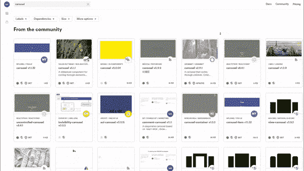
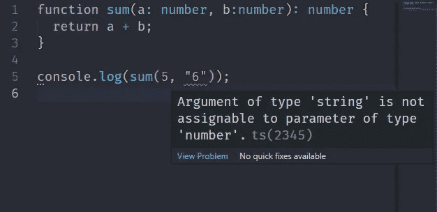
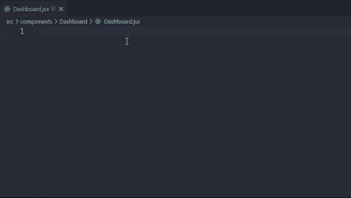
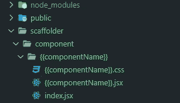
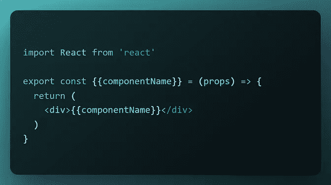
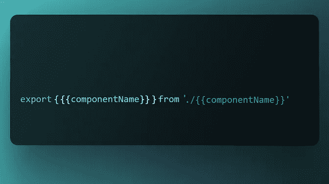

# 加速 React 开发的 5 个工具

> 原文：<https://javascript.plainenglish.io/5-tools-practices-to-help-you-develop-faster-in-react-b884c1b20fc2?source=collection_archive---------1----------------------->

## React 工具、技巧和最佳实践将帮助您更快地构建应用

Original [Photo](https://www.pexels.com/photo/black-motorcycle-on-road-2519370/) by [Kelly](https://www.pexels.com/@kelly-1179532/) @ Pexels

React 没有为样式、数据获取、路由或动画指定惯用的解决方案。您管理状态和组件之间的关系来完成您需要做的事情，使用您需要的任何附加工具来完成它，并将结果呈现给 DOM。

换句话说，它提供了简单性。

我在一个被设计成完全独立的事物中看到了美，并且做*一件*事情——并且完美地完成那一件事情。

因为 React 的核心是如此之小，所以作为一名开发者，你可以做一些事情*在那个领域生存和试验。下面是你可以用 React 构建更快、更好、更可扩展的应用的五件事。*

***剧透:*** *“在推特上关注丹·阿布拉莫夫”不在此列。*😅

# 开始之前

让我们先制定一些基本规则，这样你就知道这个**不是**了。

*   **我不打算讨论多年来一直被认为必不可少的 Dev Tools**——比如 ESLint/ts lint+prettle、React Dev Tools、Emmet 等等。这些有成千上万的教程；它们是必需品。使用它们。
*   **无开发环境建议**。我在 Windows 10 系统上使用 VS 代码，发现它对我有用。对你来说，这可能是另一种组合，因为你已经有了公司执照。使用最有意义的东西；您的开发环境不会拖您的后腿。
*   不“使用这个特定的库，因为它是最好的！''建议任一行为(AG 网格、React 查询、React 挂钩形式等。)*或*风格(MaterialUI、Tailwind、Bootstrap 等。).这些库使用独特的不同范例来解决独特的不同问题，对于哪个问题使用哪个工具的选择，应该由作为工程师的您来决定。

# 1.少量

你在 web 开发中遇到的最大的时刻是当你理解了 React 的可组合性范式，并大声惊叹:*如果 React 支持模块化、组件驱动的开发，为什么我不能从某种组件仓库中获取我需要的组件，并用它们来构建我的应用程序呢？*

这时你会发现[位](https://bit.cloud/)很有用。

Bit 是一个开源工具链和组件中心，它提供了一种简单、可扩展的方式来创建、使用和共享组件，无论您的用例是什么，也无论用例在团队和项目中有多分散。

您可以使用 Bit 从头开始构建整个应用程序，将每个组件创建为它自己的独立包。

除此之外，您还可以发现其他组件，这些组件可以是您自己或您的团队创建的，也可以是其他开发人员在线提供的 Bit 组件。

过程很简单。你进入 [bit.cloud](https://bit.cloud/) ，浏览/搜索发现最适合你的项目的组件，试用它们，然后独立地导入、更新并使用它们组成任何项目——所有这一切只需一个简单的`npm install`。

Looking for a <Carousel />?

想发表和分享自己的吗？太好了！使用[钻头](https://bit.dev/)您可以:

*   从逻辑上识别您的单个组件(或者将它们分解，直到我们得到尽可能小的单元，比如自定义按钮组件)，
*   使它们独立于您现有的库或应用程序的上下文，
*   然后将它们作为一个单独的包在 Bit 上进行构建、测试、版本化和发布，这将为您管理依赖关系。

Bit 是以正确的方式进行组件驱动开发的理想选择——具有易于发现、无限可重用和可扩展的组件。如果您正在寻找构建 React UI 库之类的东西，甚至是整个设计系统，Bit 是我的首选解决方案。

> *💡*顶端的樱桃？默认情况下，位上的任何内容都是[树可摇动的](https://developer.mozilla.org/en-US/docs/Glossary/Tree_shaking)。想要纯粹的原子积木来组成你的应用？直接从您关注表单组件中导入*仅*那个奇特的 CustomButton。

# 2.以打字打的文件

我知道你在想什么。TypeScript 如何帮助我更快地编写代码？！我所有的结构和功能打字不是很繁琐很慢吗？”

TypeScript is a syntactic superset of JavaScript, created and maintained by Microsoft.

有一个学习曲线，但 TypeScript 并不是某种完全陌生的语言，你需要几个月才能弄清楚。从技术上讲，任何 JavaScript 文件都是有效的类型脚本文件，因此迁移不需要是一个巨大的、通宵的、孤注一掷的过程。您可以循序渐进地完成，考虑到您获得的回报，时间投资根本不算什么:

## **1。您可以更快地编写代码，因为您的 IDE 现在可以为您提供更多帮助。**

**采用 TypeScript 就像给你的 IDE 增压**。曾经调用过真正具有未定义/空值的东西吗？曾经在 API 调用中包含错误的字段，或者发送错误的数据类型吗？JavaScript 会非常乐意让您继续前进，而您只会意识到生产中出现了问题。然而，TypeScript 将产生简明的错误，让您确切地知道哪里出了问题——在编码时*。*

Completely valid JS, but somehow, I doubt “56” was the answer you were looking for. With TS, of course, you catch this immediately.

你还可以为你的代码*和*你的 JSX/TSX，为你的所有道具**获得无限好的智能感知，即使你使用的是带有未知道具**的第三方库！与任何测试套件相比，您将在开发过程中发现更多的问题，并支持更多不可预测的行为。

## **2。重构现在已经不重要了。**

因为如果您决定更改类型定义或添加新的类型定义(或者您正在使用的第三方库)，TypeScript 将在每个文件中产生简明的错误，然后您的 ide 可以使用它现在拥有的新的、强大的重构选项来解决这些错误。

## **3。在团队中工作现在是小菜一碟。**

TS 使您的代码自文档化，并具有无限的可维护性。入职也是精简的，因为新员工可以立即投入其中，并对代码库做什么以及如何做有一个精确的想法。

使用[打字稿](https://www.typescriptlang.org/docs/)。简而言之:没有它，开发会更慢，更复杂，风险也更大。

# 3.片段

这个很简单。在样板文件上花更少的时间；把它抽象成几个按键。相反，把更多的时间花在重要的事情上:建造酷的东西。

这里有几个我用过的:

 [## ES7+React/Redux/React-本机代码片段- Visual Studio 市场

### Visual Studio 代码的扩展-使用 ES7+语法在 JS/TS 中扩展 React、React-Native 和 Redux

marketplace.visualstudio.com](https://marketplace.visualstudio.com/items?itemName=dsznajder.es7-react-js-snippets)  [## 简单的 React 片段- Visual Studio 市场

### React 片段和命令的基本集合。只有你需要的，仅此而已。没有 Redux。没有反应…

marketplace.visualstudio.com](https://marketplace.visualstudio.com/items?itemName=burkeholland.simple-react-snippets) 

安装完扩展后，重新启动 VS 代码，然后您可以通过键入快捷键并按 Tab 或 Enter 来使用代码片段。

For example, ‘rafce’ (‘tsrafce’ if you’re using TypeScript) for a functional component that uses the arrow function syntax, and adds a default export.

查看[此处](https://github.com/chillios-ts/vscode-react-javascript-snippets/blob/master/docs/Snippets.md)的快捷键完整列表。

# 4.架子工

[Scaffolder](https://github.com/galElmalah/scaffolder#getting-started) 是一个交互式 CLI 工具/VS 代码扩展，让您使用模板自动生成*任何东西*，不管框架如何。你所要做的就是在你的项目根中创建一个存根文件夹/文件结构，描述你想要自动生成的东西——一个*模板*——Scaffolder 会立即为你创建它，同时在你想要的地方动态替换变量名。

下面是设置 Scaffolder 生成带有动态变量的样板组件的简单方法:

**步骤 1** :在项目根目录下的`scaffolder`目录中编写你的模板。

Use double braces to indicate variable names. This example has a ‘component’ template that will create a folder with the provided name, which holds within it a JSX and a CSS file with that same name.

And here are my CSS, component logic, and barrel templates. (Click each to zoom)

**第二步** : `cd`进入你的组件目录和`npx scaffolder-cli i`。如果你使用的是 VS 代码扩展，右击你的组件文件夹，然后点击`Scaffolder : Use Template`。Scaffolder 的交互式界面将接管并指导您完成命名过程。

**第三步**:恭喜！您已经成功地生成了一个基本的组件结构，而不必手动创建一堆文件和一个文件夹。

最好的部分是:这不是特定于组件(或者甚至是反应)的。你可以用它来创建实用函数、测试、钩子、JSON/YAML 配置文件，任何东西——只要你能为它写一个模板。

# 5.最佳实践

## 使用风格指南并坚持下去。

样式指南是项目的规则集，包含结构化导入顺序的指令(例如，首先是第三方库，其次是代码库导入，最后是 React 内部)，使用内联样式的选择，文件/文件夹/钩子/组件/变量的命名约定，良好的目录结构，等等。

无论你是一个单独的开发人员还是团队的一员，风格指南总是确保代码干净、可维护。

您甚至可以考虑使用 Bit 来创建一个只包含设计令牌/CSS 变量的组件，并将其注入到您的所有组件中——这绝对是一个保持一致性的好方法！

## **将可重用逻辑提取到定制钩子中。**

根据 React 官方文档:*钩子允许我们在不改变组件层次结构的情况下重用状态逻辑*。因此，如果您有在多个地方处理状态-组件关系的代码，请将其提取到一个自定义钩子中。

作为一个例子，这里是我的`useDebounce`钩子。一个简单的去抖器来避免请求冲击外部服务器，它可以在我的应用程序中的每个 API 请求中重用。

哇，我越想越觉得，你甚至可以创建定制的钩子作为单独的 Bit 组件来增加可重用性！

Feel free to use this. Works great for autocompletes!

## **如果您有一个复杂的状态** **配置**，请使用 useReducer 而不是 useState

如果您的状态由非原语组成，如果您的`useState`列表越来越长，如果您的下一个状态依赖于前一个状态，或者如果您有多个事件处理程序更新状态:您最好实现`useReducer` 钩子，而不是**增强代码可读性**和**使调试状态更容易**，一举。

## **停止使用 useEffect 重新创建 componentidmount()**

无论您是在休息之后重新访问 React，还是移植遗留代码，您都需要抛弃古老的类组件范式。具体来说，`useEffect`不是一个生命周期方法。它是道具和状态的快照——一个 [JavaScript 闭包](https://developer.mozilla.org/en-US/docs/Web/JavaScript/Closures) ，它只知道闭包被创建时的封闭值

***加成*** *:现在你知道为什么* `*useEffect*` *需要一个依赖数组了——为了避免陈旧的闭包)。因此，* ***最适合同步 DOM 更新和网络请求，而不是数据流。***

# 结论

React 是现代 web 开发中真正的***标准，在这个意义上，每一个新的框架都必须与它进行比较，并回答“它能做什么来帮助我用模块化技术大规模地构建我需要的东西？”***

***所以这里的动机是分享帮助我在这方面变得更快的工具和实践的组合——使用模块化、组件驱动的思维方式来构建和发布东西——并且希望它们能帮助你做同样的事情！***