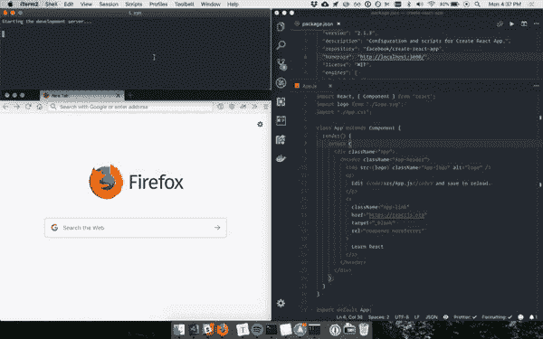
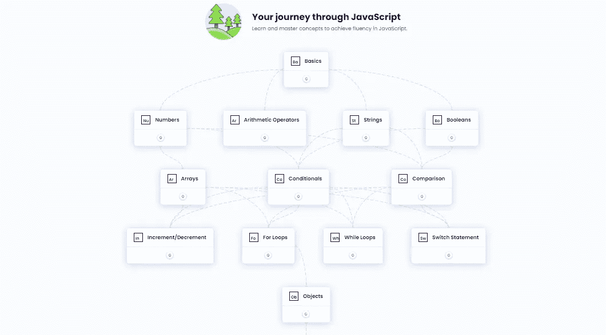
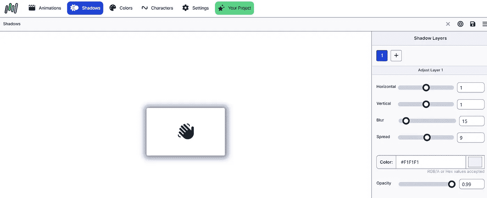
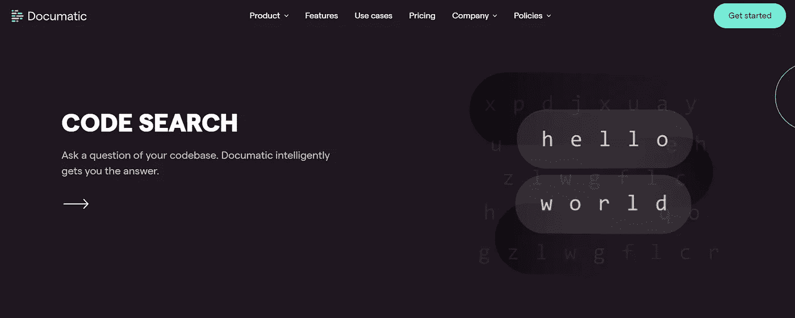
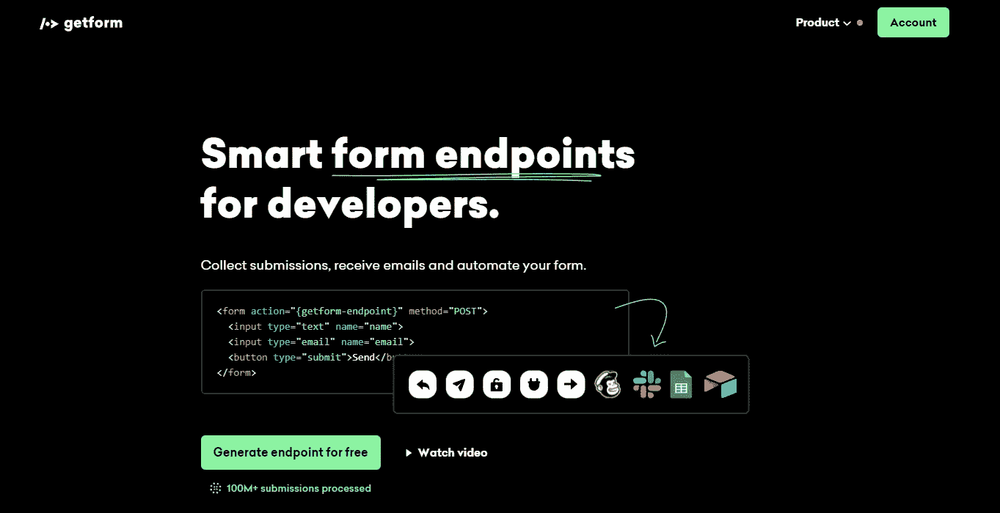
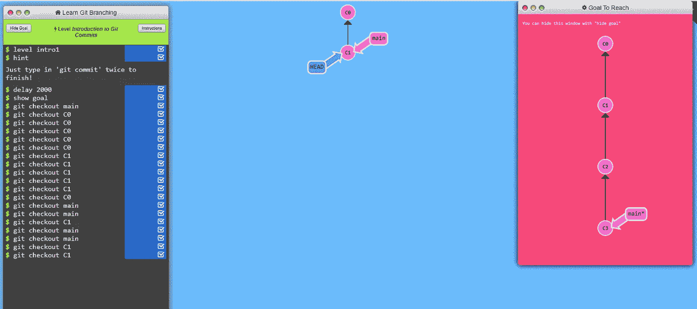

# 2023 年 5 大免费网站有助于更快学习 Web 开发

> 原文：<https://javascript.plainenglish.io/5-top-free-websites-help-to-learn-web-development-faster-in-2023-de1b5aec0791?source=collection_archive---------4----------------------->

## 提升你的开发技能。以有趣的方式练习和学习！

作为一名 web 开发人员，我已经完全明白，作为一名前端 web 开发人员，无疑就是要在堆积如山的代码中寻找导致您的网站在 Safari 中看起来不可靠的那一行代码。这是关于永不放弃，因为你知道，最终，你会找到解决办法。

但这不仅仅是代码的问题。这是与客户合作，了解他们的需求，并将其转化为一个正常运行的网站或应用程序。

而是要有创造力，找到解决问题的新方法。这是关于不断学习，因为网络是不断变化和发展的。

> 如果你正在考虑成为一名前端网站开发者，那么这五个网站将帮助你在 2023 年学得更快

# 练习

[Exercism](https://exercism.org/)

Exercism 是一个免费网站，通过给你额外的挑战来帮助你更快地学习编码。这个网站已经存在五年了，已经帮助了成千上万的人学习编码。

该网站的工作原理是给你一系列的挑战，每个挑战都是为了帮助你理解一个特定的概念。一旦你完成一个挑战，你解锁下一个。

该网站还有一个开发人员社区，他们可以回答您的问题，并对您的代码提供反馈。

# 关键帧

[KeyFrames](https://keyframes.app/)

新一代的 web 开发工具正在出现，这可能有助于降低 CSS 的危害。这些工具是基于浏览器的、移动友好的和私有的。他们可以帮助你更快地学习 web 开发并改进你的工作流程。

其中一个工具是关键帧，这是一个基于浏览器的工具，可以轻松创建和管理 CSS 动画。关键帧被设计为移动友好的，并提供了一个注重隐私的替代其他动画工具。

# Askyourcode

[Askyourcode](https://askyourcode.com/)

如果你还没有遇到从一个更大的代码库中寻找一个特定代码片段的问题，askyourcode 可能是一个无价的资源。

这是一个社区驱动的网站，开发者可以发布问题并回答它们。社区会对答案进行投票，因此您一定会得到与您的问题最相关和最有帮助的回答。

除了问题和答案，askyourcode 还有一个丰富的代码片段库，你可以通过搜索找到你想要的。

# GetForm

[GetFrom](https://getform.io/)

作为一名 web 开发人员，您知道创建表单和端点是一件非常痛苦的事情。但是如果有一种方法可以让这一切变得更容易呢？

GetForm 是一个新的表单构建工具，它使得创建智能表单端点变得容易。使用 GetForm，您可以根据自己的特定需求快速轻松地创建优化的表单。

对于希望在创建表单时节省时间和精力的开发人员来说，GetForm 是一个完美的解决方案。凭借其易于使用的界面和强大的功能，GetForm 可以轻松地创建美观、实用的表单。

# Git 分支

[Git Branching](https://learngitbranching.js.org/)

Git Branching 是一个免费网站，教你使用 GitHub 进行协作的基础知识。向存储库投稿很容易，维护 repos 也很简单。该网站有一个圆滑的设计，它是用户友好的。教程简短扼要。Git 分支是学习如何使用 GitHub 的极好资源。

# 结论

2023 年，帮助教授 web 开发的顶级免费网站将更快、更有效。这是因为将会有更多的在线资源和工具可用。因此，对于那些使用这些免费网站的人来说，学习 web 开发会更容易、更快。

*更多内容请看*[***plain English . io***](https://plainenglish.io/)*。报名参加我们的* [***免费周报***](http://newsletter.plainenglish.io/) *。关注我们关于*[***Twitter***](https://twitter.com/inPlainEngHQ)[***LinkedIn***](https://www.linkedin.com/company/inplainenglish/)*[***YouTube***](https://www.youtube.com/channel/UCtipWUghju290NWcn8jhyAw)*[***不和***](https://discord.gg/GtDtUAvyhW) *。对增长黑客感兴趣？检查* [***电路***](https://circuit.ooo/) *。***