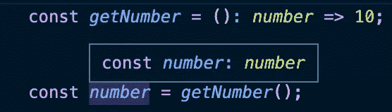

# 将会有回报的 5 堂打字课

> 原文：<https://javascript.plainenglish.io/5-typescript-lessons-that-will-pay-off-911d35974c8?source=collection_archive---------10----------------------->

## 你知道第五条吗？


Image by author, icon by [flaticon](https://www.flaticon.com/free-icons/bad)

在 https://twitter.com/antondevv[](https://twitter.com/antondevv)****通过在 Twitter 上关注我，保持反应和打字的前沿。****

**享受中等？点击 [**此处**](https://medium.com/@anton.franzen/membership) 获取 [**对介质的完全访问**](https://medium.com/@anton.franzen/membership)**

**在本文中，我将介绍我在 TypeScript 开发过程中遇到的 5 个 TypeScript 课程。所以让我们开始吧！**

## **1.为他人编写类型✅**

**我学到的是，你不必为自己编写所有这些额外的代码；它主要面向团队中的其他开发人员，或者您正在从事的涉及多个开发人员的任何项目。**

**因此，无论您为类型、接口等选择什么命名约定。，确保遵循最佳实践，并使其他人能够简单地理解这些类型是什么以及它们的用途。**

**考虑一个用户对象，你需要为它写一个类型:我是这样做的:**

```
type User = {
email: string;
name: string;
...
}
```

**因此用户类型被命名为`User`,这表明它是用户的类型。**

**并确保遵循命名约定等方面的最佳实践。你可以在这里阅读更多关于最佳实践的内容，这通常是我需要查找资料时遵循的。**

## **2.不要凡事都用类型，❌**

**是的，不要不必要地扰乱代码库。**

**TypeScript 为您推断出许多类型，而不要求您指定一个类型，例如:**

**如果有返回数字的函数，可以将返回类型设置为数字。然后有一个变量调用函数并得到返回的数字。在这种情况下，您不需要为变量指定类型。考虑下面的例子来理解我的意思:**

****

**Image by author**

**我们不需要为这个`number`变量设置类型，因为默认情况下 TypeScript 会推断出它。**

## **3.避免类型脚本反模式💀**

**对于 TypeScript 来说，这些都是非常简单的最佳实践，所以一定要了解它们。让我们来看两个反模式:**

****`**any**`**式……******

****当我开始学习 TypeScript 时，我被混淆为 fu*k。所以最终发生的情况是，我对大多数事情都使用`any`，这是一个大❌.****

****因为真的，如果你什么都用`any`的话，使用 TypeScript 甚至没有任何好处。TypeScript 的要点是在变量和函数中有类型。****

****因此，确保在创建和设置类型时遵循最佳实践，查找您不知道的类型，查找 X case 的最佳实践等等。所以与其偷懒写`any`，不如查查，一开始就做对。****

****如果你要使用 TypeScript，那么你最好正确地使用它。:D****

******使用函数类型******

****除了变量之外，`Function`型类似于`any`。因此，当我们为函数添加类型时，我们应该为参数和返回类型指定数据类型，没有必要仅仅将类型设置为`Function`。****

******我们可以为函数创建一个类型别名，如下所示:******

```
**type toLowerCaseFN = (str: string) => string**
```

******并这样使用:******

```
**const toLowerCase: toLowerCaseFn = (str) => str**
```

## ****4.小心点！无效断言❌****

****您以前遇到过这种错误吗？****

```
**Object is possibly 'null'.**
```

****这基本上告诉我们，我们试图做一些操作的变量，可能是空的。****

******这个代码会出现这种情况:******

********

****Image by author****

****因此，为了解决这个问题，您可以*告诉 TypeScript 变量‘str’不能为空，为此，我们可以使用！运算符(非空断言运算符)。*****

********

****Image by author****

****现在错误消失了。****

****在这种情况下，这很好，因为我们已经执行了检查，并且确信`str`实际上是一个字符串🙂****

****另一方面，空断言操作符应该只在绝对确定变量不能为空或未定义时使用。****

****如果有可能不是这种情况，你必须做一个空检查。****

******什么时候*应该*使用？:******

****即使在您执行了空值检查并确定变量不为空或未定义之后，TypeScript 编译器仍继续抱怨。但是你真的应该尽量避免。****

## ****5.信任你的朋友编译器；)****

****TypeScript 编译器可能是一种痛苦…****

****但在 99%的情况下，这是你的错；如果编译器抱怨并拒绝让你做某件事，那很可能是你的错。****

****这是一件好事，因为它将帮助您尽早发现错误，甚至不允许您运行代码。****

****我有一个案例，我为一个客户端构建了一个包含大量逻辑的 reducer 函数，在多个实例中，它抱怨数据可能为空，我知道做出空断言不是一个好主意。所以我重写了一些代码，walla，没有潜在的问题，代码更好，更干净。****

*****你好，如果你想自己体验媒介，请考虑支持我和所有其他作家，注册成为* [***会员***](https://medium.com/@anton.franzen/membership) *每月 5 美元，以保持独立写作的活力，* [***在此注册；***](https://medium.com/@anton.franzen/membership)****

****除了支持他人，Medium 还可以通过写作和在此安家的强大、积极参与的社区来支持你。****

## ****如果你喜欢这件作品，我希望你也会喜欢:****

****[](/4-killer-ways-to-write-typescript-with-react-6a66b32764f1) [## 用 React 编写打字稿的 4 种黑仔方法

### 4 个黑仔打字稿，带反馈提示+ 1 个额外提示

javascript.plainenglish.io](/4-killer-ways-to-write-typescript-with-react-6a66b32764f1) [](/stop-learning-from-react-tutorials-that-suck-5e2031d9bdc7) [## 停止从糟糕的 React 教程中学习

### 不受欢迎的观点

javascript.plainenglish.io](/stop-learning-from-react-tutorials-that-suck-5e2031d9bdc7) [](/3-micro-lessons-about-npm-47759d85f18c) [## 关于国家预防机制的 3 节微课

### 你会喜欢第三条。

javascript.plainenglish.io](/3-micro-lessons-about-npm-47759d85f18c) [](https://betterprogramming.pub/callbacks-vs-promises-vs-async-await-a-step-by-step-guide-f93d13447604) [## 回调 vs .承诺 vs .异步 Await:逐步指南

### 引擎盖下也有点。

better 编程. pub](https://betterprogramming.pub/callbacks-vs-promises-vs-async-await-a-step-by-step-guide-f93d13447604) 

*更多内容看* [***说白了。报名参加我们的***](https://plainenglish.io/) **[***免费每周简讯***](http://newsletter.plainenglish.io/) *。关注我们* [***推特***](https://twitter.com/inPlainEngHQ) *和*[***LinkedIn***](https://www.linkedin.com/company/inplainenglish/)*。加入我们的* [***社区不和谐***](https://discord.gg/GtDtUAvyhW) *。*******