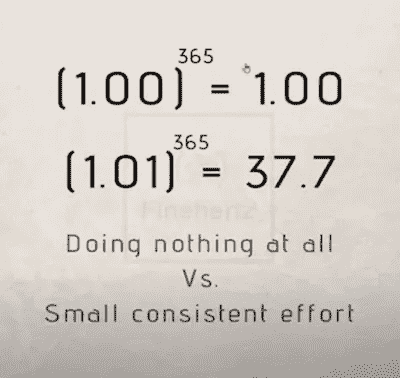

# 作为一名开发人员，你可以立即做的 5 件不为人知的事情

> 原文：<https://javascript.plainenglish.io/5-untold-things-you-can-do-immediately-to-improve-as-a-developer-a7bb8511673d?source=collection_archive---------12----------------------->

#2 建议改进

要看到你职业生涯中非凡的变化，你只需要每天都比前一天稍微好一点。

大的改变不需要大规模的行动，但是每天都要进行小的、集中的改进。

如果你想在一年后的开发生涯中取得超乎你想象的成就，那么每天遵循这五个小习惯，看看一年后它们会把你带到哪里。

# 1.同行评审他人的代码

这带来了以下好处:

*   你练习如何更快地阅读代码。
*   你练习你的调试技巧。
*   你会发现解决常见问题的聪明模式。
*   你找出开发软件的痛点。
*   你帮助你的团队。

所以最后，其他一些事情，比如审查其他人的代码，也会帮助你增长资历，在团队中得到赏识。

# 2.建议改进

我对自己许下了 2022 年的承诺。每周的一个下午，我会花时间分析我所从事的项目中的痛点和未解决的 bug。

这种实践可以帮助你作为开发人员获得更多的经验，并且对你每天看到的代码有更多的信心，因为你将学会掌握这个项目和它的难题。

此外，随着时间的推移，你会慢慢看到你的同事会如何寻求你的帮助，因为你会在你的项目领域树立自己的权威。

# 3.接受新的挑战

如果你让自己总是做例行公事，你将永远不会进步。你将很快达到一个平台期，永远不会在你的职位上有所提升。

相反，试着总是接受一个略高于你水平的新挑战。但是注意不要挑太难的任务，否则很容易气馁。

所以从明天开始，要求你的老板和同事给你更难的任务，包括一些你从未遇到过的事情。寻找 70%的套路，30%的未知。

# 4.练习你的技能

李小龙曾经说过:

> **“我不怕一次练一万次的人，我怕一次练一万次的人”**

这完美地总结了一个重要的教训:熟能生巧。每个专业人士都知道这一点。从伟大的钢琴家到天才的运动员。所以如果你想提高，每天花 30 分钟练习你的编码技能。

学会把今天的困难变成明天的*简单常规*任务。

如果你想找到最好的网站来培养你的程序员思维，看看这些:

*   [黑客排名](https://www.hackerrank.com/dashboard)。
*   [主厨](https://www.codechef.com/)。
*   [代码大战](https://www.codewars.com/)。
*   [TopCoder](https://www.topcoder.com/challenges) 。

# 5.分享你的知识

分享你的知识本身就是一种学习经历，因为你被迫解释和思考你所知道的。另外，在编码领域分享你的技能可以给你带来数百个工作和经济机会。

2022 年分享知识的一些想法包括:

*   开始在媒体上写科技文章。
*   开通一个 Youtube 编码教育频道。
*   编码时实时直播自己。

## 关键外卖

非凡的改变不需要非凡的行动，只需要把每天的努力集中在非常小的习惯上，就会有所不同。

这是成功背后的原则。每天只提高 1%。如果你仍然不相信我，看看这张照片，它向你展示了，通过如此小的努力，你在一年后可以达到的目标。

[IvanOnTech](https://twitter.com/IvanOnTech?ref_src=twsrc%5Egoogle%7Ctwcamp%5Eserp%7Ctwgr%5Eauthor) via Twitter

感谢阅读，
—皮耶罗

**你还想要更多的**？⬇️

## [想学习如何作为一名开发者赚更多的钱并达到财务自由吗？这是我给你的免费指南。](https://tinyurl.com/MoneyDev)

*更多内容尽在*[*plain English . io*](http://plainenglish.io/)*。报名参加我们的* [*免费周报*](http://newsletter.plainenglish.io/) *。在我们的* [*社区*](https://discord.gg/GtDtUAvyhW) *获得独家写作机会和建议。*