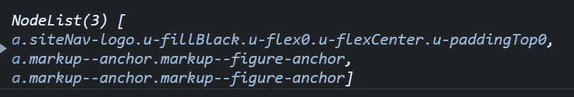
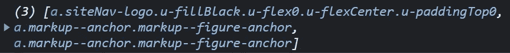

# 5 个不同寻常的 JavaScript 技巧，让您的生活更轻松

> 原文：<https://javascript.plainenglish.io/5-unusual-javascript-tips-that-make-your-life-easier-81f272b2184e?source=collection_archive---------5----------------------->

## 使用这五个简单却不寻常的 JavaScript 技巧，写出更好的代码。


Photo by [David Nicolai](https://unsplash.com/@davidnicolai?utm_source=medium&utm_medium=referral) on [Unsplash](https://unsplash.com?utm_source=medium&utm_medium=referral)

太多关于 JavaScript 技巧的文章只涉及数组函数的基础知识或对代码的明显改进。这篇文章将会更深入，帮助你改进你每天写的代码。

## 1.等待…任何事

有时候，你想等待一些事情发生。虽然这项任务可能会变得复杂(例如，使用非阻塞循环)，但对于大多数等待问题，有一个简单的解决方案:承诺。

承诺可以在给定的超时后解决:

```
new Promise((resolve) => {
  setTimeout(() => {
    // DO Something
    resolve();
  }, 1000);
});
```

此承诺将在大约 1 秒后解决。您还可以将它存储在一个变量中，并使用 await 来阻塞一秒钟(注意潜在的 UX 问题)。虽然您可以找到上面片段的一个用例，但它暗示了一个更有用的技巧。

您可以使用承诺作为信号量:有时，您希望执行一个异步的、长时间运行的流程。但是用户可以一次又一次地触发这个过程。因此，您希望确保正在运行的进程必须在用户可以再次启动它之前完成。方法如下:

```
let processStatus = null;
function myProcess() {
  if (processStatus) {
    return;
  } processStatus = new Promise(resolve => {
    // Do some heavy lifting, for example
    setTimeout(() => {
      // pretending a long running action
      resolve();
    }, 5000);
  })
    .then(() => {
      processStatus = null;
    });
}
```

只有在没有活动进程时，用户才能单击此按钮。这有助于避免多次获取相同的数据。

## 2.使用异步优化 JavaScript 中的循环

我看到许多人在 JavaScript 数组上使用`forEach`函数，但是他们中的大多数人并不知道它的真正威力:异步循环。

```
const asyncArr = [
  new Promise(resolve => setTimeout(resolve.bind(this, 1), 2000)),
  new Promise(resolve => setTimeout(resolve.bind(this, 2), 500)),
  new Promise(resolve => setTimeout(resolve.bind(this, 3), 5000)),
  new Promise(resolve => setTimeout(resolve.bind(this, 4), 1000)),
];asyncArr.forEach(async (el) => {
  const i = await el;
  console.log(i);
});// logs: 2, 4, 1, 3
```

虽然使用 for-of-loop 也可以做到这一点，但使用 await 读起来要优雅得多。下面是使用 for-of-loop 的相同示例。

```
for (const el of asyncArr) {
  el.then(console.log);
}
```

不要让 for-of-loop 更简洁的事实欺骗了你。在这个例子中，我们不用`i`做任何计算。然而，想象一下在 for-const-loop 使用的`then`函数体中做更多的计算。

在这里，使用`forEach`接口可能会遇到两个问题:

首先，它没有返回值。这意味着你改变你的原始数组，或者你根本不改变数组。如果您决定修改数组，您将产生副作用，如果您根本不改变它，这些副作用可能很难调试——好吧。

第二，不稳定。如果不同步遍历所有元素，我无法按照原始数组的顺序记录结果。后一种选择意味着循环会运行得更慢。为了避免这种情况，我们可以结合使用`Promise.all`和`map`。这将产生一个新数组，其中包含我们的异步调用接收到的值，其顺序与原始数组相同。

```
const asyncArr = [
  new Promise(resolve => setTimeout(resolve.bind(this, 1), 2000)),
  new Promise(resolve => setTimeout(resolve.bind(this, 2), 500)),
  new Promise(resolve => setTimeout(resolve.bind(this, 3), 5000)),
  new Promise(resolve => setTimeout(resolve.bind(this, 4), 1000)),
]

Promise.all(asyncArr)
 .then(console.log);// logs: [1,2,3,4] after 5 seconds
```

太棒了。它不会产生副作用，因为它返回一个新的数组(除非`asyncArr`中的函数产生副作用——那你就输了),并且它会返回稳定的结果！

## 3.尽可能避免使用 else

这个技巧简单而有力。在很多情况下，你会看到自己写了一个 else 块，而这可以用两秒钟的思考来避免。所以我给你介绍一些不需要的情况。

**3.1 提前归还**

利用早期返回语句可以帮助您消除第一组不必要的 else 块。请参见下面的示例:

```
function myFun() {
  if (x > 10) {
    // do something
  } else {
    // do something else
  } return someVar;
}
```

这可以被重构为

```
function myFun() {
  if (x > 10) {
    // do something
    return someVar;
  } // do something else
  return someVar;
}
```

您可能会反对:这两个例子在大小上没有太大区别——何必呢？这不是大小的问题，而是可读性和降低复杂性的问题。

任何 if 和 else 语句都会增加函数的复杂性。遇到 else 块的时候，有多长？if-block 有多长？你还记得你读书时身在何处吗？

这里有一个经验法则:用 if 语句处理错误并尽快返回。然后，函数应该做任何 if/else 之外应该做的事情。

**3.2 违反了单一责任原则**

遇到最佳实践的初级开发人员总是问我:我什么时候知道我违反了单一责任原则？我什么时候意识到我的功能不止做一件事？If-else 可以做指标！

```
function myFun() {
  if (x > 10) {
    // do something
  } else {
    // do something else
  }

  if (y < 100) {
    // do something
  } else {
    // do something else
  } return someVar;
}
```

特别是当一个函数中有多个 if-"else if"-else 块时，很可能会违反这个函数的 SRP。上面的例子可以重构为

```
function myFunc() {
  const xValid = checkX(x);
  const yValid = checkY(y);
  return xValid && yValid;
}
```

当然，重构高度依赖于代码的语义。然而，这可能是将上面的例子重写为一个更清晰、可读性更好的函数的一种方法。

**3.3 默认值**

你觉得这个眼熟吗？

```
let x;
if (someVar === "something") {
  x = 1;
} else {
  x = somethingElse;
}
```

考虑一下这个重构:

```
let x = 1;
if (someVar !== "something") {
  x = somethingElse;
}
```

甚至是这个:

```
const x = someVar !== "something"
  ? somethingElse 
  : 1;
```

好了，最后一个例子是用 else(种)。然而，我们避免使用`let`,因为它可能是错误的来源。

## 4.使用`Array.from`进行迭代

好吧，这可能是你们大多数人都熟悉的一个(也许除了`Promise.all`的事情)，但是我遇到了这么多没有意识到这一点的开发者，所以我决定把它放在列表上。

```
const as = document.querySelectorAll("a");
```

`as`的*具体是什么*类型。

首先，你可能认为它是一个数组，但它不是。证明？

```
Array.isArray(as);
// -> false
```

因此，`as.map(...)`行不通。真扫兴。

其次，Chrome 将它显示为一个数组，这可能会让许多人感到困惑。但是，请注意“节点列表(3)”



这意味着它是所谓的“类数组对象”(或可迭代对象)。所以无论什么时候遇到这种对象，都可以从中创建一个数组。

```
const asArray = Array.from(as);
```



这确实是一个数组。现在，你可以在上面使用`map`、`filter`或任何其他数组函数。

## 5.摆脱引用

引用会在代码中引起各种副作用。意识到什么时候你在处理一个引用，什么时候你只是在处理一个值，这是编写无错误软件的关键。但是，我不会详细讨论什么是引用。您将主要在处理对象和数组时体验到这种行为。

问题是这样的:

```
const a = { key: "value" };
const b = a;
b.key = "something else";console.log(a.key);
```

将记录什么？正确，“别的东西。”

`b`只是对`a`的引用，因此每当`b`改变一个被引用的对象键，那么它也会反映在`a`上。我们可以使用几种技术创建一个新的对象`b`，而不引用`a`。

**5.1 解构**

这个已经流行了一段时间了。析构移除所有引用。

```
const a = { key: "value" };
const b = {...a};
b.key = "something else";console.log(a.key); // logs: value
console.log(b.key); // logs: something else
```

**5.2 Object.assign**

析构是`Object.assign`的语法糖，因此引用也可以用这种技术移除:

```
const b = Object.assign({}, a);
```

结果将和析构化一样。

**5.3 Array.from**

如果你正在处理数组，那么你可以使用`Array.from`来去除引用。问题是这样的:

```
const arr1 = [1,2,3,4];
const arr2 = arr1;
arr2[0] = 5;console.log(arr1); // -> [5, 2, 3, 4]
```

它可以像这样使用`Array.from`来解决

```
const arr1 = [1,2,3,4];
const arr2 = Array.from(arr1);
arr2[0] = 5;console.log(arr1); // -> [1, 2, 3, 4]
console.log(arr2); // -> [5, 2, 3, 4]
```

当然，析构也适用于数组。另一件要注意的事情是:`Array.from`不仅适用于“类数组对象”，也适用于数组。

**5.4 最后一招:JSON.stringify**

作为最后的手段，您可以将一个对象字符串化并再次解析它。所有引用都将被清除。

```
const a = { key: "value" };
const b = JSON.parse(JSON.stringify(a));
b.key = "something else";console.log(a.key); // logs: value
console.log(b.key); // logs: something else
```

但是，请注意 JSON.stringify 也会清除任何类型信息。这可能会给你的日期和其他对象带来一些麻烦。

就这些了，伙计们！

如果你喜欢这篇文章，请鼓掌并跟我来，告诉我你会喜欢更多的东西。非常感谢你的阅读和支持！

*更多内容请看*[***plain English . io***](https://plainenglish.io/)*。报名参加我们的* [***免费周报***](http://newsletter.plainenglish.io/) *。关注我们关于*[***Twitter***](https://twitter.com/inPlainEngHQ)*和*[***LinkedIn***](https://www.linkedin.com/company/inplainenglish/)*。查看我们的* [***社区不和谐***](https://discord.gg/GtDtUAvyhW) *加入我们的* [***人才集体***](https://inplainenglish.pallet.com/talent/welcome) *。*