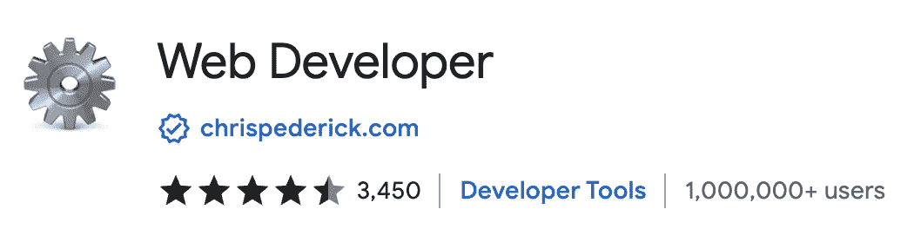
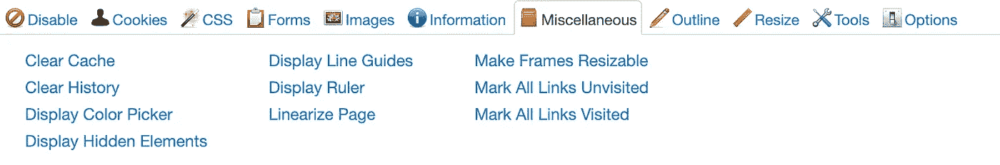
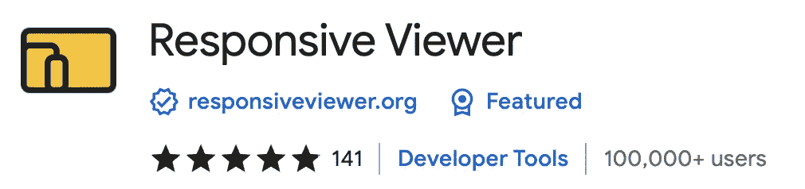
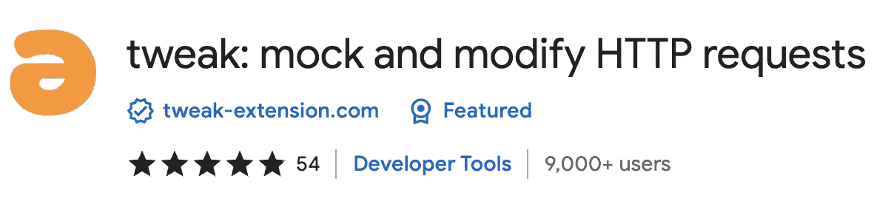
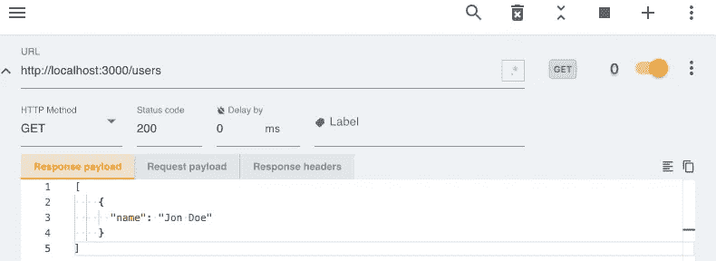
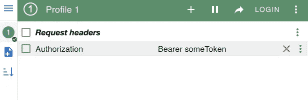
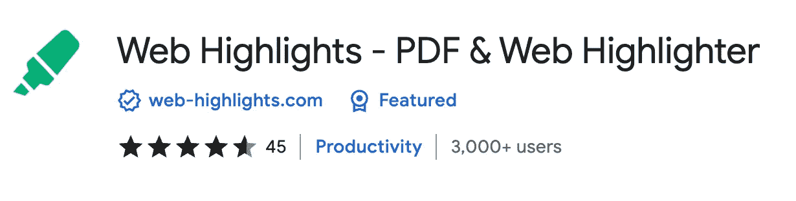
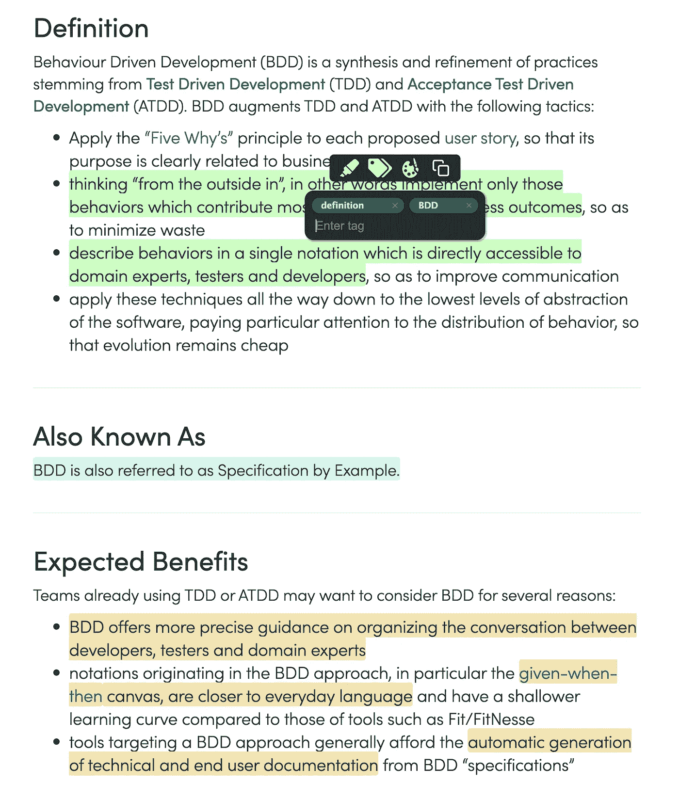

# 5 个对网络开发者有用的 Chrome 扩展

> 原文：<https://javascript.plainenglish.io/5-useful-chrome-extensions-for-web-developers-b87bf6848de6?source=collection_archive---------11----------------------->

## Chrome 扩展提高您的工作效率。

Photo from [Pixabay](https://www.pexels.com/de-de/foto/start-des-white-space-shuttles-34521/)

作为一名 web 开发人员，您在浏览器上花费了大量时间。越重要的是从中获得最大收益。即使内置的 Chrome 开发者工具已经很强大了，我还是想和大家分享一下我最喜欢的 Chrome 扩展。它们让我的日常工作变得不那么繁琐，让我的工作效率大大提高。

 [## 如何构建一个 Chrome 扩展

### 按照这个循序渐进的指南创建你的第一个 Chrome 扩展

javascript.plainenglish.io](/how-to-build-a-chrome-extension-d165f5cde793) 

# 1.Web 开发人员

Chrome Web Store screenshot

我再也无法想象没有 [Web Developer extension](https://chrome.google.com/webstore/detail/web-developer/bfbameneiokkgbdmiekhjnmfkcnldhhm) 的工作生活。它给你的浏览器添加了一个小工具栏，里面有各种 web 开发工具。它提供了许多开发者经常需要的功能:删除 cookies、隐藏图像、验证 HTML、显示密码等。

这个扩展的伟大之处在于它统一了如此多的工具，以至于可以取代许多其他的扩展。例如，我经常需要的东西之一是一个页面标尺，它允许我检查元素是否正确对齐。过去，我为此安装了一个单独的扩展。现在，我可以快速转到杂项部分，并单击显示标尺。

Web Developer extension with its toolbar

# 2.响应观众

Chrome Web Store screenshot

这个[响应浏览器扩展](https://chrome.google.com/webstore/detail/responsive-viewer/inmopeiepgfljkpkidclfgbgbmfcennb)对于前端开发者来说尤其有趣。它使您能够在一个视图中显示多个屏幕。这是开发和测试响应网站和应用程序的理想选择。

我希望 Chrome 开发者工具能提供类似的东西。在他们这么做之前，我会继续这个出色的扩展。

Responsive Viewer extension

# 3.扭

Chrome Web Store screenshot

Tweak 是一个对我测试前端帮助很大的扩展。它允许您模拟或修改 HTTP 请求来测试、开发和演示您的 web 应用程序。

这是测试边缘情况的好方法，或者只是在服务器还没有准备好的情况下模拟服务器请求。

Screenshot of Tweak

# 4.ModHeader

Chrome Web Store screenshot

ModHeader 是另一个帮助修改 HTTP 请求的扩展。它使您能够轻松地更改 HTTP 头。我经常用它来做测试。尤其是手动设置`Authentication`表头。

Screenshot of ModHeader extension

# 5.网页集锦

Chrome Web Store screenshot of [Web Highlights](https://chrome.google.com/webstore/detail/web-highlights-pdf-web-hi/hldjnlbobkdkghfidgoecgmklcemanhm)

[Web Highlights](https://chrome.google.com/webstore/detail/web-highlights-pdf-web-hi/hldjnlbobkdkghfidgoecgmklcemanhm) 使您能够突出显示您在浏览器中访问的每个页面或 PDF 上的文本。您可以提供标签来对您的研究进行分组，并非常容易地重新找到它。你所有的精彩瞬间都会同步到 web-highlights.com[的相应网络应用上。](https://web-highlights.com/)

 [## 网络亮点- PDF 和网络荧光笔

### 在每个网站或 PDF 上创建亮点、书签、标签和文件夹。以结构化的方式组织您的想法和研究…

chrome.google.com](https://chrome.google.com/webstore/detail/web-highlights-pdf-web-hi/hldjnlbobkdkghfidgoecgmklcemanhm) 

听起来这个扩展不是直接为开发人员构建的，但是它帮助我每天保持我的研究有条理。同样很酷的是，你可以与他人分享你的重要发现。例如，[这是我对行为驱动开发](https://web-highlights.com/sharing/8acdab1c-6e36-4659-95e1-92b836ea5d43)的研究。此外，您可以更有效地存储您的书签，并通过手机在移动[网络应用](https://web-highlights.com/)中访问它们。

Screenshot of Web Highlights

# 最后的想法

我希望你喜欢阅读这篇文章。我总是很乐意回答问题，也乐于接受批评。请随时联系我😊

***如果你想支持我的写作，*** [***成为中等会员***](https://medium.com/@mariusbongarts/membership) ***。如果你这样做，我会得到一小笔佣金。谢谢！***

 [## 通过我的推荐链接加入 Medium-Marius bong arts

### 作为一个媒体会员，你的会员费的一部分会给你阅读的作家，你可以完全接触到每一个故事…

medium.com](https://medium.com/@mariusbongarts/membership) 

关注我，不要错过我的下一篇文章。我写了关于 Typescript、Web 组件、前端框架、软件设计模式、Chrome 扩展以及更多的主题！🙏

# 关于我

我是埃森哲互动公司的软件工程分析师。最驱动我的是我想创造一些可能对他人有帮助并改变他人生活的东西的冲动。例如，[**Web Highlights Chrome Extension**](https://chrome.google.com/webstore/detail/web-highlights-%20-bookmark/hldjnlbobkdkghfidgoecgmklcemanhm)使您能够高亮显示您在浏览器中访问的每个页面或 PDF 上的文本。您可以提供标签来对您的研究进行分组，并非常容易地重新找到它。你所有的精彩瞬间都会同步到 web-highlights.com[上相应的网络应用程序中。看看吧！](https://web-highlights.com/)

通过**[**LinkedIn**](https://www.linkedin.com/in/marius-bongarts-6b3638171/)**与我取得联系，或者在 [**Twitter**](https://twitter.com/MariusBongarts) 上关注我。****

# ****进一步阅读****

**** [## 您需要掌握的 5 个类型脚本特性

### 使用这些必备的功能改进您的类型脚本代码。

medium.com](https://medium.com/@mariusbongarts11/top-5-typescript-features-you-need-to-master-475700ce98cd)  [## 具有代码挑战的高级类型脚本:泛型

### 学习高级的 Typescript 特性，并将它们应用到实际的代码练习中

medium.com](https://medium.com/@mariusbongarts11/advanced-typescript-generics-1b30d6b5dd49)  [## 带有类型脚本示例的设计模式:工厂方法

### 工厂方法有助于编程接口，而不是实现。

javascript.plainenglish.io](/design-patterns-with-typescript-examples-factory-method-4d145887b141) 

*更多内容看* [***说白了。报名参加我们的***](https://plainenglish.io/) **[***免费周报***](http://newsletter.plainenglish.io/) *。关注我们*[***Twitter***](https://twitter.com/inPlainEngHQ)*和*[***LinkedIn***](https://www.linkedin.com/company/inplainenglish/)*。查看我们的* [***社区不和谐***](https://discord.gg/GtDtUAvyhW) *加入我们的* [***人才集体***](https://inplainenglish.pallet.com/talent/welcome) *。*******