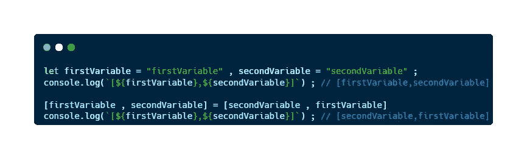
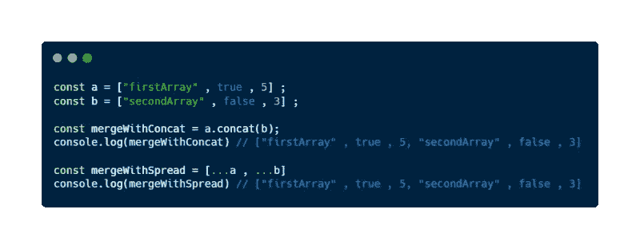
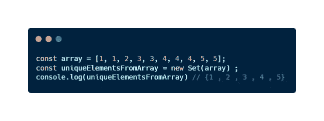
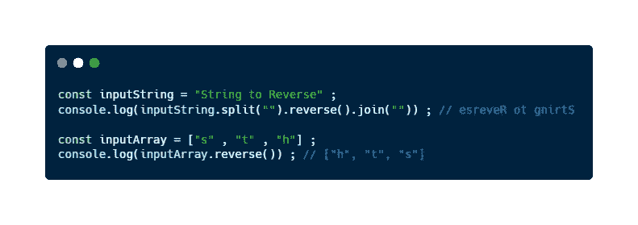
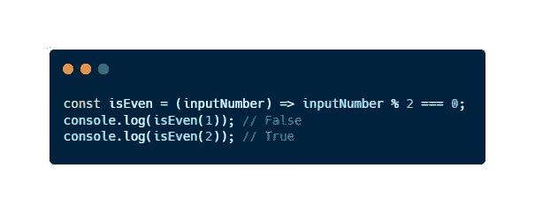

# 5 个对初学者有用的 JavaScript 一行程序

> 原文：<https://javascript.plainenglish.io/5-useful-javascript-one-liners-for-totally-beginners-56e678d9a314?source=collection_archive---------14----------------------->

## 在短短几分钟内，你将能够减少代码行的数量，你必须写，并提高你的生产力与 JS ✨

几天前，我开始作为一名使用 JavaScript 的后端开发者工作。因为这个原因。我正在提高我使用这种语言的技能，我也学到了很多。随着我学到的每一个新东西，我意识到 **JavaScript 是一种神奇的语言，你可以用它做很多事情。**

不仅是因为开发人员用这种语言开发的所有库和框架(NodeJS、ReactJS、NextJS、react native……)，而且它还有一些功能，如箭头函数，**允许我们减少解决问题所需编写的代码行数**。

这些功能使得用这种语言只用一行代码就能做不可思议的事情成为可能。我确信，如果我在开始**的时候就知道一些小程序，我会做得更快** r。因为我不想让你重复这些，这里有 **5 个小程序，即使是大多数初学者也能理解**。

# 什么是一行代码？

一个**单行代码**顾名思义就是只占用一行的**代码。想象一下，你把一段代码压缩成一行，这就是一行代码。你可以用一个简单的**和**打包的**方式在一行中解决特定的问题。

但是使用它时要小心，因为你可能会写出任何人都能理解的复杂的一行程序。如果您使用或创建了复杂、混乱且难以理解的一行程序，最好不要使用它们。然而，如果你很好地使用了简单易懂的俏皮话，就好像你拥有了超能力

此外，使用 JavaScript，我们可以使用一些**内在功能**和**数据结构**来编写非常棒的一行程序。您想了解更多关于 JavaScript 的知识吗？我给你推荐一篇好看的文章；):

 [## 什么是 JavaScript 数组方法？

### 以及为什么如果你想成为一名优秀的 JavaScript 开发人员，你必须学习它们。

javascript.plainenglish.io](/what-are-javascript-array-methods-d24d994f636) 

你是否在问自己是否应该在项目中使用一行程序？检查他们的**好处**并自己决定:

# 了解和使用一行程序的好处

虽然您可以在互联网上找到不同的观点，但是使用一行程序是一种可以给我们带来很多好处的编程实践，例如:

*   它们是找到解决问题的创造性方法的好方法。
*   我们可以利用 JavaScript 的一些好处来创建质量更好的一行程序。
*   如果你使用**正确的一行程序**，你的代码将会**清晰**。
*   你将**减少你必须写的代码行**。
*   能够编写一行语句是非常有趣的事情。
*   当你完全理解他们的时候，你会感觉像个专家。
*   你会**发现一些语言特性**以便给出更简洁的解决方案(比如[数组方法](/what-are-javascript-array-methods-d24d994f636?source=your_stories_page-------------------------------------)，lambda 函数，三元运算符等)。

此外，如果你能正确理解一行语句，你将会学习这门语言，并成为一名更好的开发者。

想一想，如果你不能理解或写出一行语句，你怎么能希望理解或写出更复杂的语句呢？

已经期待在您的代码中使用这种实践了吗？以下是我为初学者准备的 5 个单句俏皮话，你会很容易理解:

## 1.交换两个变量

如果您使用很酷一行程序，那么在 JavaScript 中交换两个变量非常容易:

Swapping variables with only one line

## 2.合并多个数组

作为 JavaScript 开发人员，我们必须完成的一项经典任务是合并数组。你肯定知道几种合并数组的方法。但是，你知道如何只用一行代码合并数组吗？没问题，让我给你举几个例子

Merging arrays using a one-liner

## 3.寻找独特的元素

学习一行程序可以让我们更多地了解这门语言。在这种情况下，一些 JavaScript 一行程序可以使用数据结构而不是箭头函数或内部函数来实现。这里有一个允许您在数组中查找唯一元素的示例:

Getting unique elements from an array using a one-liner

## 4.反转一根绳子

反转字符串是每种语言都可以做的事情。然而，使用 JavaScript，您只需一行代码就可以做到这一点。你也可以反转一个数组。让我们来看看如何:

Reversing a string using a one-liner in

## 5.检查简单条件

如果你的老板要求你检查一个数字是偶数还是奇数，你可能会使用一些如果，这没关系。但是，我在这里给你一个更酷的方法来解决这个任务并赢得你的晋升:使用一句俏皮话。

在 JavaScript 中，您可以构建小的一行程序来检查简单的条件，例如使用奇妙的箭头函数检查一个数字是偶数还是奇数(如果您不知道什么是箭头函数，我推荐您查看我的文章:“ [*什么是 JavaScript*](/finally-understanding-the-arrow-functions-in-javascript-a47eb1f4dbae) 中的箭头函数”)。让我给你举个例子:

Checking if a number is even or odd using a one-liner

# 最后的想法

如今， **JavaScript 是 Web 开发最重要的支柱。许多开发人员喜欢这种语言，因为它的多功能性，因为它有能力**提高开发人员的生产率**和**减少使用一些语言功能(如箭头函数或数组方法)必须编写的代码行数**。这使得它成为应用一行程序的最佳语言。**

在本文中，我介绍了 **5 个简单的 JavaScript 一行程序**,当我解决编码难题或编写项目时，我会用到它们，它们为我节省了大量时间。我认为它们对于初学者来说很容易理解，并且是一个很好的例子。

总之，永远不要忘记那句话:“伟大的力量伴随着伟大的责任”。如果你使用一行程序，你可以提高开发人员的工作效率，你会成为办公室里最酷的人。然而，**这并不意味着你必须降低代码的可读性**和可理解性。不要让使用一行程序成为不好的习惯，明智地使用它们。

*在使用 JavaScript 时，你如何减少代码中的行数？你知道这种语言的其他俏皮话吗？*

# 结论👋

谢谢大家！非常感谢您阅读这篇文章。我很想知道你对此的看法，所以不要写在评论里，我会读给你听。

反过来，如果这篇文章已经帮助你记住了，你可以为它鼓掌，并与你的同志分享。如果你不想错过我的任何一篇文章，别忘了关注我。

# 关于作者🤓

我的两个爱好是技术和交流，所以我抓住一切机会谈论或写关于技术的东西。

# 想要连接吗？📲

📩**jesuslagaresgalan@gmail.com**

📸 [**Instagram**](https://instagram.com/jesuslagares_)

💼 [**领英**](https://www.linkedin.com/in/jesus-lagares/)

📹 [**Youtube**](https://www.youtube.com/c/Jes%C3%BAsLagares)

🐦 [**推特**](https://twitter.com/jesuslagares_)

谢谢！❣️

*更多内容请看*[***plain English . io***](https://plainenglish.io/)*。报名参加我们的* [***免费周报***](http://newsletter.plainenglish.io/) *。关注我们关于*[***Twitter***](https://twitter.com/inPlainEngHQ)[***LinkedIn***](https://www.linkedin.com/company/inplainenglish/)*[***YouTube***](https://www.youtube.com/channel/UCtipWUghju290NWcn8jhyAw)*[***不和***](https://discord.gg/GtDtUAvyhW) *。***