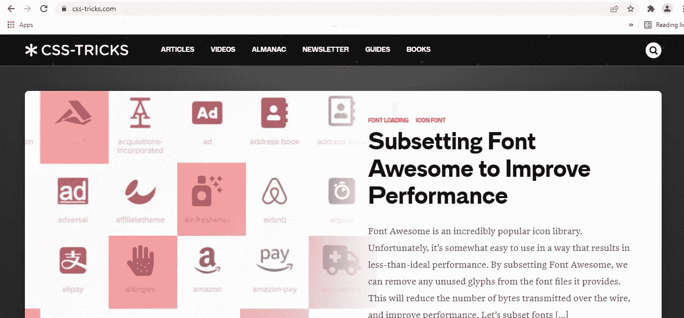

# 2022 年学习前端开发的 5 个有用网站

> 原文：<https://javascript.plainenglish.io/5-useful-websites-for-learning-front-end-development-in-2022-f40529b8dcbc?source=collection_archive---------18----------------------->

## 一些学习前端开发基础的有用网站列表。

Learning Front-end Technologies in 2022

前端开发是主要通过使用 HTML、CSS 和 JavaScript 开发网站用户界面的艺术。这些被认为是任何网站应用程序的组成部分。它有助于最终用户查看和增加与网站的功能互动。下面附上的网站列表是免费的，用于教育目的。以下是一些有用的网站，用于学习基于文本的前端开发的基础知识:

1.  [开发者 Mozilla](https://developer.mozilla.org/en-US/)

这是我学习网络技术中最喜欢的部分。它是一个文档库，是开发人员为开发人员制作的从基础到高级概念的学习资源。

**Developer Mozilla**

2. [**砸弹匣**](https://www.smashingmagazine.com/)

它是一个网站和电子书出版商，为网站开发者和网站设计者提供编辑内容和专业资源。

Smashing Magazine

3. [**CSS 招数**](https://css-tricks.com/)

它提供关于层叠样式表(CSS)以及 HTML 和 JavaScript 的日常文章，以及所有与 web 设计和 web 开发相关的内容。

CSS Tricks

4.**[**W3schools.com**](https://www.w3schools.com/)**

**这是一个免费的学习资源，用于学生和刚刚开始编码之旅的人在线学习编码。**

****

**w3schools.com**

**5. [**FreeCodeCamp**](https://www.freecodecamp.org/)**

**FreeCodeCamp 是一个非营利组织，由一个交互式学习平台、一个在线社区论坛和在线出版物组成，使任何人和每个人都可以访问编码。**

****

**Freecodecamp**

**不管一个人在概念上有多少专业知识，他总是可以修改他们的基础知识。这些是我最喜欢的顶级网站，我每天都会关注它们来提高我的技能水平。**

***更多内容请看*[***plain English . io***](https://plainenglish.io/)*。报名参加我们的* [***免费周报***](http://newsletter.plainenglish.io/) *。关注我们关于*[***Twitter***](https://twitter.com/inPlainEngHQ)*和*[***LinkedIn***](https://www.linkedin.com/company/inplainenglish/)*。加入我们的* [***社区不和谐***](https://discord.gg/GtDtUAvyhW) *。***