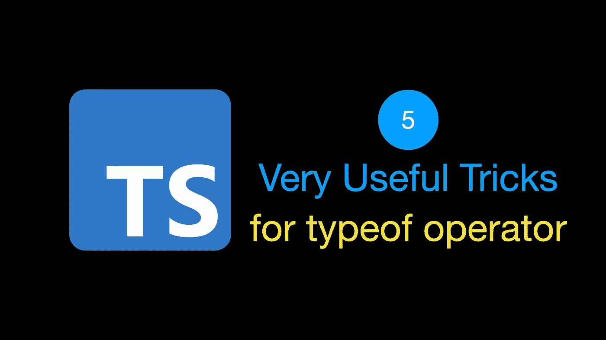
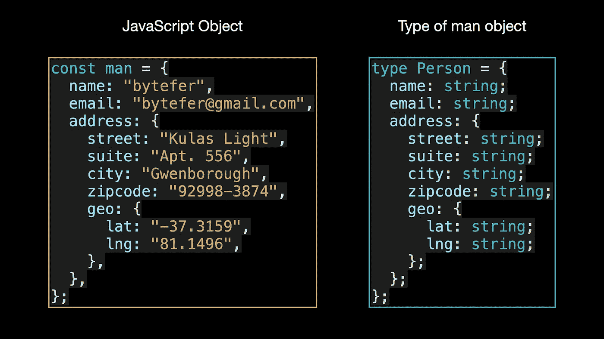
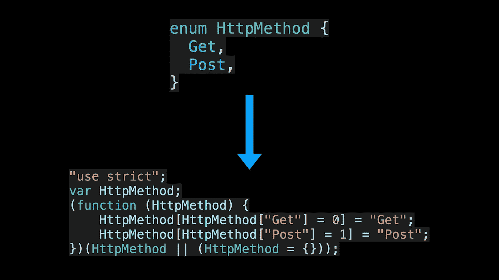
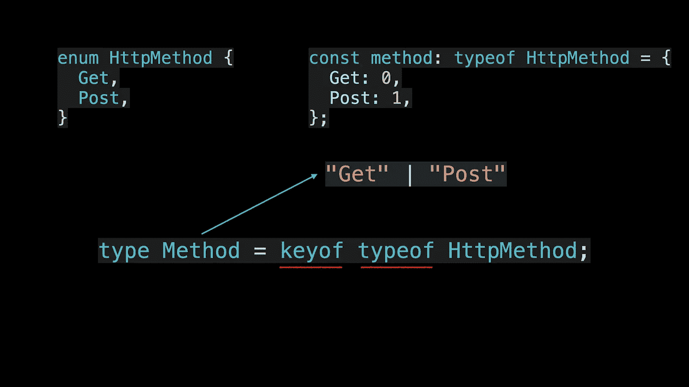
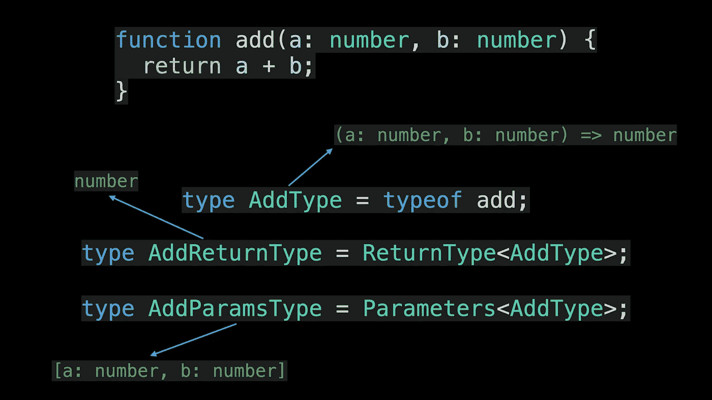
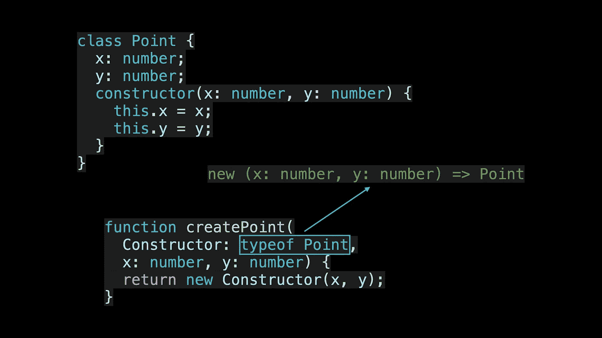
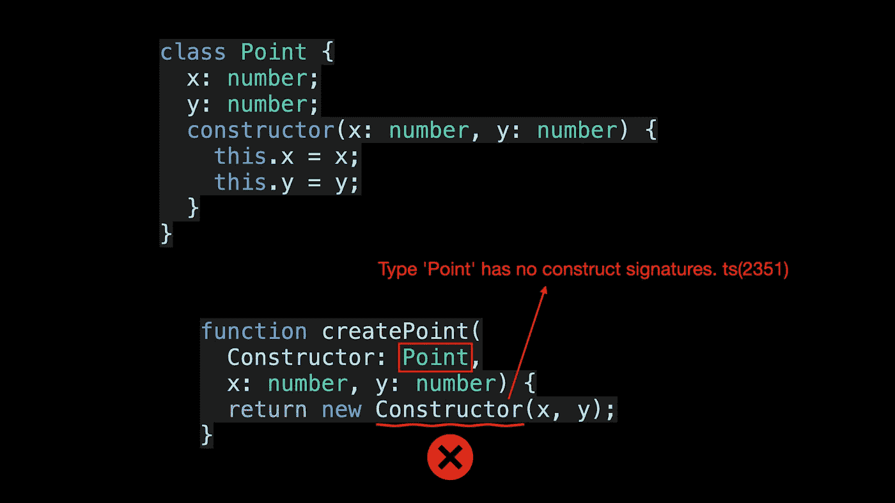
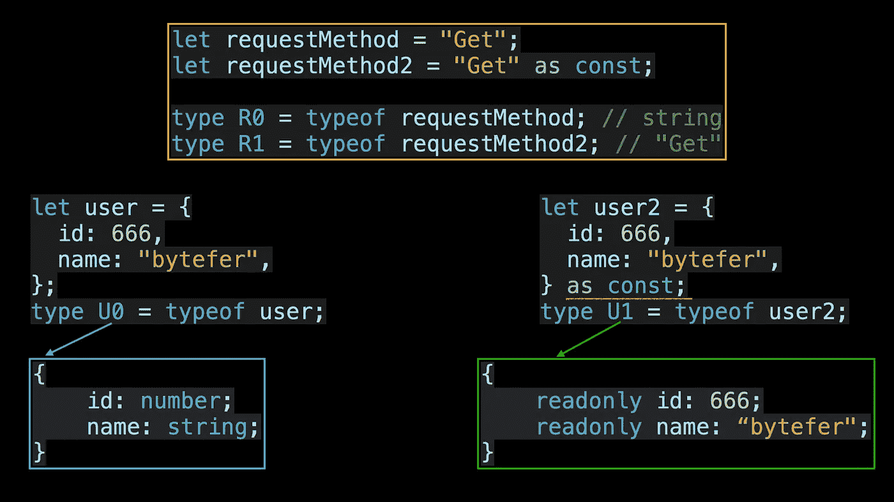

# 5 个非常有用的技巧

> 原文：<https://javascript.plainenglish.io/5-very-useful-tricks-for-thetypescript-typeof-operator-404c0d30cd5?source=collection_archive---------0----------------------->



欢迎来到**掌握打字稿**系列。本系列将以动画的形式介绍打字稿**的核心知识和技巧。让我们一起学习吧！以前的文章如下:**

*   [**TypeScript 泛型中的 K、T、V 是什么？**](https://medium.com/frontend-canteen/what-are-k-t-and-v-in-typescript-generics-9fabe1d0f0f3)
*   [**使用 TypeScript 像 Pro 一样映射类型**](/using-typescript-mapped-types-like-a-pro-be10aef5511a)
*   [**使用 TypeScript 条件类型像亲**](/use-typescript-conditional-types-like-a-pro-7baea0ad05c5)
*   [**使用 TypeScript 交集类型像亲**](/using-typescript-intersection-types-like-a-pro-a55da6a6a5f7)
*   [**使用打字稿推断像亲**](https://levelup.gitconnected.com/using-typescript-infer-like-a-pro-f30ab8ab41c7)
*   [**使用 TypeScript 模板字面类型像亲**](https://medium.com/javascript-in-plain-english/how-to-use-typescript-template-literal-types-like-a-pro-2e02a7db0bac)
*   [**可视化打字稿:15 种最常用的实用类型**](/15-utility-types-that-every-typescript-developer-should-know-6cf121d4047c)

在 JavaScript 中，可以通过`typeof`运算符得到变量的类型，那么你知道`typeof`运算符在 TypeScript 中是干什么用的吗？在本文中，我将介绍运算符类型的 5 个常见应用场景，您可能会在未来的项目中用到它们。

# 1.获取对象的类型



`man`对象是一个普通的 JavaScript 对象，在 TypeScript 中你可以使用 type 或 interface 来定义对象的类型。通过这种对象类型，可以使用 TypeScript 的内置实用程序类型(如 Partial、Required、Pick 或 Readonly)来处理对象类型，以满足不同的需求。

对于简单的对象来说，这可能不是什么大事。但是对于嵌套层次更深的大型复杂对象，手动定义它们的类型可能会让人感到麻木。要解决这个问题，可以使用 typeof 运算符。

```
type Person = typeof man;type Address = Person["address"];
```

与以前手动定义类型相比，使用 typeof 运算符变得容易得多。`Person["address"]`是一种索引访问类型，用于在另一种类型(人员类型)上查找特定属性(地址)。

# 2.获取将所有枚举键表示为字符串的类型

在 TypeScript 中，枚举类型是编译成常规 JavaScript 对象的特殊类型:



因此，也可以在枚举类型上使用`typeof`操作符。但是这通常没有太大的实际用途，当处理枚举类型时，它通常与`keyof`操作符结合使用:



# 3.获取函数对象的类型

还有一个更常见的场景，在您的工作中使用了 typeof 运算符。获得对应的函数类型后，可以继续使用 TypeScript 内置的 **ReturnType** 和 **Parameters** 实用类型分别获得函数的返回值类型和参数类型。



# 4.获取类对象的类型

既然`typeof`操作符可以处理函数对象，那么它也可以处理类对象吗？答案是肯定的。



在上面的代码中，`createPoint`是一个创建 Point 类实例的工厂函数。通过 typeof 运算符，可以获得 Point 类对应的构造签名，从而实现对应的类型验证。在定义构造函数的参数类型时，如果没有使用 type of 运算符，将出现以下错误信息:



# 5.获取更精确的类型

当使用`typeof`操作符时，如果你想得到更精确的类型，那么你可以将它与 TypeScript 版本中引入的 **const 断言**结合使用。这是用在下面的方式。



从上图可以看出，在使用了 **const 断言**之后，再使用 typeof 运算符，我们可以得到一个更精确的类型。

如果你想学习打字稿，那么就不要错过**掌握打字稿**系列。在 [Medium](https://medium.com/@bytefer) 或 [Twitter](https://twitter.com/Tbytefer) 上关注我，阅读更多关于 TS 和 JS 的内容！


[Bytefer](https://medium.com/@bytefer?source=post_page-----404c0d30cd5--------------------------------)

## 掌握打字稿系列

[View list](https://medium.com/@bytefer/list/mastering-typescript-series-688ee7c12807?source=post_page-----404c0d30cd5--------------------------------)47 stories

# 资源

[](https://www.typescriptlang.org/docs/handbook/enums.html) [## 手册-列举

### 枚举是 TypeScript 具有的为数不多的特性之一，它不是 JavaScript 的类型级扩展。枚举允许一个…

www.typescriptlang.org](https://www.typescriptlang.org/docs/handbook/enums.html) 

*更多内容请看*[***plain English . io***](https://plainenglish.io/)*。报名参加我们的* [***免费周报***](http://newsletter.plainenglish.io/) *。关注我们关于*[***Twitter***](https://twitter.com/inPlainEngHQ)[***LinkedIn***](https://www.linkedin.com/company/inplainenglish/)*[***YouTube***](https://www.youtube.com/channel/UCtipWUghju290NWcn8jhyAw)*[***不和***](https://discord.gg/GtDtUAvyhW) *。***