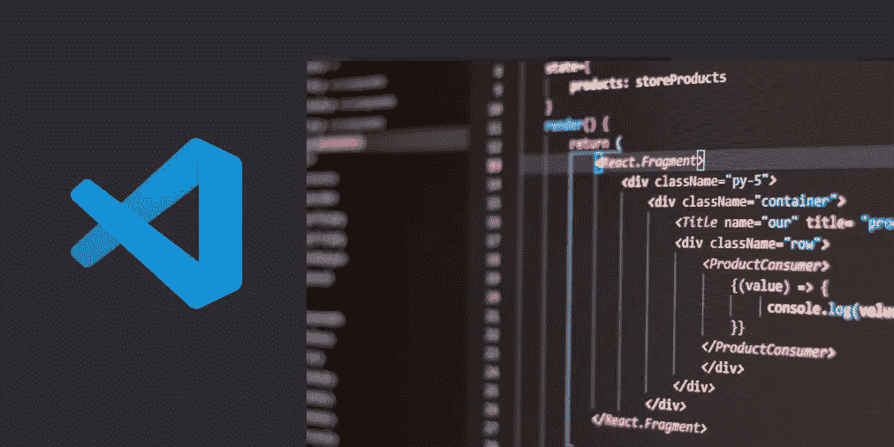
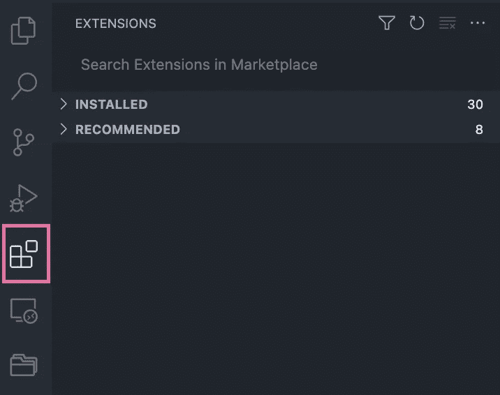
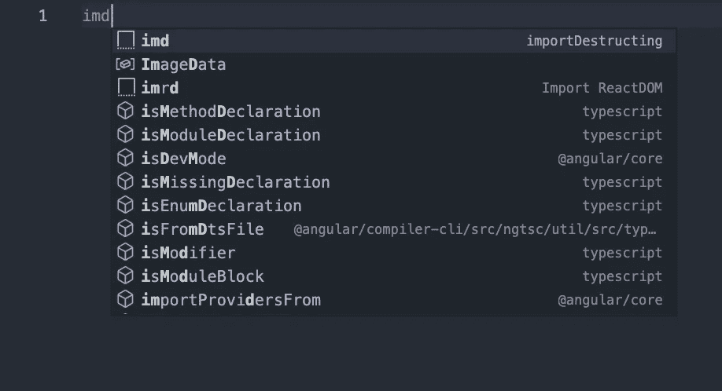
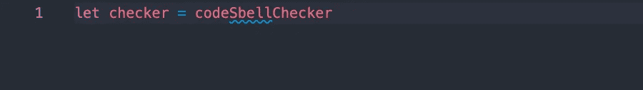

# 2022 年，每个 JavaScript 开发人员都需要 5 个代码扩展

> 原文：<https://javascript.plainenglish.io/5-vs-code-extensions-every-javascript-developer-needs-in-2022-45d4daf92c53?source=collection_archive---------3----------------------->

VS Code 大概是近年来最好最受欢迎的代码编辑器了。这个由微软开发的编辑器是开源的，在 GitHub 上获得了 13k 星！它之所以如此受欢迎，是因为它有一个很棒的特性:能够支持广泛的扩展。

那么，为什么我们要在代码编辑器中使用扩展呢？原因很简单。首先，扩展使工作流更加高效和多产，其次，你编码更快，错误更少。

**如何安装扩展**

*   对于 Windows 用户，只需按 Ctrl + windows + x。
*   对于 Mac 用户，按 Shift + Command + x。
*   更直接的方法是，单击扩展名图标并搜索扩展名。

1.  [**JavaScript 代码片段**](https://marketplace.visualstudio.com/items?itemName=xabikos.JavaScriptSnippets)

作为一名 JavaScript 开发人员，有时您会厌倦控制台日志记录，因为要花很长时间来编写枯燥的语法。这个扩展解决了这个问题。它提高了你的工作效率，节省了你很多时间。只需键入缩写，然后您将获得完整的代码片段。比如 clg 获取 console.log，fin 获取 For(对象中的 const)，imd 从' fs '获取 import {}，不一而足。

这个扩展包含 ES6 语法的 JavaScript 代码片段。它不仅支持 JavaScript，还支持 React 中的 JavaScript、Vue 中的 JavaScript 和 React 中的 TypeScript。

**2。** [**更漂亮—代码格式化程序**](https://marketplace.visualstudio.com/items?itemName=esbenp.prettier-vscode)

作为一名 JavaScript 开发人员，你是否花费了大量的时间和精力来格式化你的代码？如果是这样的话，你一定要变漂亮来帮助你。

每个月都有数百万开发者使用 Prettier。它确保所有输出的代码都符合一致的风格，这样您就可以停止浪费时间争论，并且可以结束关于风格的讨论

拥有一个通用的风格指南对于一个项目和团队来说是有价值的，因为代码库的一致性总是意味着很多，它防止你的同事在扩展代码库时有不合适的心理模型。

3. [**代码拼写检查器**](https://marketplace.visualstudio.com/items?itemName=streetsidesoftware.code-spell-checker)

代码拼写检查是一个扩展，帮助您检查注释，字符串和纯文本的拼写。它甚至可以理解 camel 案例中的代码，并对其进行检查。

4. [**CSS 偷看**](https://marketplace.visualstudio.com/items?itemName=pranaygp.vscode-css-peek)

CSS peek 是一个允许符号定义跟踪的扩展，简单来说，它意味着你可以通过点击 CSS 选择器来跟踪 CSS 代码，如类，id 和 HTML 标签，然后它会直接跳转到相应的 CSS 文件和位置。

5. [**自动关闭标签**](https://marketplace.visualstudio.com/items?itemName=formulahendry.auto-close-tag)

顾名思义，在您键入开始标记的右括号后，这个扩展会自动为您添加结束标记。将光标放在开始和结束标记之间使得体验更加用户友好。

在 VS 代码中使用扩展可以提高生产率和效率，并允许开发人员犯更少的错误。如果安装 VS 代码是我第一天工作的第一件事，那么获得扩展肯定是我的第二件事。我强烈建议每个 JavaScript 开发人员安装上述扩展。

编码快乐！

*更多内容看* [***说白了就是***](https://plainenglish.io/) *。报名参加我们的* [***免费周报***](http://newsletter.plainenglish.io/) *。关注我们关于*[***Twitter***](https://twitter.com/inPlainEngHQ)*和*[***LinkedIn***](https://www.linkedin.com/company/inplainenglish/)*。查看我们的* [***社区不和谐***](https://discord.gg/GtDtUAvyhW) *加入我们的* [***人才集体***](https://inplainenglish.pallet.com/talent/welcome) *。*