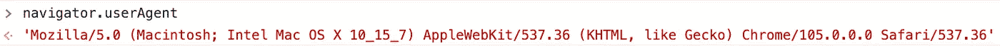
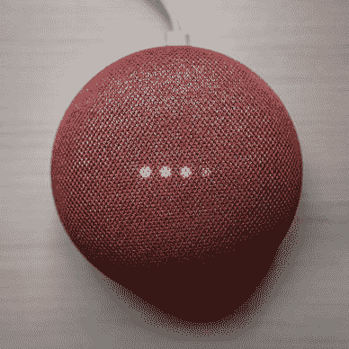

# 用 JavaScript 检测移动浏览器的 5 种方法

> 原文：<https://javascript.plainenglish.io/5-ways-to-detect-mobile-browsers-in-javascript-86c38982a5b?source=collection_archive---------5----------------------->

## 响应式网页设计不仅仅是关于 CSS


Image from [Wallhaven](https://wallhaven.cc/w/dp3lrj)

响应式网站设计不是可选的。

这是必须的。

因为这不仅关乎用户体验，还关乎 SEO。如果一个网站不支持移动设备，你永远也做不出一个足够好的网站。

好消息是，在许多情况下，开发一个响应式网站并不太难。我们只需要 CSS 媒体查询来改变不同屏幕尺寸的表示。

例如，当视区等于或小于 600 像素时，下面的代码更改按钮的样式。由于大多数手机的宽度不会超过 600 像素，这已经足够适合手机了。

```
.btn{
/*some style*/
}@media only screen and (max-width: 600px) {
    .btn {/*some style for mobile*/}
}
```

但是，你不可避免地会遇到更复杂的场景。

来看一个前端开发者的面试问题:

> 你的网站上有一个下载应用程序的按钮。
> 
> 请为它编写一个`onClick()`函数，它应该:
> 
> -在 iPhones 上点击 App Store 时打开它
> 
> -在安卓手机上点击谷歌 Play 商店时打开它
> 
> -在桌面浏览器中点击下载网站时打开该网站

这是不可能用纯 CSS 来实现的。

所以，这就是我们今天的话题:如何用 JavaScript 检测手机浏览器？

本文将总结 5 种使用 JavaScript 技巧识别移动设备的方法。看完，上面的问题对你来说会超级简单。🙂

# 1.从 UserAgent 属性获取设备信息

现代浏览器有一个特殊的属性——`navigator.userAgent`，它包含设备信息。

例如，下面的屏幕截图显示了我的 Mac 上的信息:



The content of the userAgent property

因此，使用 JavaScript 通过该属性获取设备信息是一种直观的想法。

因此`onClick()`函数对于前面的采访函数可以如下:

# 2.检查屏幕的宽度

这和 CSS 媒体查询的想法是一样的。

如上所示，如果`window.screen.width`属性小于 600 像素，我们的`onClick()`函数会将当前浏览器视为移动浏览器。

如果你是一个 React 开发者，这一招在 JSX 也非常有用。例如基于屏幕宽度呈现不同的 UI 组件:

# 3.检查 CSS 媒体查询是否正常工作

在我们已经有 CSS 媒体查询的情况下，我们可以使用 JavaScript 来检查它们是否工作，以检测移动浏览器:

```
let isMobile = window.matchMedia("only screen and (max-width: 600px)").matches;
```

如上面的代码所示，`window.matchMedia()`函数是识别 CSS 媒体查询是否有效的关键。

# 4.使用触摸事件检测移动浏览器

移动设备支持触摸事件，桌面浏览器不支持。所以这也是一个很好的检测手机浏览器的点。

我们可以编写如下函数:

上面的逻辑是正确的，因为桌面浏览器不能给对象添加`touchstart`事件。

# 5.检查屏幕的方向

除了触摸事件之外，移动设备还有一个特殊的功能——它们的屏幕可以非常容易地旋转。

因此，`window.orientation`属性是移动专用的。在桌面浏览器上是`undefined`。所以我们可以用它来检测移动设备:

```
if (window.orientation !== 'undefined') {
  // this is a mobile browser
}
```

# 结论

一个现代化的网站应该是移动友好的。但是响应式网页设计不仅仅是关于 CSS 的。JavaScript 对于一些复杂的场景是必不可少的。

***感谢阅读。***

***通过我的推荐链接加入 Medium，访问数百万篇精彩文章:***

[](https://yangzhou1993.medium.com/membership) [## 通过我的推荐链接-周扬加入媒体

### 阅读周扬的每一个故事(以及媒体上成千上万的其他作家)。你的会费直接支持杨…

yangzhou1993.medium.com](https://yangzhou1993.medium.com/membership) 

*关于 JavaScript 的更多信息:*


[周扬](https://yangzhou1993.medium.com/?source=post_page-----86c38982a5b--------------------------------)

## 升级 JavaScript

[View list](https://yangzhou1993.medium.com/list/level-up-javascript-f47e7346b9d4?source=post_page-----86c38982a5b--------------------------------)4 stories

*关于 CSS 的更多信息:*


[周扬](https://yangzhou1993.medium.com/?source=post_page-----86c38982a5b--------------------------------)

## 超赞的 CSS

[View list](https://yangzhou1993.medium.com/list/awesome-css-0ef666aac091?source=post_page-----86c38982a5b--------------------------------)5 stories

*更多内容请看*[***plain English . io***](https://plainenglish.io/)*。报名参加我们的* [***免费周报***](http://newsletter.plainenglish.io/) *。关注我们关于*[***Twitter***](https://twitter.com/inPlainEngHQ)[***LinkedIn***](https://www.linkedin.com/company/inplainenglish/)*[***YouTube***](https://www.youtube.com/channel/UCtipWUghju290NWcn8jhyAw)***，以及****[***不和***](https://discord.gg/GtDtUAvyhW) *对成长黑客感兴趣？检查* [***电路***](https://circuit.ooo/) ***。*****