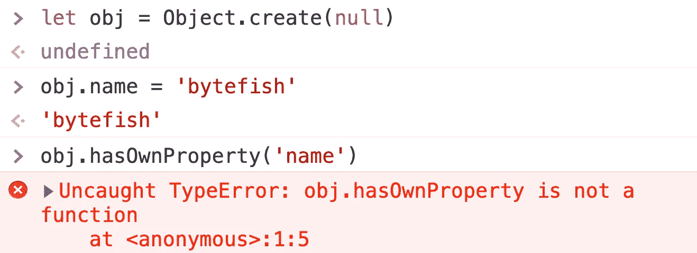

# 判断一个物体是否有属性的 5 种方法

> 原文：<https://javascript.plainenglish.io/5-ways-to-judge-if-an-object-has-a-property-ec6aa24187af?source=collection_archive---------22----------------------->

## ES2022 有一个新的建议来做这件事。

Photo by [Markus Winkler](https://unsplash.com/@markuswinkler?utm_source=medium&utm_medium=referral) on [Unsplash](https://unsplash.com?utm_source=medium&utm_medium=referral)

在编程时，我们经常需要确定一个对象是否具有某种属性。这里我们将列出 5 种方法。

# 1.in 运算符

如果指定的属性在指定的对象或其原型链中，`**in**` **操作符**返回`true`。

用法:

但是`in`运算符有一个缺点，那就是:如果属性来自对象的原型，它仍然会返回`true`。

# 2.Reflect.has()方法

`Reflect.has`方法允许你检查一个属性是否在一个对象中。作为一个函数，它像`in`操作符一样工作。

用法:

# 3.hasOwnProperty()方法

`**hasOwnProperty()**`方法返回一个布尔值，表明对象是否将指定的属性作为自己的属性(相对于继承它)。

它可以正确区分对象本身的属性和其原型的属性。

用法:

但是这种写法有一个缺点，那就是如果对象是由`Object.create(null)`创建的，那么就不能使用这种方法。

# 4.object . prototype . hasownproperty()方法

解决前面的问题很简单，我们只需要使用`Object.prototype.hasOwnProperty`。这种方法是直接调用内置的实用函数，跳过原型链。

# 5.Object.hasOwn()方法

由于之前的几种方式都不优雅， [ES2022 有了新的提议](https://github.com/tc39/proposal-accessible-object-hasownproperty) : `Object.hasOwn`

如果指定对象将指示的属性作为其*自己的*属性，则`**Object.hasOwn()**`静态方法返回`true`。如果该属性是继承的或者不存在，则该方法返回`false`。

用法:

现在你知道了。感谢您的阅读。