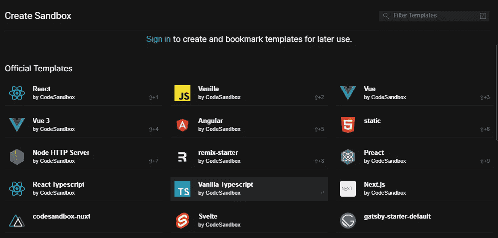

# 5 网站，帮助您为中型文章创建漂亮的 JavaScript 代码片段

> 原文：<https://javascript.plainenglish.io/5-website-to-help-you-create-beautiful-javascript-code-snippets-for-your-medium-articles-e37ee4afaff?source=collection_archive---------14----------------------->

## 如果你在包含代码块的介质上写文章，我有 5 个不同的网站可以帮助你美化它们


Woman photo created by lookstudio — [www.freepik.com](http://www.freepik.com)

在撰写技术开发文章时，您经常会看到一些代码块。您可以在显示代码时截取您最喜欢的 IDE 的屏幕截图，也可以通过按`````使用简单的中等代码格式。但是我建议不要使用这两种方法中的任何一种，而是使用本文中介绍的任何或所有网站。

# 1.GitHub Gists

创建代码块的主要网站是 GitHub Gists。你可以简单地去[https://gist.github.com](https://gist.github.com)把你的代码添加到要点中。此外，你可以将多个文件添加到一个要点中，并在文章中独立使用它们。

例如，我创建了一个包含两个文件的 gist:`[https://gist.github.com/paulknulst/d8592d3f8e3a0f2e6290f0bb7c91a6f1](https://gist.github.com/paulknulst/d8592d3f8e3a0f2e6290f0bb7c91a6f1)`

如果我只是将链接复制到这里作为嵌入内容，您会看到:

但是如果用`[https://gist.github.com/paulknulst/d8592d3f8e3a0f2e6290f0bb7c91a6f1?file=file1.js](https://gist.github.com/paulknulst/d8592d3f8e3a0f2e6290f0bb7c91a6f1?file=file1.js)`
和
`[https://gist.github.com/paulknulst/d8592d3f8e3a0f2e6290f0bb7c91a6f1?file=file2.js](https://gist.github.com/paulknulst/d8592d3f8e3a0f2e6290f0bb7c91a6f1?file=file2.js)`

您导入的代码块将是

和

# 2.碳. now.sh

我发现了另一个不错的网站，可以嵌入到中型文章中。您可以在我的上一篇 JavaScript 片段文章中看到我是如何使用它的。

这个网站真的很简单。您可以使用您的 GitHub 个人资料登录并开始创建代码片段。转到并插入您的代码。它将自动保存到您的个人资料中，并可以通过 URL 访问。

我真的很喜欢它在中型文章中的显示方式，因为它包含一个复制按钮，这样读者可以很容易地复制代码块。此外，如果块太长，它还嵌入了滚动功能。

作为一个例子，我使用这个网址:`[https://carbon.now.sh/XHGvwhmthQjAZLJAWNoA](https://carbon.now.sh/XHGvwhmthQjAZLJAWNoA)`

在 Medium 中，内容将如下所示:

不幸的是，在一个代码片段中不可能有多个文件。

# 3.JSFiddle

JSFiddle 是一个著名的 javascript 代码平台，在这里你可以在浏览器中测试你的 HTML、CSS 和 JS。

此外，这些代码块可以作为嵌入导入到介质中。在 Medium 中，您将有一个带有可切换标签菜单的块。

我以这把小提琴为例:`[https://jsfiddle.net/paulknulst/odLg3qu1/](https://jsfiddle.net/paulknulst/odLg3qu1/)`

如果你把它嵌入到介质中，它看起来会像这样:

如您所见，您可以在 JavaScript、HTML、CSS 和 Result 之间切换。在 Result 里面，你可以看到三个“文件”被 jsfiddle.net 的[合并运行后的结果。](https://jsfiddle.net)

# 4.Codepen.io

Codepen 堪比 JSFiddle。也可以添加 HTML，CSS，JS，导入到 Medium。

我以此为例:`[https://codepen.io/paulknulst/pen/NWaXwdW](https://codepen.io/paulknulst/pen/NWaXwdW)`

如果你把它嵌入到介质中，它看起来会像这样:

如您所见，您可以在 JavaScript、HTML、CSS 和 Result 之间切换。它看起来与 JSFiddle 不同，但包含相同的信息。

# 5.Codesandbox.io

使用 Codesandbox.io，您可以为将在浏览器中运行的项目创建完整的沙盒。

如果您从该网站开始，您可以从预定义的沙箱列表中选择一个示例沙箱



选择模板后，将创建所有需要的文件，您可以在集成 IDE 中更改它们，并在嵌入式浏览器窗口中查看结果。

作为一个例子，我选择 Next.js 来展示如何将它嵌入到 Medium 中，并使用这个 URL:【https://codesandbox.io/s/next-js-uo1h0

不幸的是，如果您将它嵌入到 Medium 中，您将只能看到结果网站:

但如果 codesandbox 是公开的，它至少会包含一个按钮，引导您到可以访问代码的网站。

# 结束语

作为一个主要撰写包含代码块的技术文章的人，我总是试图在我的文章中使用最适合的网站。在我的第一篇文章中，我截取了我的 IDE 的一个截图，以一种很好的方式展示了每一个片段。[第二篇文章](https://python.plainenglish.io/12-time-saving-python-tricks-every-developer-must-know-aacabb3abb5a)使用了中等代码片段。[在我的上一篇 JavaScript 文章](/12-useful-javascript-snippets-for-everyday-problems-4f08ee1ab5e)中，我使用了我认为合适的 carbon.now.sh。

到目前为止，我还没有机会使用 JSFiddle 或 Codepen.io，但也许将来我会写一篇文章，介绍这些网站最适合的地方。

我真的希望这篇文章对您有所帮助，并且可以在您的开发文章中使用任何网站。如果你也有很酷的网站来美化 Medium 文章中的 JavaScript 片段，欢迎在这里发表评论，并与其他开发者分享。

*✍️写的*

***保罗·克努斯*** *丈夫，两个孩子的父亲，极客，终身学习者，科技爱好者&软件工程师*

***问好*** *🙌***:*[*推特*](https://www.twitter.com/paulknulst) *，*[*LinkedIn*](https://www.linkedin.com/in/paulknulst/)*，* [*GitHub*](https://github.com/paulknulst)*

**更多内容请看*[*plain English . io*](http://plainenglish.io/)*。报名参加我们的* [*免费每周简讯*](http://newsletter.plainenglish.io/) *。在我们的* [*社区*](https://discord.gg/GtDtUAvyhW) *获得独家写作机会和建议。**