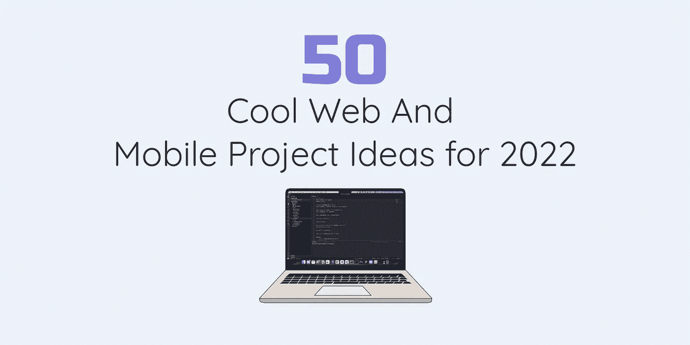

# 2022 年 50 个很酷的网络和移动项目创意

> 原文：<https://javascript.plainenglish.io/50-cool-web-and-mobile-project-ideas-for-2022-e1caead3c26e?source=collection_archive---------0----------------------->

## 2022 年你可以探索的很酷的网络和移动项目创意。

这是我在 2021 年写的文章**2021 年 50 个很酷的网络和移动项目创意**的后续。从那以后，我的技术储备略有变化。我只把它作为一个例子，这样你就可以知道如何用你自己的技术栈来构建这些应用程序。每个项目都有初级、中级或高级编程级别。这些应用程序可以使用前端、后端或全栈技能来创建。

这些只是例子，没有什么是一成不变的。在现实世界中，例如，您应该证明拥有 SQL 或 NoSQL 后端的最佳用例。至于编程水平，这只是我的个人观点，每个人都是不同的，所以做出你自己的判断。我已经包括了应用程序可以做什么的基本简介。当然，我相信你可以想出更多的方法来增加特性列表，所以继续吧。

这些应用中的一些可以被货币化，并被用作 IaaS、PaaS 或 SaaS。查看这篇文章，了解它们是什么【https://www.ibm.com/cloud/learn/iaas-paas-saas 以及如何将它们应用到你的项目中。

我目前的技术组合是:

前端:HTML，CSS，JavaScript，TypeScript，React，React Native，Redux

后端:Python，C#，NodeJS，SQL，NoSQL，Docker

# 新手

# 1.向量托管平台

开发一个平台，设计师/开发人员可以上传和存储自定义的 SVG 图像和图标。然后可以导出代码，以便其他人可以使用它们。

## 你将学到什么

您将学习如何构建一个在数据库中存储 SVG 数据的 CRUD 应用程序。然后，代码可以在前端显示在生成的 SVG 图标或图像旁边。如果你允许人们留下评级和评论，这个应用程序甚至可以更进一步。以及拥有许可协议甚至用户配置文件。

## 技术堆栈

**项目类型**:全栈式

**前端** : HTML，CSS，JavaScript，React

**后端** : Node.js，NoSQL

# 2.技术堆栈推荐工具

您在一个表单中回答一些问题，然后它会向您推荐一个可以用于项目的技术堆栈。如果你只是在学习如何编码，它甚至可以给你一个可能的职业道路。链接到课程，并有一个为什么你应该使用某种技能的描述。

## 你将学到什么

您将学习如何在前端处理表单数据并导航到不同的屏幕。或者，在获取表单以计算数据时，您可以选择隐藏或显示组件。

## 技术堆栈

**项目类型**:前端

**前端** : HTML，CSS，JavaScript，React

**后端**:可选

# 3.在 Twitter/LinkedIn 上寻找开发者的平台

专门从事技术写作、CSS 艺术、twitter 空间、Web3、NFTs 等的开发人员的精选列表。因此，我们不必在社交媒体上随意搜索，而是可以在平台上找到每个人和他们的定位，从而轻松跟踪他们。您还可以根据位置和其他因素进行筛选和排序。

## 你将学到什么

您将学习如何从 API 中检索数据并将其显示在页面上。这也是一个学习 DOM 遍历和使用 map、sort 和 filter 来改变对象数组中的数据的好机会。

## 技术堆栈

**项目类型**:全栈式

**前端** : HTML，CSS，JavaScript，React

**后端** : NodeJS

# 4.品牌生成器平台

该平台根据你回答的问题，或者可能涉及某种形式的机器学习，创建一种品牌颜色，一组随机生成的 SVG 徽标和排版建议等。

## 你将学到什么

您将学习如何收集表单数据，然后在网页上显示结果。你甚至可以想出一种方法将它与第三方 API 相结合来扩展这些特性。

## 技术堆栈

**项目类型**:全栈

**前端** : HTML，CSS，JavaScript，React

**后端**:NoSQL NodeJS

# 5.开发者环境生成器

用户在表单中输入一个技术栈，它会自动告诉你要安装什么软件，代码片段，栈溢出故障排除等等。

## 你将学到什么

您将学习如何根据用户通过表单输入的数据在页面上生成信息。

## 技术堆栈

**项目类型**:前端

**前端** : HTML，CSS，JavaScript，React

**后端**:可选

# 6.开发者设置推荐网站

一个策划列表网站，有电脑推荐，键盘，站立的桌子，椅子等。

## 你将学到什么

您将学习如何采用表单输入，将基于字段的数据输出到网页上。对于这个应用程序，您可以创建自己的后端 API，或者使用一些现有的 API。

## 技术堆栈

**项目类型**:全栈式

前端:HTML，CSS，JavaScript，React

**后端** : Node.js，NoSQL

# 7.废弃开发者项目查找器

一个平台，在这里你可以列出你放弃的开发者项目，让其他开发者捡起来继续工作。

## 你将学到什么

您将学习如何构建一个具有用户配置文件的 CRUD 应用程序。在这个平台上，应该有一个供人们列出项目和搜索功能的部分，以便其他开发人员可以找到他们。这里有很多开发功能丰富的应用程序的空间。

## 技术堆栈

**项目类型**:全栈

**前端** : HTML，CSS，JavaScript，React

**后端**:NoSQL NodeJS

# 8.入职网站

一系列不同的职业道路和关于掌握不同技术的信息。

## 你将学到什么

您将学习如何创建一个显示技术堆栈列表的网站或应用程序。每个技术堆栈都应该有一个包含文本、图像或链接的详细演练，用于学习该主题。

## 技术堆栈

**项目类型**:前端

**前端** : HTML，CSS，JavaScript，React

**后端**:可选

# 9.一个克隆体

是的，我知道已经有很多克隆的 Wordle，但这并不意味着你不应该尝试创造你自己的。更进一步，增加更多的选项，比如选择不同的语言，用名字代替单词，增加时间限制，或者尝试猜测每一行。天空才是极限！

## 你将学到什么

您将学习如何创建一个使用 DOM 遍历和事件侦听器的应用程序。如果你愿意，你可以创建自己的单词表或者使用单词 API。

## 技术堆栈

**项目类型**:前端

**前端** : HTML，CSS，JavaScript

**后端**:可选

# 10.一款目标追踪应用

跟踪你的心情和每日、每周、每月的目标。

## 你将学到什么

您将学习如何持久化数据和状态更改。如果您选择后端，数据可以存储在本地存储或数据库中。

## 技术堆栈

**项目类型**:前端

前端 : HTML，CSS，JavaScript，React

**后端**:可选

# 11.随机对话生成器

一个随机创建潜在话题的应用程序，这样你就再也不用担心那些尴尬的沉默了。它甚至可以根据主题、级别、深度等进行定制和筛选。

## 你将学到什么

您将学习如何创建包含不同数据的对象数组。以及如何随机选择它们。

## 技术堆栈

**项目类型**:前端

前端:HTML，CSS，JavaScript

**后端**:可选

# 12.工资计算器

创建一个应用程序，可以根据一个人的技能、经验、货币和其他因素(如位置等)来计算他应该挣多少工资。

## 你将学到什么

您将学习如何使用数学和其他运算符在 JavaScript 中进行计算。某种形式的表单需要有可以转换的数据。数据应该显示在网页上。

## 技术堆栈

**项目类型**:前端

前端:HTML，CSS，JavaScript

**后端**:可选

# 13.随机播放列表生成器

一个可以为你的播放列表随机生成歌曲列表的应用。它可以考虑各种过滤器，如你的喜好，年份，流派，你打算听一首歌多长时间，等等。然后它会根据这些参数创建一个播放列表。

## 你将学到什么

您将学习如何使用函数、循环和 DOM 遍历等等。

## 技术堆栈

**项目类型**:前端

**前端** : HTML，CSS，JavaScript，React

**后端**:可选

# 14.开发人员档案卡

您可以创建一个应用程序，自动生成包含您的个人资料的图像或一些数据。它可以有你的照片，姓名，职位和技术栈。也应该可以进行一些定制，如改变字体，颜色和设计。

## 你将学到什么

您将学习如何进行 DOM 遍历，以及如何使用 JavaScript 中的表单来捕获和返回将显示在网页上的数据。交互性是一个需求，因为用户需要改变字体、颜色和设计风格。

## 技术堆栈

**项目类型**:前端

**前端** : HTML，CSS，JavaScript，React

**后端**:可选

# 15.响应式动画幻灯片

创建一个响应式动画幻灯片应用程序。它可以为用户提供许多自定义功能。作为奖励，你甚至可以把它变成一个 npm 包，这样其他人就可以把它集成到他们的项目中。

## 你将学到什么

您将学习如何与 DOM 交互，并使用动画结合图像来创建幻灯片。

## 技术堆栈

**项目类型**:前端

**前端** : HTML，CSS，JavaScript，React

**后端**:可选

# 16.电脑游戏漫游

为什么不创建一个托管计算机游戏演练的平台呢？它可以是一个电脑游戏的独立应用程序。或者你可以把它变得更高级，这样它可以保存很多游戏的教程。这个应用程序可以是简单的，也可以是高级的。甚至有可能加入许多某种形式的互动。

## 你将学到什么

你将学习如何建立一个互动网站。

## 技术堆栈

**项目类型**:前端

前端 : HTML，CSS，JavaScript，React

**后端**:可选

# 17.纸牌游戏

你可以尝试再造一种流行的纸牌游戏，比如 21 点或扑克。或者你可以创建某种定制的纸牌游戏。

## 你将学到什么

您将学习如何创建一个交互式游戏，让至少两个玩家一起玩。如果你能让游戏与多个玩家一起玩，或者想出一种方法让电脑与你对战，这些功能还可以进一步增强。

## 技术堆栈

**项目类型**:前端

**前端** : HTML，CSS，JavaScript，React

**后端**:可选

# 18.货币兑换商

用于兑换不同的货币

## 你将学到什么

您将学习如何使用 JavaScript 处理数学和进行数字计算。

## 技术堆栈

**项目类型**:前端

**前端** : HTML，CSS，JavaScript

**后端**:可选

# 19.网站克隆

找到一个非常酷的网站，然后复制一个。如果你刚刚开始，那么试着先创建一个简单的网站，比如投资组合或新闻网站。当你开始感到更有雄心时，去做一些复杂的事情，比如 Twitter、YouTube 或 Instagram。

## 你将学到什么

如何用 HTML，CSS，JavaScript 搭建一个网站？

## 技术堆栈

**项目类型**:前端

**前端** : HTML，CSS，JavaScript，React

**后端**:可选

# 中间的

# 20.产品管理平台

建立一个平台来管理你所有的产品。例如，该平台能够管理账单、定期支付和来自客户的信息。除了提醒之外，它甚至可以让你为自己留下个人笔记。

## 你将学到什么

您将学习如何构建一个处理随时间变化的状态和数据的应用程序。日历整合和发送电子邮件和通知也将是一个很好的补充。

## 技术堆栈

**项目类型**:全栈

**前端** : HTML，CSS，TypeScript，React

**后端**:蟒蛇，烧瓶

# 21.模拟面试平台

一个为你匹配专业人员的平台，这样你就可以进行模拟视频/语音面试。

## 你将学到什么

如何建立一个可以处理多人实时聊天和视频的网站？为所有用户创建搜索功能和配置文件。拥有一个能让用户离开并阅读评论的系统也会非常有用。

## 技术堆栈

**项目类型**:全栈

前端:HTML，CSS，打字稿，反应

**后端**:蟒蛇，烧瓶

# 22.开发者协作平台

一个平台，开发者可以创建项目，并找到其他有兴趣合作或参与项目的开发者。这将是一个很好的方法，在你的简历中加入一些活的工作，同时结交新朋友。

## 你将学到什么

为用户拥有个人资料的平台构建 CRUD 应用程序。这是一种搜索人员和项目的方式，此外还有这种类型的平台所期望的许多其他功能。

## 技术堆栈

**项目类型**:全栈

前端:HTML，CSS，打字稿，反应

**后端**:NoSQL NodeJS

# 23.社交焦虑平台

一个为你和其他人随机配对的平台，给你一个你们两人都应该谈论的随机话题。也许有一个计时器结束，然后你可以和别人匹配。一种验证个人资料的方法，同时保持安全和匿名，以减少假冒/垃圾邮件/机器人。

## 你将学到什么

您将学习如何构建一个使用身份验证的应用程序，从而实现良好的安全性和隐私性。该平台将需要使用 websockets 的聊天功能，甚至视频集成。

## 技术堆栈

**项目类型**:全栈

**前端** : HTML，CSS，打字稿，React

**后端** : Python，Flask

# 24.结对编程平台

你可以找到另一个拥有相似技术的开发者。适合练习或解决代码问题。视频、音频或文字聊天。

## 你将学到什么

您将学习如何使用 websockets 构建一个具有聊天功能的应用程序，可能还会集成视频。需要有某种方法来共享实时编码会话，作为让开发人员看屏幕的替代方法。像微软团队这样的视频通话应用让其他人来控制，所以如果你能找到一种方法来做到这一点，这是一个可能的选择。

## 技术堆栈

**项目类型**:全栈

**前端** : HTML，CSS，TypeScript，React

**后端** : Python，Flask

# 25.面向开发者的全球排行榜

一个面向开发人员的跨平台应用程序，它让每个人都可以看到一个开发人员在一天、一周、一个月中参与了多少个项目。这样你就可以跟踪你的进度，看看你和其他开发人员相比如何。

你可以在排行榜之间切换，看看谁是最努力的员工，以及你与他们相比如何。很好的激励，看看谁是最值得追随的人。它甚至可以包含一些社交媒体元素。或者查看个人资料和关注他人的方式。

## 你将学到什么

你将学习如何建立一个人们可以注册和加入的平台。应该有全天自动更新的排行榜。

## 技术堆栈

**项目类型**:全栈

**前端** : HTML，CSS，打字稿，React，React Native

**后端** : Node.js，NoSQL

# 26.随机 API 生成器

根据您提出的问题或输入的数据随机生成 API 的网站。也许它可以导出不同文件类型的数据，如 CSV，JSON，GraphQL 等。或者你得到一个可以作为端点的在线链接。非常适合测试假数据。

## 你将学到什么

您将学习如何构建一个可以随机生成 API 列表的平台。您可以在后端创建自己的 API，也可以使用第三方 API。

## 技术堆栈

**项目类型**:全栈

前端 : HTML，CSS，打字稿，反应

**后端** : Node.js，NoSQL

# 27.一款定时人像应用

当你每天都在改变和进步的时候，每天记下你自己的照片日记。对于正在锻炼并希望跟踪自己进步的人来说很好。或者那些只想记住自己的外貌在一段时间内是如何变化的人。

## 你将学到什么

您将学习如何设置和发送可自定义的通知。用户需要一种方法来拍摄照片，然后自动保存在服务器或数据库中。找到将它们放入图库或自动导出为视频或类似内容的方法可加分。

## 技术堆栈

**项目类型**:全栈式

**前端** : HTML，CSS，打字稿，React，React Native

**后端**:NoSQL NodeJS

# 28.电脑游戏

这可能是 2D 或三维的可能性是无穷无尽的。

## 你将学到什么

如何做游戏开发？

## 技术堆栈

**项目类型**:全栈

**前端** : HTML，CSS，TypeScript，React，React Native，Unity

**后端** : C#，ASP。网络核心，SQL

# 29.学习平台

你可以创建某种学习平台，它不需要与编程相关，可以是任何主题。

## 你将学到什么

如何构建一个全栈 CRUD 应用，让用户可以访问各种课程。用户需要能够创建个人资料，并登记各种课程，单独跟踪他们的进展。有一个评级系统是必不可少的，因为有能力留下宝贵的意见。

## 技术堆栈

**项目类型**:全栈

**前端** : HTML，CSS，打字稿，React

**后端** : Node.js，NoSQL

# 30.初学者的网站建设者

它可以是一个向初学者展示如何构建应用程序的网站。因此，您可以选择您的技术堆栈，然后它会生成一些演练文档，为您提供如何构建的分步指南。

## 你将学到什么

接受表单数据的网站可能会从您创建的后端 api 中获取更多数据。

## 技术堆栈

**项目类型**:全栈式

前端:HTML，CSS，打字稿，反应

**后端** : Node.js，NoSQL

# 31.在线问答游戏

与 Wordle 相似，但完全不同。你不是自己解决问题，而是随机与其他玩家匹配。你的团队必须合作解决谜题、文字游戏或类似的问题。这可以在某种程度上链接到一个排行榜，这样每个人都可以看到其他球员的统计数据。

## 你将学到什么

如何创建一个文字游戏或多个不同的迷你游戏，这些游戏以团队为基础，并将团队和玩家的分数存储在全球排行榜中。

## 技术堆栈

**项目类型**:全栈

**前端** : HTML，CSS，打字稿，React

**后端** : Node.js，NoSQL

# 32.Excel 电子表格导出器

创建一个应用程序，它可以接收某种类型的数据，然后将其导出为电子表格。因此，举例来说，你可以有另一个应用程序来跟踪你每月的消费习惯。然后，您可以将数据导出为 CSV 格式，然后导入到另一个应用程序中，并导出为一个易读的 excel 电子表格。

## 你将学到什么

这将是一个很好的挑战，因为您将学习如何编译和转换不同的数据类型。

## 技术堆栈

**项目类型**:全栈

**前端** : HTML，CSS，TypeScript，React

**后端** : Python，Flask

# 33.聊天应用程序

创建一个类似 WhatsApp、iMessage、Telegram、Signal、Facebook Messenger 等的聊天应用。

## 你将学到什么

如何让人们使用像 WebSocket API 这样的技术相互交流。最基本的要求是让聊天正常进行。这些功能可以通过添加一种方式来发送媒体文件，进行语音通话，以及做其他你在聊天应用程序中看到的酷事情，如拥有表情键盘和分享故事。

## 技术堆栈

**项目类型**:全栈

**前端** : HTML，CSS，TypeScript，React

**后端**:NoSQL NodeJS

# 34.技术评估平台

它可以成为某种技术评估的平台。这可以是任何事情，从编程到驾驶测试或任何你能想到的事情。这里没有限制，这个平台可以迎合各种各样的人。

## 你将学到什么

如何构建一个 CRUD 应用程序，它有一个注册页面和一个让人们创建配置文件的方法。用户需要一种方法来跟踪他们正在学习的课程，并且需要一种安全的方法让人们在不作弊的情况下进行测试。

## 技术堆栈

**项目类型**:全栈

前端 : HTML，CSS，打字稿，反应

**后端** : Node.js，NoSQL

# 35.评级平台

你可以建立一个平台，让人们对某种产品或服务发表评论。

## 你将学到什么

需要有一种方法让人们只对项目进行一次评级，这样他们就不能多次进行评级，否则会破坏评论的可信度。

## 技术堆栈

**项目类型**:全栈

前端:HTML，CSS，打字稿，反应

后端:NoSQL 的 NodeJS

# 36.关系跟踪者

记录你的社交生活。你可以用它来记录谈话主题、事件、心情等。它甚至可以有日历集成和其他功能。

## 你将学到什么

如何构建保存各种状态数据的应用程序？因为数据会发生变化，所以它需要具有 CRUD 功能。

## 技术堆栈

**项目类型**:全栈

**前端** : HTML，CSS，打字稿，React

**后端** : Node.js，NoSQL

# 37.横幅创建者

从网站到社交媒体，横幅随处可见，在应用程序和博客中也是如此。创建一个可以为每个平台自动生成正确大小和尺寸的横幅的应用程序怎么样？

## 你将学到什么

如何构建一个可以根据用户输入进行计算并生成用户请求的数据的应用程序。

## 技术堆栈

**项目类型**:前端

**前端** : HTML，CSS，TypeScript，React

**后端**:可选

# 38.互动故事应用

生成独特互动故事的应用程序。从 Wordle 中获得灵感，每天可能会发布几个章节或几集，它们会持续一整周。所以在一周结束时，你会对你所追踪的故事有一个结论。

如果你有设计背景，那么这给了你一个绝佳的机会去创作插图，然后你可以把它们组合成一个很酷的流畅的故事。

## 你将学到什么

如何构建一个交互式故事应用程序，让用户能够选择不同的路径。这是 web 或移动应用程序的完美格式。

## 技术堆栈

**项目类型**:全栈

**前端** : HTML，CSS，打字稿，React，React Native

**后端** : Node.js，NoSQL

# 先进的

# 39.个人教练平台

一个管理潜在客户的平台，这些客户希望从您这里获得指导。想象一下，如果有一个专门的平台，人们可以在那里寻求指导和训练。可能有一种方法可以安排会议并向潜在客户发送自动回复。您甚至可以内置一些聊天或视频功能，这样您就可以在平台上进行会话。

## 你将学到什么

您将学习如何构建具有完整 CRUD 功能的全栈应用程序。您还有机会学习如何集成使用 WebSocket API 或类似工具进行实时聊天的能力。

## 技术堆栈

**项目类型**:全栈

前端 : HTML，CSS，打字稿，反应

**后端** : Node.js，NoSQL

# 40.人工智能驱动的社交媒体内容生成器

当你有机器学习和人工智能为你做所有的工作时，永远不会再没有内容了。

## 你将学到什么

您将学习如何使用 Python 和众多库中的一个(例如 TensorFlow)进行机器学习。

## 技术堆栈

**项目类型**:全栈

前端:HTML，CSS，打字稿，反应

**后端** : Python

# 41.云托管平台

创建平台即服务(PaaS ),使开发人员能够完全在云中构建、运行和操作应用程序。

## 你将学到什么

您将了解如何在 AWS、Azure 和 Google Cloud 等平台上设置云帐户。您还需要学习如何注册一个域并为 PaaS 设置配置。

## 技术堆栈

**项目类型**:全栈式

**前端** : HTML，CSS，打字稿，React

**后端** : Python，Django，Docker

# 42.社交媒体活动仪表板

一个可以让你在所有平台上追踪你的粉丝总数的平台。web、桌面和移动设备上的跨平台应用程序。你可以管理你计划创建的内容，也许给他们标签和其他很酷的信息，这样你就知道你要创建什么内容。您可以跟踪指标，因为它显示分析和数据。

## 你将学到什么

您将学习如何构建一个跨平台的应用程序，该应用程序可能会从外部 API 获取数据。为了显示分析和数据，您可以使用像 D3、Highcharts 或 Chart.js 这样的库

## 技术堆栈

**项目类型**:全栈

**前端** : HTML，CSS，TypeScript，React

**后端** : Python，Django

# 43.元宇宙平台

一个 2D/3D 网络，适用于 crypto、区块链、NFT 和 Web3 社交网络。一种互动、交易和生活在广阔沙盒世界的方式，在那里你可以过第二人生。

## 你将学到什么

这将是一个相当复杂的应用程序，因为涉及到许多技术，可能最好是整个团队来开发。开发 2D/3D 世界，创建设计，编写后端和前端逻辑。将它部署到多个平台上。这些特性和功能会让你忙碌很长一段时间，但是你会在这个过程中学到很多。

## 技术堆栈

**项目类型**:全栈

**前端** : HTML，CSS，TypeScript，React，React Native，Unity

**后端** : C#，ASP。Net 核心，Python，SQL

# 44.我们中的一个克隆人

尝试建立一个我们之间的克隆，使用网络聊天套接字，并有一个多人方面建立了它。

## 你将学到什么

有多种方法可以构建这个应用程序。您可以使用 React Native 或 Unity 创建一个移动版本。后端也有很大的灵活性。如果应用程序是跨平台的，那么就有很多机会来构建它。

## 技术堆栈

**项目类型**:全栈式

**前端** : HTML，CSS，打字稿，React，React Native，Unity

**后端** : C#、Python、Flask、SQL

# 45.一个人工智能驱动的待办事项应用

一个可以根据你的习惯或者你输入的一些数据进行推荐的 app。所以它可以创建任务让你完成，或者推荐做某件事最理想的策略。

## 你将学到什么

因为这个应用将是人工智能驱动的，所以使用机器学习是有意义的。每个人都制作待办事项应用程序，所以跳出框框思考，尽量让它独特而强大。

## 技术堆栈

**项目类型**:全栈

**前端** : HTML，CSS，打字稿，React，React 原生

**后端** : Python，Flask，SQL

# 46.高级费用跟踪器

你可以开发一个真正复杂的东西，不仅显示你的开销，也显示其他人的开销，而不是建立一个简单的开销跟踪器。我认为这将是一个很好的方式来看看每个人是如何管理他们的生活的。就隐私而言，它不需要显示你的收入和支出。另一种方法是只显示你通常在什么地方花钱。

例如，衣服、科技、食物、健身房、宠物、账单等等。它可能会帮助那些财务和趋势不好的人，让他们更明智地消费。如果你看到其他人比你做得好得多，你可能会更有动力去追随。

## 你将学到什么

如何建立一个安全的平台，用户可以创建个人资料，并分享他们的一些购买历史，可以与其他用户进行比较。这将教您如何生成来自多个来源的数据，并以图表和图形的形式显示这些数据以及其他指标和数据。

## 技术堆栈

**项目类型**:全栈

**前端** : HTML，CSS，打字稿，React，React Native

**后端** : Python，Flask，SQL

# 47.皇家战役游戏

创建一个类似皇家战役的在线多人游戏。你可以创建任何类型的游戏。游戏可以很简单，可以在浏览器或移动设备上玩。从激烈的 3D FPS 到简单的派对风格的棋盘游戏,《皇家战役》可以是任何东西。

## 你将学到什么

如何构建一个多人游戏，以便多个其他用户可以在线一起玩。

## 技术堆栈

**项目类型**:全栈

**前端** : HTML，CSS，TypeScript，React，React Native，Unity

**后端** : C#，ASP。网络核心，SQL

# 48.鱿鱼游戏克隆

一个在线多人类型的游戏，非常类似于鱿鱼系列游戏

## 你将学到什么

如何构建一个多人游戏，以便多个其他用户可以在线一起玩。

## 技术堆栈

**项目类型**:全栈

**前端** : HTML，CSS，打字稿，React，React Native，Unity

**后端** : C#，ASP。网络核心，SQL

# 49.克隆一个你现有的应用程序

我们的手机上已经有了大量的应用程序，但并不是所有的都有我们想要的功能。事实上，在某些情况下，你需要多个应用程序来服务于一个目的。一个更好的选择是从所有这些应用程序中提取最好的方面，并将它们放入一个应用程序中。或者甚至添加一些你希望其中一款应用具备的缺失功能。

## 你将学到什么

如何重新创建一个现有的应用程序，并可能使其成为一个更好的版本。至少你将学会如何构建流行的应用程序，给你最终开发自己独特产品的知识。

## 技术堆栈

**项目类型**:全栈

**前端** : HTML，CSS，打字稿，React，React 原生

**后端** : Node.js，NoSQL

# 50.高级人工智能/聊天机器人

这是钢铁侠(托尼·斯塔克)boss 级项目！将自己推向极限，看看你是否能建立一个真正先进的人工智能。考虑到它的复杂性，大多数人会首先选择简单的聊天机器人。

如果你能想出办法制造出能通过图灵测试的人工智能。那么恭喜你，你可能会获得诺贝尔奖。

仅供参考:图灵测试最初由艾伦·图灵在 1950 年称为模仿游戏，是一种测试机器表现出与人类同等或不可区分的智能行为的能力的测试。

## 你将学到什么

如何成为钢铁侠😎

## 技术堆栈

**项目类型**:全栈

**前端** : HTML，CSS，打字稿，React，React Native

**后端** : Python，Django

# 51.⭐️奖金:⭐️树莓派

给自己买一个树莓派，创建自己的项目。对于那些不知道的人来说，树莓派本质上是一系列紧凑而强大的单板计算机。它们是由 Raspberry Pi 基金会设计的，旨在以一种负担得起的方式教人们(无论年龄和技能如何)如何编程。

查看这些网站获取灵感:

 [## 项目|树莓 Pi 项目

### 我们使用 cookies 来确保在我们的网站上给您最好的体验。通过继续访问本网站，您…

projects.raspberrypi.org](https://projects.raspberrypi.org/en)  [## 最佳树莓 Pi 项目

### 当我们迎来可爱的二月时，我们不禁钦佩所有辛勤工作的制造者已经投入新的…

www.tomshardware.com](https://www.tomshardware.com/uk/features/best-raspberry-pi-projects)  [## 160 多个树莓 Pi 项目

### 在本教程中，我们将向您展示如何在树莓皮上种植 Chia。Chia 是一种加密货币…

pimylifeup.com](https://pimylifeup.com/category/projects/) 

## 你将学到什么

如何用树莓派做酷的东西🚀

## 技术堆栈

**项目类型**:全栈

**前端** : HTML，CSS，打字稿，React，React Native

**后端** : Python，Django

*更多内容看* [***说白了. io***](http://plainenglish.io/) *。报名参加我们的* [***免费周报***](http://newsletter.plainenglish.io/) *。在我们的* [***社区获得独家访问写作机会和建议***](https://discord.gg/GtDtUAvyhW) *。*