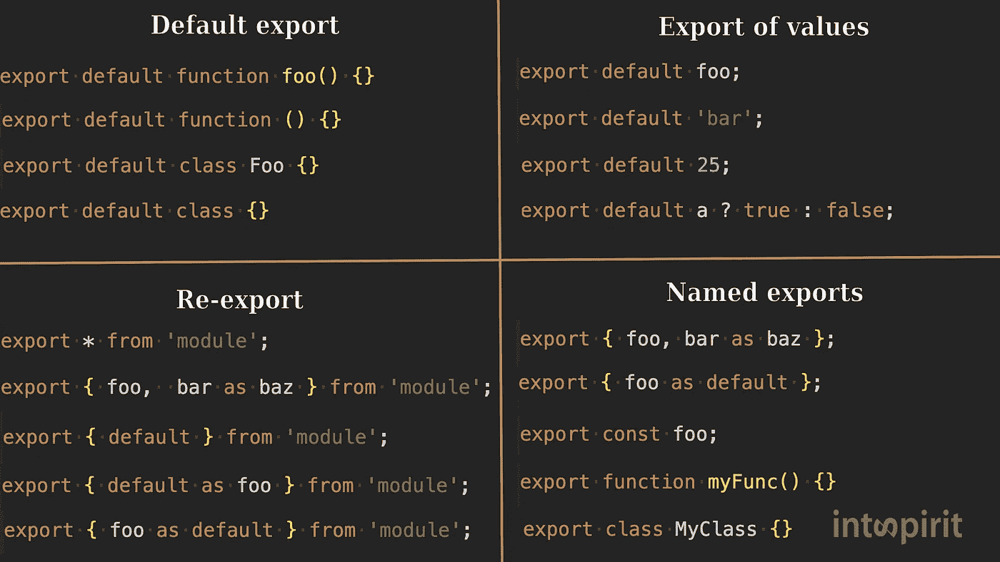
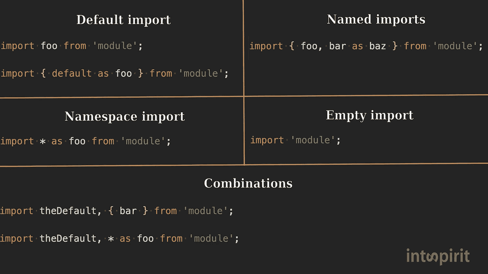

# 50 种色调的 ES6 模块

> 原文：<https://javascript.plainenglish.io/50-shades-of-es6-modules-95cd0b016156?source=collection_archive---------4----------------------->

## 对开发人员来说，最难的 JavaScript 主题的最大挑战。

如果你问一个开发者:“对你来说最难的 JS 题目是什么？”，你绝不会听说是 ES6 模块。但是统计更懂！我们统计了电报频道各种主题测验的错误答案数量，发现 ES6 模块是反领导者模块。对于开发者来说，其他 5 个最棘手的话题可以在[这里](https://medium.com/@intspirit/top-of-js-topics-mostly-failed-by-developers-53397f13eb78)查看。

似乎很多开发者认为 ES6 模块只不过是*导出-导入*关键词。事实上，它要多样化得多。它有强大的功能和鲜为人知的陷阱。在这篇文章中，我们将看看所有这些，使用我们的电报频道的测验作为例子。这一次，我们不会根据正确答案的数量将任务排在前面，因为一些任务的解释可能是基于以前的解释，但是，为了更有趣，我们将指出正确回答测验的开发人员的百分比。走吧。

## 测验#1。53%的正确答案

index.mjs

module.mjs

[自己试试](https://t.me/intspirit/461)

首先，让我们记住各种各样的导入和导出语法:

Export syntax

Import syntax

如果您使用导入语法检查该表，您将看到没有与我们的代码匹配的语法:

`import { default } from ‘./module.mjs’;`

因为这种语法是被禁止的。测验代码会引发以下错误:

*语法错误:意外的保留字*

在第`import { default } from ‘./module.mjs’;`行中，`default`是导出的名称，也是这个作用域中的一个变量的名称，这是被禁止的，因为`default`是一个保留字。修复非常简单:

`import { default as foo } from ‘./module.mjs’;`

现在，`default`是导出的名称，`foo`是变量的名称。换句话说，如果您想对默认导出使用命名导入语法，您必须重命名它。就是这样，这么简单！

## **测验 2。35%的正确答案**

index.js

helper.js

[自己试试](https://t.me/intspirit/447)

许多开发人员不知道的一个重要的细微差别是，导入被挂起。也就是说，它们在引擎解析代码时上升。所有依赖项将在代码运行前加载。

这就是为什么我们将按以下顺序查看日志:

`helper.js, index.js, 3`

如果您希望某些代码在导入声明之前执行，请考虑将其移动到单独的文件中:

new index.js

logs.js

我们现在有了预期的输出:

`index.js, helper.js, 3`

## 测验三。42%的正确答案

index.mjs

module.mjs

counter.mjs

[自己试试](https://t.me/intspirit/459)

模块是*单线*。

无论你从同一个位置或者不同的地方导入一个模块多少次，这个模块都只会被执行和加载一次。换句话说，只有一个模块实例。

Creds: [https://imgflip.com/i/3mol6q](https://imgflip.com/i/3mol6q)

## 测验四。34%的正确答案

index.mjs

module.mjs

[自己试试](https://t.me/intspirit/412)

在对我们之前的[文章](https://medium.com/@intspirit/only-10-of-developers-can-solve-these-javascript-challenges-f4804c7c54eb)的评论中，我们收集了来自我们频道的最难的测验，一些人写道他们认为没有必要如此彻底地了解这门语言。嗯，不同意。我们相信你知道的越多，你的效率就越高(其他条件不变)。这个说法在我们公司的实践中被反复证明。

也许这个特性是将要被写到的特性之一——“为什么我们需要知道这个。”而且真的不太可能天天用。但是，总有一天，它会派上用场，节省你在谷歌上花费的时间是多么美妙。

所以根据 [MDN](https://developer.mozilla.org/en-US/docs/Web/JavaScript/Reference/Operators/import.meta) :

> import.meta 对象向 JavaScript 模块公开特定于上下文的元数据。它包含关于模块的信息。
> 
> 它返回一个带有 url 属性的对象，该属性指示模块的基 URL。对于外部脚本，这将是从中获取脚本的 URL；对于内联脚本，这将是包含文档的文档基 URL。

请注意，这将包括查询参数和/或哈希(即，在？或者#)。

## 测验五。45%的正确答案

index.js

counter.js

[自己试试](https://t.me/intspirit/449)

大多数开发人员忽略的另一个极其重要的时刻是，在导入模块的范围内，导入变量的行为类似于常量。

例如，要使代码工作，可以导出一个对象并更改其属性。

## 测验 6。11%的正确答案

index.mjs

module.mjs

[自己试试](https://t.me/intspirit/463)

这个测验的正确答案似乎是最少的。一方面，这是意料之中的，因为这是一个死角。另一方面，如果你再集中一点注意力，你会发现这个任务实际上是基于每个人都应该知道的基本事情(可能知道，只是没有意识到)。

首先，这个

`export default function foo() {}`

等于

`function foo() {}
export { foo as default }`

我们想说这也相当于

`function foo() {}
export default foo`

但事实并非如此..不要惊讶，继续读下去。我们将在下一次测验中回到这个问题。

现在是时候记住函数是提升的，变量的初始化总是在函数/变量声明之后。这难道不是基础中的基础吗？

引擎处理完模块代码后，它看起来像这样:

module.mjs as the engine sees it

因此，测验结果就是`number`。

## 测验#7。17%的正确答案

index.mjs

module.mjs

[自己试试](https://t.me/intspirit/465)

在大多数情况下，导入数据是实时的。也就是说，如果导出的值发生了变化，这种变化会反映在导入的变量中。

但是对于默认导出，情况并非如此:

`export default foo;`

使用这种语法时，导出的不是变量，而是它的值。您可以像这样完全不使用变量导出默认值:

`export default ‘hello’;`

如果您查看测验#1 中带有导出语法的表格，您会看到`export default function () {}`与`export default foo` ( `Export of values`)位于不同的列(`Default export`)。

这是因为它们的行为不同，函数仍然作为活动引用传递:

module.mjs

index.mjs

让我们再看一下出口表。

`export { foo as default };`在`Named Export`列，和两者都不一样。但对我们来说，唯一重要的是它不在`Export of values`一栏。因此，这意味着当您以这种方式导出数据时，它将是导入值的动态绑定。

## 测验 8。40%的正确答案

index.mjs

module1.mjs

module2.mjs

[自己试试](https://t.me/intspirit/406)

行`import { num } from ‘./module2.mjs’;`将抛出一个错误，因为导入构造必须在脚本的顶层:

*语法错误:意外的标记' {'*

这是一个重要的限制，加上在文件路径中使用变量的限制，使得 ES6 模块成为静态的。这意味着您不必像 Node.js 中使用的 Common.js 模块那样执行代码来找出模块之间的所有依赖关系。

在这个使用 Common.js 模块的示例中，为了确定哪个模块`a`或`b`将被加载，需要运行以下代码:

CommonJS example.

模块的静态特性有很多好处。以下是其中的一些:

1.  您总是知道导入数据的确切结构。这有助于 linters 在执行代码之前找到错别字。
2.  异步加载。因为模块是静态的，所以可以在执行模块体之前加载导入。
3.  支持循环依赖。我们将在下一次测验中更详细地探讨这种可能性。
4.  高效捆绑。这个话题就不多说了，你可以在[这篇文章](https://blog.developer.adobe.com/optimizing-javascript-through-scope-hoisting-2259ef7f5994)中自己看看 [Rollup](https://rollupjs.org/guide/en/) bundler 是如何有效构建 ES6 模块的。

在 ES6 中，如果你需要有条件地加载一个模块，你可以使用类似于`import()`函数的结构，这将在接下来的测验中强调。

## 测验 9。33%的正确答案

index.mjs

module.mjs

[自己试试](https://t.me/intspirit/467)

在上面的代码中，我们可以看到循环依赖:`index.mjs`从`module.mjs`导入`double`和`square`函数，而`module.mjs`从`index.mjs`导入`calculation`函数。

这段代码可以工作，因为 ES6 模块本质上很好地支持循环依赖。例如，如果我们重写这段代码以使用 Common.js 模块，它将不再工作:

index.js in Common.js style

module.js in Common.js style

这是 Node.js 中常见的“痛苦”。让我们看看这段代码实际上是如何工作的:

1.  `index.js`开始加载
2.  加载中断在第一行加载`module.js`:

`const helpers = require(‘./module.js’);`

3.`module.js`开始加载

4.在第`console.log(actions.calculate(3));`行，代码抛出一个错误，因为`actions.calculate`没有定义。这是因为 Common.js 同步加载模块。`index.js`尚未加载，其导出对象当前为空。

如果延迟调用导入的函数，`index.js`模块将有时间加载，代码将相应地工作:

module.js in Common.js style v2

正如您在前面的测验中所知道的，ES6 模块支持循环依赖关系，因为它们是静态的，模块的依赖关系是在代码执行之前加载的。

让上面的代码工作的另一件事是提升。当调用`calculate`函数时，我们还没有和它的定义在一起。

下面是捆绑模块后的代码:

bundle.js

不吊就不行。

如果我们将计算声明函数更改为函数表达式:

calcualate function as a function expression.

它将抛出以下错误:

*ReferenceError:初始化前无法访问“计算”*

## **第十题。31%的正确答案**

index.mjs

module.mjs

[自己试试](https://t.me/intspirit/404)

*顶级等待*是一个非常有用的特性，许多开发人员并不知道，也许是因为它是最近才在 ECMAScript 2022 中引入的。啊，真好！

根据 [tc39 顶层待处理方案](https://github.com/tc39/proposal-top-level-await):

> 顶级 await 使模块能够充当大型异步函数:通过顶级 await，ECMAScript 模块(ESM)可以等待资源，导致导入它们的其他模块在开始评估它们的主体之前等待。

模块的标准行为是，在它导入的所有模块都被加载并且它们的代码被执行之前，模块中的代码不会被执行(请看测验#2)。事实上，随着顶级 await 的出现，一切都没有改变。模块中的代码直到导入的模块中的所有代码都被执行后才被执行，只是现在这包括等待模块中所有等待的承诺被解析。

index.js

module.js

输出:

`module.js`
`module.js: promise 1`
`module.js: promise 2`
`index.js`

如果我们从第 5 行和第 13 行的`module.js`中删除等待，并在文件`index.js`中添加超时，如下所示:

index.js

输出将是:

`module.js`
`index.js`
`num = 5`
`module.js: promise 1`

`module.js: promise 2`
`timeout num = 20`

我们将在未来的测验中返回到顶级的等待功能。

## 第 11 题。16%的正确答案

index.mjs

module1.mjs

module2.mjs

[自己试试](https://t.me/intspirit/408)

根据 [MDN](https://developer.mozilla.org/en-US/docs/Web/JavaScript/Reference/Operators/import) :

> import()调用通常称为动态导入，是一个类似函数的表达式，允许异步和动态地加载 ECMAScript 模块。它允许人们绕过导入声明的语法限制，有条件地或按需加载模块。

ES2020 中引入了该功能。

返回一个承诺，该承诺实现了一个包含模块所有导出的对象。

由于`import(module)`返回一个承诺，为了修复测试代码，我们必须在导入调用之前添加`await`关键字:

index.mjs

这里我们再次使用顶级的 await，这让我们想起了这个特性的酷。

我相信至少有一次你的应用程序出错崩溃了:

*语法错误:await 仅在异步函数中有效*

当试图从全局范围调用异步函数时，经常会发生这种情况。为了解决这个问题，我们不得不回避丑陋:

这不仅难看，而且在使用这种模式异步加载模块时可能会导致错误。例如:

module1.mjs

module2.mjs

导入`module1.mjs`时，`num`的结果会是什么——来自`module2`或`undefined`的值？这将取决于何时访问变量:

index.mjs

当你访问从`module1`导入的`num`时，使用顶级 await，它永远不会是`undefined`:

module1.mjs

index.mjs

## **第 12 题。21%的正确答案**

index.mjs

module1.mjs

module2.mjs

[自己试试](https://t.me/intspirit/410)

上面的代码会抛出一个错误:

*类型错误:无法将对象转换为原始值*

同意，一个相当意外的错误措辞。让我们弄清楚这个错误是从哪里来的。

在这段代码中，我们使用了一个在前面的例子中已经遇到过的动态导入。为了理解这段代码中的问题，我们需要仔细看看`import()`的返回值。

变量`module1`和`module2`的值不是我们所期望的。`import()`返回一个承诺，该承诺实现一个与名称空间导入具有相同形状的对象:

`import * as name from moduleName`

`default`导出可作为名为`default`的键使用。

因此，在变量`module1`和`module2`中，我们分别有了对象`{ default: 1 }`和`{ default: 2 }`，而不是值`1`和`2`。

那么，为什么我们在将两个对象相乘时会得到如此奇怪的错误，而不是我们习惯的`NaN`？

这是因为返回的对象有一个`null`原型。因此，它没有一个`toString()`方法，用于将对象转换为图元。如果这个对象有一个`Object`原型，我们会在控制台中看到`NaN`。

要修复测验代码，我们需要进行以下更改:

index.mjs changes v1

或者

index.mjs changes v2

阅读更多关于 import()的内容: [MDN](https://developer.mozilla.org/en-US/docs/Web/JavaScript/Reference/Operators/import) 。

## **第 13 题。17%的正确答案**

index.js

module1.js

module2.js

intermediate.js

[自己试试](https://t.me/intspirit/380)

`export * from ‘module’`语法将来自*‘模块’*文件的所有命名导出重新导出为当前文件的命名导出。如果有几个**名称相同的出口，则没有一个出口被重新出口。**

所以运行这段代码，我们会在控制台中看到`undefined`。只有 17%的应答者正确回答了这个问题，大多数应答者(59%)认为这个代码会抛出一个错误。事实上，这种无声的失败似乎不是严格模式的典型特征。(正如我们所记得的，JavaScript 模块自动处于严格模式。)如果你知道这种行为的原因，请在评论中告诉我。

顺便说一句，如果在同样的情况下我们*显式地*导入`x`，我们会有一个预期的错误:

`import { x } from ‘./intermediate.js’;`

语法错误:请求的模块。“/intermediate.js”包含名称“x”的冲突星形导出

## **总之。**

一如既往，我们想鼓励你继续学习你每天写的语言，让我们做得更好！

> *订阅* [电报频道](https://t.me/intspirit) *成为办公室里的“百事通”。*
> 
> *关注我们的* [中型](https://intspirit.medium.com/) *不要错过新东西。*
> 
> *在* [LinkedIn](https://www.linkedin.com/company/intspirit) *上关注我们做的其他酷事。*

在评论中分享——在 JavaScript 的哪个主题中，你认为你理解得最差？也许下一次我们会专门为此写一篇文章。