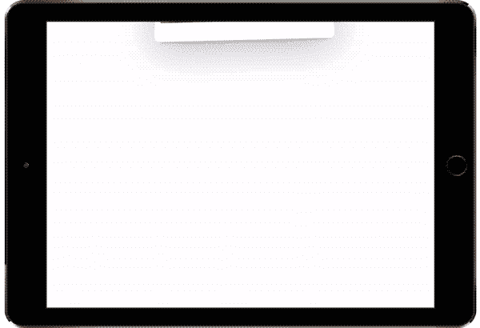

# 为您的下一个 React 项目提供 6 个动画库

> 原文：<https://javascript.plainenglish.io/6-animations-library-for-your-next-react-project-9b1d45fcb8e2?source=collection_archive---------7----------------------->

## #3 是我现在的最爱之一。



[Source](https://react-spring.io/).

最近我在考虑给我的 SaaS [野火](https://usewildfire.com)添加动画，在选择适合这个项目的库之前，我尝试了一些库。

向任何站点添加动画都可以立即带来更好的用户体验。

从在加载状态下显示动画到成功消息，动画可以极大地增强你的应用。

值得一提的是，你的动画必须流畅，并且不能以任何方式降低应用程序的性能。

虽然下面提到的一些库在创建复杂动画时比其他库更有能力，但它们仍然值得在列表中占有一席之地。

这是一个简单、易于实现且直观的库的管理。

以下是 React 的 6 个动画库:

## 1.[反应过来露出](https://www.react-reveal.com/)


[Source](https://www.react-reveal.com/).

React Reveal 可能是你在网站上添加动画最快的方式。

通过下面给出的命令安装软件包后，您可以使用它简化您的组件，这样就完成了。

```
npm install react-reveal --save
```

现在您可以包装您的组件了。

```
import Zoom from 'react-reveal/Zoom';
....
....
....
<Zoom>  
  <CustomComponent />
</Zoom>
```

此外，还支持服务器端渲染。

```
<Zoom ssrFadeout><h1>Content</h1></Zoom>
```

只需将`ssrFadeout`添加到动画组件中。

## 2.[反作用弹簧](https://react-spring.io/)


[Source](https://react-spring.io/).

React Spring 是一个基于弹簧物理学的动画库。

它比 React Reveal 包更广泛，因为它支持更多的动画，包括视差和轨迹。

尽管 API 很全面，但文档和演示几乎涵盖了所有内容。

下面是添加弹簧动画的代码:

```
*import* { Spring, animated } *from* 'react-spring'class ChainExample extends PureComponent {
  render() {
    return (
      <Spring
        loop
        from={{ opacity: 0, color: 'red' }}
        to={[
          { opacity: 1, color: '#ffaaee' },
          { opacity: 0, color: 'rgb(14,26,19)' },
        ]}>
        {styles => (
          <animated.div style={styles}>I will fade in and out</animated.div>
        )}
      </Spring>
    )
  }
}
```

## 3.[反应帆布纸屑](https://www.npmjs.com/package/react-canvas-confetti)


[Source](https://ulitcos.github.io/react-canvas-confetti/).

这不是一个典型的动画库。

顾名思义，它给你的应用程序添加了一个五彩纸屑动画。

我使用这个库在博客作为“成功”动画发布后展示一个五彩纸屑动画。

如果你熟悉`canvas-confetti` [库](https://github.com/catdad/canvas-confetti)，这个库将是一个显而易见的。

```
<ReactCanvasConfetti
    // set the styles as for a usual react component
    style={style}
    className={'yourClassName'}
    refConfetti={this.getInstance}
  />
```

***如果你想阅读更多这样的文章，可以考虑使用*** [***我的推荐链接***](https://medium.com/@anuragkanoria/membership) ***，这样你就可以通过点击*** [***这里***](https://medium.com/@anuragkanoria/membership) ***无限制地访问我的博客以及其他作者的博客。***

## 4.[成帧器运动](https://www.framer.com/motion/)


[Source.](https://www.framer.com/motion/)

我在使用 Chakra UI 时第一次发现了 Framer Motion，从那以后我就爱上了这个库。

```
import { motion } from "framer-motion"export const MyComponent = () => (<motion.div animate={{ scale: 2 }} transition={{ duration: 0.5 }}/>)
```

成帧器动作让你对动画进行精细的控制，它的功能非常多。

它可能是这个列表中最全面的库，如果动画是你的网站的一个重要方面，这是你应该去的库。

从视差动画到拖动到退出动画，这个库涵盖了所有内容。

## 5.[反应移动](https://www.npmjs.com/package/react-move)


[Source](https://www.npmjs.com/package/react-move).

React Move 是一个非常棒的数据驱动动画库，只有 3.5kb (gzipped)大小。

从上面的例子可以看出，无论何时添加或删除一个项目，您都会看到一个贴切、生动的动画来增强体验。

您可以将这些动画应用到饼图、地图、条形图等。

还支持 React Native 和 React-VR 以及现成的 Typescript 支持。

## 6.[使粒子反应](https://www.npmjs.com/package/react-tsparticles)


[Source](https://github.com/matteobruni/tsparticles/blob/main/components/react/README.md).

与上面讨论的五彩纸屑包一样，React Tsparticles 也属于类似的类别，尽管它的用途更广。

它扩展了使用粒子来创建美丽的背景和动画。

```
import Particles from "react-tsparticles";
import { loadFull } from "tsparticles";

const App = () => {
  const particlesInit = async (main) => {
    console.log(main);

    // you can initialize the tsParticles instance (main) here, adding custom shapes or presets
    // this loads the tsparticles package bundle, it's the easiest method for getting everything ready
    // starting from v2 you can add only the features you need reducing the bundle size
    await loadFull(tsParticles);
  };

  const particlesLoaded = (container) => {
    console.log(container);
  };

  return (
    <Particles id="tsparticles" url="http://foo.bar/particles.json" init={particlesInit} loaded={particlesLoaded} />
  );
};
```

如前所述，这个库更加通用和强大，这里有一些[演示](https://particles.js.org/samples/presets/index.html)的链接，你可以去看看。

## 最后的想法…

React 拥有强大的社区支持，并且有许多动画库可供使用，这对于开发者来说是一个巨大的选择。

在这个列表中，你得到了 6 个坚实、漂亮的动画库，你可以在你的下一个项目中进行实验。

除此之外，许多这些库也有 Vue 和其他框架的包装器。

如果你已经从这个列表中找到了你理想的动画库，那么是时候建立一个项目了。使用 API 是构建项目的绝佳方式，你可以查看我的博客:

[](/6-unique-apis-for-your-next-project-along-with-ideas-ea87a3175288) [## 为您的下一个项目提供 6 个独特的 API 和想法

### 免费和不同的 API 来构建有趣的应用程序。

javascript.plainenglish.io](/6-unique-apis-for-your-next-project-along-with-ideas-ea87a3175288) 

希望你喜欢阅读这个博客！

*更多内容请看*[***plain English . io***](https://plainenglish.io/)*。报名参加我们的* [***免费周报***](http://newsletter.plainenglish.io/) *。关注我们关于*[***Twitter***](https://twitter.com/inPlainEngHQ)*和*[***LinkedIn***](https://www.linkedin.com/company/inplainenglish/)*。查看我们的* [***社区不和谐***](https://discord.gg/GtDtUAvyhW) *加入我们的* [***人才集体***](https://inplainenglish.pallet.com/talent/welcome) *。*