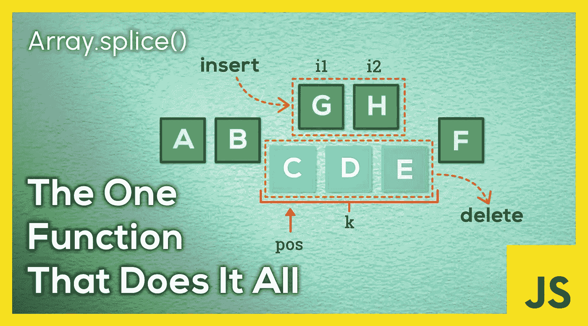
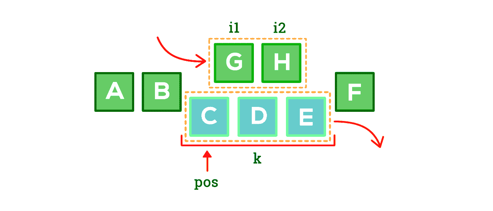
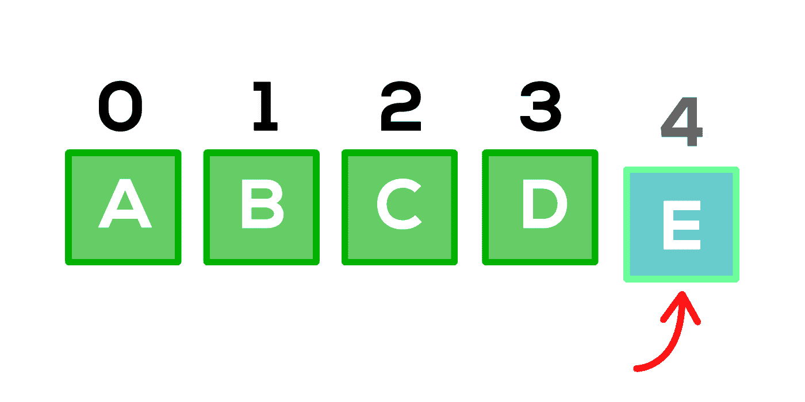
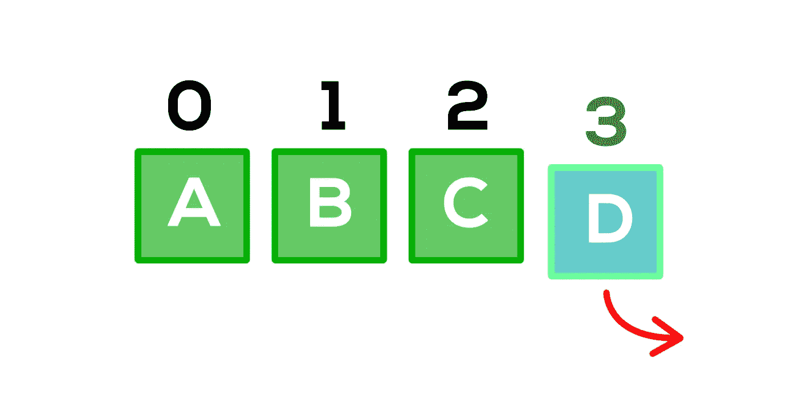
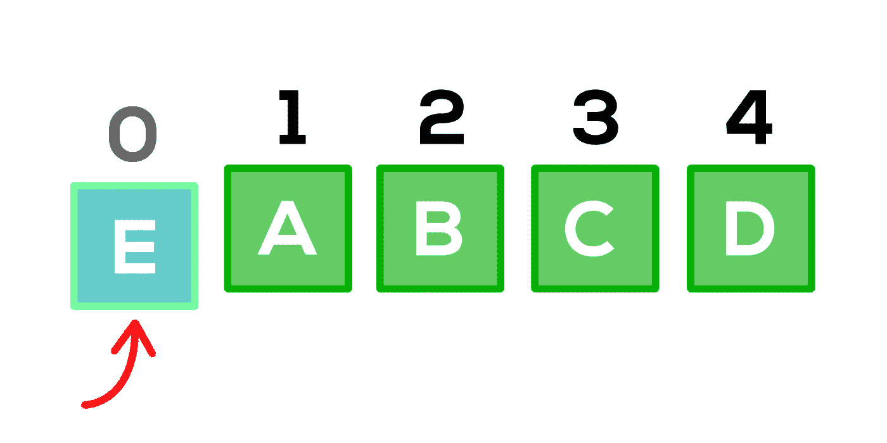
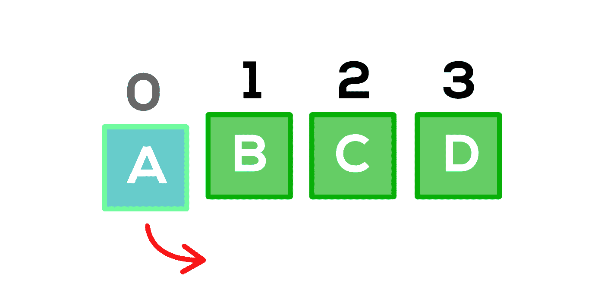
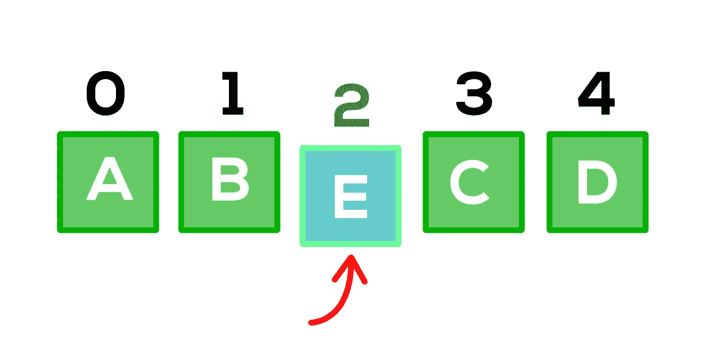
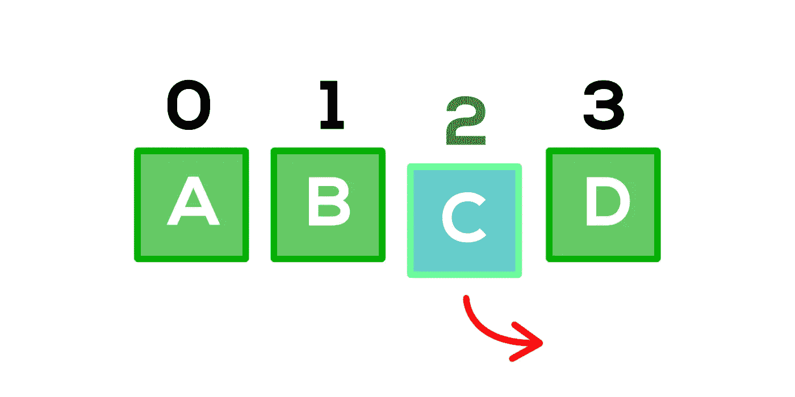

# 一个 JavaScript 函数可以完成 6 个数组操作

> 原文：<https://javascript.plainenglish.io/6-array-operations-that-can-be-done-with-one-javascript-function-c25f2a844a07?source=collection_archive---------18----------------------->

## 数组。Splice() —完成所有工作的函数。



数组是编程中最简单也是最广泛使用的数据结构。在数组中插入或删除元素是每个程序员日常工作中最常见的操作。

JavaScript 数组有一组内置函数，可以用来操作数组。但是其中的一个函数可以代替其他几个函数来执行一些常见的数组操作。

# **array . splice()函数**

`**Array.splice(pos,k,item1,item2,...,itemN)**` 函数可用于从数组的任何部分插入或删除任意数量的元素。第一个参数指定数组中要执行操作的**位置**。第二个参数接受从该位置向右的可能被删除的元素的**数量。剩余的参数可以是在该位置插入的项目。**

顾名思义，这个方法在位置`pos`切割✂数组，从该位置删除右边➡的🗑 `k`元素，并在该位置插入`0`或更多项。

考虑下图。这里，`pos`的值取为`**2**`，`k`取为`**3**`。剩下的参数是`**"G"**`和`**"H"**`，它们是要插入的项目。

```
var arr = ["A", "B", "C", "D", "E", "F"];
var pos = 2;
var k = 3;
var i1 = "G";
var i2 = "H";
arr.splice(pos, k, i1, i2);
```



当该方法执行时，元素`"C","D","E"`将被移除，而`"G","H"`将被插入。`splice()`方法的多功能性使其可用于执行以下数组操作。

> ***注意:*** *下面的数组定义用于本文中的所有例子。*

```
var arr = ["A", "B", "C", "D"];
console.log(arr); //  ["A", "B", "C", "D"]
```

# **1。在末端插入**



`**Array.push(item)**`是用于将一个或多个元素追加到数组末尾的默认数组方法。但是这可以通过如下的`**splice()**`来完成。

```
arr.splice(arr.length, 0, "E");
console.log(arr); //  ["A", "B", "C", "D", "E"]
```

这里我们设置第一个参数*(位置)*为数组的**长度，第二个参数*(要删除的元素个数)*为**零**，第三个参数为要插入的**元素**。**

不能使用`**Array.push()**` c 方法插入多个元素，但是可以使用`splice()`将这些元素作为逗号分隔的参数传递到方法的末尾。

```
arr.splice(arr.length, 0, "E", "F");
console.log(arr); //  ["A", "B", "C", "D", "E", "F"]
```

# **2。从末尾删除**



`**Array.pop()**` 是用来从数组末尾删除一个元素的默认方法。这可以通过如下的`**splice()**`来完成。

```
arr.splice(arr.length - 1);
console.log(arr); //  ["A", "B", "C"]
```

这里我们将第一个参数 *(position)* 设置为**比数组的长度**——最后一个元素——小一。在这种情况下，不需要提供第二个参数，因为当第二个参数不可用时，该方法会删除从`pos`到数组末尾的所有元素。

`**Array.pop()**` 一次只能删除一个元素。但是，多个元素可以使用如下的`**splice()**`方法从末尾删除。这里`count`指定要删除的元素数量。

```
var count = 2;
arr.splice(arr.length - count);
console.log(arr); //  ["A", "B"]
```

# **3。在开头插入**



`**Array.unshift(item)**`是默认方法，可用于在数组开头插入元素。但这也可以用`**splice()**`来完成，如下所示。

```
arr.splice(0, 0, "E");
console.log(arr); //  ["E", "A", "B", "C", "D"]
```

这里我们将第一个*(位置)*和第二个参数*(要删除的元素数量)*都设置为**零**，并将第三个参数设置为要插入的**元素**。

通过将多个元素作为逗号分隔的参数传递到`**splice()**`方法的末尾，可以插入多个元素。

```
arr.splice(0, 0, "E", "F");
console.log(arr); //  ["E", "F", "A", "B", "C", "D"]
```

# **4。从头删除**



`**Array.shift()**` 是用来从数组开头删除一个元素的默认方法。这也可以使用如下的`**splice()**`方法来完成。

```
arr.splice(0, 1);
console.log(arr); //  ["B", "C", "D"]
```

这里我们将第一个参数*(位置)*设为**零**，将第二个参数*(要删除的元素数)*设为**一**。

`**Array.shift()**` 一次只能删除一个元素。但是，多个元素可以使用如下的`**splice()**`方法删除。`count`是要删除的元素个数。

```
var count = 2;
arr.splice(0, count);
console.log(arr); //  ["C", "D"]
```

# **5。在中间插入**



JavaScript 中没有特定的数组方法可以用来在数组中间插入元素。然而，有几种方法可以实现这一点。其中之一是使用`**splice()**`方法。

```
var pos = 2; // position where the element is to be added
arr.splice(pos, 0, "E");
console.log(arr); //  ["A", "B", "E", "C", "D"]
```

我们初始化一个变量`pos`,它存储了要插入的元素的位置。现在，将第一个参数*(位置)*设置为`**pos**`，将第二个参数*(要删除的元素数)*设置为`**0**`，将第三个参数设置为要插入的**元素**。

通过将多个元素作为逗号分隔的参数传递到 splice 方法的末尾，可以在中间插入多个元素。

```
var pos = 2; // position where the element is to be added
arr.splice(pos, 0, "E", "F");
console.log(arr); //  ["A", "B", "E", "F", "C", "D"]
```

# **6。从中间删除**



方法也可以用来从数组中间删除一个元素。

```
var pos = 2;
arr.splice(pos,1);
console.log(arr); //  ["A", "B", "D"]
```

我们初始化一个变量`pos`,它存储要删除的元素的位置。现在，将第一个参数*(位置)*设置为`**pos**`，将第二个参数*(要删除的元素数)*设置为**一个**。

如果`count`是要删除的元素数量，通过将`k`的值设置为`count`可以删除多个元素

```
var pos = 2;
var count = 2;
arr.splice(pos,count);
console.log(arr); //  ["A", "B"]
```

在本文中，我们学习了`**Array.splice()**`函数，以及如何用它来替换 JavaScript 中的其他几个函数。

*更多内容请看*[***plain English . io***](https://plainenglish.io/)*。报名参加我们的* [***免费周报***](http://newsletter.plainenglish.io/) *。关注我们关于*[***Twitter***](https://twitter.com/inPlainEngHQ)*和*[***LinkedIn***](https://www.linkedin.com/company/inplainenglish/)*。加入我们的* [***社区不和谐***](https://discord.gg/GtDtUAvyhW) *。*