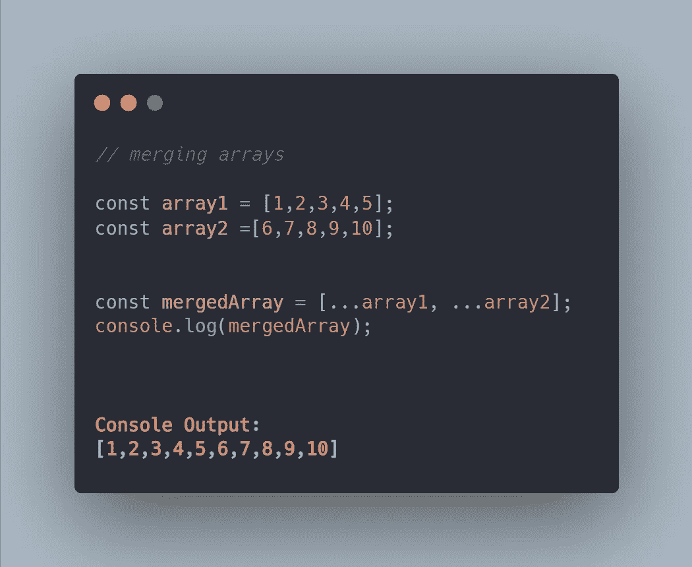
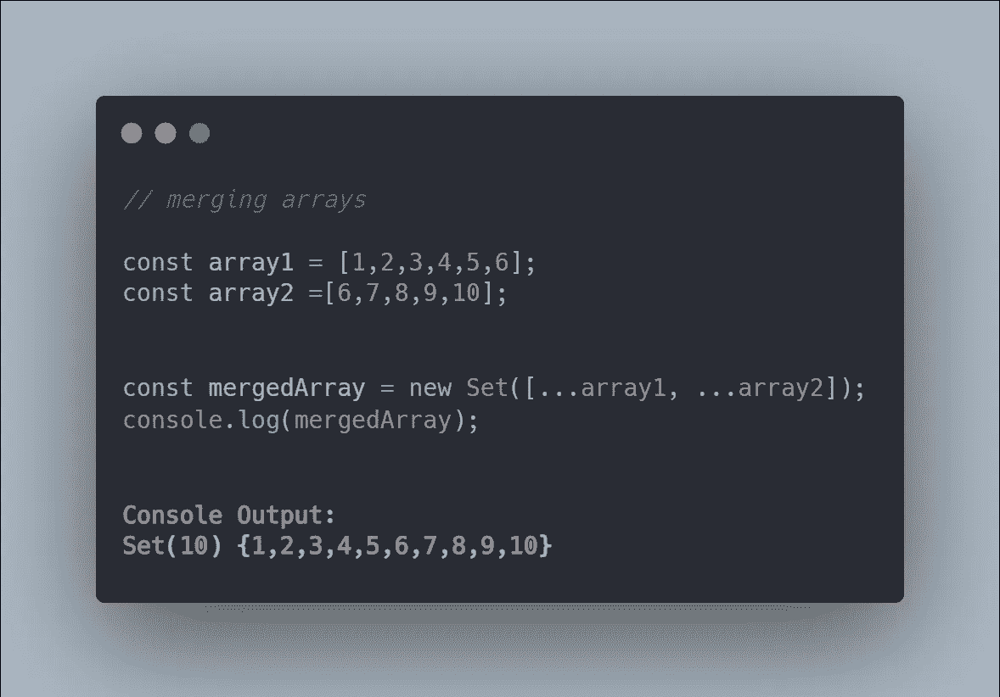
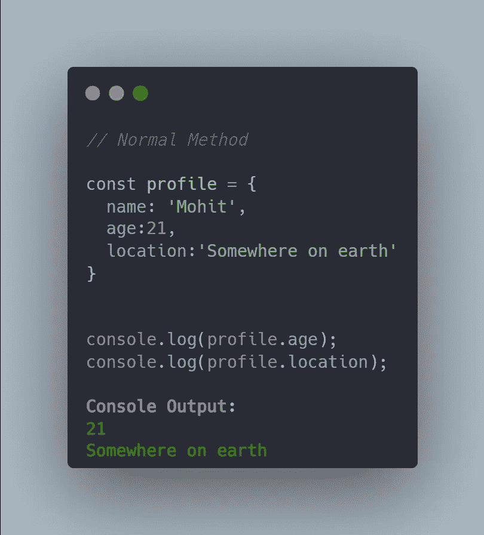
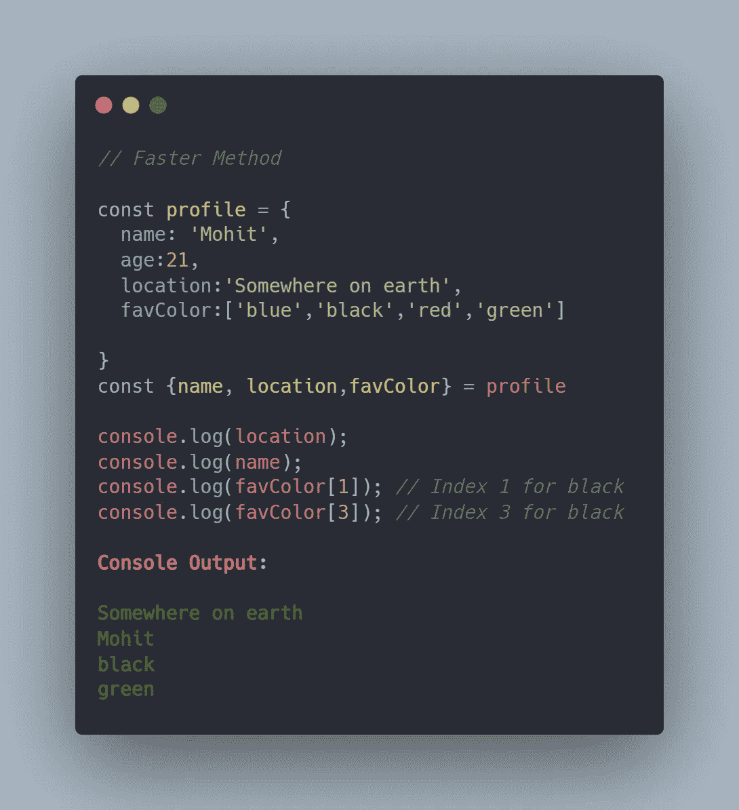
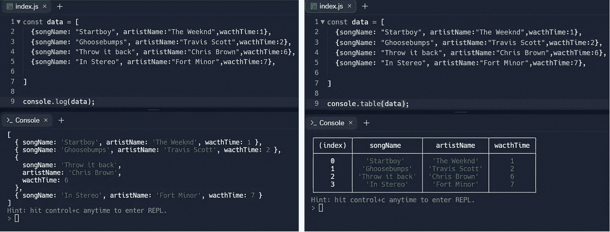
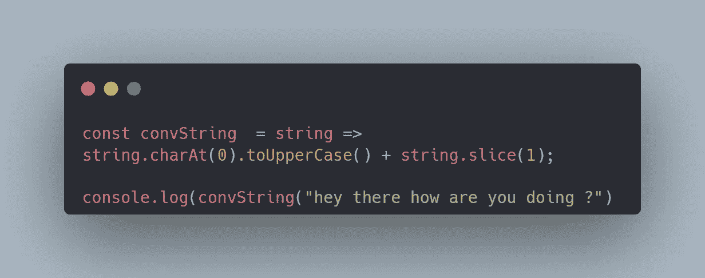
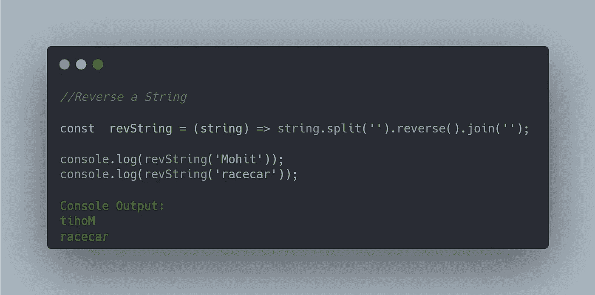

# 你需要知道的 6 个很棒的 JavaScript 一行程序

> 原文：<https://javascript.plainenglish.io/6-awesome-javascript-one-liners-you-need-to-know-f0e0d2694fae?source=collection_archive---------1----------------------->

## 以前所未有的速度编写 JavaScript

## **1。设计模式**

JavaScript 总是给我带来惊喜，它的独特特性让我觉得使用起来更有趣。设计模式让你可以在网站上玩文本，你只需要在控制台上输入**文件**来启用它。**现在你可以编辑文本和玩网站了。**

**Design Mode ON** vs **Design Mode OFF**

## 2.合并数组

在 *JavaScript* 中有很多不同的方法来合并数组，但是使用节省时间的技术对开发人员来说总是一个好方法。

***例如:***

*   假设我们有两个数组，数组中的数字从**1–10**；
*   要合并**阵列 1** 和**阵列 2** ，一个排列操作员将立即完成这项工作。

*   然而，在任何数组中出现重复项的情况下，我们必须进行一些更改。
*   为了确保合并后的数组不包含任何重复项，我们可以使用一个 **Set()** 来删除重复项。

**Merging Arrays**

*   注意，当我们使用包含重复项的数组时， **Set()** 会很快删除它们。

## 3.提取，血统

您必须熟悉 JavaScript 中的提取，大多数时候我们使用点表示来访问对象中的属性，如下所示:

> 但是有更快的方法可以做到这一点

***例如:***

*   假设我们有一个名为 **profile** 的 *const* ，为了提取名为 **age、name、** & **location** 的属性，我们可以使用一个点来访问它们。
*   为此，您必须添加您想要访问的 ***属性*** ，并将其设置为等于您想要从中提取的 ***对象*** 。

**Faster way of Extraction**

*   此外，如果您正在处理数组，那么您可以简单地使用带有索引值的属性来访问这些数组项。

## 4.控制台.表格

使用老式的 ***console.log*** 可能是开发人员最喜欢的，但是有时候你的数组包含大量数据，这使得读取 log 语句变得更加困难。对于这种情况，一个很好的替代方法是使用***console . table***，它在表中记录数据。在 JavaScript 中使用数组时，这个特性会非常方便，因为它使得读取数据变得非常容易。

**console.log** vs **console.table**

## 5.将字符串大写

当您的前端应用程序需要美观且没有错误时，一堆乱七八糟的字符串看起来并不好看。为了确保你永远不必面对这种情况，你可以使用下面的方法来立即大写一个字符串。

***例如:***

*   我们在这个例子中使用了 **JavaScript** arrow 函数，我们的 arrow 函数需要一个包含小写字符串的 ***字符串*** 。
*   为了利用这一点，我们使用了 **charAt(0)** 在**索引 0** 处选取一个字母，并使用 **toUpperCase** 将该字母转换成大写字母。
*   **string.slice(1)** 完成组合剩余小写字母的剩余工作。

**Capitalizing a String**

## 6.反转一根绳子

JavaScript 内置方法使得反转字符串变得非常容易，你只需要按照正确的顺序使用内置方法就可以得到结果。

***例如:***

*   假设我们有一个名为 **revString** 的函数，其中我们传递了一个需要反转的 ***字符串*** 。
*   使用**split(')**方法我们可以断开我们的字符串，使用 **reverse()** 方法字符串被反转。
*   **join(')**用于再次连接我们反转的字符串。

> 注意，这个方法对回文无效。

**Reverse a String**

 [## 数组中第一个重复出现的字符

### JavaScript 中的数据结构和算法

javascript.plainenglish.io](/first-recurring-character-in-an-array-88f3dcca1638)  [## 作为高级开发人员，你必须知道的 3 个高级 JavaScript 概念

### 引用类型、上下文和实例化

javascript.plainenglish.io](/3-advanced-javascript-concepts-you-must-know-as-a-senior-developer-b1f4e8379305)  [## Ultra 4 分钟指南:一个新的 React Web 框架

### 解开网络捆绑

javascript.plainenglish.io](/4-minute-guide-to-ultra-a-new-react-web-framework-7f12a853f58) 

*更多内容请看*[***plain English . io***](https://plainenglish.io/)*。报名参加我们的* [***免费周报***](http://newsletter.plainenglish.io/) *。关注我们关于*[***Twitter***](https://twitter.com/inPlainEngHQ)[***LinkedIn***](https://www.linkedin.com/company/inplainenglish/)*[***YouTube***](https://www.youtube.com/channel/UCtipWUghju290NWcn8jhyAw)*[***不和***](https://discord.gg/GtDtUAvyhW) *。对增长黑客感兴趣？检查* [***电路***](https://circuit.ooo/) *。***