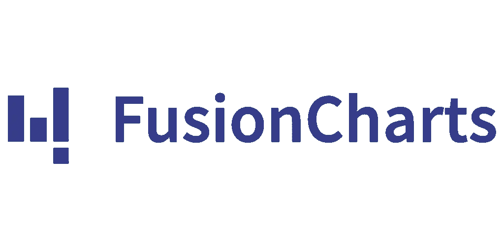

# 6 个最佳反应数据可视化库

> 原文：<https://javascript.plainenglish.io/6-best-react-data-visualization-libraries-fc155b573168?source=collection_archive---------1----------------------->

## 立即升级您的 React 项目

## [1。胜利](https://github.com/FormidableLabs/victory)

> GitHub Stars: 9.2K

实现**图形**和**图表**的绝佳选择在 React 应用程序中，你会得到一些令人敬畏的特性，比如*&***缩放*** 。然而，获得像样的图表结果需要更多的时间&建议只有在你从事个人项目时才使用这个库，因为它比其他的更容易使用。*

*   *它附带了数量有限的可视化工具，然而，它更容易使用，但缺乏控制 ***标签定位，宽度*** & ***高度*** 。*
*   *您还可以使用这个库在 ***React Native*** 中处理图表和图形，这也被认为是一个不错的选择，因为它不像其他库那样直接与 **DOM** 交互。*

## *[2。开普勒. gl](https://github.com/keplergl/kepler.gl)*

> *GitHub Stars: 8.3K*

**

*一个强大的大规模数据集库，建立在 **deck.gl** 之上，可以渲染数百万个点。作为 React 组件，它使用 **Redux** 来管理其 ***状态*** 和 ***数据*** 流，这就像任何其他 Redux 状态一样提供了定制的灵活性。要使用 ***kepler.gl*** 你只需在 UI 中挂载 kepler.gl React 组件，在 root reducer 中挂载 kepler.gl reducer。*

*   *建议在大型应用程序和个人项目中使用该库，该库由 ***【优步】*** 的开发人员维护良好。*
*   *与其他数据可视化库相比，使用 kepler.gl 需要一些时间。*

## *[3。reaviz](https://github.com/reaviz/reaviz)*

> *GitHub Stars: 507*

**

*这个库使用 ***D3js*** 进行计算，它提供了你在应用中可能需要的所有基本图表。多种图表类型可用，具有大量定制选项。在这个列表中，这个库对图表非常有效，而且与其他库相比，实时编辑数据也很容易。*

*   *很棒的文档。*
*   *流畅地编辑实时数据。*

## *[4。fusioncharts](https://github.com/fusioncharts)*

> *GitHub Stars: 8.8K*

**

*作为一名 React 原生开发人员，我个人最喜欢的图表库之一，这个库提供了所有的基本特性，并提供了很好的文档。Fusioncharts 支持大量图表类型和地图，可以轻松集成到任何技术堆栈中。如果您正在开发一个大规模的生产应用程序，那么我会推荐您使用这个库，因为即使在低性能设备上，图表也能呈现出迷人的效果。*

*   *生产级**移动** & **Web** 应用的好选择。*
*   *通过实施援助提供良好的支持。*

## *[5。反作用于](https://github.com/uber/react-vis)*

> *GitHub Stars: 8.1K*

**

*另一个由优步的开发人员构建的伟大的库具有一些伟大的功能， *react-vis* 使用简单且灵活，刚刚接触 react 生态系统的初学者可以很容易地开始在 ***移动***&***Web***应用程序上构建图表。*

*   *这很简单，你不需要非常擅长 React，因为你的第一次可视化不需要任何关于 ***React*** 库的深入知识。*
*   *它还提供了一组基本的构建块，使入门更加容易。*例如*，单独的 **X** & **Y** 组件提供了对布局图表的高级控制。*
*   *它支持 ***React 的*** 生命周期，不会创建不必要的 ***节点*** 。*

## *[6。反应流](https://github.com/wbkd/react-flow)*

> *GitHub Stars: 8.8K*

**

*一个非常有趣的库，您可以在 React 应用程序中构建基于节点的图形。它易于使用，具有无缝*缩放*和*平移*功能以及单个元素多选。*

*在使用基于节点的图形时，您可以获得可定制的节点和边类型，即使在低性能设备上也能快速渲染。另外，用**打字稿**写，用**柏树**测试。*

*   *你可以看看一些 [***例子***](https://reactflow.dev/examples/) 基于节点的图在 react-flow 中是什么样子。*

* [## 开发人员永不过时的 4 项技能

### 提升自信的技巧

javascript.plainenglish.io](/4-skills-that-never-gets-old-for-developers-6c90ef901fb8)  [## 2022 年自学成才的开发者赚钱的 5 种方式

### 2022 年挣得比全职工作还多

javascript.plainenglish.io](/5-ways-to-make-money-as-a-self-taught-developer-in-2022-54e18603c8e0)  [## TypeScript 4.5 中的所有新功能

### 一个更好的 TypeScript 版本终于出现了

javascript.plainenglish.io](/everything-new-in-typescript-4-5-f57b0b3dc437) 

*更多内容请看*[***plain English . io***](http://plainenglish.io/)*。报名参加我们的* [***免费周报***](http://newsletter.plainenglish.io/) *。在我们的* [***社区***](https://discord.gg/GtDtUAvyhW) *获得独家获得写作机会和建议。**