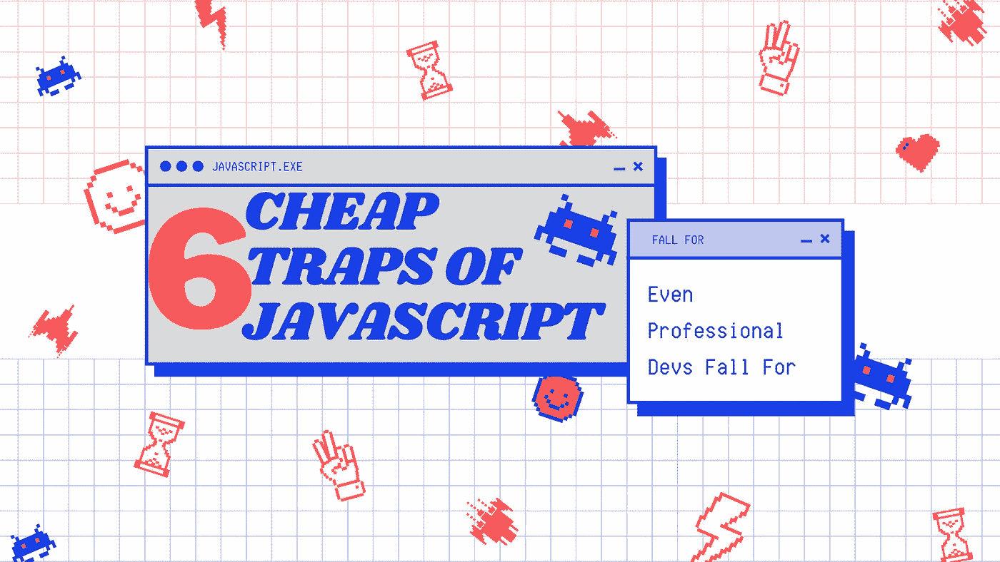

# 6 个便宜的 JavaScript 陷阱，也让专业开发人员受益匪浅

> 原文：<https://javascript.plainenglish.io/6-cheap-traps-of-javascript-that-also-get-the-better-of-professionals-developers-8818e0a1f190?source=collection_archive---------11----------------------->

## 不管你的经历如何，他们中的一些人会抓住你。

Art made by the [Author](http://www.arnoldcode.com) by [Canva](http://www.canva.com)

# 1.“With”的缺陷

`with`语句为您提供了一种访问对象属性的快捷方式。

但是当你看到代码时，你会加入到是否应该使用它的冲突观点中。道格拉斯·克洛克福特不喜欢它。约翰·瑞西格在他的《T21》一书中揭示了它的几种巧妙用法。他承认使用时会令人困惑，我同意他的观点。

孤立地看一个`with`块，不可能准确地说出发生了什么:

我是修改了本地变量`bob, eric, max, optimus`还是设置了`babyNames.bob, babyNames.eric, babyNames.max, babyNames.optimus`？

嗯，如果`babyNames.bob`已经被定义，那么它被重置为‘好’否则，如果范围内有一个`bob`变量，就改变它。最后一种情况发生在没有对象`babyNames`或者`babyNames`没有属性`bob`的时候。

最后，确切地写下你想做的事情会更清楚。

# 2.数组和类型 of！=数组

`typeOf`返回基本类型实例的类型。

`Array`不是基本类型。所以`typeof`和`Array`是`Object`而不是`Array`:

# 3.文字和数组的实例会产生误导

`instanceOf`返回对象是否是使用指定的构造函数构造的。

这也适用于其原型链中的对象。这在检查您自己定义的对象类型时非常有用。但是如果您使用字面语法创建一个内置类型的实例，那就太容易引起误解了:

由于`[Array](/array-reduce-in-javascript-b196353a5f6d?source=your_stories_page----------------------------------------)`不是真正的内置类型之一(它的作用是——因此`typeof`不像预期的那样工作),所以`instanceof`确实像预期的那样工作:

综上所述，如果想测试类型`Boolean`、`String`、`Number`，或者`Function`，可以使用`typeof`。其他的都可以用`instanceof`。

# 4.字符串替换不是全局应用的

字符串`replace` 函数只替换第一个匹配。再多就哔！他们不会被取代。

如果您希望替换所有匹配，您必须使用一个[正则表达式](https://levelup.gitconnected.com/indiana-jones-and-the-universal-way-to-search-for-text-1901990f53ae)并向其添加全局修饰符。全局修饰符确保替换在第一次匹配后停止。

# 5.“+”运算符既可以加法也可以连接

JavaScript 的`+`操作符总是导致连接。

缩小范围，当任一操作数为`string`时。如果你想加一个数字，这可能会让你崩溃。例如，输入元素的内容(将是一个`string`)。

你需要先投`Number`:

# 6.Math.max 和 Math.min 扭曲无限

在这个疑难杂症列表的末尾有一个很大的混乱的小疑难杂症。

`Math.max()` & `Math.min()`是两个效用函数，给出参数的最大值或最小值。当你不带任何参数地使用它们时，你会得到`-Infinity` & `Infinity`。

***这里有什么问题？***

*   Max => `-Infinity`
*   Min => `Infinity`

获取 26 份备忘单，只研究你真正需要的东西，以获得你的第一份网络开发工作！

[Arnold Code Academy 26 Web Developer Cheatsheets](https://arnoldcodeacademy.ck.page/26-web-dev-cheat-sheets)

*更多内容请看*[*plain English . io*](http://plainenglish.io/)*。报名参加我们的* [*免费每周简讯*](http://newsletter.plainenglish.io/) *。在我们的* [*社区*](https://discord.gg/GtDtUAvyhW) *获得独家写作机会和建议。*