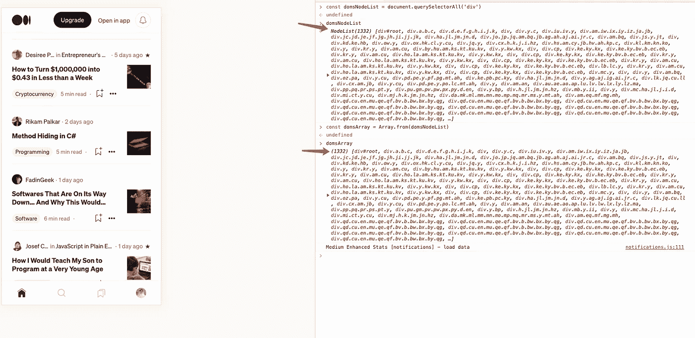

# ES6 中你必须知道的 6 个超酷的数组功能

> 原文：<https://javascript.plainenglish.io/6-cool-array-functions-in-es6-you-must-know-28aea7c8b93b?source=collection_archive---------1----------------------->

## 让你少写多做的 6 ES6 小技巧。

# 1.数组. of

**关于诡异数组函数:**

众所周知，我们可以通过数组函数做以下事情。

1.  初始化指定长度的数组
2.  设置数组的初始值

传递给数组函数的参数个数不一样，它的函数也不一样。这常常让我困惑。

好在我们可以用 Array.of 来弥补 Array 的不足。

# 2.数组. from

从方法中，我们可以通过 Array.from 方法将类似数组的对象、arguments 对象和 NodeList 对象转换为真实的数组。

1.  **阵列状物体**

**2。节点列表**

**3。参数**

**4。Array.from 的第二个参数**

我们可以使用类似“[]的 Array.from 方法。地图”。

# 3.包含

我们经常会写这样的判断语句，在满足其中一个条件的情况下做一些事情。

事实上，您可以通过 include 方法简化代码。

# 4.使用“at 方法”读取数组的尾部元素

如何读取数组的尾部元素？是的，我们需要用“array.length-1”作为下标来读取。

**还有别的办法吗？**

是的，“at”方法将是你的魔法。当然，您可以读取数组中其他位置的元素。

# 5.平的

from[MDN](https://developer.mozilla.org/en-US/docs/Web/JavaScript/Reference/Global_Objects/Array/flat):“flat()方法创建一个新数组，所有子数组元素递归地连接到该数组中，直到指定的深度。”

# 6.findIndex

from[MDN](https://developer.mozilla.org/en-US/docs/Web/JavaScript/Reference/Global_Objects/Array/findIndex):" find index()方法返回数组中满足所提供测试函数的第一个元素的索引。否则，它返回-1，表示没有元素通过测试。

# 最后

**感谢阅读。**期待期待您的关注，阅读更多高质量的文章。

 [## 让你看起来像高级开发人员的 8 个很酷的 GitHub 技巧

### 使用 GitHub 可以做的 8 件很酷的事情

javascript.plainenglish.io](/8-cool-github-tricks-to-make-you-look-like-a-senior-developer-ab8fe9ae9b14)  [## 10 个你可能不知道答案的简单面试问题

### 99%的人不一定知道答案。

javascript.plainenglish.io](/10-easy-interview-questions-you-may-not-know-the-answer-e9421a0953b8)  [## 面试官:可以“x！== x "在 JavaScript 中返回 True？

### 你可能不知道的五个神奇的 JavaScript 知识点！

javascript.plainenglish.io](/interviewer-can-x-x-return-true-in-javascript-7e1d1fa7b5cd)  [## 123['toString']。length + 123)用 JavaScript 打印出来？

### 95%的前端开发者回答错误的问题。

javascript.plainenglish.io](/what-does-123-tostring-length-123-print-out-in-javascript-2c804a414325)