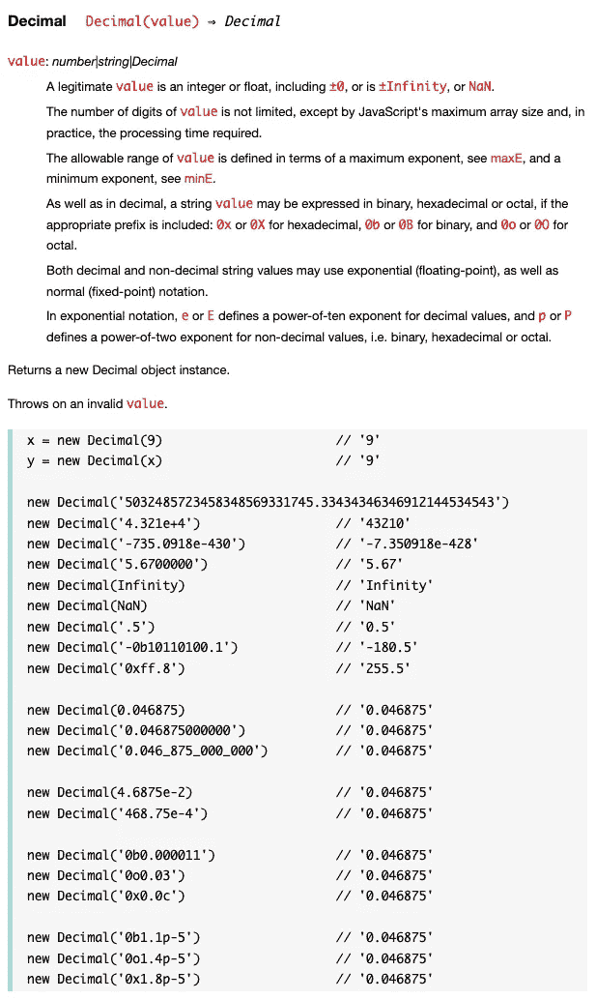

# 6 个不允许你成为高级开发人员的古怪 JavaScript 错误

> 原文：<https://javascript.plainenglish.io/6-curios-javascript-mistakes-that-disallow-you-to-become-a-senior-dev-9fc3a9e281b9?source=collection_archive---------2----------------------->

## 如果你想往上爬，就不要犯这么简单的错误


Image By [Author](http://ArnoldCode.com) Via [Canva.com](http://Canva.com)

> 没有需求或设计，编程就是给一个空文本文件添加 bug 的艺术。—路易·斯利格雷

*添加 bug*是这里的关键词。bug 是任何开发者最大的敌人，你写的无 bug 代码越多，你就越容易获得晋升。JavaScript 可能是一个丛林，如果你没有意识到这种语言提供的许多古怪和特性，你只是在给文本文件添加错误。

一个简单的循环可能已经是错误的选择，整个程序将不再工作。

# 1.For-In 循环的数组迭代

`forEach`、`for`、`for-of`是推荐的循环语句。

但是`for-in`呢？

我看到很多使用它的代码，因为它看起来简单且符合逻辑。

但是细节决定成败。

一个数组有它的原型`Array.prototype`。如果有人在添加方法/属性，那么🦆变得疯狂！在下一个代码片段中，我将创建一个包含元素`1`、`2`和`3`的数组`numbers`。我还将添加一个名为`WhoAreYou`的原型属性，内容为🦆。

既然`WhoAreYou`也将被迭代，为什么输出`numbers`的长度会得到 3？因为长度关联的是对象`numbers`本身，而不是原型。

使用`for-in`循环时会出现问题。反正你会看到`WhoAreYou`的索引。

如果你用同样的循环迭代元素，你也会看到鸭子。

所以对包含原型方法的数组使用`for-in`循环会有问题。

**最坏的情况** *:想象一下*你在一个函数中实现了一个`for-in`循环，这个函数处理许多包含重要信息的数组。一切都很好，但是团队中的另一个开发人员给原型添加了一些东西…🔥

**代替**，使用`forEach`、`for`、`for-of`的适当循环。

# 2.使用带有命名索引的数组

从技术上讲，数组只是 JavaScript 中的一个对象。Any 允许您使用命名索引。就像物体的属性一样。

如果您这样做，您可能会很快使用数组方法产生错误的结果。例如，您将不再获得合适的索引长度。

你认为什么会看起来更干净？

*此外，任何人都会马上告诉你使用关联数组是错误的。*

# 3.误用+运算符来合并数组

> 我想玩一个游戏。—拼图

告诉我`console.log`语句的结果:

```
x = [1, 2];
y = [3, 4, 5];console.log(x + y)
```

正确答案是什么？

*   **【1，2，3，4，5】**
*   **【1，23，4，5】**

JavaScript 没有添加数组，而是将最后一个元素`x`与第一个元素`y`连接起来。导致**【1，23，4，5】。**

## 改做什么？

使用[适当的方法](http://seekoapp.io/61d9805e96f000f4ab603b82)连接数组:

您也可以使用 spread 语法:

> **提示**:通过应用[现代编码方式](/upgrade-your-legacy-coding-style-with-these-6-modern-ways-of-coding-6a9db753a574)，我进一步提升了我的 JavaScript 编码技能。

# 4.处理 NaN(非数字)

处理这个小 NaN f*ck*r 相当复杂。虽然 NaN 代表 [*不是一个数字*，但它实际上是一个](http://seekoapp.io/61d9805f96f000f4ab603b83)🤯

因此，比较表达式不能正确处理`NaN`,请检查:

那么，到底是什么🦆？那么处理`NaN`的一个好方法是什么呢？

我们有`isNaN()`，我们有`Number.isNaN()`。如果我们放入`NaN`作为参数，两者都会工作并返回 true。

## 但是它们之间有什么区别呢？

`Number.isNaN()`不强制将参数转换成数字。

全局`isNaN()`函数确实会转换。

这意味着传递通常会转换为`NaN`但实际上不是`NaN`的值是安全的。因此，只有同样是`NaN`的数字返回 true。

**使用** `**Number.isNan()**` **更健壮。**

# 5.不使用严格模式

通常会被忽略的代码错误现在会出现。

严格模式是一种选择进入 JavaScript 受限变体的方式。它有意具有不同于常规代码的语义。此时，含蓄地选择退出“[草率模式](http://seekoapp.io/61d9806096f000f4ab603b84)”太多的开发人员不使用这个特性。

严格模式代码和非严格模式代码可以共存，以便脚本可以增量地选择严格模式。

*如何调用？*

```
'use strict';
```

这是你需要的唯一一行。使用它来启用它:

*   整个脚本/文件
*   功能
*   班
*   模块(自动处于严格模式)

*更多优势:*

*   简化调试
*   它可以防止意外创建全局变量
*   消除“这种”强制
*   不允许创建重复的属性名或参数
*   在`delete`的无效用法中抛出错误

阅读 Mozilla 文档以了解每个细节。

# 6.错误地比较浮动

简单数学逻辑:`0.3 + 0.6 = 0.9`。

但在计算机逻辑中，这是不正确的。会出现微小的偏差。这是 pcs 精度的本质。

将你的价值观与简单的`==`或`===`相比较是错误的

## 改做什么？3 个选项

比较带`deviation`的浮子和`Math.abs()`的用法。

你也有机会用`parseFloat()`让你的浮动达到期望的精度。`2`是您想要用来获得正确结果的精度。

作为选项 3，您可以随时使用库，例如`[decimal.js](http://seekoapp.io/61d9806396f000f4ab603b86)`。



[Screenshot from Decimal.js GitHub API](https://mikemcl.github.io/decimal.js/)

获取 26 份备忘单，只研究你真正需要的东西，以获得你的第一份网络开发工作！


Arnold Code Academy 26 Web Developer Cheatsheets

*更多内容看* [***说白了就是***](http://plainenglish.io/) *。报名参加我们的* [***免费每周简讯***](http://newsletter.plainenglish.io/) *。在我们的* [***社区获得独家写作机会和建议***](https://discord.gg/GtDtUAvyhW) *。*