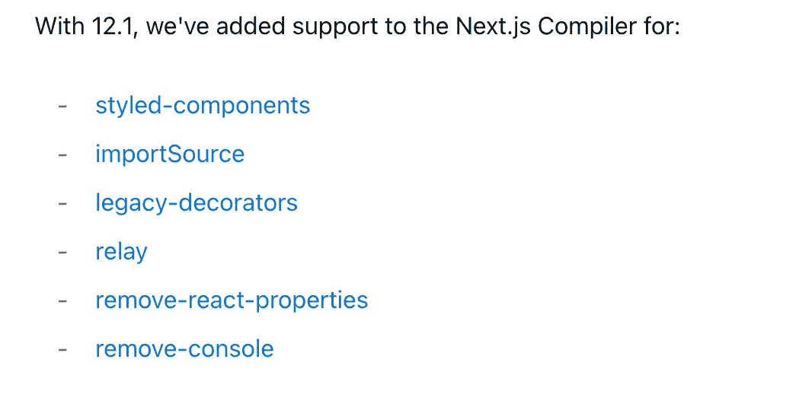
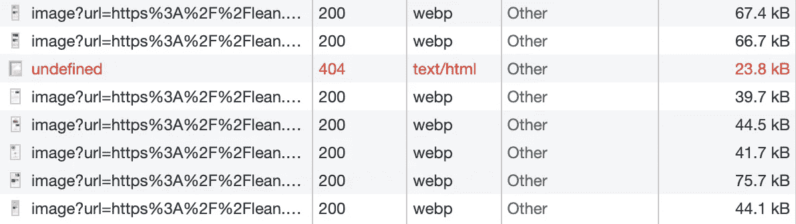
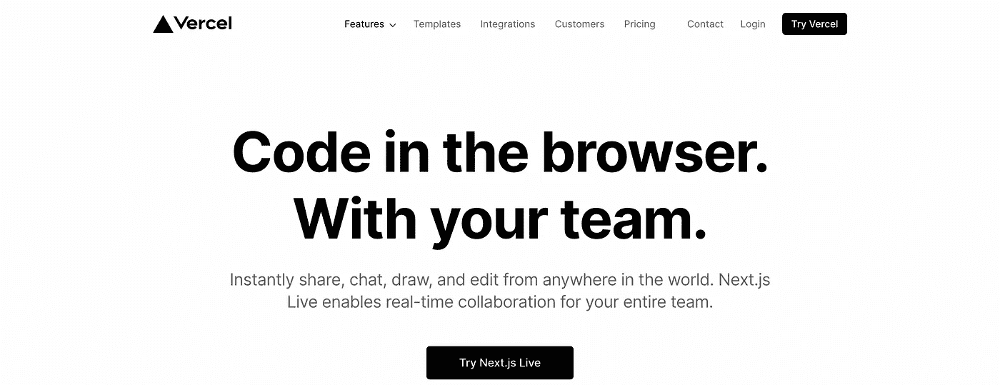
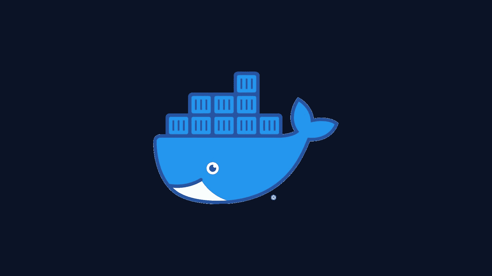

# 6 个较少被提及的 Next.js 特性

> 原文：<https://javascript.plainenglish.io/6-extraordinarily-useful-features-present-in-next-js-9fffd235d46?source=collection_archive---------10----------------------->

## 为什么我这么喜欢 Next.js


Photo by [Ben White](https://unsplash.com/@benwhitephotography?utm_source=medium&utm_medium=referral) on [Unsplash](https://unsplash.com?utm_source=medium&utm_medium=referral)

我发现自己最近越来越多地使用 Next.js，以至于在过去一年中我没有使用任何其他框架。

我不是一个拘泥于一个框架的人。我喜欢学习和尝试新的库和框架。

然而，Next.js 提供了如此丰富的功能和次要特性，使得大多数其他框架看起来不完整。

不要误解我的意思，其他框架也很棒，你应该使用你熟悉的任何工具来满足你的需求，对我来说，它就是 Next.js。

> 当你知道得更多，你会做得更好。~Mayo Angelou

最近，Next.js 一直在推出更新，这些更新似乎针对的是其他任何框架都无法满足的开发人员的需求，至少在 JavaScript 生态系统中是这样。

下面讨论的所有特性都出现在最新版本的 Next.js 中(在写这篇博客时是 12.1 版)。

*要更新到 Next.js 的最新版本，请运行以下命令:*

```
npm install next@latest
```

下面是你能在 Next.js 中找到的 6 个非常有用的特性，我希望我能早点知道:

## 1.删除所有控制台日志



[Source](https://nextjs.org/blog/next-12-1).

在控制台中记录数据是开发人员臭名昭著的调试方法，我们都对此感到内疚。

然而，随着时间的推移，在大型项目中，我们可能会经常忘记删除控制台日志命令，当这些命令被发布到生产环境中时，**最终用户也会看到它们。**

不是我们想要的，对吗？

之前，我使用 regex `**console.log.*$**` 搜索控制台日志，然后用空字符串替换它们。

但是感觉不太对，如果我想在开发模式下再次使用它呢？

Next.js 在 v12.1 中提供了一个方便的特性，可以禁用所有日志。更有趣的是，您还可以排除任何可能很重要的特定类型的日志，如“错误”。

```
module.exports = {
  compiler: {
    removeConsole: {
      exclude: ['error'],
    },
  },
}
```

## 2.图像优化



Source: Author

Next.js 提供了令人难以置信的开箱即用的图像优化技术。

我最近将我的 Next.js 版本推向了生产。

在本地，Next 使用` [sqoosh](https://www.npmjs.com/package/@squoosh/lib) `进行映像优化，因为在开发环境中安装更容易、更快。

然而，当运行 Next.js 生产版本时，我注意到 Chakra UI 的 Image 组件加载图像的时间太长，Next.js 的 Image 组件也是如此。快速查看日志后，我意识到有一个[问题](https://nextjs.org/docs/messages/sharp-missing-in-production)。

在添加了缺少的依赖项并从标准图像组件切换到下一个图像后，我注意到不仅媒体密集型页面上的滚动非常平滑，而且图像大小也减小了。

我上面分享的图片显示了图片的大小，所有图片的大小都在 70kb 以下，这很令人惊讶，因为这些图片的大小实际上都在 700kb 到 1Mb 之间。

这种尺寸的减小是因为 Next.js 处理图像的方式，而且因为它将图像转换为“webp”格式，这大大减小了图像的尺寸。

**此外，最近他们还在内置的图像优化 API 中支持 AVIF 图像，使得图像比 WebP 小 20%。**

## 3.动力载荷

Next.js 允许开发人员轻松地动态拆分代码和导入组件。

这不仅有助于减少首次加载时间和页面大小，而且对某些类型的库也非常有用。

我在这里提到的库是客户端大小的库——只能在浏览器中运行，无法在服务器端呈现。

您可以导入这些库，甚至在您打算加载到服务器端的页面上也可以很容易地使用它们。

```
import dynamic from "next/dynamic";

// ...

const MyComp = dynamic(()=>import("../components/Editor"), 
{ ssr: false });
```

此外，如上所述，这也导致[第一负载 JS 的减少。](https://thekevinwang.com/2021/03/15/reduce-first-load-js/)

## 4.零客户端 JavaScript

要启用此功能，您必须安装最新版本的 Next 以及其他一些软件包。运行以下命令安装所有必需的软件包:

```
npm install next@latest react@rc react-dom@rc
```

js 12+提供了对服务器端组件的支持，但是这种支持仍然处于 alpha 阶段。

```
module.exports = {
  experimental: {
    runtime: 'nodejs',
    serverComponents: true,
  },
}
```

您可以在服务器上呈现组件，这意味着不需要任何客户端 JavaScript。

这不同于当前 Next.js 构建中的服务器端呈现，在后者中，您只是在服务器上预先生成 HTML。

## 5.实时协作实时编码



[Source](https://vercel.com/live).

这个网站允许你和你的团队一起编写代码，并实时处理项目。

你所需要做的就是在 Vercel 上部署，几秒钟之内，你的活动 URL 就会激活，你就可以开始结对编程了。

Next.js 提供了以下特性:

*   浏览器内编辑。
*   团队协作。
*   无摩擦且易于安装。
*   又快又安全。
*   只需要一个浏览器就能上手。

你可以**将实时网址发送给任何有浏览器的人，他们不需要任何软件或依赖关系**来运行和编辑你部署的 Next.js 应用。

## 6.Docker 图像缩小约 80%



Docker

Next.js 可以自动创建一个`standalone`文件夹，其中只包含*生产部署所需的*文件。

这导致 Docker 图像缩小了 **~80%。**

为了利用这种自动复制功能，您可以在您的`next.config.js`中启用它:

```
module.exports = {
  experimental: {
    outputStandalone: true
  }
}
```

这将创建一个可用于部署的文件夹`.next/standalone`。

而且，你已经不需要`node_modules` 了。

*然而，一个最小的* `*server.js*` *也将被创建，如果你正在使用它，确保将* `*public*` *&* `*.next/static*` *复制到* `*standalone/public*` *和* `*standalone/.next/static*` *。*

## 最后的想法…

Next.js 背后的团队似乎真的听到了开发者的担忧&正在大步前进。

尽管我刚刚列出了一些与我相关的杀手级特性，有用的特性列表还可以更长，比如预取 URL、中间件、SWR、缓存破坏和控制等等。

此外，因为它是基于 React 的，所以您可以获得所有的社区支持以及 React 库可用的大量库和包。

如果你喜欢读这篇文章，考虑使用[我的推荐链接](https://medium.com/@anuragkanoria/membership)，这样你就可以通过点击[这里](https://medium.com/@anuragkanoria/membership)无限制地访问我的博客以及其他作者的博客。

另外，请查看我最新的关于 web 开发框架生态系统使用和流行选择的总体展望的博客。

[](/why-dont-we-use-other-frameworks-instead-of-react-3fcfaec5604b) [## 为什么不用其他框架代替 React 呢？

### React 到底为什么这么受欢迎？

javascript.plainenglish.io](/why-dont-we-use-other-frameworks-instead-of-react-3fcfaec5604b) 

*更多内容看* [***说白了就是***](https://plainenglish.io/) *。报名参加我们的* [***免费每周简讯***](http://newsletter.plainenglish.io/) *。关注我们* [***推特***](https://twitter.com/inPlainEngHQ) *和*[***LinkedIn***](https://www.linkedin.com/company/inplainenglish/)*。加入我们的* [***社区不和谐***](https://discord.gg/GtDtUAvyhW) *。*