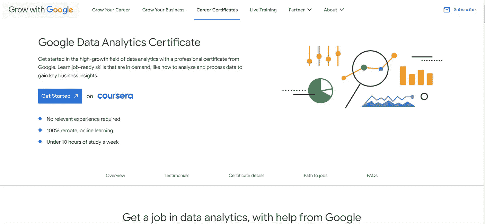
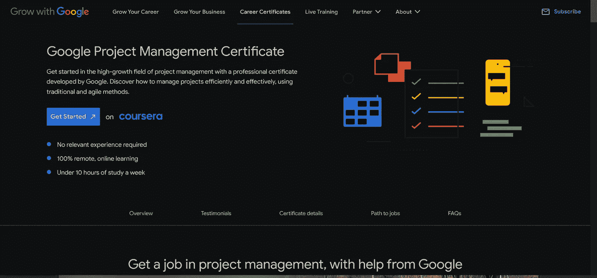
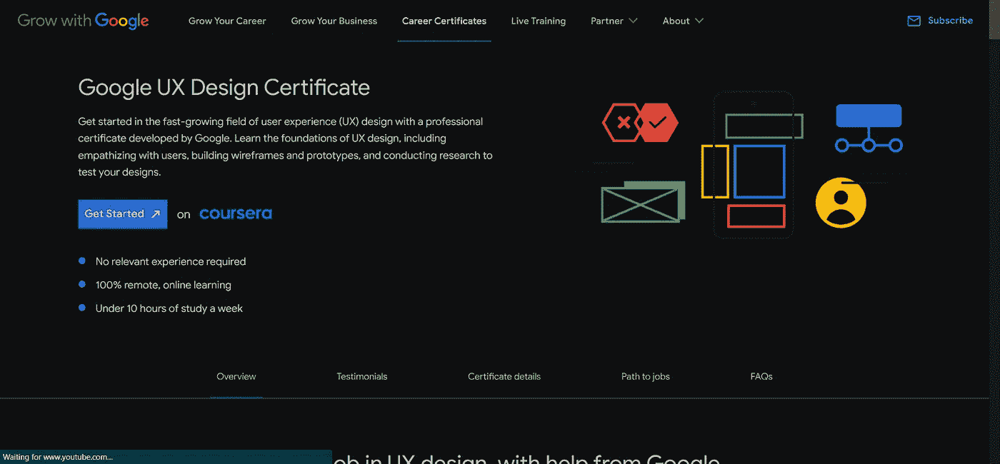
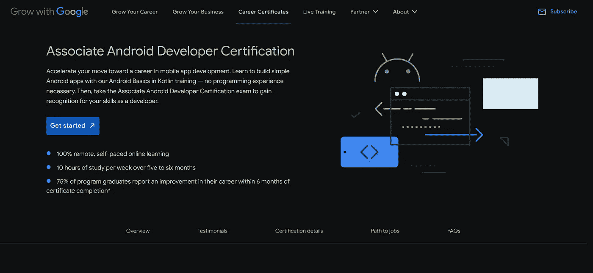
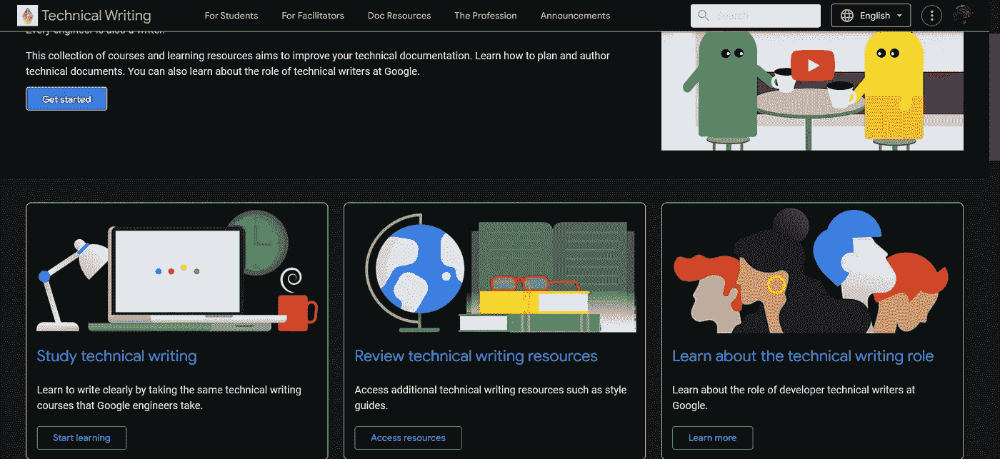

# 6 个面向自学开发者的免费谷歌认证

> 原文：<https://javascript.plainenglish.io/6-free-google-certifications-for-self-taught-developers-80e52e10253d?source=collection_archive---------7----------------------->

## 我的意思是 100%免费

Photo by [Pawel Czerwinski](https://unsplash.com/@pawel_czerwinski?utm_source=medium&utm_medium=referral) on [Unsplash](https://unsplash.com?utm_source=medium&utm_medium=referral)

打入科技领域可能很难。由于昂贵的大学学位和新兵训练营，有些人无法负担成为软件开发人员的费用。

为了帮助那些缺乏必要经验或相关学位的自学成才的开发人员，我整理了一份 **6 个免费谷歌认证**的清单，让你的简历更容易被招聘人员注意到。

## 目录

[1。它支持](#8bd8)
[2。数据分析](#ee41)
[3。项目管理](#f6c9)
[4。UX 设计](#0220)
[5。安卓开发](#cc3c)
[6。科技写作](#6b3f)

# 1.信息技术支持

第一个认证是谷歌的 [IT 证书](https://grow.google/certificates/it-support/#?modal_active=none)。

该认证有两个级别**初级**和**高级。**

入门级别教你它的基础知识。这些基础知识包括网络和系统管理等主题。它还有一个额外的好处，那就是不需要相关经验。

高级级别教你如何使用 python 来自动化 IT 流程的许多部分。建议您先完成初级课程，但这不是必需的。

Google IT Certficatios Home Page

# 2.数据分析

下一个认证是[数据分析证书](https://grow.google/certificates/data-analytics/#?modal_active=none)。

这个认证教你不同的数据类型和结构。它还教你如何分析数据和使用可视化来更好地显示数据。

该证书仅包含入门级课程。

Google Data Analytics Certficate Homepage

# 3.项目管理

下一个证书是[项目管理证书](https://grow.google/certificates/project-management/#?modal_active=none)。

该认证涵盖的主题将有助于您成功运行大型项目。

Google’s [Project Management Certificate](https://grow.google/certificates/project-management/#?modal_active=none). Homepage

# 4.UX 设计

第四个认证是 [UX 设计证书](https://grow.google/certificates/ux-design/#?modal_active=none)。

该认证侧重于开发人物角色、用户故事和用户旅程图等技能。

如果你不确定 UX *是什么*，我会推荐[这篇文章](https://medium.com/beakerandflint/an-introduction-user-experience-design-2a7f8167bf03)作者[本·拉夫](https://medium.com/u/ad30e3efec5b?source=post_page-----80e52e10253d--------------------------------)

Google UX Design Certifcate Homepage

# 5.Android 开发

第五个认证是[安卓开发者认证](https://grow.google/certificates/android-developer/#?modal_active=none)

该认证将教你如何使用 Kotlin 构建原生 android 应用

如果你想进入移动开发领域，但是没有任何相关经验，那么这个认证是非常好的。

Google’s [Android Developer Certification](https://grow.google/certificates/android-developer/#?modal_active=none) Homepage

# 6.科技写作

最后的认证是[技术写作](https://developers.google.com/tech-writing)认证。

在谷歌的世界里:“每个工程师都是作家”。这个认证教你如何计划和撰写技术文档。如果你是 medium.com[网站的技术作家，这个认证尤其重要。](https://medium.com/r?url=https%3A%2F%2Fbookeraziz.medium.com%2Fmembership)

Google’s Techincal Writer Certification Homepage

# 结论

感谢您阅读完我的文章**“自学开发人员的 6 个免费谷歌认证”**。如果你有任何问题，请随意提问，我会尽快回答。

如果你是中级新手，你可以点击这里的[链接](https://bookeraziz.medium.com/membership)加入。

## 我的更多故事

 [## 如何在 React Native 中构建一个旋转木马

### 在 react native 中从头开始创建旋转木马

javascript.plainenglish.io](/how-to-build-a-carousel-in-react-native-9ed31d14c9fb)  [## 如何使用 Expo 在 React Native 中创建图像拾取器

### 在 React Native 中上传图像和视频变得简单

javascript.plainenglish.io](/how-to-create-an-image-picker-in-react-native-using-expo-4dd403e706bd) 

*更多内容请看*[***plain English . io***](https://plainenglish.io/)*。报名参加我们的* [***免费周报***](http://newsletter.plainenglish.io/) *。关注我们关于*[***Twitter***](https://twitter.com/inPlainEngHQ)*和*[***LinkedIn***](https://www.linkedin.com/company/inplainenglish/)*。加入我们的* [***社区不和谐***](https://discord.gg/GtDtUAvyhW) *。*