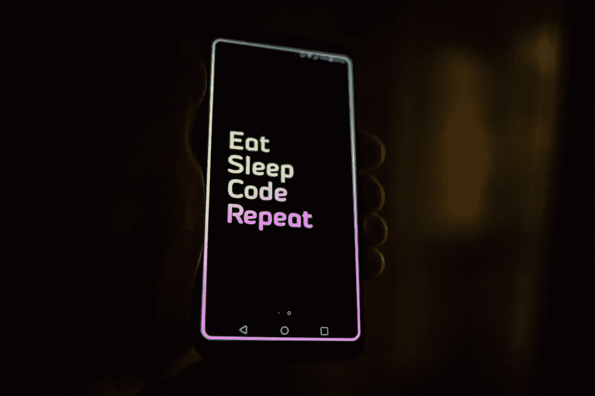

# 2022 年要学习的 6 种未来编程语言

> 原文：<https://javascript.plainenglish.io/6-futuristic-programming-language-to-learn-in-2022-1a13ffbf5225?source=collection_archive---------7----------------------->

## 2022 年要学的顶级编程语言。

Photo by [Roman Synkevych](https://unsplash.com/@synkevych?utm_source=unsplash&utm_medium=referral&utm_content=creditCopyText) on [Unsplash](https://unsplash.com/s/photos/programming?utm_source=unsplash&utm_medium=referral&utm_content=creditCopyText)

从事编程职业的人面临的挑战之一是决定学习哪种语言。有这么多的语言用于不同的目的，选择你想学习的语言将取决于你最感兴趣的专业以及工作需求。编程课程网站“编码游牧者”周二发布的一份报告着眼于 2022 年的“最佳”编程语言。

# *1。Java*

尽管名字相似，但 Java 和 JavaScript 几乎没有共同之处。

它是一种面向对象的解释型编程语言，是第一种允许你编写一次代码就可以在任何地方运行的语言。

这种语言可用于开发各种规模的 web 和移动应用程序，以及开发企业级应用程序和处理大数据。

# **2。Python**

作为目前最有学问的，Python 也将很快增加它的应用普及度。由于优雅和简单的语法，它被认为是最容易学习的语言，并用于教学编程。

它被广泛用于机器学习(ML)、深度学习(DL)、数据科学以及数学、统计学、计算科学。Python 既简单又强大，允许简化健壮应用程序的开发过程:web 或移动应用程序。

# **3。JavaScript**

将被利用的第一语言(继续被利用)，JavaScript 是一种高级的、多范例的动态编程语言，在未来许多年内仍将是世界上最流行的语言。

它主要用于开发交互式和功能丰富的 web 应用程序，但也可以用于创建在任何地方运行的其他软件:服务器、浏览器、移动设备、微控制器等。

# 4.C++

C++是 C 语言的改进版本，引入了面向对象的特性。

它提供了许多编译器和库来构建强大而可靠的解决方案，可以处理高性能和丰富的功能。C++很容易适应生态系统或硬件的变化，是云计算和游戏开发的完美选择。

它也是最难学的语言之一。

# **5。科特林**

Kotlin 是另一种现代通用编程语言(2015 年发布)，不断受到欢迎。

它运行在 JVM (Java 虚拟机)上，允许使用大量的 Java 库。

Kotlin 的代码比 Java 简单干净得多，开发人员的工作效率接近 Python。由于所有这些显著的优势，它现在是 android 应用程序开发的主要语言。

# **6。打字稿**

TypeScript 是 JavaScript 的超集，是一种面向对象的语言，引入它是为了扩展 JS 的功能。

这种语言使得开发人员编写和维护代码变得很容易。TypeScript 提供了对每个代码组件的完整描述，可用于开发具有严格语法和较少错误的大型应用程序。

此外，它结构良好，易于学习。它的扩展工具箱使应用程序开发变得更快。由于它提供的好处，TypeScript 有望在 2020 年取代 JS，成为未来最受欢迎的编程语言之一。

# 结论

学习编程语言并不容易，它有一个陡峭的学习曲线...但这也是非常有益的。此外，请记住，成为一名专业程序员需要几年时间。不要指望一夜之间变好。

*更多内容请看*[***plain English . io***](http://plainenglish.io/)*。报名参加我们的* [***免费周报***](http://newsletter.plainenglish.io/) *。在我们的* [***社区***](https://discord.gg/GtDtUAvyhW) *获得独家获得写作机会和建议。*