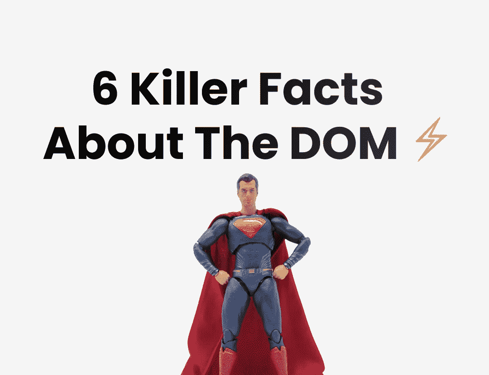

# 作为一名前端开发人员，你需要了解的关于 DOM 的 6 个黑仔事实

> 原文：<https://javascript.plainenglish.io/6-killer-facts-you-need-to-know-about-the-dom-as-a-frontend-developer-caf9872e4ae2?source=collection_archive---------6----------------------->

## #6.碎片，嗯？



Photo by author and [King Lip](https://unsplash.com/photos/S9uB_IlDThw) on [Unsplash](https://unsplash.com/photos/S9uB_IlDThw)

在 https://twitter.com/antondevv[](https://twitter.com/antondevv)****通过在 Twitter 上关注我，保持反应和打字的前沿。****

**许多前端开发人员在使用库和框架时并不了解他们工作的基本原则，我就是其中之一。**

**是因为无聊吗？还是认为这很难？或者仅仅是因为这些库和框架是如此的光滑和吸引人，以至于它们占据了教学空间，只有少数几个深入地覆盖了基本的核心主题。**

**无论如何，在这篇文章中，我将回顾几个我认为重要的 DOM 方面！**

## **1.HTML 被解析成节点树**

**有些前端开发人员甚至不知道 HTML 页面只是一种标记，就像 XML 一样。实际上，浏览器正在将 HTML 代码解析成一种叫做 DOM - document 对象模型的东西。**

**当浏览器加载网页时，它是 HTML 格式的。为了让浏览器与 HTML 进行交互，比如修改内容、点击内容并使其发生变化等等，必须有某种方法来设置 HTML 内容上的事件并轻松地改变内容等等。**

**这就是为什么浏览器将 HTML 代码解析成一个包含节点对象的文档，该文档以树的格式构造，这被称为 DOM。**

**HTML 页面中的每个元素，比如`<h1>, <div>, <header>, <head>` 等等，都被转换成自己的节点对象。**

****关于该流程如何工作的简短通知:****

1.  **它将 HTML 标记成标记。如果你以前做过任何 ML 的东西，把它想象成把一个文本标记成单词。**
2.  **有了这些标记，它就创建了一个解析树。**
3.  **通过解析树，它创建了 DOM 树。**

**这就引出了下一点。👇**

## **2.每个 HTML 元素都是 DOM 中的一个节点对象**

**因此，正如我们所知，节点对象是 HTML 代码中不同元素的表示。所以节点基本上是表示不同 HTML 元素的对象。我们使用的最常见的节点有:**

****元素节点、文本节点和文档节点。****

**例如，这个 HTML 代码`<a href="contact.html">Contact</a>`是`HTMLAnchorElement`的一个节点对象，它有一个文本节点`Contact`。**

**所有的节点类型来自哪里？浏览器有一个节点对象，该节点对象有 DOM 树继承的其他节点。**

****下面是节点对象上可用的内容:****

```
'ELEMENT_NODE', 'ATTRIBUTE_NODE', 'TEXT_NODE', 'CDATA_SECTION_NODE', 'ENTITY_REFERENCE_NODE', 'ENTITY_NODE', 'PROCESSING_INSTRUCTION_NODE', 'COMMENT_NODE', 'DOCUMENT_NODE', 'DOCUMENT_TYPE_NODE', 'DOCUMENT_FRAGMENT_NODE', 'NOTATION_NODE', 'DOCUMENT_POSITION_DISCONNECTED', 'DOCUMENT_POSITION_PRECEDING', 'DOCUMENT_POSITION_FOLLOWING', 'DOCUMENT_POSITION_CONTAINS', 'DOCUMENT_POSITION_CONTAINED_BY', 'DOCUMENT_POSITION_IMPLEMENTATION_SPECIFIC'
```

**这就引出了下一点。👇**

## **3.DOM 树中的每个节点都继承自 node 对象**

**所有节点类型都继承自节点。**

**另外，需要注意的重要一点是，节点是一个 JavaScript 构造函数。构造函数是初始化一个新对象并返回它的函数。**

**因此，节点构造函数基本上是一个返回带有节点类型的对象的函数。**

**不同的节点对象共享相同的类型，因此您可以将其视为对象原型继承。**

**我的意思是这只是对它的高级解释，而不是详细或准确的解释。如果你想要那个，我推荐你读读 [**这个**](http://domenlightenment.com/) 。**

## **4.创建节点和向 DOM 添加节点的不同方法**

**因此，当浏览器加载时，它会解析 HTML，并在构造 DOM 之前将每个元素转换为一个节点对象。**

**web APIs 允许我们用 JavaScript 创建自己的 DOM 节点，并在 DOM 中添加、删除和更新节点。**

**我们可以像这样创建一个节点元素:`document.createElement('div')`并且我们可以通过把它附加到主体节点来把它添加到 DOM 中。例如:**

```
document.querySelector('body')
.appendChild(document.createElement('div'))
```

**还有一些使用简单字符串创建和插入节点的方法和属性。**

**`document.querySelector('body').innerHTML = "<div></div>"`将用一个`div`节点元素替换主体中的所有节点。**

## **5.到底是干什么用的？**

**一个 HTML 文档必须以声明开始，尽管它不再需要这样做了。但基本上，浏览器需要了解预期的文档类型，然后它可以将 HTML 文档解析为包含表示每个 HTML 元素的节点对象的文档。**

**没有它，它不知道该怎么做，或者至少以前是这样，它还有一些其他的属性来使它正常工作。**

## **6.碎片的魔力**

**`document.createFragment()`是一个节点对象，*但是*，它从来都不是 DOM 树的一部分；取而代之的是它的所有子节点，而碎片本身只是内存的一部分。**

**此外，因为片段不是 DOM 的一部分，它只存在于内存中，所以它实际上可以提高性能，因为当子元素附加到片段上时，它不会导致回流。**

**如果你用过 React，你可能会认为它和 React 是一样的。片段，或<>，它可以帮助你避免破坏 HTML 的语义，这是可访问性的基础。但这不一样；事实上，反应过来。片段仅用于在需要时包装 JSX 元素，并帮助处理语义。React 不调用 createFragment，所以不一样。**

***你好，如果你想自己体验媒介，请考虑支持我和所有其他作家，注册成为* [***会员***](https://medium.com/@anton.franzen/membership) *每月 5 美元，以保持独立写作的活力，* [***在此注册；***](https://medium.com/@anton.franzen/membership)**

**除了支持他人，Medium 还可以通过写作和在此安家的强大、积极参与的社区来支持你。**

# **如果你喜欢这件作品，我希望你也会喜欢:**

**[](/4-killer-ways-to-write-typescript-with-react-6a66b32764f1) [## 用 React 编写打字稿的 4 种黑仔方法

### 4 个黑仔打字稿，带反馈提示+ 1 个额外提示

javascript.plainenglish.io](/4-killer-ways-to-write-typescript-with-react-6a66b32764f1) [](/5-typescript-lessons-that-will-pay-off-911d35974c8) [## 将会有回报的 5 堂打字课

### 你知道第五条吗？

javascript.plainenglish.io](/5-typescript-lessons-that-will-pay-off-911d35974c8) [](https://betterprogramming.pub/callbacks-vs-promises-vs-async-await-a-step-by-step-guide-f93d13447604) [## 回调 vs .承诺 vs .异步 Await:逐步指南

### 引擎盖下也有点。

better 编程. pub](https://betterprogramming.pub/callbacks-vs-promises-vs-async-await-a-step-by-step-guide-f93d13447604) 

*更多内容看* [***说白了。报名参加我们的***](https://plainenglish.io/) **[***免费每周简讯***](http://newsletter.plainenglish.io/) *。关注我们* [***推特***](https://twitter.com/inPlainEngHQ) *和*[***LinkedIn***](https://www.linkedin.com/company/inplainenglish/)*。加入我们的* [***社区不和谐***](https://discord.gg/GtDtUAvyhW) *。*****