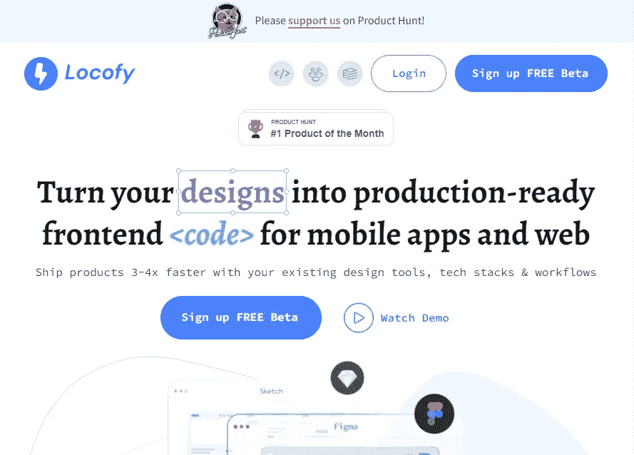
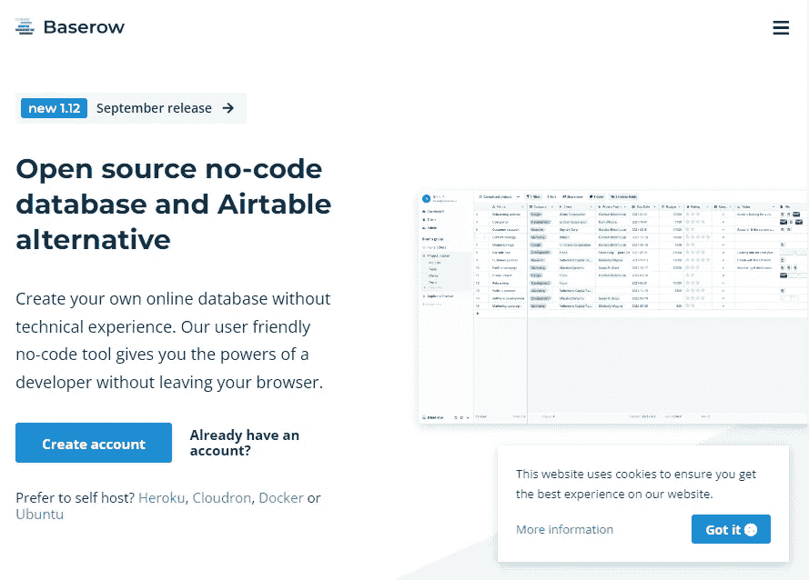
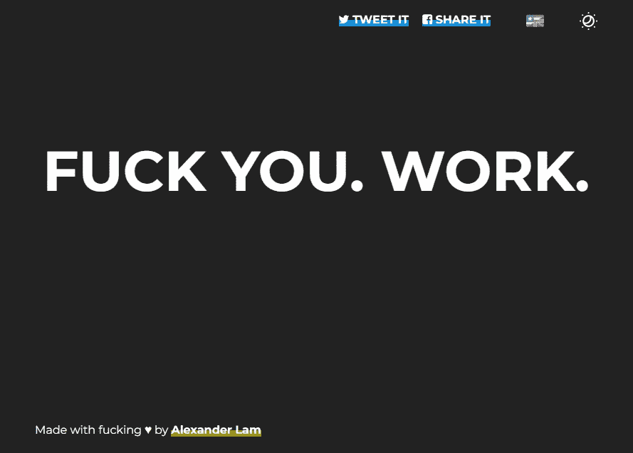
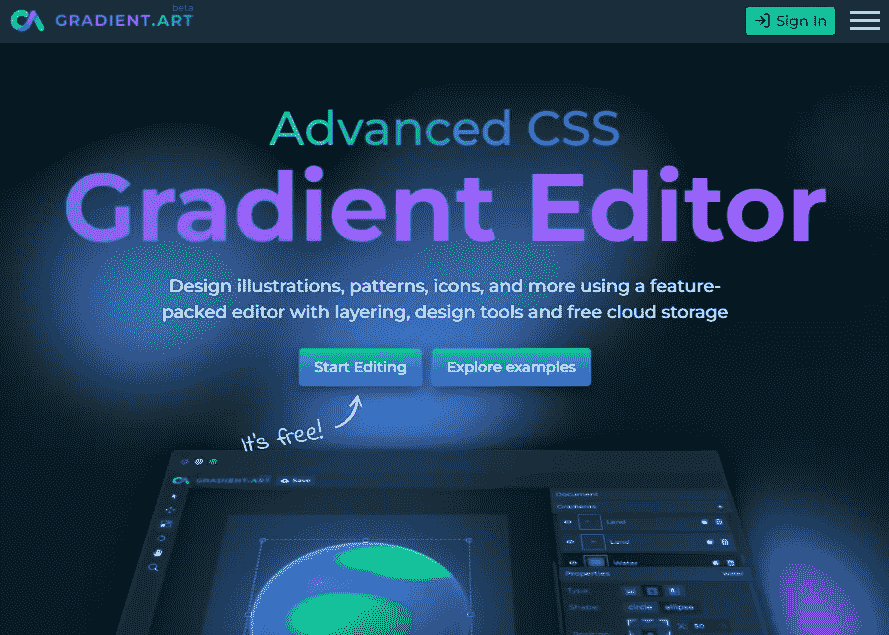
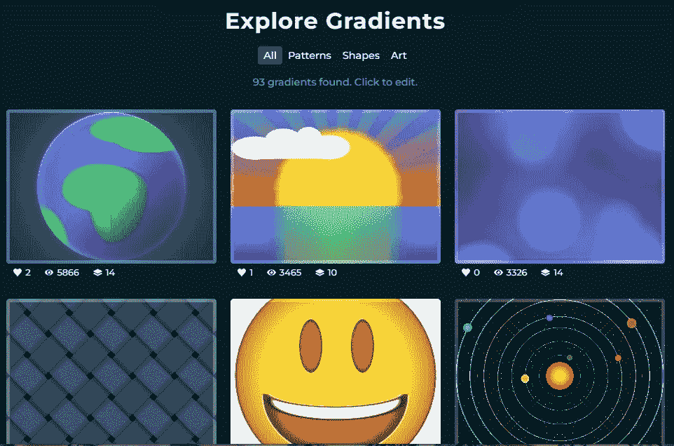
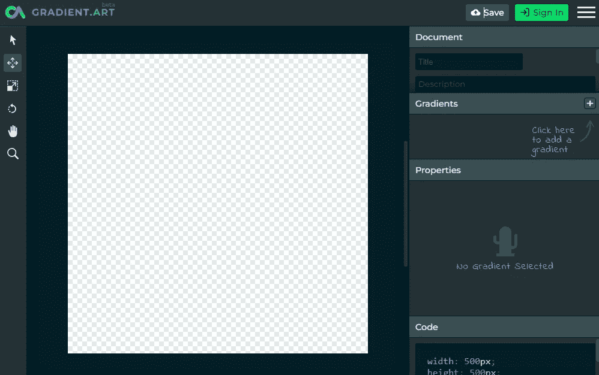
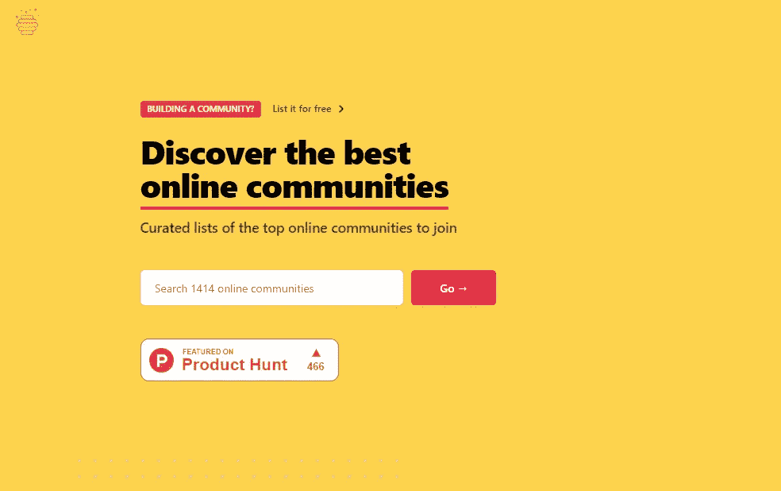
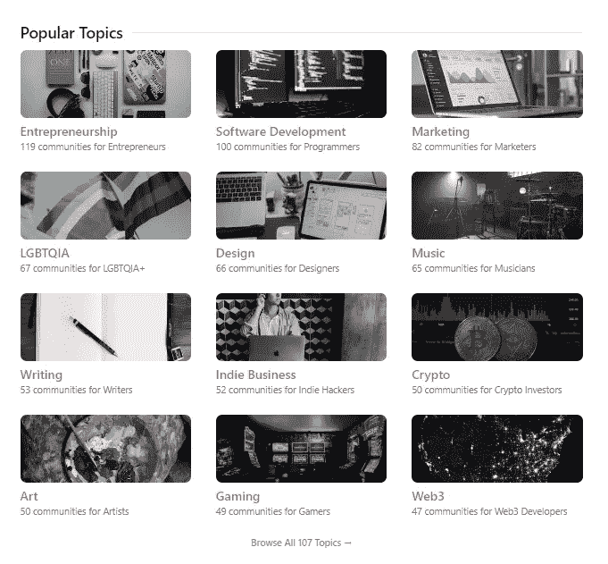
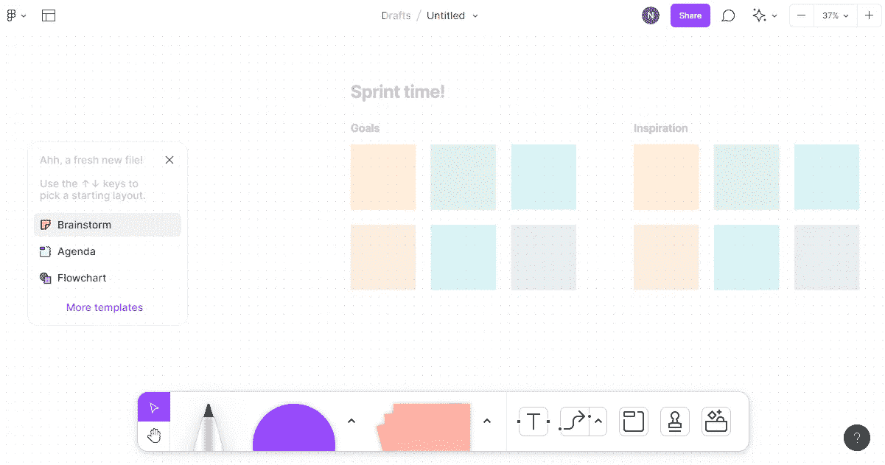
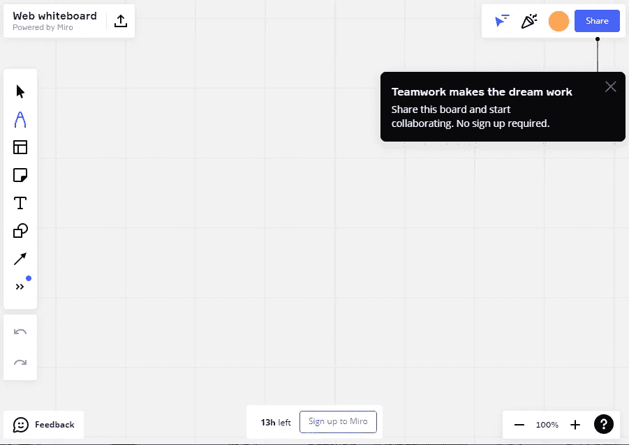

# 6 黑仔在线编程工具我不能没有

> 原文：<https://javascript.plainenglish.io/6-killer-online-programming-tools-i-can-no-longer-live-without-14fbfc44dbcc?source=collection_archive---------1----------------------->

## 它不包括 Canva、opinion 或任何类似的东西。

我现在有几个项目。因此，我在日常活动中使用各种工具。在这个过程中，我学到了很多关于[的新工具](/7-stupidly-simple-programming-tools-youve-probably-never-heard-of-d1f0edf54645)，将它们用于我自己，然后与大家分享。

今天，我还将提供一些我发现的最酷的编程工具，来帮助你更快地构建，提高你的生产力，并专注于重要的事情。

> 注意:我写这篇文章并没有从这些工具中得到任何报酬。换句话说，我没有从他们的创始人那里得到任何报酬。没有附属链接，每一个都是免费使用的。

让我们开始吧。

1.  [loco fy . ai](https://www.locofy.ai/)

我们大多数人会使用无代码平台来创建自己使用的定制网站和应用程序。

这确实是未来。这就是为什么现在各种工具正在发布。

他们中的大多数是有报酬的；是的，如果您想导出代码，您必须购买高级订阅。因此，人们无法从中受益。

但现在不会了，因为 Locofy.ai 让你的设计转型变得简单。它现在完全免费。

下面是简单的过程。

Src: Twitter

**2。** [**Baserow**](https://baserow.io/)

当我在一家公司工作时，他们使用 Airtable 连接数据和工作流，并相互通信。

然后我开始用的最多。

现在我知道了 Baserow，它是一个开源的无代码数据库，是 Airtable 的替代品。

**3。** [**去他妈的工作**](https://www.gofuckingwork.com/)

大多数时候，看电影、玩网络游戏或利用社交媒体不会帮助你创造金钱。

是的，你的家庭需要经济支持。

老实说，作为一名程序员，我知道一些企业确实在实施一些概念，以增加用户使用特定应用程序的时间。

甚至我试着花时间。事实上，看更多的电影和视频，使用社交媒体会降低你的工作效率和注意力，对你的健康有很多不利影响。

我知道你们都不在乎自己的健康，所以别管它了。

然而，你可以使用这个工具来提高你的工作效率。它只是一个 Chrome 扩展，可以阻止令人分心的网站，让你可以专注于自己的工作。

**4。**

****

**你可能尝试过其他 CSS 渐变编辑器，但这是最好的之一。**

****

**有几个可用的渐变示例，您可以轻松地将其集成到您的代码中。当然，你也可以编辑它们。**

****

**你甚至可以自己制作。**

**你想要更多吗？你可以在云中免费保存你的项目！每个项目都分配有一个公共 URL，您可以与其他人共享该 URL 以进行查看和编辑。**

****5。** [**蜂巢指数**](https://thehiveindex.com/)**

****

**当一群人使用相同的技术并相互交换信息时，事情会变得容易得多。**

**假设我们联系在一起，我正在提供一些对你非常有用的神奇工具。**

**同样，也有各种各样的在线社区帮助其他人提高他们的技能。可能很难找到最适合你的。**

**但不是在这篇文章之后。**

**Hive Index 可以帮助您识别可用的最佳在线社区。**

****

**实际上，对于每一个话题，都有成千上万的社区。**

****6。**[**fig jam**](https://www.figma.com/figjam/)**或** [**网络白板**](https://webwhiteboard.com/)**

****

**Source: FigJam**

**我正在做几个项目。是的，我有许多任务要完成，必须与我的团队一起集思广益。这就是 FigJam 或 Web 白板派上用场的时候了。**

**将它视为与您的团队一起产生想法的白板。**

****

**Source: Web Whiteboard**

**你甚至不需要注册网络白板；只需专注于你的工作。**

**希望你喜欢。**

**就这样——谢谢。**

**[*如果你喜欢看这样的故事，并且想帮助我这个作家，那就考虑成为一个中等成员吧*](https://nitinfab.medium.com/membership) *。每月花费 5 美元，你可以无限制地访问媒体内容。如果你通过我的链接注册，我会得到一点佣金。***

***更多内容请看*[***plain English . io***](https://plainenglish.io/)*。报名参加我们的* [***免费周报***](http://newsletter.plainenglish.io/) *。关注我们关于*[***Twitter***](https://twitter.com/inPlainEngHQ)[***LinkedIn***](https://www.linkedin.com/company/inplainenglish/)*[***YouTube***](https://www.youtube.com/channel/UCtipWUghju290NWcn8jhyAw)***，以及****[***不和***](https://discord.gg/GtDtUAvyhW) *对成长黑客感兴趣？检查* [***电路***](https://circuit.ooo/) ***。*******