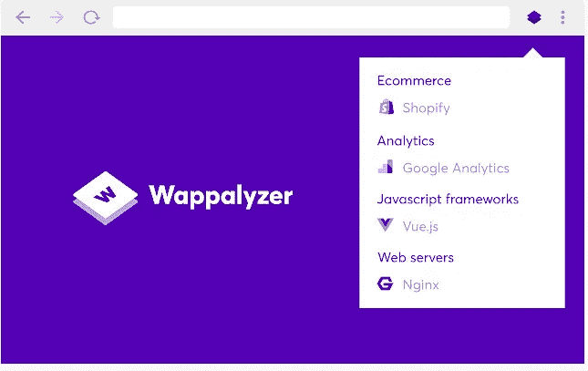
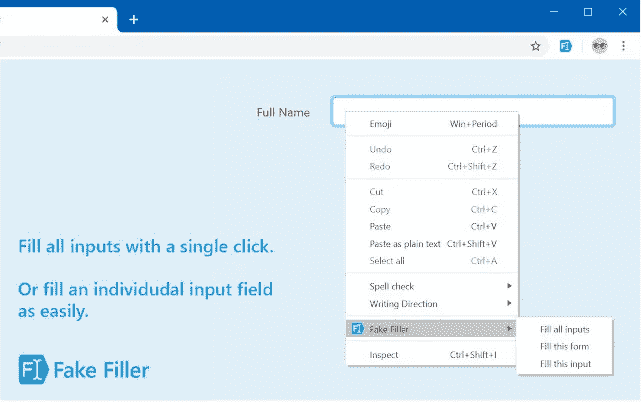
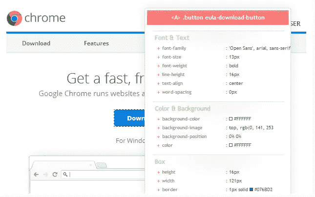

# 6 个面向网络开发者的宏伟的 Google Chrome 扩展

> 原文：<https://javascript.plainenglish.io/6-majestic-google-chrome-extensions-for-web-developers-35992af6bde2?source=collection_archive---------11----------------------->

## 革命性的 Chrome 扩展

Photo by [Matheus Bertelli](https://www.pexels.com/@bertellifotografia?utm_content=attributionCopyText&utm_medium=referral&utm_source=pexels) from [Pexels](https://www.pexels.com/photo/woman-using-umbrella-with-lights-573238/?utm_content=attributionCopyText&utm_medium=referral&utm_source=pexels)

*这个故事背后是 Medium 的* [*会员制付费墙*](https://help.medium.com/hc/en-us/articles/360017581433-About-the-metered-paywall) *，这意味着作者通过合作伙伴计划赚取收入。喜欢在媒体上阅读？* [*购买会员资格*](https://sanjay-priyadarshi.medium.com/membership) *获取全部权限。*

作为一名开发人员，我在日常工作中使用了 20 多个 Chrome 扩展。

它们让我的生活变得更轻松，给我的生活增添了很多价值。

程序员经常会收到不同类型工具的推荐。但是困扰我的一件事是，我们一直得到相同的工具推荐。

在这里，我整理了一个只有少数人谈论的 7 个革命性的 Chrome 扩展的列表。

# 1.瓦帕里斯

Photo from [Wappalyzer Extension](https://chrome.google.com/webstore/detail/wappalyzer/gppongmhjkpfnbhagpmjfkannfbllamg?hl=en)

*   使用 Wappalyzer 你可以分析你的竞争对手的网站正在使用什么样的技术。
*   Wappalyzer 不同于其他基本的帧检测器。它能够分析一千多种技术，这些技术有十几个子类。
*   这些类别包括各种类型的编程语言。此外，你的竞争对手的网站使用支付处理器。
*   任何随机帧检测器只能给你一个宽泛的类别，但不会给你这个扩展能给你的细节。您的设备甚至可以使用此扩展，即使它没有连接到互联网。

# 2.假填充物

Photo from [Fake Filler Extension](https://chrome.google.com/webstore/detail/fake-filler/bnjjngeaknajbdcgpfkgnonkmififhfo?hl=en)

*   这个 Chrome 扩展是一个多么大的生产力助推器啊！有了拥有 10 万用户的[假填充器](https://chrome.google.com/webstore/detail/fake-filler/bnjjngeaknajbdcgpfkgnonkmififhfo?hl=en)，你可以在你的网站上填写表格。
*   它会为你生成假数据，让你快速填表。产生的虚假数据完全是随机的。你什么都不用做。
*   这个扩展帮助您消除手动填写表单的需要。你需要做零配置调整。

# 3.CSS-查看器

Photo From [CSSViewer Extension](https://chrome.google.com/webstore/detail/cssviewer/ggfgijbpiheegefliciemofobhmofgce?hl=en)

*   作为 web 开发人员，我们经常关注 CSS。很多时候我们想要的是设计出类似竞争对手网站的元素。但是要做到这一点，我们需要投入大量的时间。
*   有了拥有超过 10 万用户的 CSSViewer ，你可以很容易地在不同的网站上找到应用的 CSS 属性。
*   当您将鼠标悬停在不同的元素上时，这个扩展会自动向您显示应用在它上面的 CSS 属性。
*   要使用此扩展，您需要一些权限。

# 4.每日发展

Photo from [daily.dev Extension](https://chrome.google.com/webstore/detail/dailydev-the-homepage-dev/jlmpjdjjbgclbocgajdjefcidcncaied)

*   这是一个优秀的 Chrome 扩展。作为开发人员，我们总是需要一个能够为开发人员提供所有消息的工具。
*   有了 [daily.dev](https://chrome.google.com/webstore/detail/dailydev-the-homepage-dev/jlmpjdjjbgclbocgajdjefcidcncaied) 扩展，各种开发者新闻都可以在一个地方找到。这一扩展将为你提供来自 400 多个来源的新闻。
*   一旦你安装了这个扩展，我相信你不会错过任何关于开发者行业的新闻。
*   使用这个扩展不需要注册。它是完全免费和 100%开源的。你也可以通过阅读有价值的文章来获得排名。

# 5.Toggl 跟踪:生产率和时间跟踪

Photo from [Toggl Track: Productivity & Time Tracker](https://chrome.google.com/webstore/detail/toggl-track-productivity/oejgccbfbmkkpaidnkphaiaecficdnfn?hl=en)

*   有了 [Toggl Track](https://chrome.google.com/webstore/detail/toggl-track-productivity/oejgccbfbmkkpaidnkphaiaecficdnfn?hl=en) ，开发者可以正确地跟踪他们的时间。
*   通过此扩展进行的时间跟踪保存在您的 Toggl 帐户中。您可以使用您的 Toggl 帐户直接访问您宝贵的开发时间。
*   像吉拉、Slack、Trello 和 100 多种其他工具都是可用的。如果你想跟随番茄工作法，这个扩展也可以帮助你跟随它。

# 6.AdGuard 广告拦截器

Photo from [AdGuard AdBlocker](https://chrome.google.com/webstore/detail/adguard-adblocker/bgnkhhnnamicmpeenaelnjfhikgbkllg?hl=en)

*   使用[广告卫士广告拦截器](https://chrome.google.com/webstore/detail/adguard-adblocker/bgnkhhnnamicmpeenaelnjfhikgbkllg?hl=en)你可以拦截广告。来自脸书、Youtube 和其他随机网站的广告可以被屏蔽。
*   作为 web 开发人员，在我们的日常工作中，我们会使用许多网站，要么是为了修复一个错误，要么是为了理解一个主题。由于广告被屏蔽，网站的加载速度加快。
*   这种扩展也有助于通过阻止许多广告来保护您的隐私。

[点击此处](https://codertoentrepreneurs.substack.com)加入一个由热爱编程和技术的人组成的社区。喜欢在媒体上阅读？[购买会员资格](https://sanjay-priyadarshi.medium.com/membership)获得全部权限。

 [## 通过我的推荐链接加入 Medium-Sanjay Priyadarshi

### 作为一个媒体会员，你的会员费的一部分会给你阅读的作家，你可以完全接触到每一个故事…

sanjay-priyadarshi.medium.com](https://sanjay-priyadarshi.medium.com/membership) 

*更多内容请看*[***plain English . io***](http://plainenglish.io/)*。报名参加我们的* [***免费周报***](http://newsletter.plainenglish.io/) *。在我们的* [***社区***](https://discord.gg/GtDtUAvyhW) *获得独家获得写作机会和建议。*