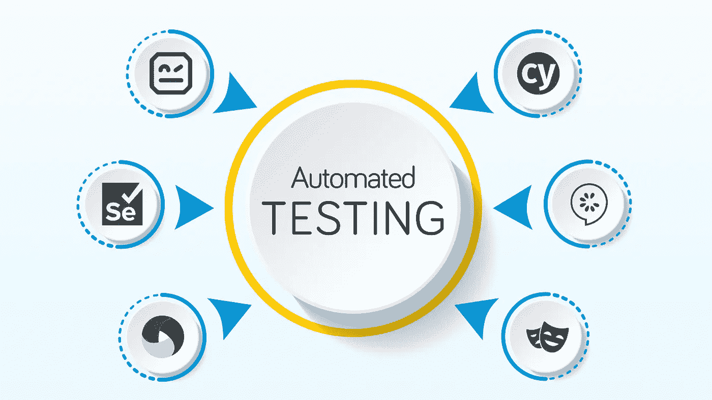

# 6 种流行的测试自动化工具，它们的优缺点，以及何时使用它们

> 原文：<https://javascript.plainenglish.io/6-popular-test-automation-tools-their-pros-and-cons-and-when-to-use-them-849f597460e9?source=collection_archive---------9----------------------->

在 QA 领域，我们将测试分为手工测试和自动化测试(这是一个相当高级的区别)。由于大规模的手工测试不适合大多数项目，由于缺乏可扩展性，大多数现代软件都是自动测试的。日益增长的自动化趋势是明确的，并导致伟大的工具，帮助实现复杂的 QA 目标的崛起。

下面，我们写下了一些最受欢迎的，在他们的类别中是最好的(如果不是最好的)。

# 硒

Selenium 是用于 web 自动化的最流行和最成熟的工具之一。这一切都始于 2004 年，直到今天是积极发展和维护。它是开源的，可以跨不同的浏览器和操作系统运行。很少有人知道 Selenium 实际上是一套工具，它为我们提供了一个强大的自动化解决方案。

## Selenium WebDriver

WebDriver 用于测试跨不同浏览器的 web 应用程序，并支持许多编程语言，如 [Java。NET，PHP，Python，Perl，Ruby](https://www.itmagination.com/services/custom-software-development) 。因此，简而言之，有了 WebDriver，我们可以使用我们喜欢的语言编写测试用例，直接与浏览器进行交互。

## 硒栅

Selenium Grid 有助于在多台机器上并行运行测试。它由两个主要部分组成。 **Hub** 接受测试请求并在多个节点上并行运行它们。**节点**是具有操作系统和浏览器实例的远程设备。

## 硒 IDE

Selenium IDE 不需要使用任何编程语言。这个工具可以记录你与浏览器的交互，并在此基础上创建测试用例。它使用起来非常简单，是一个标准的浏览器附加扩展。

## 用例

Selenium 具有广泛的测试能力，但主要用于 [web app](https://www.itmagination.com/clients-scope/web-application-development) 测试自动化。尽管如此，Selenium 可以成功地用于 web 性能测试、移动测试和 web 废弃。

## 赞成的意见

*   它是免费和开源的
*   支持多种编程语言
*   大型社区
*   跨浏览器和并行功能

## 骗局

*   对于没有经验的工程师来说可能很难设置
*   没有报告和缺少测试运行者(需要被一些测试框架包装)
*   管理不当可能会导致巨大的复杂性和代码库
*   测试用例对于非技术人员来说是不清晰的

# 柏树

Cypress 是一个基于 JavaScript 的测试工具，直接在浏览器中运行。由于该工具在浏览器中运行，因此不需要驱动程序；这里的中介。框架使用 DOM 事件来执行测试命令。这使得它更快更容易使用，同时它也有一个交互式的测试运行器，这使得这个工具更加用户友好。

## 用例

Cypress 是一个纯粹的基于 JavaScript 的框架，所以你将主要使用它来进行 web 应用程序的自动化测试。

## 赞成的意见

*   内置*等待*管理
*   出色的文档
*   提供每个测试操作细节的快照
*   视觉测试跑步者

## 骗局

*   没有多选项卡功能
*   无法并行打开两个浏览器
*   仅支持一种编程语言— JavaScript
*   不支持所有常用的浏览器

# Appium

Appium 是一个基于 [Node.js](https://www.itmagination.com/blog-category/web-applications) 的工具，用于测试本地、混合、移动 web 和桌面应用。它支持多种编程语言，包括 Python、C#、Node.js、PHP、Java、Ruby 和 JavaScript。在超过 10 年的时间里，它已经成长为 Android 和 iOS 测试领域的领导者。

## 用例

它是另一个具有很多功能的大框架，主要用于移动测试(iOS 和 Android)。

## 赞成的意见

*   它是开源的，有着巨大的社区
*   不同的移动平台使用相同的 API。
*   可以与任何测试框架集成
*   如果你知道硒，你会很容易学会应用

## 骗局

*   不支持 4.2 之前的 Android 版本(尽管现在这几乎不是问题)
*   测试混合应用可能具有挑战性
*   测试执行时间可能是一个瓶颈
*   Windows 机器上缺少应用程序检查器

# 机器人框架

Robot Framework 是一个开源的测试自动化框架，主要用于验收测试。测试用例主要遵循关键字驱动的风格，但是你可以很容易地选择行为驱动和数据驱动的风格。由于测试用例是以表格格式编写的，并且使用了关键字，这使得它非常容易阅读和理解，即使对于非技术利益相关者也是如此。Robot Framework 支持许多库，包括 Selenium。

## 用例

由于框架的灵活性和使用 Python 扩展库的可能性，它被成功地用于测试前端和后端服务。

## 赞成的意见

*   免费和开源
*   关键字驱动，支持小黄瓜
*   基础很容易学
*   不需要以前强大的编码经验

## 骗局

*   管理不当可能极难维护
*   HTML 报告可能很难阅读
*   调试可能是一场斗争

# 黄瓜

Cucumber 是一个行为驱动的设计框架，支持 Gherkin 的 Given、When 和 Then 符号。BDD 被证明是非常高效的，帮助敏捷团队降低复杂性并最大化生产力。黄瓜是 BDD 方法的绝佳选择。有了 Gherkin 的支持，测试用例的创建变得更加容易。此外，由于它支持多种编程语言，它是最好的 BDD 框架之一。

## 用例

因为 Cucumber 更像是我们测试的 BDD 包装，并且测试逻辑本身是使用一种受支持的编程语言实现的，所以 cucucumber 成功地用于前端和后端测试。

## 赞成的意见

*   人类可读形式的需求和测试用例
*   多语言支持
*   代码的可重用性
*   帮助技术和非技术成员更紧密地合作

## 骗局

*   一些复杂的场景可能很难用小黄瓜来表达
*   正确描述场景需要用户的参与

# 剧作家

在 QA 工具市场上，剧作家是一个相对较新的工具，但很快就出名了。它是一个前端自动化工具，支持 Java、Python、C#和 Node.js (JavaScript、TypeScript)。尽管它是新的，但它已经具备了成为一个伟大的自动化工具所需要的所有东西。

## 用例

剧作家和 Cypress 主要用于测试 web 应用程序，并且正在成为最流行的工具之一。

## 赞成的意见

*   一个 GUI 调试工具
*   易于设置和配置
*   多语言和多浏览器支持
*   并行浏览器测试

## 骗局

*   还很新，所以社区支持有限

# 结束语

这就是了。6 大测试自动化工具，它们的优缺点，以及它们的用例。我们错过了什么吗？我们错过了你最喜欢的工具吗？你喜欢在你的项目中有自动化的，手动的测试，还是两者都有？我们很想听听你的意见。把你的观点发推特给我们 [@ITMAGINATION](https://twitter.com/ITMAGINATION) 或者[在 LinkedIn 上给我们加标签](https://www.linkedin.com/sharing/share-offsite/?url=https://itmagination.com/blog/6-popular-test-automation-tools-their-pros-and-cons-and-when-to-use-them)。

【https://www.itmagination.com】最初发表于**。**

**更多内容请看*[***plain English . io***](https://plainenglish.io/)*。报名参加我们的* [***免费周报***](http://newsletter.plainenglish.io/) *。关注我们关于*[***Twitter***](https://twitter.com/inPlainEngHQ)*和*[***LinkedIn***](https://www.linkedin.com/company/inplainenglish/)*。查看我们的* [***社区不和谐***](https://discord.gg/GtDtUAvyhW) *加入我们的* [***人才集体***](https://inplainenglish.pallet.com/talent/welcome) *。**