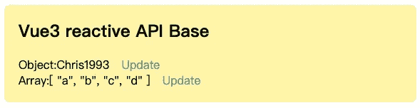
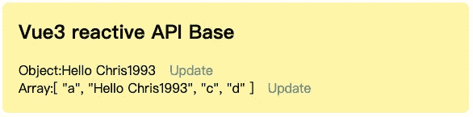
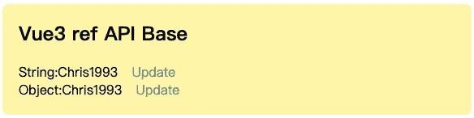
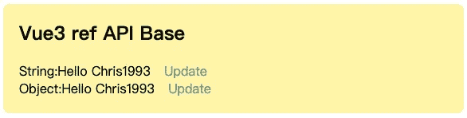
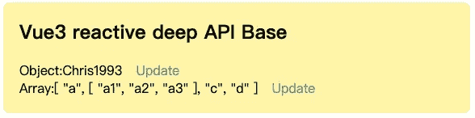
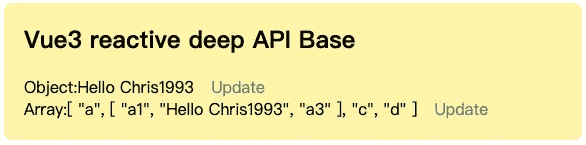

# 关于 Vue3 中的参考电压和无功电压，您应该了解的 6 个问题

> 原文：<https://javascript.plainenglish.io/6-questions-you-should-understand-about-the-ref-reactive-in-vue3-3ce509d73662?source=collection_archive---------7----------------------->

## 本文从入门的角度介绍了这两个 API。


Vue3 为开发者提供了两个 API`ref`和`reactive`来实现响应式数据，这也是我们在 Vue3 开发项目中经常用到的两个 API。

本文从入门的角度介绍了这两个 API。如有错误，请大家一起讨论学习~

***❝*** *本文使用 Vue3 设置语法。❞*

在初学者阶段，我们需要掌握的是这两个 API 的“是什么”、“如何使用”和“常见问题”。

[1。如何使用反应式 API？](#8804)
[2。如何使用 ref API？](#34e7)
[3。reactive 可以用在深度对象或者数组上吗？](#799f)
[4。反应式返回值是否等于源对象？](#b079)
[5。TypeScript 如何写 ref 和 reactive 参数类型？](#e517)
[6。ref 值作为电抗参数怎么样？](#2a41)
[7。总结](#c5dc)

# 1.如何使用反应式 API？

`reactive`方法用于创建一个反应对象。它接受一个对象/数组参数，并返回该对象的一个被动副本。当对象的属性值改变时，它会自动更新使用对象的地方。

以**【对象】**和**【数组】**为参数进行测试:

```
import { reactive } from 'vue'let reactiveObj = reactive({ name : 'Chris1993' });
let setReactiveObj = () => {
  reactiveObj.name = 'Hello Chris1993';
}let reactiveArr = reactive(['a', 'b', 'c', 'd']);
let setReactiveArr = () => {
  reactiveArr[1] = 'Hello Chris1993';
}
```

模板内容:

```
<template>
  <h2>Vue3 reactive API Base</h2>
  <div>
    Object:{{reactiveObj.name}} 
    <span @click="setReactiveObj">Update</span>
  </div>
  <div>
    Array:{{reactiveArr}} 
    <span @click="setReactiveArr">Update</span>
  </div>
</template>
```

页面内容:



当我们分别点击`Update`按钮时，可以看到数据发生变化后，视图上的内容也一起更新:



# 2.如何使用 ref API？

`ref`的作用是将一个**【原始数据类型】**(原始数据类型)转换成一个具有**【响应特征】**的数据类型。共有 7 种原始数据类型，分别是:`String`/`Number`/`BigInt`/`Boolean`/`Symbol`/`Null`/`Undefined`。

在 JS/TS 中读取和修改`ref`的值时，需要使用`.value`获取，在模板中读取时，不需要使用`.value`。

以**【字符串】**和**【对象】**为参数进行测试:

```
import { ref } from 'vue'let refValue = ref('Chris1993');
let setRefValue = () => {
  refValue.value = 'Hello Chris1993';
}
let refObj = ref({ name : 'Chris1993' });
let setRefObj = () => {
  refObj.value.name = 'Hello Chris1993';
}
```

模板内容:

```
<template>
  <h2>Vue3 ref API Base</h2>
  <div>
    String:{{refValue}} 
    <span @click="setRefValue">Update</span>
  </div>
  <div>
    Object:{{refObj.name}}
    <span @click="setRefObj">Update</span>
  </div>
</template>
```

页面内容:



当我们分别点击`Update`按钮时，可以看到数据发生变化后，视图上的内容也一起更新:



# 3.reactive 可以用在深度对象或者数组上吗？

答案是**【是】**`reactive`是基于 [ES2015 代理 API](https://developer.mozilla.org/en-US/docs/Web/JavaScript/Reference/Global_Objects/Proxy) 实现的，它的响应性是整个对象的所有嵌套层次。

以**【对象】**和**【阵列】**为参数进行测试:

```
import { reactive } from 'vue'let reactiveDeepObj = reactive({
  user: {name : 'Chris1993'}
});
let setReactiveDeepObj = () => {
  reactiveDeepObj.user.name = 'Hello Chris1993';
}let reactiveDeepArr = reactive(['a', ['a1', 'a2', 'a3'], 'c', 'd']);
let setReactiveDeepArr = () => {
  reactiveDeepArr[1][1] = 'Hello Chris1993';
}
```

模板内容:

```
<template>
  <h2>Vue3 reactive deep API Base</h2>
  <div>
    Object:{{reactiveDeepObj.user.name}}
    <span @click="setReactiveDeepObj">Update</span>
  </div>
  <div>
    Array:{{reactiveDeepArr}}
    <span @click="setReactiveDeepArr">Update</span>
  </div>
</template>
```

页面内容:



当我们分别点击`Update`按钮时，我们可以看到数据改变后，视图上的内容也一起更新:



# 4.反应式返回值是否等于源对象？

答案是**【不等于】**因为`reactive`是基于 [ES2015 代理 API](https://developer.mozilla.org/en-US/docs/Web/JavaScript/Reference/Global_Objects/Proxy) 实现的，所以返回结果是一个代理对象。

测试代码:

```
let reactiveSource = { name: 'Chris1993' };
let reactiveData = reactive(reactiveSource);console.log(reactiveSource === reactiveData);
*// false*console.log(reactiveSource);
*// {name: 'Chris1993'}*console.log(reactiveData);
*// Reactive<{name: 'Chris1993'}>*
```

# 5.TypeScript 如何写 ref 和 reactive 参数类型？

使用 TypeScript 编写 ref / reactive 参数类型时，可以根据 ref / reactive 接口类型实现特定类型:

```
function ref<T>(value: T): Ref<T>function reactive<T extends object>(target: T): UnwrapNestedRefs<T>
```

修改前面的示例代码:

```
import { ref } from 'vue'let refValue = ref<string>('Chris1993');let setRefValue = () => {
  refValue.value = 'Hello Chris1993'; *// ok!*
  refValue.value = 1993; *// error!*
}let reactiveValue = reactive<{name: string}>({name: 'Chris1993'});
```

# 6.ref 值作为电抗参数怎么样？

当我们已经有了一个`ref`对象并需要在一个`reactive`对象中使用它时会发生什么？

假设:

```
let name = ref('Chris1993');
let nameReactive = reactive({name})
```

我们也可以这样做:

```
let name = ref('Chris1993');
let nameReactive = reactive({name})
console.log(name.value === nameReactive.name); *// true*name.value = 'Hello Chris1993';
console.log(name.value);        *// Hello Chris1993*
console.log(nameReactive.name); *// Hello Chris1993*nameReactive.name = 'Hi Chris1993';
console.log(name.value);        *// Hi Chris1993*
console.log(nameReactive.name); *// Hi Chris1993*
```

这是因为`reactive`将打开所有深度`refs`并保持`ref`反应。

当`ref`被赋值给`reactive`属性时，`ref`也被自动解包:

```
let name = ref('Chris1993');
let nameReactive = reactive({})
nameReactive.name = name;console.log(name.value);        *// Chris1993*
console.log(nameReactive.name); *// Chris1993*
console.log(name.value === nameReactive.name); *// true*
```

# 7.摘要

本文主要从入门的角度介绍`reactive` / `ref` API 的用法区别，以及使用过程中的几个问题。

简单总结一下:

*   `reactive`一般用于对象/数组类型数据，不需要使用`.value`；
*   `ref`一般用于基本数据类型的数据。在 JS 中读取和修改时需要使用`.value`，在模板中使用时不需要；
*   `reactive`可以修改深层属性值并保持响应；
*   `reactive`返回值不同于源对象；
*   `reactive`属性值可以是`ref`值。

下一篇文章会和大家分享掌握的情况，欢迎大家期待。

*更多内容看* [***说白了。报名参加我们的***](https://plainenglish.io/) **[***免费周报***](http://newsletter.plainenglish.io/) *。关注我们关于* [***推特***](https://twitter.com/inPlainEngHQ) ，[***LinkedIn***](https://www.linkedin.com/company/inplainenglish/)*，*[***YouTube***](https://www.youtube.com/channel/UCtipWUghju290NWcn8jhyAw)*，以及* [***不和***](https://discord.gg/GtDtUAvyhW) *。***