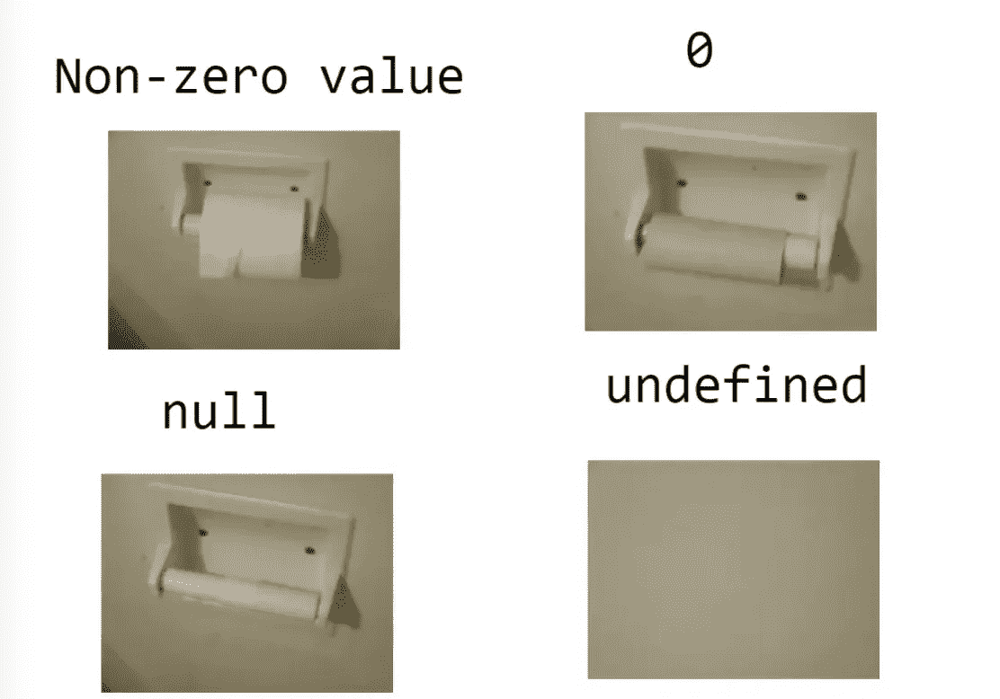

# 你应该知道的关于“空”和“未定义”的 6 个秘密

> 原文：<https://javascript.plainenglish.io/6-secrets-about-null-and-undefined-that-you-should-know-bf759ab59bce?source=collection_archive---------2----------------------->

## 也许我们根本不知道“空”和“未定义”

Photo by [Steve Tsang](https://unsplash.com/@stevetsang?utm_source=medium&utm_medium=referral) on [Unsplash](https://unsplash.com?utm_source=medium&utm_medium=referral)

**对于**`**null**`**`**undefined**`**的一切我都不知道，我感到很惭愧，虽然我已经工作很多年了。****

**如果你和我一样困惑，这篇文章会告诉你一切。**

# **每个人都知道的基础知识**

****

**这是一张非常有趣的图片，也许它表达了`null`和`undefined`的本质区别。**

**`null`和`undefined`都代表“空”，那么它们之间的主要区别是什么？**

1.  **`undefined`表示变量尚未定义。**
2.  **`null`意味着变量被定义了，但是它没有指向内存中的任何对象。**

**这是`null`和`undefined`最基本的区别，你一定很清楚。**

# **1.为什么“typeof null”返回“object”？**

**`null`和`{}`不一样，不是数据的对象类型，但是`typeof null`为什么会返回 object？**

****其实是 JavaScript 从设计之初就存在的 bug，只是到现在都无法修复。****

**在 JavaScript 的初始版本中，所有值都存储在 32 位中。前 3 位表示数据类型的标记，其余的位是值。**

**对于所有对象，对象的前 3 位标记为 000 作为类型标记位。在早期版本的 JavaScript 中，null 被认为是一个特殊的值，对应于 C 中的空指针。但是，JavaScript 不像 C 中那样有指针，所以 null 意味着什么也没有或无效，并且由全 0(32)表示。**

**所以每当 JavaScript 读取一个空值，前 3 位就把它当作一个对象类型，这就是为什么`typeof null`返回‘object’。**

# **2.为什么==和===给出不同的结果？**

**你知道为什么这段代码会给出完全不同的结果吗？**

**ECMA 在第 11.9.3 章清楚地告诉我们**

1.  **如果 x 为空，y 未定义，则返回 true。**
2.  **如果 x 未定义，y 为空，则返回 true。**

# **3.为什么 null + 1 和 undefined + 1 返回不同的结果？**

**这涉及到 JavaScript 中的隐式类型转换，在执行加法运算之前，它会尝试将表达式中的变量转换为数字类型。例如，' 1' + 1 将得到 11。**

**当 null 转换为数字时，它将转换为 0。**

**当 undefined 被转换为数字时，它被转换为 NaN**

# **4.为什么 object . prototype . tostring . call(Null)输出'[object Null]'？**

**toString()是 Object 的原型方法。当我们调用这个方法时，它默认返回当前对象的[[Class]]。这是[对象 Xxx]形式的内部属性，其中 Xxx 是对象的类型。**

# **5.为什么 undefined 可以被覆盖？**

**虽然我们不太可能写出这样的代码，但它确实符合所有的规范。**

**JavaScript 在全局环境中创建了一个只读的未定义变量，但并没有完全禁用局部未定义变量的定义。**

**所以你仍然可以在函数中声明一个未定义的变量，但是这是一个魔鬼，请停止这样做。**

# **6.JSON.stringify 为什么要删除带有未定义值的内容？**

**其实这篇文章没有什么好的解读方法。JSON.stringify 去掉 undefined 对应的键，这是 JSON 自己的转换原则。**

**有一次我因为不熟悉` JSON.stringify '的转换规则而吃了大亏，你可以点击这篇文章了解它的全部详情。**

** [## 因为 JSON.stringify 我差点丢了年终奖金

### 多么悲伤的故事

javascript.plainenglish.io](/i-almost-lost-my-year-end-bonus-because-of-json-stringify-a715c54559bb) 

# 最后

**感谢阅读。**我期待期待您的关注和阅读更多高质量的文章。

 [## “我失去了一个工作机会，只是因为承诺。所有”

### 一次让我好难过的面试经历。

javascript.plainenglish.io](/i-lost-a-job-opportunity-just-because-of-promise-all-be396f6efe87)  [## 采访者:“npm 跑 xxx”怎么了？

### 一个大多数人都不知道的秘密。

javascript.plainenglish.io](/interviewer-what-happened-to-npm-run-xxx-cdcb37dbaf44)  [## 面试官:可以“x！== x "在 JavaScript 中返回 True？

### 你可能不知道的五个神奇的 JavaScript 知识点！

javascript.plainenglish.io](/interviewer-can-x-x-return-true-in-javascript-7e1d1fa7b5cd)  [## 现在是 2022 年，不要再滥用箭头功能了

### 不应该使用箭头函数的 4 种情况。

javascript.plainenglish.io](/its-2022-don-t-abuse-the-arrow-function-anymore-905862a9c668) 

*更多内容请看*[***plain English . io***](https://plainenglish.io/)*。报名参加我们的* [***免费周报***](http://newsletter.plainenglish.io/) *。关注我们关于*[***Twitter***](https://twitter.com/inPlainEngHQ)[***LinkedIn***](https://www.linkedin.com/company/inplainenglish/)*[***YouTube***](https://www.youtube.com/channel/UCtipWUghju290NWcn8jhyAw)*[***不和***](https://discord.gg/GtDtUAvyhW) *。*****