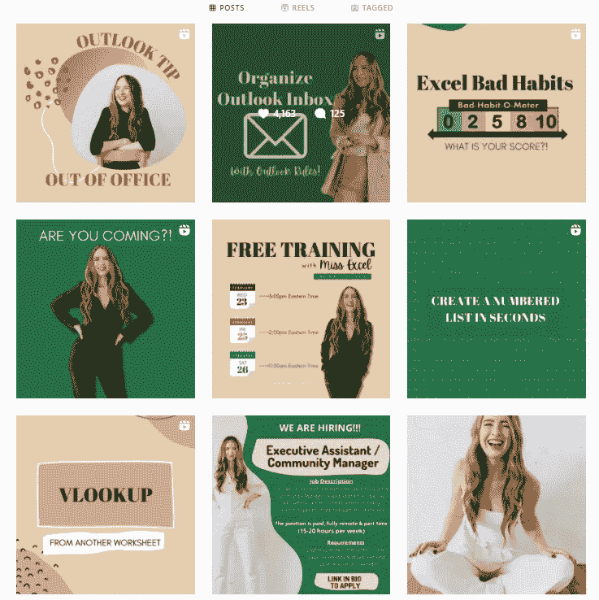

# 作为程序员，6 份兼职工作会让你赚钱，有时甚至是被动的

> 原文：<https://javascript.plainenglish.io/6-side-gigs-that-will-make-you-money-as-a-programmer-sometimes-even-passive-54b9176dbe3a?source=collection_archive---------4----------------------->

## 一份严肃的兼职清单。

Photo by [Victoria Heath](https://unsplash.com/@vheath?utm_source=medium&utm_medium=referral) on [Unsplash](https://unsplash.com?utm_source=medium&utm_medium=referral)

正如我们所见，自疫情爆发以来，世界已经发生了变化。大多数人试图多工作，开始副业，并从中获得被动收入。

我不知道你怎么想，但是我想有更多的副业，让我自由地生活。我会尽我所能帮忙。

我通常会与一些优秀的专业人士聊天，以了解更多关于流行的侧滑。学习新的东西，并努力将其付诸实践。

在这里，我将分享我的一些朋友的一些高端骗局，以及他们如何从中赚钱。

# **1。写技术含量相关的书**

在我的一个朋友告诉我关于卢卡斯的事情后，我刚刚和他谈过。他是一名经验丰富的开发人员，主要为一家领先的法国公司工作。

由于他所拥有的知识，他尝试创作电子书并在网上销售。在早期，他只是认为这是一个兼职。

他出版第九本书后不久，收入就增加了。亚马逊通常每月支付他一次。他还告诉我，他已经在 Kindle 上发布了他的书。因此，他将能够赚更多的钱。

我催促他提供进一步的信息。你能谈谈你遇到的困难吗？所以他告诉我，当我第一次开始写书时，我尝试了一些标准的标题，如 Python 入门和 React 入门。

不过附近有几本书。因此，我无法挣钱。更确切地说，任何人都可以制作这样的书，亚马逊上大量的这类出版物就说明了这一点。

所以你现在要问我做了什么？简单地说，我试图用我所拥有的知识写一些短篇小说。它砰的一声爆炸了。

## **你有什么选择？**

所以，读者们，如果你有什么特殊的技术知识，你可以写一本关于它的书。是的，这需要时间，但你永远不知道之后你会赚多少钱。

# **2。销售 API**

当我得知原料药可能被出售时，我惊呆了。实际上，我是在和一个叫贾的程序员聊天。她大约在一年前开始研究 API。

让我告诉你她的起源。简而言之，她了解了一个名为 RapidAPI 的 API 平台，并开始设计和销售 API。这对她来说只是一份兼职。她从没想到会这样。

她很快赢得了几个客户，他们真的付钱给她，让她根据需求为他们设计定制的 API。

她目前有一个代理机构，在那里她设计 API 并在网上销售。

要开始这个副业，你需要熟悉 Python 或 JavaScript。之后，您可以使用这些语言来开发 API。

Unsplash 和 Stripe 都有自己的 API，您可以使用它们来访问它们的服务。

## 你有什么选择？

如果你懂 JavaScript 或 Python，你可以简单地创建 API(有很多相关的课程)。如果你不知道它是什么，在继续前进之前尝试去学习它。

这里有一个非常棒的免费课程给你。

# **3。销售 NFT**

我们都听说过近年来的 NFT 趋势。然而，我们大多数人并没有试图成为它的一部分。

另一方面，哈里什和他的朋友拉吉在他们的房间里建立了他们的副业。换句话说，他们在制作非功能性食物并在网上销售。Harish 是一名平面设计师，而 Raj 专攻市场营销。

所以他们一起建立了这个副业，不到三个月，他们就把它提升到了一个新的高度。他们现在有了自己的销售 NFT 的生意。
Harish 告诉我，大多数新手做无用的 NFT。

相反，我们必须多研究，尽可能做出最好的作品。没有人会买上面有泰迪熊或狮子的 NFT。它应该提供一些价值。

他们现在正在为一些基于 NFT 的游戏开发 NFT。

我们认为 NFT 只是在出售毫无价值的照片。我们错了；不仅仅是这样。

## **你有什么选择？**

你可能会以新手的身份学习密码和区块链的基础知识。然后你可以继续学习非功能性测试。有几本书和 YouTube 视频可以帮助你。

# **4。创建特定课程**

我的一个同事最近建议我在网上寻找 Excel 小姐。在那之后，我惊讶地发现有人仅仅通过提供 Excel 课程就能赚很多钱。

当我们大多数人都熟悉 Excel 时，这确实是真的。如果没有，我们可以在 YouTube 上了解一下。那她为什么仅仅提供 Excel 课程就能赚这么多钱？

所以我决定多了解她。

可以这么说，她是个天才。这里有一个例子可以说明她的营销策略有多创新。

Src: Instagram

我真的很享受她用 Instagram 获取客户的方式。毕竟，她是开发课程然后销售的专家。

老实说，我熟悉平面设计的基本原理，并与生成 Instagram 帖子以吸引客户或消费者的组织合作过。

而 Excel 小姐则在另一个层面。顺便说一下，她的真名是凯特·诺顿。

所以，如果你想建一个课程，就跟着她。

## 你有什么选择？

如果你练一个天赋练了很久。尝试把它变成一门课程。你有什么技能并不重要。

# **5。成为 Canva 的平面设计师**

你喜欢 Excel 小姐用 Instagram 分享她的内容吗？如果是这样的话，你也可以这样做。

您可以使用 Canva 模板并修改它们以满足我们的要求。Canva 绝对是我的最爱。每当我需要做什么东西时，我就去 Canva，几分钟之内就能完成。

是的，我不是这方面的专家，但我有能力做这项工作。
因为我是一名网站开发人员，所以每当有客户需要网站时，我都会创建一个。我不会聘请平面设计师来制作最好的照片或插图；相反，我使用 Canva 来这样做。

让我告诉你我在一家网页设计公司的另一个经历。我和一个平面设计师合作，他每天只工作三个小时。我询问了一下，他告诉我他订阅了 Canva pro，只要他想做点什么就用 Canva。

## **你有什么选择？**

努力提高 Canva 的效率。用它制作一些模板和页面。尽可能多地学习平面设计。
仅此而已。

# **6。创建区块链相关的应用或网站**

你知道这个比喻吗，在淘金热期间，卖铲子。

今天的区块链技术也是如此。大多数人都有钱，并且正在寻找通过被动收入增加收入的方法。

然而，他们中的大多数人在投资加密货币时都会赔钱。你知道有超过 12000 种加密货币吗？

然而，当你在网上搜索某些货币时。我看到了一个类似的定义:它比比特币更快，可扩展，汽油费更低，可以并行处理几个链上的大量交易，以及大多数人不感兴趣的智能合约等其他概念。

他们只是在和比特币竞争，没有别的。

## 那么，你有什么选择？

与其和比特币竞争，不如开发一种有一定效用的技术。

请允许我给你举个例子。我用的是 Brave 浏览器，无广告。所以，如果我想看 YouTube，我就去 Brave。另一方面，如果你不想在 YouTube 上观看广告，你必须付费才能访问 YouTube premium。

我不是想卖给你任何东西；我只是给你举个例子。

那么，你有什么选择？因为你是一名程序员，你将能够快速掌握 Solidity 或相关技术，并设计一个大多数用户都会喜欢的服务。并对他们的生活产生一些影响

# **最终想法**

作为一名程序员，你可以通过多种方式赚钱。这些方法可以让你在自己舒适的家中赚取全职收入。然而，你必须投入时间和精力，并且要有敏锐的商业意识，就像你从事任何其他职业一样。

完全被动收入是存在的。然而，达到这一水平所需的工作量与你朝九晚五的工作所需的工作量相当，如果不是更多的话。

没有快速现金这种东西。如果你采取果断的措施和行动，通过编程赚钱可能会有相当大的回报。逆境、拒绝和失败都是旅程的一部分。

然而，胜利并不总是必要的；相反，你应该试着找出一个有用的东西。确保你不会偏离主题。专注于几个，然后一个，并抵制追逐下一个闪闪发光的物体的冲动。

[*如果你喜欢阅读这样的故事，并想帮助我成为一名作家，可以考虑成为一名中等会员*](https://nitinfab.medium.com/membership) *。每月花费 5 美元，你可以无限制地访问媒体内容。如果你通过我的链接注册，我会得到一点佣金。*

就这些——谢谢。

 [## 作为一名开发者，你可以在睡觉的时候用 5 种不同的方式赚钱

### 不要指望博客，媒体，YouTube

javascript.plainenglish.io](/5-different-ways-you-can-make-money-as-a-developer-while-you-sleep-ad54715b6ad7) 

*更多内容看* [***说白了就是***](https://plainenglish.io/) *。报名参加我们的* [***免费周报***](http://newsletter.plainenglish.io/) *。关注我们* [***推特***](https://twitter.com/inPlainEngHQ) *和**[***LinkedIn***](https://www.linkedin.com/company/inplainenglish/)*。加入我们的* [***社区不和谐***](https://discord.gg/GtDtUAvyhW) *。**