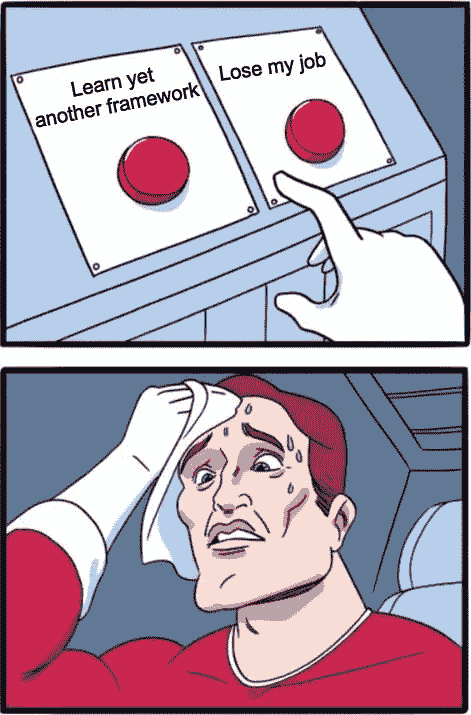
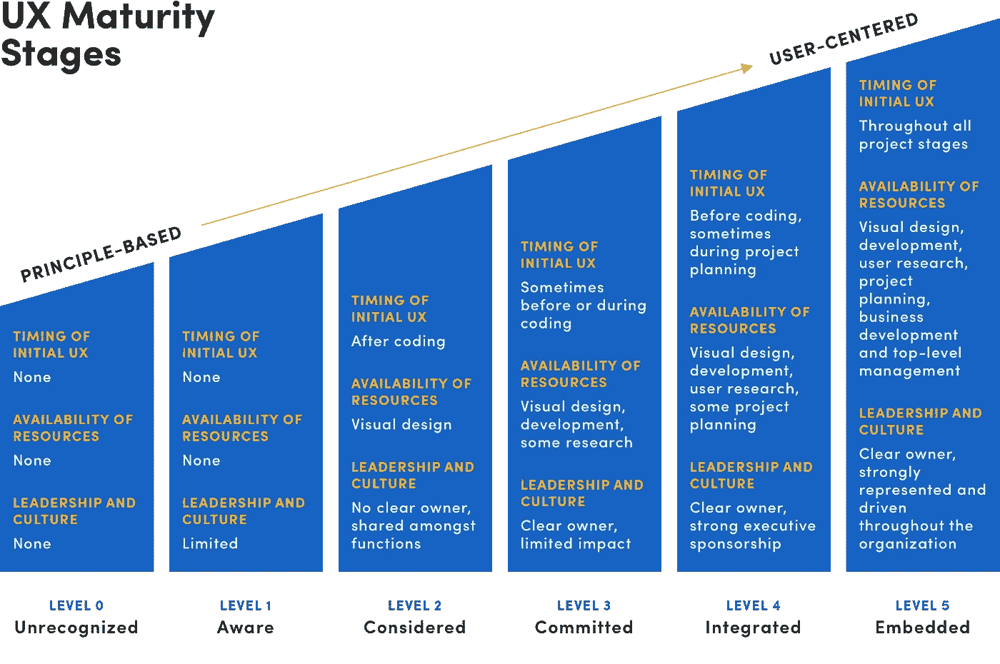
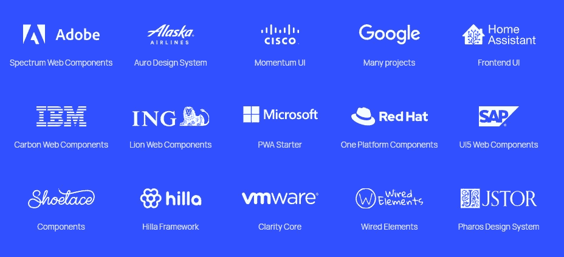

# 6 个迹象表明以标准为中心的前端开发正在获得动力

> 原文：<https://javascript.plainenglish.io/6-signs-that-standards-focused-frontend-development-is-gaining-momentum-ab1dd2c1eda4?source=collection_archive---------8----------------------->

## **学习在现代浏览器中能做什么比学习某个框架能做什么更有价值**。

Photo by [Vasista vedantam](https://unsplash.com/@vashi?utm_source=unsplash&utm_medium=referral&utm_content=creditCopyText) on [Unsplash](https://unsplash.com/s/photos/david-goliath?utm_source=unsplash&utm_medium=referral&utm_content=creditCopyText)

在过去的十年里，对于 Web 组件、Web API 和其他 Web 标准来说，这是一场艰苦的战斗。

为什么？

在一个快速发展、炒作驱动的网络社区中制造一些噪音并不容易。这部分是因为来自大量市场化的、受技术影响的大型框架的噪音更大，每个框架都提供了一个繁荣的社区、精致的网站、完整的引导程序等等。

最重要的是， [FOMO](https://en.wikipedia.org/wiki/Fear_of_missing_out) 确保开发人员抓住每一个承诺处理他们前任问题的酷新框架的化身，[而不是问他们自己为什么首先需要它们](https://javarome.medium.com/design-noframework-bbc00a02d9b3)。

Image from “[The Cure to Javascript Fatigue — and All Other Fatigues (freecodecamp.org)](https://www.freecodecamp.org/news/the-cure-to-js-fatigue/)”

正如我在[塞壬之歌](/song-of-the-siren-how-frontend-frameworks-keep-luring-you-into-technical-debt-a7e8b7300f33)中所说的，框架可能很酷很闪亮，但是它们在你的项目中是有代价的，因为根据定义，它们比 web 标准短命得多。

标准。无聊。但是有用。就 Web 标准而言，它非常强大和成熟。如此多的前端开发人员从来没有花时间学习每个框架内部使用的底层技术，这真的是一种耻辱(因为最终，都是 JavaScript，不是吗？).

开发优秀的 Web 应用程序并不是火箭科学。是前端领域的混乱让它看起来如此。

*我个人的看法是，* [*Web 组件*](https://developer.mozilla.org/en-US/docs/Web/Web_Components) *，*[*Web API*](https://developer.mozilla.org/en-US/docs/Web/API)，*和一个小的工具集/库对于任何复杂的(SPA) Web App 或者*[*【PWA*](https://developer.mozilla.org/en-US/docs/Web/Progressive_web_apps)*都可以做得比较精细。*

那么，我们在哪里？

密切关注该领域的一切，在这个平台和其他平台上阅读，我感觉有些事情正在发生变化…

# 1.框架供应商提到 Web 组件

**[*React*](https://reactjs.org/docs/web-components.html)*和*[*Vue*](https://vuejs.org/guide/extras/web-components.html\)*都提到可以使用 web 组件，苗条的* [*可以使用*](https://www.sveltejs.tech/svelte/webcomponents-with-svelte3/) *创建 web 组件。***

**在框架决定放弃它们自己专有的组件模型之前，还需要一段时间，围绕框架的巨大生态系统会适应。顺便说一句，这并不意味着框架会变得过时，正如 Marius Bongarts 所说的那样，但是总的方向似乎是这样的，即 web 组件和前端框架“[是为了解决不同的问题而构建的](https://reactjs.org/docs/web-components.html)”。**

# **2.设计系统越来越受欢迎**

**设计系统是一套标准，通过减少冗余来管理大规模的设计，同时在不同的页面和频道上创建共享的语言和视觉一致性。——[*尼尔森诺曼集团*](https://www.nngroup.com/)**

**鉴于对 UX 的日益关注，以及对公司正在经历的 UX 成熟阶段的认识，构建、记录、共享和维护一个可视化组件库被认为是最佳实践。**

****

**From: [№12: Leadership and Maturity | Drawbackwards](https://drawbackwards.com/blog/ux-maturity-leadership)**

**实现一个设计系统也不难，使用像 [Storybook](https://storybook.js.org/) 这样的开源软件肯定会越来越多。**

**Web 组件[是](https://vaadin.com/blog/design-systems-and-standardized-web-components#:~:text=Web%20Components%20are%20the%20ideal,be%20used%20for%20multiple%20frameworks.) [对](https://ionicframework.com/blog/5-reasons-web-components-are-perfect-for-design-systems/)设计系统的完美 [。](https://medium.com/blue-harvest-tech-blog/web-components-and-design-systems-two-peas-in-a-pot-2f2ab10c2355)**

**[根据 Ionic](https://ionicframework.com/blog/5-reasons-web-components-are-perfect-for-design-systems/) 的说法，原因如下:**

1.  **他们到处工作**
2.  **它们很容易定制**
3.  **它们有助于推动采用**
4.  ****它们是面向未来的****
5.  **有大量的 WC 库可以利用**

**我强调了第四个原因，因为对我来说，这是一个成功且长久的设计系统的关键:**

***也许 Web 组件最吸引人的好处是它们将我们从前端框架和工具的高度不稳定的环境中解放出来。通过使用一组一致的 web 标准，Web 组件不依赖于特定的前端框架，如 Angular、React 或 Vue。当然，您可以在这些框架中使用 Web 组件，我们鼓励您这样做，以便利用它们提供的许多好处。但是，最重要的是，你不需要依赖这个框架来让你的组件工作。* " —离子型**

# **3.对框架附加值的怀疑越来越多**

**在[真的，为什么反应？](https://dev.to/jfbrennan/really-why-react-5958) Jordan Brennan 认为“**React 潮流已经慢慢地让人们离网络平台越来越远，进入了过度设计的深水区。**”**

**早在 2017 年，[Django](https://www.linkedin.com/in/adrianholovaty)web 框架的联合创建者 Adrian Holovaty ，提出了一个反对框架的案例，以及他为什么转向 Vanilla JS 开发。**

***“我开始将框架视为必须迎合每个用例的大块。这是一种恶性循环:越受欢迎的东西，对新功能的需求就越多”——阿德里安·霍洛瓦蒂***

**Holovaty’s talk at [dotJS 2017](https://www.dotconferences.com/2017/12/adrian-holovaty-a-framework-author-case-against-frameworks)**

**在他关于不使用任何框架的[文章](https://javarome.medium.com/design-noframework-bbc00a02d9b3)中，[jérme Beau](https://javarome.medium.com/)使用了术语“**框架税**”:实际上，当你开始使用框架时，会发生以下情况:**

*   **你必须遵守他们的 API，这样他们才能为你提供服务**
*   ****升级**实际上是*强迫*在你身上**
*   **你必须**向**妥协授权控制所隐含的缺点**
*   **你必然会失去**技能。许多开发人员要么不太了解底层 API，要么生活在过去(即，停留在过时的 it 知识上，没有意识到最新的改进和新功能)。****

**我强烈推荐 jérme 的文章，因为他很好地收集了大量反对使用框架的有效论据。**

***需要注意的重要一点是，开发人员可能会基于他们对框架的投资和他们所拥有的吸引力而驳回许多给定的论点。CTO 和其他技术领导者的任务是做出判断。***

# **4.越来越多的公司使用 Web 组件**

**自 2019 年以来，一些像 [Lit](https://lit.dev/) 这样的微型库使得创建 Web 组件变得极其容易。**

**Lit 提供了反应性(自动重新渲染)和简单的封装(使用 Shadow DOM)，开销很小，速度极快。**

**这些是一些已经开始使用 Lit 的公司:**

****

**From: [Lit](https://lit.dev/)**

**正如你所看到的，有很多大公司非常重视 web 组件。在我看来，大公司比一般的初创公司更快地转向 web 组件是可以理解的。当你有多个团队和产品要维护时，它与战略思维、长期愿景和不断增长的利益有关。**

# **5.谷歌有一个致力于从 React 到 Lit (web 组件)的代码实验室**

**Google 是 Web 组件采用的驱动者之一。他们甚至将整个 CodeLab 用于从 React 到 Lit 的迁移。**

# **6.人们开始意识到 Web APIs 真的非常非常成熟——而他们以前没有意识到这一点**

**正如我在 3)中所说的，在框架漏斗中呆久了会让你远离浏览器本身能做的事情。**

**例如， [**fetch()** API](https://developer.mozilla.org/en-US/docs/Web/API/Fetch_API) 已经在所有现代浏览器中存在很长时间了(早在 2015 年就推出了)，但大多数框架用户都在使用像 Axios 这样的定制包。**

**Web API**非常通用，[有很好的文档记录](https://developer.mozilla.org/en-US/docs/Web/API)，并且稳定。所有的 web 开发人员都应该跟上它，以防止求助于不必要的定制包。是的，如果你需要的话，大多数 API 都有 polyfills。****

**例如，您是否知道 navigator.sendBeacon()用于向服务器发送分析数据，即使用户卸载了页面，它也能工作？**

**您知道吗，您可以使用 [WebRTC](https://webrtc.org/) 标准[构建自己的视频会议](https://codepen.io/hejral/pen/eeaKrx?editors=1011)？**

# **最后的话**

**很长一段时间以来，我一直是框架追随者的反主题社会中的叛逆者，但我绝对能看到事情朝着我的方向发展。框架仍然会有自己的位置，但如果你问我，他们的供应商应该反思他们所走的道路，越来越抽象，并构建开发人员现在认为“真实”的替代现实。必须有一个中间地带，这个中间地带当然包括 web 组件。**

**我真心支持像 Adrian Holovaty 和 Nils Norman Haukå这样的人，他们都采取了超越库和框架的立场，重新发现模式和原则的价值。**学习在现代浏览器中能做什么比学习某个框架能做什么更有价值**。**

**最后一件事:关于如何用基于标准的普通 JavaScript 处理现实生活中的事情，我们确实需要展示更多的最佳实践，讨论更多的模式，分享更多的例子。如果你想讨论如何实现这一点，请联系我。同时，我正在[利用](/a-spa-pwa-router-in-pure-vanilla-es6-javascript-e8f79cfd0111) [这个](/add-events-to-any-class-in-vanilla-javascript-1b3805e5740b) [频道](/resize-images-on-the-client-using-javascript-before-uploading-them-17a6484e3a00)定期发布我使用的一些做法…**

# **喜欢更有趣的阅读吗？**

*   **[关于 Web 组件。那是 1998 年，W3C 提出了… |作者:Andrea Giammarchi | Medium](https://webreflection.medium.com/about-web-components-cc3e8b4035b0)**
*   **[使用 Elise Hein 的平台](https://elisehe.in/2021/08/22/using-the-platform)**
*   **[塞壬之歌——前端框架如何不断引诱你陷入技术债务|作者 Marc van neer ven | JavaScript in Plain English](/song-of-the-siren-how-frontend-frameworks-keep-luring-you-into-technical-debt-a7e8b7300f33)**

***更多内容请看*[***plain English . io***](https://plainenglish.io/)*。报名参加我们的* [***免费周报***](http://newsletter.plainenglish.io/) *。关注我们关于*[***Twitter***](https://twitter.com/inPlainEngHQ)*和*[***LinkedIn***](https://www.linkedin.com/company/inplainenglish/)*。查看我们的* [***社区不和谐***](https://discord.gg/GtDtUAvyhW) *加入我们的* [***人才集体***](https://inplainenglish.pallet.com/talent/welcome) *。***