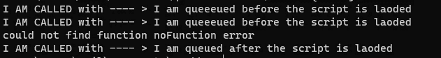
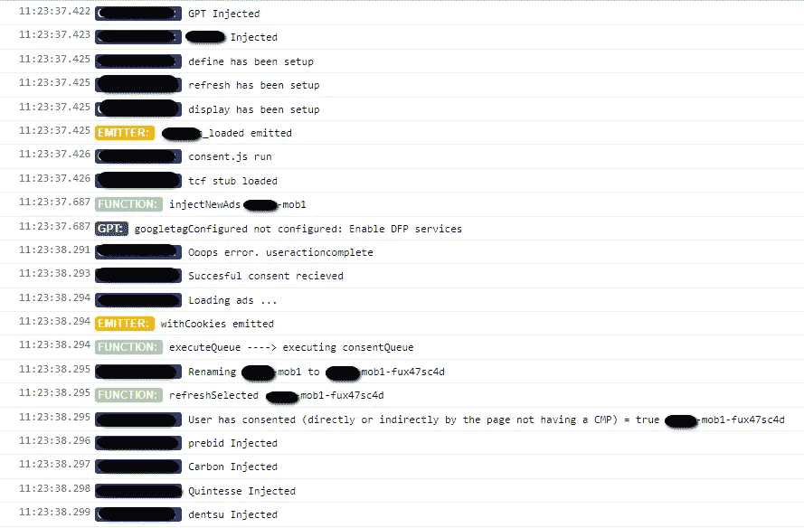

# 编写 JavaScript 库的 6 个技巧

> 原文：<https://javascript.plainenglish.io/6-tips-to-write-a-library-bb19dc83841c?source=collection_archive---------14----------------------->

## 我在编写要在客户网站上实现的库时学到的东西。

下面是我在编写一个要在客户网站上实现的库时学到的 6 个技巧。这意味着使用这个库的唯一方法是将其作为脚本加载到 HTML 中的某个地方。


JS external library

# 1.尽可能使它异步

由于我们是在与网络打交道，任何速度都是非常重要的，所以这个脚本应该完全异步执行是非常重要的。这意味着它不会阻止网站上正在执行的任何东西，你可以在网站的不同阶段加载。

# 2.实现命令队列

如果第一条被正确实施，这意味着如果一个网站必须与图书馆沟通，必须有一些时间上的协调。如果您试图在加载脚本之前执行库公开的命令，将会失败。这里的关键是我们希望能够在脚本加载并准备好的时候执行一个方法。为了解决这个问题，命令队列可以帮助我们。下面是一个简单的例子，可以展示一些基本知识:

上面将打印以下内容:



Command queue result

# 3.验证输入和默认参数

这一点将为我们节省大量时间。最重要的参数必须经过验证，如果没有设置，则默认为最重要的参数。这对于图书馆的内部工作非常重要，尤其是在客户必须与图书馆进行交互的情况下。

验证示例:

```
if (typeof someVar === "undefined") {
    throw Error(`Please setup the someVar option`);
 }
```

默认示例:

Default + optional params

# 4.实现调试标志

在构建一个外部库供其他网站使用的情况下，当它在客户的网站上使用时，偷看一下自己的库是非常有用的。为了实现这一点，我们需要一种方法来告诉库，我们想要调试它和/或在网站的上下文中查看关于库的附加信息。

一种方法是向查询字符串(页面的 URL)添加一个特定的键。这样我们就可以想出一个具体的键名，比如说:

```
?lib_debug=true
```

实现这一点的方法如下:

每当这个查询字符串出现在 URL 中时，我们将设置我们的库打印出关于运行时变量和内部库状态的附加信息。
如果您实现了一个简单的定制日志程序，您可以很容易地在控制台中得到如下内容:



Debug log for library

# 5.多多测试

因为大多数库，尤其是 web 库，将在各种各样的环境中使用。如果你有好的测试，你会有信心它在最正常的情况下工作。与所有其他测试一样，在编写哪种测试之间有一个权衡。单元测试很好，因为它们很快，应该能够验证你的库的一小部分。

如果这个库有一定的复杂性，那么花一些额外的时间来编写端到端测试会很有用。它们需要更长的时间来编写，但可以验证你的库在“现实生活”中的工作情况，在这种情况下，许多事情会发生变化，超出你的控制。

拥有一个好的测试套件的另一个很好的理由是 6:

> 没有好的测试，你不能可靠地重构。

# 6.重构和扩展

随着您的图书馆变得越来越大，您将需要更多的功能，并且您将会想到改进您的图书馆的新方法。实现这一点的唯一方法是不断重构你的代码。只要你的测试覆盖了最重要的部分，你就不应该害怕重构。

如果在你的重构发布后出现了问题，这仅仅意味着你的测试不够好。现在，这并不全是坏事。然后你将扩展你的测试，下次你必须重构的时候你会更加自信。

在我看来，这一切都归结于“提升”你的代码。

当然，bug 并不好，但是在某种程度上，它们几乎是不可避免的。每当我看到或发现一个 bug，我就把它看作是改进整体代码(测试、可读性、重构)的机会。

*更多内容请看*[***plain English . io***](https://plainenglish.io/)*。报名参加我们的* [***免费周报***](http://newsletter.plainenglish.io/) *。关注我们关于*[***Twitter***](https://twitter.com/inPlainEngHQ)*和*[***LinkedIn***](https://www.linkedin.com/company/inplainenglish/)*。加入我们的* [***社区不和谐***](https://discord.gg/GtDtUAvyhW) *。*