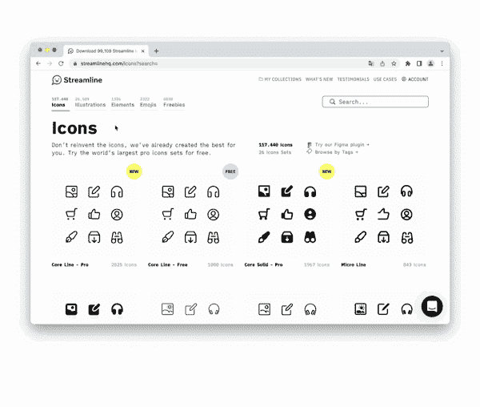
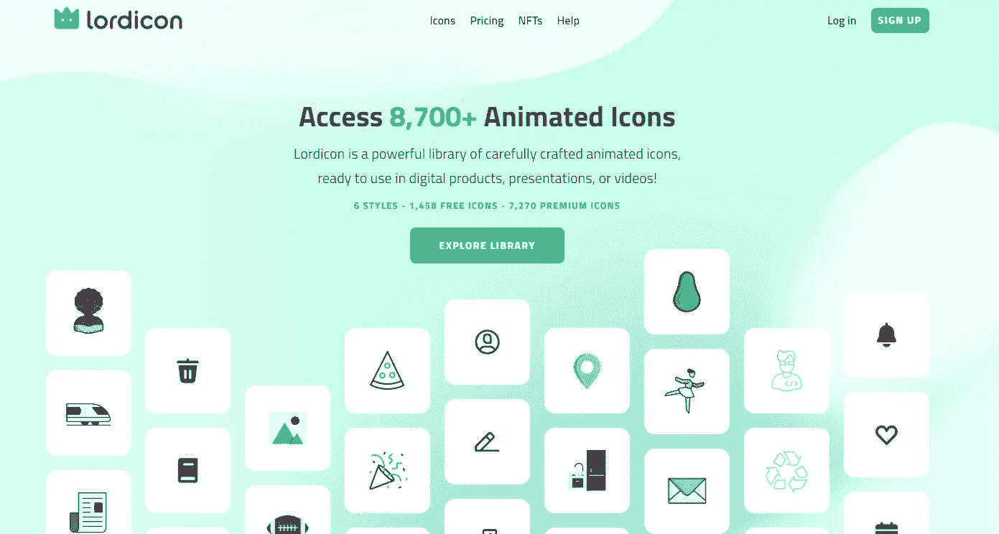
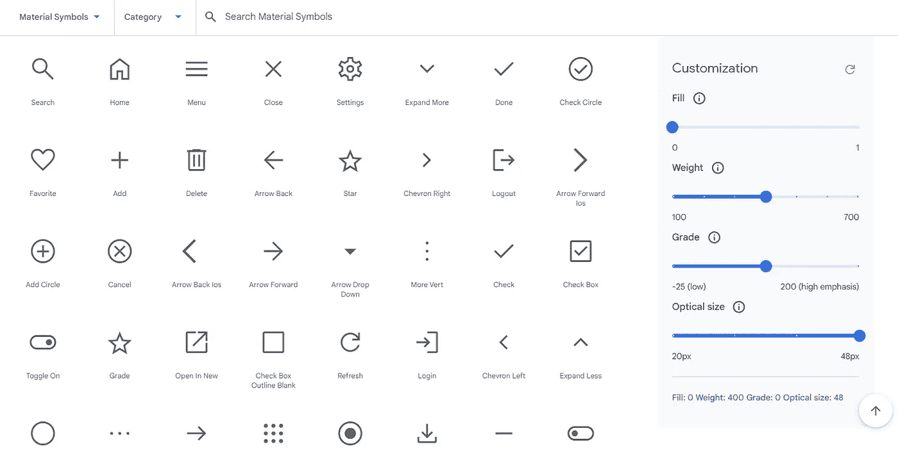
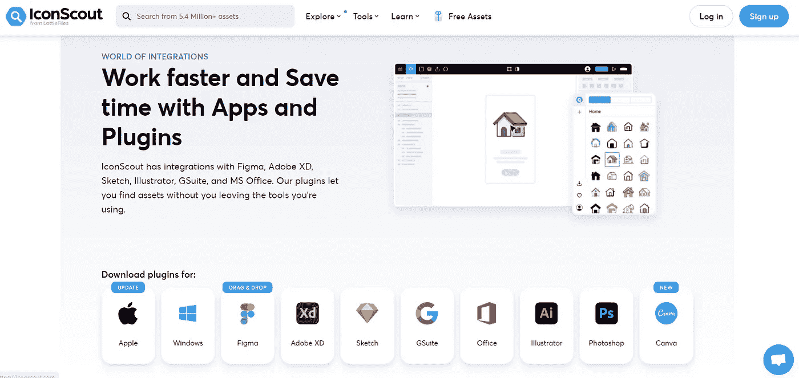
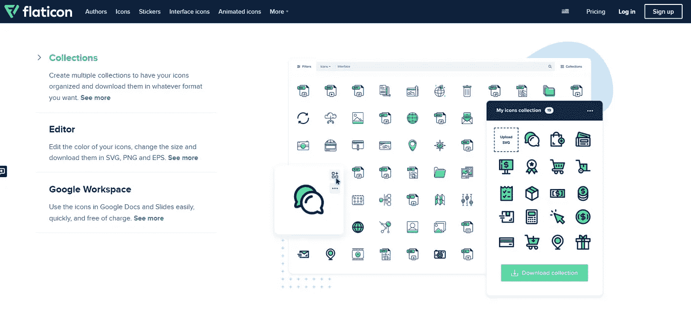
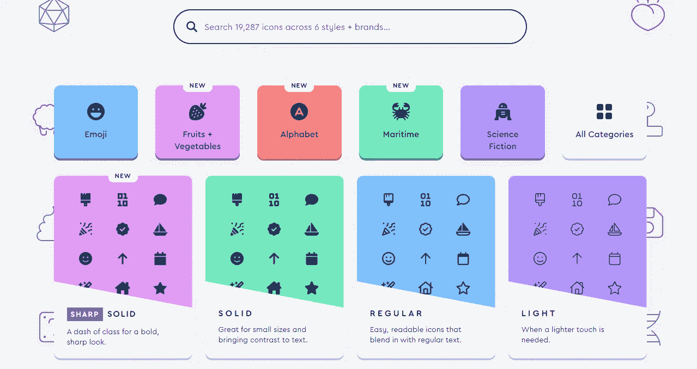

# 面向开发者和设计者的 6 大免费图标下载网站

> 原文：<https://javascript.plainenglish.io/6-top-free-icon-download-websites-for-developers-and-designers-9b114a1c7308?source=collection_archive---------4----------------------->

## 设计师和开发人员，在这些顶级图标网站上为你的下一个项目找到完美的图标。

[Streamlineh](http://streamlinehq.com)

网站多如牛毛，但是找到合适的图标就像大海捞针。

然而，我们已经为你做了艰苦的工作，并编制了一份五大图标网站的名单，肯定有你所寻找的。

你是否想要创造一个高质量的设计需要时间，从零开始或者尝试更新一个旧的。然而，使用大量的图标会有很大的帮助。

选择合适的图标对完成任何项目都是至关重要的——把它看作蛋糕上的樱桃。不幸的是，有这么多的选择，它可能需要时间来找出从哪里开始。但是不要害怕。我们是来帮忙的！

我们的六大图标网站肯定有你需要的，无论你是在寻找免费的还是优质的图标。

> 你还在等什么？开始浏览并下载！

# 6.洛迪肯

[Lordicon](https://lordicon.com/)

Lordicon 是一个为开发者和设计者提供一系列图标供选择的网站。

这个网站提供了广泛的分类，让你很容易为你的项目找到合适的图标。

您也可以在下载前编辑图标的属性。Lordicon 提供动画和静态两种格式供你下载。

# 5.谷歌字体(材料符号)

[Material Symbols](https://fonts.google.com/icons)

材料符号是我们最新的图标，在一个字体文件中整合了 2500 多种字形，具有广泛的设计变体。此外，符号有多种粗细可供选择，可用于浅色和深色背景。

我们的团队努力为您带来这套新符号，我们希望您喜欢在您的设计中使用它们。

有这么多选择，我们相信你会为你的下一个项目找到完美的符号。

如果你是一名开发人员或设计师，请访问我们的网站，查看材料符号字体。我们认为你会喜欢它的！

# 4.图标侦察

[iconScout](https://iconscout.com/)

IconScout 的网站上有各种各样的图标。您可以通过关键字搜索图标或浏览不同的类别。

一旦你找到一个你喜欢的图标，你可以下载你选择的格式。IconScout 还提供高级图标供购买。

如果你正在寻找一个可以找到高质量图标的网站，IconScout 是一个很好的选择。它们与流行程序的集成使得在不中断工作流程的情况下找到你需要的图标变得容易。

# 3.扁平图标

[Flaticon](https://www.flaticon.com/)

Flaticon 是一个为 web、iOS 和 Android 应用程序提供矢量图标的网站。该网站有超过 8300 个 SVG 和字体格式的图标。这些图标针对网络和移动设备进行了优化。

该网站提供了各种不同用途的图标。例如，有社交媒体、食物、旅行、天气等图标。该网站还提供搜索功能，可以快速找到所需的图标。

这些图标可以免费用于个人和商业项目。此外，你可以对网站上的所有图标进行无授权许可。

# 2.字体真棒

[Font Awesome](https://fontawesome.com/)

字体真棒是世界上最广泛的图标库和工具包。在一个地方有超过 6，000 个图标，很容易为您的下一个项目找到完美的图标。

设计师和开发人员喜欢字体真棒，因为它可以很容易地将专业外观的图标添加到他们的项目中。有了我们的新工具包，在你的设计中使用字体很棒的图标变得更加容易。

*   字体真棒是互联网上最著名的图标库和工具包。
*   数以百万计的设计师、开发人员和内容创作者使用字体 Awesome，它是图标的首选资源。
*   拥有超过 5000 个图标的字体库，每个人都有自己喜欢的字体。
*   无论你是在寻找社交媒体图标，交通图标，还是任何介于两者之间的图标，字体牛逼都可以满足你。
*   字体真棒还提供了一个工具包，使创建和定制您的图标变得容易。
*   该工具包包括一个矢量编辑器和图标字体生成器，可以轻松创建可在任何网站或应用程序上使用的高质量图标。

# 1.流线总部

[Streamlinehq](https://www.streamlinehq.com/)

Streamline 拥有世界上最广泛的集合，因此您不必将不完整的集合混合搭配在一起。相反，在几秒钟内定制所有 180，000 个图形。

有这么多的选项，你一定会为你的下一个项目找到完美的图标。此外，它们的所有图标都是可定制的，因此您可以轻松地为您的项目创建完美的外观。

*更多内容请看*[***plain English . io***](https://plainenglish.io/)*。报名参加我们的* [***免费周报***](http://newsletter.plainenglish.io/) *。关注我们关于*[***Twitter***](https://twitter.com/inPlainEngHQ)[***LinkedIn***](https://www.linkedin.com/company/inplainenglish/)*[***YouTube***](https://www.youtube.com/channel/UCtipWUghju290NWcn8jhyAw)*[***不和***](https://discord.gg/GtDtUAvyhW) *。对增长黑客感兴趣？检查* [***电路***](https://circuit.ooo/) *。***