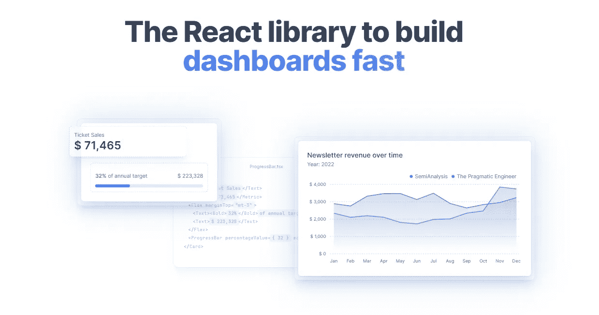
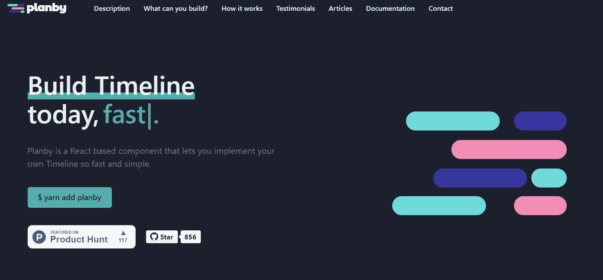
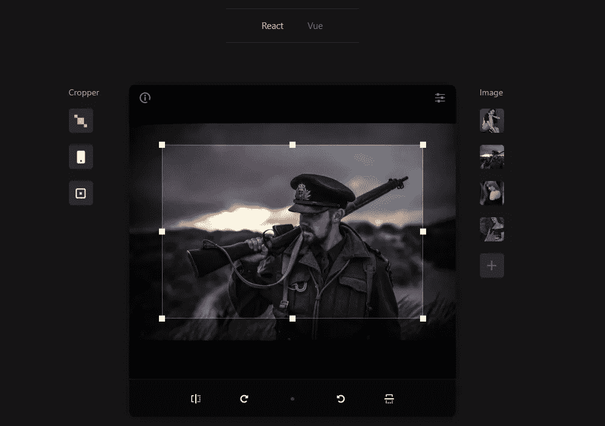
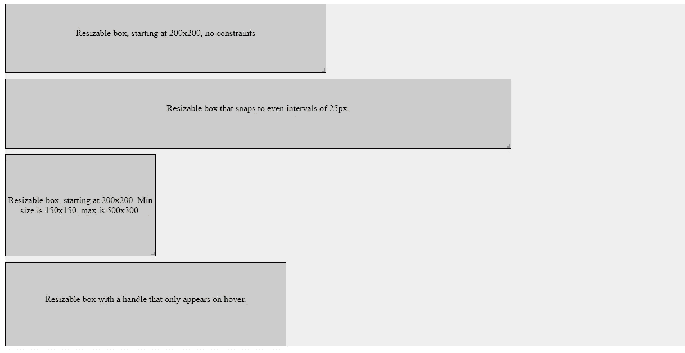
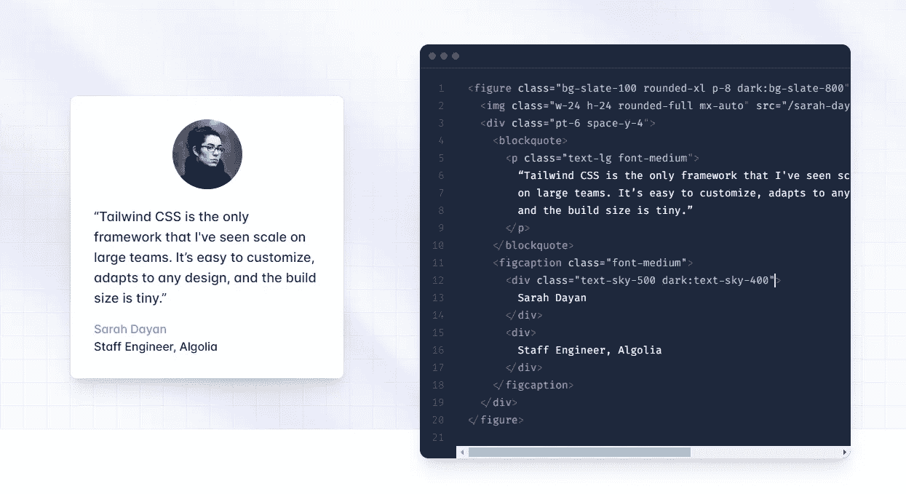
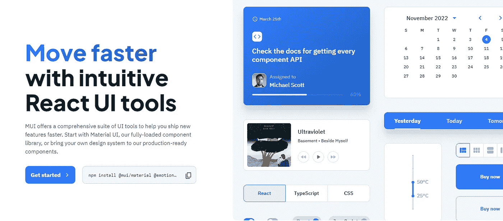

# 2023 年将使用的 6 个顶级 React 组件库

> 原文：<https://javascript.plainenglish.io/6-top-react-component-libraries-to-use-in-2023-435ca2573ca1?source=collection_archive---------2----------------------->

## 这些库将帮助您构建快速、高效且用户友好的应用程序。

Photo by [Tudor Baciu](https://unsplash.com/@baciutudor?utm_source=medium&utm_medium=referral) on [Unsplash](https://unsplash.com?utm_source=medium&utm_medium=referral)

在构建 React 应用程序时，您需要选择使用哪些组件。有这么多可用的选项，知道哪个库是最好的可能是一个挑战。然而，我们已经编制了 2023 年最佳 React 组件库的列表。这些库将帮助您构建快速、高效且用户友好的应用程序。

# 颤动

[Tremor](https://www.tremor.so/)

关于 UI 组件库，不能一刀切。这就是创建震颤的原因:提供一个低级的、自以为是的库，专门用于构建仪表板。它提供了您需要的所有基本组件，比如图表、布局和输入元素，并且涵盖了广泛的用例。因此，无论您是刚刚开始使用 React，还是正在为您的 dashboard 项目寻找特定的解决方案，震颤都值得一试。

# 普兰比

[Planby](https://planby.netlify.app/)

Planby 是一个快速实现 EPG 的组件，实时流时间线，时间表，音乐事件，时间线和更多的想法。

Planby 是一个强大且易于使用的 React 组件库，允许开发人员快速实现 EPG、实时流时间线、时间表、音乐事件、时间线和许多其他想法。

Planby 具有广泛的特性，使其成为当今最流行的 React 组件库之一。它的一些主要功能包括:

*   易于使用的 API 使得在项目中使用 Planby 变得简单。
*   广泛的预构建组件可用于快速构建复杂的应用程序。
*   优秀的文档使学习如何有效地使用 Planby 变得容易。

# 高级收割机

[Advanced Cropper](https://advanced-cropper.github.io/react-advanced-cropper/)

这个库允许你为你的网站设计创建自定义裁剪器。有了 React-Cropper，您不仅可以制作矩形切头机，还可以制作圆形或椭圆形切头机。如果需要，您可以旋转或放大您的裁剪器。如果你正在寻找一个比 React-Cropper 功能更多的库，那么看看 React-Image-crop。

# 反应反射

[React Reflex](https://strml.github.io/react-resizable/examples/1.html)

React 是一个用于构建用户界面的流行 JavaScript 库。ReFlex 是我创建的基于 React flex 的布局组件库，因为我找到的组件都不能满足我的要求。

**Reflex 提供了广泛的功能，例如:**

*   响应式网格系统
*   Sass 支持自定义样式
*   支持 RTL 布局
*   灵活易用的 API

# 顺风

[Tailwind](https://tailwindcss.com/)

Tailwind CSS 扫描您的 HTML 文件、JavaScript 组件和任何其他模板的类名，生成相应的样式，然后将它们写入静态 CSS 文件。Tailwind CSS 是一个实用优先的 CSS 框架，它使构建响应性网站变得容易。

Tailwind 扫描 HTML 文件、JavaScript 组件和任何其他模板中的类名，生成相应的 CSS 样式。这使得从 Tailwind 开始很容易，因为您不需要自己编写任何 CSS。Tailwind 也是高度可定制的，因此您可以更改元素的颜色、大小和间距，而无需编写任何 CSS。

# 材料用户界面

[Material UI](https://mui.com/)

Material UI 是一个库，它提供了实现 Google 材料设计指南的 React 组件。Material UI 易于使用和定制，对于希望创建漂亮用户界面的开发人员来说，这是一个极好的选择。

此外，material UI 在 MIT 许可下可用，因此可以在您的项目中免费使用。如果你正在寻找一个 React 组件库来帮助你创建漂亮的用户界面，Material UI 是一个很好的选择。

# 进一步阅读

 [## 2023 年最佳的 5 个 React UI 框架和组件库——开发者指南

### MUI，Saas UI，Mantine，Tailwind。基于组件多样性、性能和效率的 React UI 库综合指南

javascript.plainenglish.io](/best-react-ui-frameworks-and-component-libraries-408df66a1f31) 

*更多内容请看*[***plain English . io***](https://plainenglish.io/)*。报名参加我们的* [***免费周报***](http://newsletter.plainenglish.io/) *。关注我们关于*[***Twitter***](https://twitter.com/inPlainEngHQ)[***LinkedIn***](https://www.linkedin.com/company/inplainenglish/)*[***YouTube***](https://www.youtube.com/channel/UCtipWUghju290NWcn8jhyAw)*[***不和***](https://discord.gg/GtDtUAvyhW) *。对增长黑客感兴趣？检查* [***电路***](https://circuit.ooo/) *。***