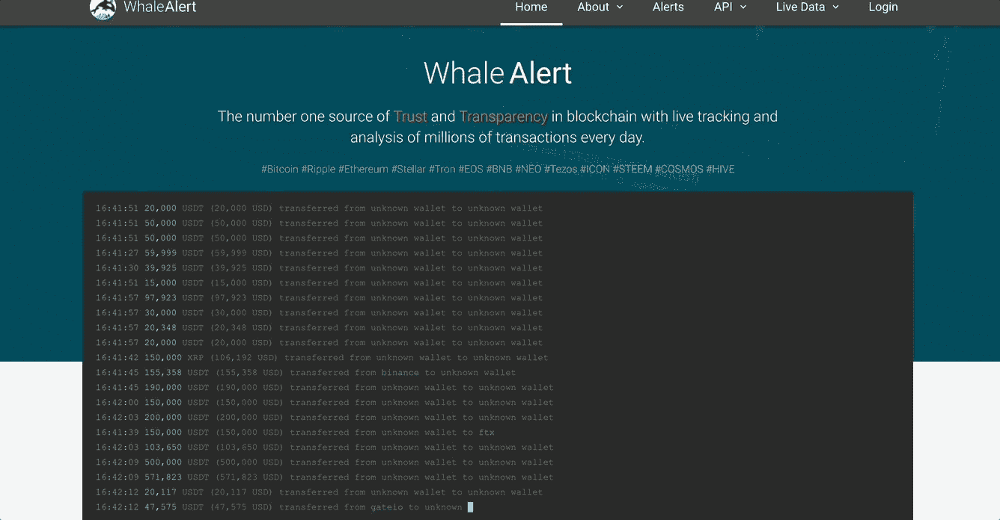
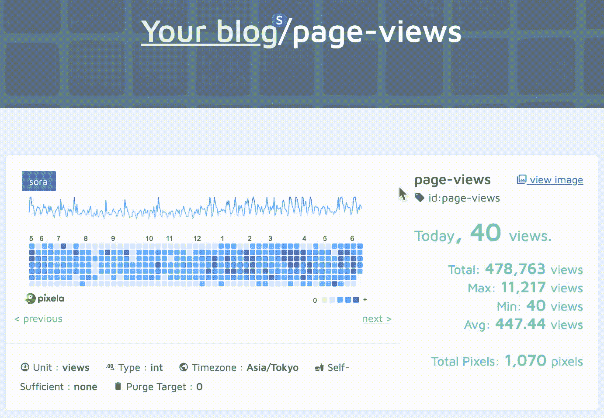

# 为您的下一个项目提供 6 个独特的 API 和想法

> 原文：<https://javascript.plainenglish.io/6-unique-apis-for-your-next-project-along-with-ideas-ea87a3175288?source=collection_archive---------4----------------------->

## 免费和不同的 API 来构建有趣的应用程序。


虽然标准的待构建项目列表包括像 todo 和社交登录网站这样的应用程序，这些应用程序对于培养编程的核心概念非常重要，但它们已经变得有点令人期待和可预测了。

独特的项目脱颖而出，构建这样的项目需要更多的时间和精力。

如果您知道独特的 API，并准备好数据供您使用，就不会这样。

下面是 6 个独特的 API 列表，您可以使用它们来构建独特的项目:

## 1.[趣味翻译](https://funtranslations.com/)


[Source](https://funtranslations.com/).

顾名思义，这个 API 可以将你的文本转换成有趣的翻译。

从尤达到海盗和莎士比亚，他们有各种各样的翻译版本。

仔细分类，你可以在这里找到一些有趣的翻译。您可以很容易地在项目中实现这个 API。

下面是 API 调用的示例输出:

```
{
  "success": {
    "total": 1
  },
  "contents": {
    "translated": "Lost a planet,  master obiwan has.",
    "text": "Master Obiwan has lost a planet.",
    "translation": "yoda"
  }
}
```

一个项目的想法是建立一个视觉上引人入胜的应用程序，为您选择的特定翻译提供动画。例如，如果你翻译了《权力的游戏》,那么就建立一个粉丝网站，在这些翻译中突出它。

你甚至可以建立一个聊天机器人，将它的回答转换成这些有趣的翻译。

## 2.[加密 API](https://whale-alert.io/)



[Source](https://whale-alert.io/).

Whale Alert 是一个流行的 API，当有大交易发生时，它会提醒您。

从比特币到 Ripple 再到 Hive，每次有‘鲸鱼’交易时，你都可以跟踪并得到通知。

虽然免费计划只有每分钟 10 个电话的限制，但你可以缓存这些响应，这样你就不会达到速率限制。

下面是一个事务的输出示例:

```
{
  "result": "success",
  "count": 1,
  "transactions": [
    {
      "blockchain": "ethereum",
      "symbol": "eth",
      "transaction_type": "transfer",
      "hash": "0015286d8642f0e0553b7fefa1c168787ae71173cbf82ec2f2a1b2e0ffee72b2",
      "from": {
        "address": "d24400ae8bfebb18ca49be86258a3c749cf46853",
        "owner": "gemini",
        "owner_type": "exchange"
      },
      "to": {
        "address": "07ee55aa48bb72dcc6e9d78256648910de513eca",
        "owner_type": "unknown"
      },
      "timestamp": 1549908368,
      "amount": 42000,
      "amount_usd": 5110718.5,
      "transaction_count": 1
    }
  ]
}
```

一个项目想法是创建一个 Twitter 机器人，使用这个 API 来获取数据。

人们可以来到你的网站，订阅你的服务，选择他们想要跟踪的硬币，他们可以在每次鲸鱼交易发生时从你的 Twitter bot 获得 DMs。

## 3. [Pixela API](https://pixe.la/?ref=devresourc.es)



[Source](https://pixe.la/?ref=devresourc.es).

Pixela 是一种不同类型的 API。它的目标是在 GitHub 启发的图表中映射您的习惯。

你可能知道，它面向熟悉 GitHub 接口的开发人员和开源贡献者。

你可以在这里找到许多有用的例子。

实现它的一种方法是测量开放拉取请求的数量。每次有新的 PR 时，您可以更新 Pixela 图，以便跟踪这样的请求。

这种 API 有一些创新的用例。

你可以用它开发的另一个应用是睡眠追踪器。这里有一篇讨论这个问题的文章[你可以翻译。](https://note.com/deer_naranara/n/n712e1dfb704c)

## 4. [AniList API](https://rapidapi.com/auth/sign-up?referral=/mikilior1/api/Anilist)


[Source](https://rapidapi.com/mikilior1/api/Anilist)

AniList 是动漫爱好者不可思议的平台。

超过 100，000 名用户使用它来跟踪、分享和发现他们最喜欢的动漫。

它由超过 500，000 个动画和漫画条目组成，只需一个 API 调用。

他们的 API 非常简单，非商业用途也是免费的。

就像有趣的翻译一样，你可以使用这个 API 提供的数据，围绕你喜欢的动漫和漫画建立一个网站。

您甚至可以将它与其他 API(如 [OMDb](https://www.omdbapi.com/) API)混合，围绕特定类型(如恐怖、喜剧或悬疑)构建一个网站。

## 5.[其他国家 API](https://restcountries.com/)

REST Countries 是我围绕其构建项目的第一批 API 之一，我只是喜欢探索你可以用它构建各种应用的可能性。

如果从名字上看不清楚，这是一个简单的 API，它通过 RESTful API 向您提供关于国家的信息。

该 API 使用起来非常直观，尽管我强烈建议缓存响应。

一个简单的电话就能让你开始。

```
[https://restcountries.com/v3.1/name/peru](https://restcountries.com/v3.1/name/peru)
```

根据您愿意投入的时间和精力，您可以使用这个 API 来构建各种应用程序。

一个简单的应用程序可以是一个包含这些国家及其国旗的目录的网站。

但你可以更进一步，创建一个测验应用程序。你可以展示一个国家的国旗，让用户猜 10 分。您可以允许提示(首都，货币等)，如果他们能够使用提示猜出国家，则将点数减少到 6。

不需要验证用户，您可以使用本地存储和 IndexedDb 来开始并跟踪用户分数。

## 6. [MealDB API](https://www.themealdb.com/api.php)


[Source](https://www.themealdb.com/api.php).

MealDB 为你提供膳食食谱。

你可以看到这道菜的缩略图、说明、食谱列表以及 YouTube 视频。

换句话说，你得到了建立一个美丽的食谱目录的一切。

对`[https://www.themealdb.com/api/json/v1/1/search.php?s=Arrabiata](https://www.themealdb.com/api/json/v1/1/search.php?s=Arrabiata)`的简单调用将返回我们上面讨论的所有属性。

围绕这个 API 的一个项目思想是通过地理位置进行划分。

API 支持按地区过滤(如印度、加拿大等)。

您可以要求用户选择一个位置，并基于此显示一个食谱列表。

使用这样的 API 时，缓存的重要性怎么强调都不为过。它减少了 API 主机端的负载和带宽，也让你的应用程序更快。

## 最后的想法

在你的投资组合中有独特的项目总是受欢迎的。

此外，构建这些项目是提高技能的好方法，在技术社区中分享这样的项目肯定会让成员感到有趣。

如果你喜欢读这篇文章，考虑使用[我的推荐链接](https://medium.com/@anuragkanoria/membership)，这样你就可以通过点击[这里](https://medium.com/@anuragkanoria/membership)无限制地访问我的博客以及其他作者的博客。

在整篇文章中，我还提到了缓存结果及其好处。实际上我已经写了一篇关于这个的博客，请随意查看:

[](/how-to-make-your-site-25x-faster-with-a-few-lines-of-code-e13056faac2a) [## 如何用几行代码让你的网站速度提高 25 倍

### 疯狂减少数据加载时间。

javascript.plainenglish.io](/how-to-make-your-site-25x-faster-with-a-few-lines-of-code-e13056faac2a) 

*更多内容看* [***说白了就是***](https://plainenglish.io/) *。报名参加我们的* [***免费周报***](http://newsletter.plainenglish.io/) *。关注我们关于*[***Twitter***](https://twitter.com/inPlainEngHQ)*和*[***LinkedIn***](https://www.linkedin.com/company/inplainenglish/)*。加入我们的* [***社区***](https://discord.gg/GtDtUAvyhW) *。*