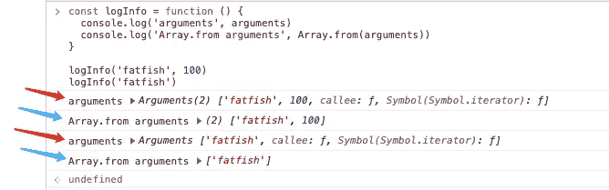

# ES6 中你必须知道的 6 个有用的数组函数

> 原文：<https://javascript.plainenglish.io/6-useful-array-functions-in-es6-you-must-know-about-60078891a2e9?source=collection_archive---------4----------------------->

## 让你少写多做的 6 ES6 小技巧。

Photo by [Steve Tsang](https://unsplash.com/@stevetsang?utm_source=medium&utm_medium=referral) on [Unsplash](https://unsplash.com?utm_source=medium&utm_medium=referral)

# 1.数组. from

从方法中，我们可以通过 Array.from 方法将类似数组的对象、arguments 对象和 NodeList 对象转换为真实的数组。

1.  **阵列状物体**

**2。节点列表**

**3。参数**

**4。Array.from 的第二个参数**

我们可以使用类似“[]的 Array.from 方法。地图”。

# 2.数组. of

**关于诡异数组函数:**

众所周知，我们可以通过数组函数做以下事情。

1.  初始化指定长度的数组
2.  设置数组的初始值

传递给数组函数的参数个数不一样，它的函数也不一样。这常常让我困惑。

好在我们可以用 Array.of 来弥补 Array 的不足。

# 3.包含

我们经常会写这样的判断语句，在满足其中一个条件的情况下做一些事情。

事实上，您可以通过 include 方法简化代码。

# 4.使用“at 方法”读取数组的尾部元素

如何读取数组的尾部元素？是的，我们需要用“array.length-1”作为下标来读取。

**还有别的办法吗？**

是的，“at”方法将是你的魔法。当然，您可以读取数组中其他位置的元素。

# 5.平的

from[MDN](https://developer.mozilla.org/en-US/docs/Web/JavaScript/Reference/Global_Objects/Array/flat):“flat()方法创建一个新数组，所有子数组元素递归地连接到该数组中，直到指定的深度。”

# 6.findIndex

from[MDN](https://developer.mozilla.org/en-US/docs/Web/JavaScript/Reference/Global_Objects/Array/findIndex):" find index()方法返回数组中满足所提供测试函数的第一个元素的索引。否则，它返回-1，表示没有元素通过测试。

# 最后

**感谢阅读。**我期待着您的关注和阅读更多高质量的文章。

 [## 记者:在 JavaScript 中(a==1 && a==2 && a==3)能计算为真吗？

### 是的，这可能是真的，而且有 6 种方式——太神奇了！

javascript.plainenglish.io](/interviewer-can-a-1-a-2-a-3-ever-evaluate-to-true-in-javascript-d2329e693cde)  [## “我失去了一个工作机会，只是因为承诺。所有”

### 一次让我好难过的面试经历。

javascript.plainenglish.io](/i-lost-a-job-opportunity-just-because-of-promise-all-be396f6efe87)  [## 采访者:“npm 跑 xxx”怎么了？

### 一个大多数人都不知道的秘密。

javascript.plainenglish.io](/interviewer-what-happened-to-npm-run-xxx-cdcb37dbaf44)  [## 面试官:可以“x！== x "在 JavaScript 中返回 True？

### 你可能不知道的五个神奇的 JavaScript 知识点！

javascript.plainenglish.io](/interviewer-can-x-x-return-true-in-javascript-7e1d1fa7b5cd)  [## 现在是 2022 年，不要再滥用箭头功能了

### 不应该使用箭头函数的 4 种情况。

javascript.plainenglish.io](/its-2022-don-t-abuse-the-arrow-function-anymore-905862a9c668) 

*更多内容请看*[***plain English . io***](https://plainenglish.io/)*。报名参加我们的* [***免费周报***](http://newsletter.plainenglish.io/) *。关注我们关于*[***Twitter***](https://twitter.com/inPlainEngHQ)[***LinkedIn***](https://www.linkedin.com/company/inplainenglish/)*[***YouTube***](https://www.youtube.com/channel/UCtipWUghju290NWcn8jhyAw)*[***不和***](https://discord.gg/GtDtUAvyhW) *。对增长黑客感兴趣？检查* [***电路***](https://circuit.ooo/) *。***