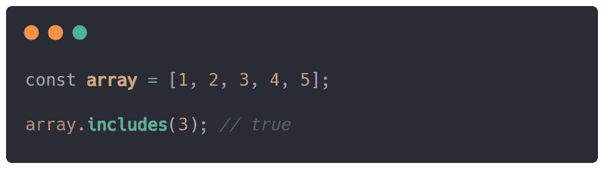
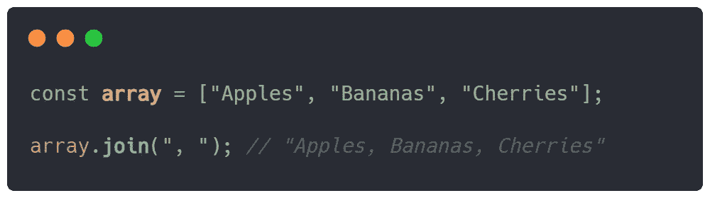
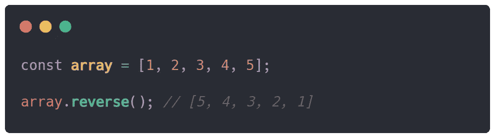
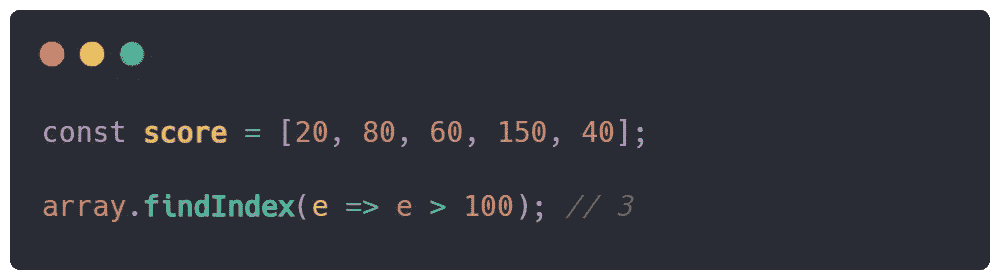
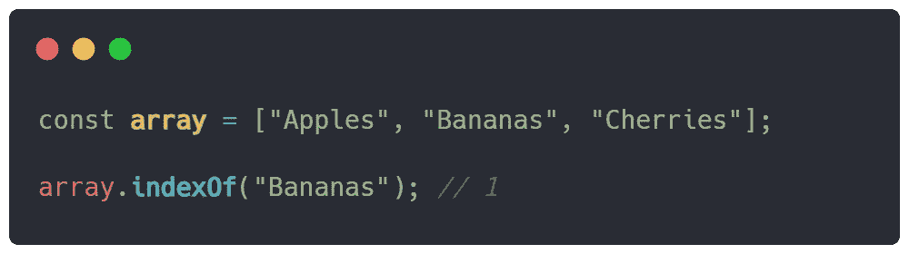
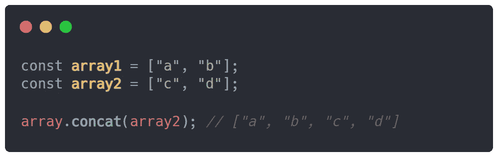

# JavaScript 中 6 个有用的数组方法

> 原文：<https://javascript.plainenglish.io/6-useful-array-methods-in-javascript-8bc9d6bc3c9?source=collection_archive---------11----------------------->

## Java Script 语言

## 6 个有用的数组方法让您的 JavaScript 生活变得轻松

Photo by [Glenn Carstens-Peters](https://unsplash.com/@glenncarstenspeters?utm_source=medium&utm_medium=referral) on [Unsplash](https://unsplash.com?utm_source=medium&utm_medium=referral)

JavaScript 中的数组是一个关键特性，用于在一个变量名下存储项目集合。数组有一组实现的方法，您可以使用它们来几乎无缝地修改它们的内容。这里有一些有用的数组方法，您可以在您的数组上使用。

## 包括()

顾名思义，方法`includes()`检查一个元素是否出现在它所调用的数组中。对于数组中的基本元素验证，这个方法是必须知道的。

该方法有 1 个参数— `includes(element)`，参数`element`将是要搜索的参数，如果找到或没有找到，该方法将返回一个布尔值。

an example of the include() method

## 加入()

方法`join()`将接受一个元素数组，并将它们连接成一个字符串值，元素之间有一个自定义分隔符。

该方法有一个参数— `join(delimiter)`，数组现在将被分隔符分隔成一个字符串值，该字符串值将被返回。

an example of the join() method

## 反向()

方法`reverse()`是一个操作性的方法，它改变调用它的原始数组并反转数组的元素。

该方法不接受任何参数，并返回反转的数组。注意，这个方法将原来的数组变成了相反的数组。

an example of the reverse() method

## findIndex()

方法`findIndex()`在给定数组中搜索满足条件的元素，然后返回该元素在数组中的索引/位置。如果找到匹配，则返回一个索引，否则返回`-1`。

该方法有 1 个参数— `findIndex(callback)`和 3 个参数— `findIndex((element, index?, array?))`。

Photo by [Agence Olloweb](https://unsplash.com/@olloweb?utm_source=medium&utm_medium=referral) on [Unsplash](https://unsplash.com?utm_source=medium&utm_medium=referral)

参数`element`是被搜索的元素，用作数组的元素迭代器，参数`index`保存数组中当前位置的值，参数`array`是被调用方法的初始数组。

an example of the findIndex() method

## 索引 Of()

方法`indexOf`搜索一组条目，并将它们与一个值进行比较。如果找到匹配，则返回一个索引，否则返回`-1`。

该方法采用两个参数— `indexOf(element, fromIndex?)`。参数`element`是我们观察搜索的值，参数`fromIndex`是搜索应该开始的地方。

an example of the indexOf() method

## concat()

方法`concat()`是 concatenation 的缩写，即将两个或更多的数组组合成一个数组，一个更加复合的数组。

该方法采用一个或多个参数— `concat(array-1, ..., array-n)`。从`array-1`到`array-n`的这些参数将与它被调用的初始数组相结合。

可以通过这种方法进行连接，但是您可以用一种更简单的方法来完成，即通过 spread 运算符。您可以获取想要组合的数组，并在一个数组内将它们串联起来— `[...array1, ...array2]`。

an example of the concat() method

## 结论

这些是我认为在我们的旅程中有用的数组方法。你现在也可以在你的项目中使用它们。我希望你喜欢我所说的每一种方法，并且理解得很好。

*更多内容看* [***说白了。报名参加我们的***](https://plainenglish.io/) **[***免费周报***](http://newsletter.plainenglish.io/) *。关注我们关于*[***Twitter***](https://twitter.com/inPlainEngHQ)*和*[***LinkedIn***](https://www.linkedin.com/company/inplainenglish/)*。查看我们的* [***社区不和谐***](https://discord.gg/GtDtUAvyhW) *加入我们的* [***人才集体***](https://inplainenglish.pallet.com/talent/welcome) *。***