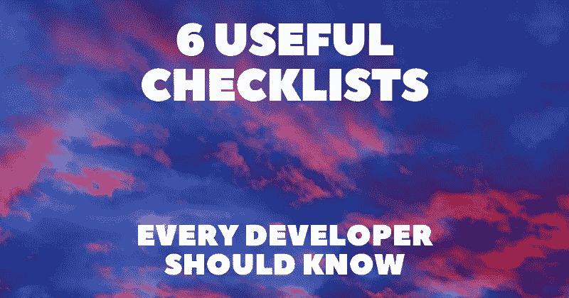

# 每个开发人员都应该知道的 6 个有用的清单📃💯

> 原文：<https://javascript.plainenglish.io/6-useful-checklists-every-developer-should-know-15bcbab44330?source=collection_archive---------13----------------------->

产品生命周期经常让我们对很多事情负责。即使你认为你知道所有的事情，为了确保万无一失，反复检查也是一个很好的做法。

在这篇文章中，我整理了一些最有用的清单。这些包括从设计和性能到产品发布、营销策略和互联网安全的一切。

我将提供直接链接和描述，这样你就可以马上得到一个洞察力。

## 1.[前端清单](https://github.com/thedaviddias/Front-End-Checklist)

> ⭐ GitHub stars 59k+

 [## github-the daviddias/前端清单:🗂现代网站的完美前端清单…

### 前端清单是一份详尽的清单，列出了你在启动网站之前需要测试的所有元素…

github.com](https://github.com/thedaviddias/Front-End-Checklist) 

HTML、CSS、JS、Webfonts、图像、安全性、性能、可访问性、SEO 以及更多你不想在下一个项目中错过的最佳实践。

为了更好的用户界面，还有一个[网站](https://frontendchecklist.io/)。

## 2.[设计清单](https://github.com/thedaviddias/Front-End-Design-Checklist)

> ⭐ GitHub stars 4k+

 [## GitHub-the daviddias/前端设计清单:💎创意网站的设计清单…

### 前端开发人员的设计清单是一个详尽的元素列表，可以帮助开发人员分析…

github.com](https://github.com/thedaviddias/Front-End-Design-Checklist) 

你想要对照网格系统检查的一切，颜色、字体和文本、链接和导航、图像和图标、表单和按钮、响应性网页设计和风格指南。

## 3.[性能检查表](https://github.com/thedaviddias/Front-End-Performance-Checklist)

> ⭐ GitHub 明星 14k+

 [## GitHub-the daviddias/前端-性能-清单:🎮唯一的前端性能清单…

### 🎮唯一一个运行速度比其他产品更快的前端性能清单。一个简单的规则:“设计和编码…

github.com](https://github.com/thedaviddias/Front-End-Performance-Checklist) 

关于如何通过各种 HTML、CSS 和 JS 技巧、图像和字体技术、服务器技巧和使用性能工具来提高性能的有价值的清单。

## 4.[发布清单](https://github.com/amilajack/project-checklist)

> ⭐ GitHub 星级 400+

 [## github-amilajack/project-check list:✅发布项目前要做的事情的清单

### 最好的项目自我推销将自述文件视为项目的电梯推介。保持简洁，并且…

github.com](https://github.com/amilajack/project-checklist) 

发布项目前要做的事情的清单。您将检查您的演示文稿、价值主张、项目质量、品牌、入职方法和融资模式。

## 5.[营销清单](https://draft.dev/learn/marketing-checklist)

一个全面的，按时间顺序排列的营销策略和想法的列表，你可以在你的创业中尝试。关于竞争对手/客户研究、电子邮件/博客/社交媒体设置、公共关系策略、免费和付费推广渠道列表的提示。

## 6.[个人安全检查清单](https://github.com/Lissy93/personal-security-checklist)

> ⭐ GitHub stars 7k+

 [## GitHub-lissy 93/个人安全清单:🔒包含 300 多条保护建议的精选清单…

### 一个精心策划的提示清单，以保护您的数字安全和隐私认证浏览网页电子邮件安全…

github.com](https://github.com/Lissy93/personal-security-checklist) 

一份精选的清单，包含 300 多条在现代网络时代保护数字安全和隐私的技巧。从身份验证、浏览、社交媒体和电子邮件到手机、安全信息和智能家居，无所不包。

写作一直是我的激情所在，帮助和激励他人给我带来了快乐。如果您有任何问题，请随时联系我们！

在 [Twitter](https://twitter.com/madzadev) 、 [LinkedIn](https://www.linkedin.com/in/madzadev/) 和 [GitHub](https://github.com/madzadev) 上给我接通！

访问我的[博客](https://madza.dev/blog)获取更多类似的文章。

*更多内容看* [***说白了。报名参加我们的***](https://plainenglish.io/) **[***免费周报***](http://newsletter.plainenglish.io/) *。关注我们*[***Twitter***](https://twitter.com/inPlainEngHQ)*和*[***LinkedIn***](https://www.linkedin.com/company/inplainenglish/)*。加入我们的* [***社区***](https://discord.gg/GtDtUAvyhW) *。***