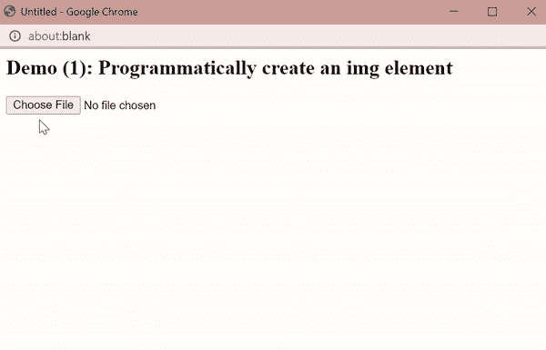
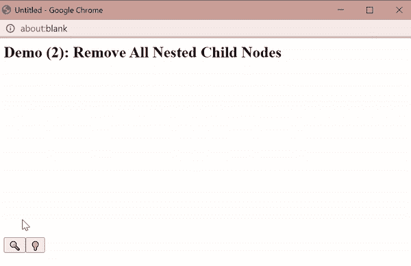
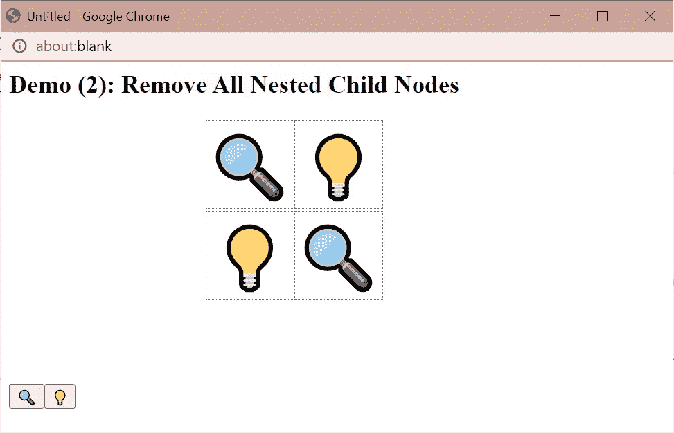
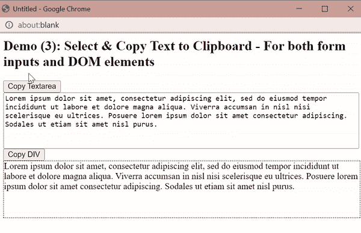
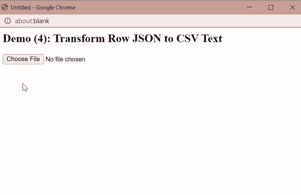
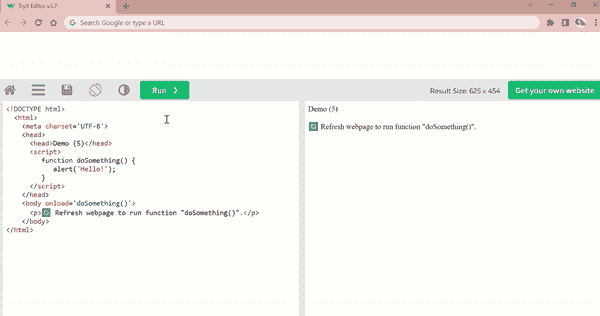
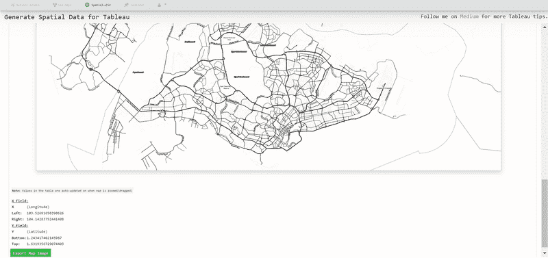

# 6 个非常有用的 JavaScript 代码片段

> 原文：<https://javascript.plainenglish.io/6-useful-javascript-code-snippets-cbab6a0fd887?source=collection_archive---------5----------------------->

## 第 3 部分:分享一个精选片段的列表，这些片段让我的日常任务变得简单多了。仅香草 JS。


Photo by [Fili Santillán](https://unsplash.com/es/@filisantillan?utm_source=medium&utm_medium=referral) on [Unsplash](https://unsplash.com?utm_source=medium&utm_medium=referral)

在 2022 年的整个上半年，我这边所有创建离线数字生产力工具的尝试都有成功和失败。然而，技术探索和反复试验对我个人的学习之旅来说是有价值和有见地的。本文将与之前发表的两篇文章相似:

## 第一部分 [**6 个有用的 JavaScript 代码片段**](/6-useful-javascript-code-snippets-91424efd1c55)

[](/6-useful-javascript-code-snippets-91424efd1c55) [## 6 个有用的 JavaScript 代码片段

### 这个列表可能很主观，但我还是分享了我自己的版本。示例和代码。

javascript.plainenglish.io](/6-useful-javascript-code-snippets-91424efd1c55) 

## 第二部分。 [**6 个有用的 JavaScript 代码片段**](/6-useful-javascript-code-snippets-part-ii-1b30b79bcb0f)

[](/6-useful-javascript-code-snippets-part-ii-1b30b79bcb0f) [## 6 个有用的 JavaScript 代码片段

### 第 2 部分:针对常见用例的 JavaScript 一行程序和函数的编译列表。没有插件。仅香草 JS。

javascript.plainenglish.io](/6-useful-javascript-code-snippets-part-ii-1b30b79bcb0f) 

本文将根据我最近的使用案例，展示一系列方便的 JavaScript 代码片段。


Photo by [Jexo](https://unsplash.com/@jexo?utm_source=medium&utm_medium=referral) on [Unsplash](https://unsplash.com?utm_source=medium&utm_medium=referral)

# 1.创建一个 DOM 元素

## 用法示例



Screencapture by Author | Uploading an image file for render

**注意:**虽然大多数 HTML 元素节点(例如`<div>` `<p>`)的属性都是可访问的，并且不需要“加载”事件的监听器，但是``是这个规则的一个例外(另一个唯一的例外是`<script>`)

因此，如果在`document.createElement('img')`时没有返回`Promise`:

```
var loadedImg=document.createElement('img');
loadedImg.src=<dataURL>; // dataURL refers to the encoded image data
```

变量`loadedImg`不会被渲染，因为当属性`src`被赋值时，它仍然是未定义的。

# 2.移除所有嵌套的子节点

## 用法示例



Screencapture by Author | Displayed icon is rendered on Canvas. On toggle, the Canvas is removed as a child element before appending a new Canvas with the selected icon.

**注意:**函数`removeAllChildNodes()`使用递归移除所有嵌套元素。这对于防止先前不需要的子节点与后续附加的子节点累积是必要的，如下所示:



Screenshot by Author | The above showcases the output display in the event the previous child nodes were not removed, which is incorrect since the buttons are meant to toggle a single icon displayed based on user selection.

# 3.选择文本并将其复制到剪贴板—包括表单输入和其他 HTML DOM 元素

## 用法示例



Screencapture by Author | The top element is a <textarea> | The bottom element is a <div> block | In both instances, the same function is called to select and copy text to clipboard.

虽然“复制到剪贴板”是最普遍需要的 JavaScript 函数之一，但同样值得注意的是，所需的文本内容既可能包含在表单元素中，如— `<input type='text'>` `<textarea>`，也可能嵌入在 HTML DOM 元素中，如— `<div>` `<p>`。

因此，这个函数通过检查文本内容是否出现在 HTMLInputElement 或 HTMLDivElement 中来解决如何在 JavaScript 中实现文本选择的问题。然后分别选择属性`.value`和`.innerText`。

# 4.将 JSON 对象的数组转换为 CSV 文本

## 用法示例

链接到用于演示的示例数据文件: [icd10_data.json](https://gist.githubusercontent.com/incubated-geek-cc/9936fdf9d1c91601dda5a92fb12496df/raw/da815d7b2f4340d7db67aa2d2a2fdcb74d371c8b/icd10_data.json)



Screencapture by Author | Upon upload of JSON file (at [icd10_data.json](https://gist.githubusercontent.com/incubated-geek-cc/9936fdf9d1c91601dda5a92fb12496df/raw/da815d7b2f4340d7db67aa2d2a2fdcb74d371c8b/icd10_data.json)), CSV output is rendered as shown.

链接到输出 CSV 文件: [icd10_data.csv](https://gist.githubusercontent.com/incubated-geek-cc/0907136dc340b8b688e8a5b6c76d47a3/raw/1fba5bca1fe0f790f01036cfdf17128615c2a57b/icd10_data.csv)

## 基本原理

按照惯例，我倾向于使用插件[json csv . js](https://raw.githubusercontent.com/incubated-geek-cc/browserify-demo/main/json2csv.js)(最初来自[https://www.npmjs.com/package/json2csv](https://www.npmjs.com/package/json2csv))进行 JSON 到 CSV 的转换。然而，**对于超过 50MB 的大文件来说**，递归算法超过了它的最大堆栈限制，这是我在尝试将文件上传到我在[https://tableau-data-utility.herokuapp.com/](https://tableau-data-utility.herokuapp.com/)开发的 web 实用程序时发现的🌐【spatial⇢csv】标签页

*(仅供参考:关于用法的详细信息，请参考下文)*

[](https://towardsdatascience.com/underrated-combined-functionalities-of-tableau-point-linestring-polygon-mapping-b4c0568a4de2) [## 低估了 Tableau 的组合功能—点、线串和多边形映射

### Tableau 中的地理空间分析-无需地理编码/底图服务即可工作+渲染混合几何类型…

towardsdatascience.com](https://towardsdatascience.com/underrated-combined-functionalities-of-tableau-point-linestring-polygon-mapping-b4c0568a4de2) 

由于地理空间数据集往往超过 50MB，实现上述函数用于 JSON 到 CSV 的转换解决了递归问题。

## 限制

只适用于深度级别为 1 的嵌套 JSON 对象。如果输入深度级别更大的 JSON 对象，将无法正常工作。例如，当第一个条目`"likes"`的**深度级别= 2** 时，下面的操作将失败

```
[
   { 
    "firstName":"John", 
    "lastName":"Doe",
    "likes": {
     "pets": ["dogs","cats"]
    }
   },
   { 
    "firstName":"Anna", 
    "lastName":"Smith" 
   }
]
```

# 5.DOMContentLoaded 事件侦听器

## 用法示例

当一个功能需要在网页加载后立即执行时，一种可能的方法是将`onload`事件嵌入到`<body>`标签中:



Screencapture by Author | Demo of onload event in <body> tag

**注意:****常见的错误是执行嵌套在`windows.onload`中的函数:**

**因此，为了对所有嵌入的 JavaScript 代码片段进行更有组织的划分，使用下面的代码:**

```
document.addEventListener('DOMContentLoaded', function() { ... });
```

**可以考虑改为:**

****

**Screencapture by Author | Note that the function doSomething() runs despite being situated below the <body> tag.**

# **6.将多个事件绑定到一个 HTML 元素**

## **用法示例**

**在我之前构建的 [web 实用程序](https://tableau-data-utility.herokuapp.com/)中，包含了跟踪所显示地图的地理坐标的功能，如下所示:**

****

**Screencapture by Author | Note that as the map is dragged/zoomed, the coordinates displayed on the bottom lefthand corner changes correspondingly.**

**现在你知道了！非常感谢你坚持到这篇文章的结尾！❤希望你觉得这个指南有用，如果你想了解更多 GIS、数据分析& Web 应用相关的内容，请随时[关注我的 Medium](https://medium.com/@geek-cc) 。会非常感激—😀**

**— 🌮请给我买一份玉米卷🎀˶❛◡❛)**

**[](https://geek-cc.medium.com/membership) [## 通过我的推荐链接加入灵媒——李思欣·崔

### 获得李思欣·崔和其他作家在媒体上的所有帖子！😃您的会员费直接…

geek-cc.medium.com](https://geek-cc.medium.com/membership) 

*更多内容请看*[***plain English . io***](https://plainenglish.io/)*。报名参加我们的* [***免费周报***](http://newsletter.plainenglish.io/) *。关注我们关于*[***Twitter***](https://twitter.com/inPlainEngHQ)*和*[***LinkedIn***](https://www.linkedin.com/company/inplainenglish/)*。查看我们的* [***社区不和谐***](https://discord.gg/GtDtUAvyhW) *加入我们的* [***人才集体***](https://inplainenglish.pallet.com/talent/welcome) *。***