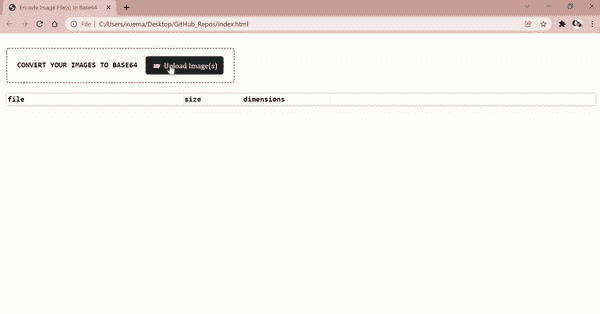

# 6 个有用的 JavaScript 代码片段

> 原文：<https://javascript.plainenglish.io/6-useful-javascript-code-snippets-part-ii-1b30b79bcb0f?source=collection_archive---------18----------------------->

## 第 2 部分:针对常见用例的 JavaScript 一行程序和函数的编译列表。没有插件。仅香草 JS。


Photo by [Juanjo Jaramillo](https://unsplash.com/@juanjodev02?utm_source=medium&utm_medium=referral) on [Unsplash](https://unsplash.com?utm_source=medium&utm_medium=referral)

在过去的几个月里，当我在业余时间开发离线浏览器工具时，我发现自己在我收藏的`.js`文件中反复搜索，以检索旧的代码片段。因此，我认为使用下面的经常使用的 JavaScript 方法列表作为参考，可能对与我有相似用例的其他人有益。

## 仅供参考——关于❝6 实用 JavaScript 代码 Snippets❞的第一部分，请参考:

[](/6-useful-javascript-code-snippets-91424efd1c55) [## 6 个有用的 JavaScript 代码片段

### 这个列表可能很主观，但我还是分享了我自己的版本。示例和代码。

javascript.plainenglish.io](/6-useful-javascript-code-snippets-91424efd1c55) 

## 1.通知未保存的更改

```
window.addEventListener('beforeunload', (event) => {
  event.preventDefault();
  event.returnValue = '';
});
```



Screencapture by Author | Demo of the code snippet below i.e. A “double confirmation” is necessary before a browser page closed.

当用户在输入字段中输入了未保存的数据，并且如果页面被卸载，这些数据将会丢失时，上面的代码片段特别有用。在上图中，用户上传了几个图像文件后，浏览器会继续提示用户是否保存了图像输出以防止数据丢失。

## 2.异步上传多个文件

上面的代码片段确保在浏览器继续执行注释后的代码逻辑之前，所有上传的图像文件已经被编码成 Base64 字符串(`fileredr.**readAsDataURL**(file);`):

```
/* TO DO LOGIC HERE */
```


Screencapture by Author | The above executes the code logic below the comment | An image node is created for each image file uploaded and appended to the <body></body> of the HTML document.

## 3.insertAdjacentHTML—before begin | after begin | before end | after end

回头参考**点 1)** 中的截屏，可以通过`**insertAdjacentHTML(<position>,<HTML String>)**`将 HTML 添加到元素中:

```
<Element>.insertAdjacentHTML('beforeend'|'afterbegin'|'beforeend'|'afterend', <HTML String>);
```

下图说明了每个选项相对于`<Element>`(即`<p></p>`)的位置:

```
<!-- beforebegin -->
<p>
  <!-- afterbegin -->
  foo
  <!-- beforeend -->
</p>
<!-- afterend -->
```

由于在**点 1)** 中，目标是附加额外的表格行(`<tr></tr>`)，所以使用了位置`beforeend`。

## 4.检查 JSON 字符串是否有效

由于我在业余时间创建的大多数离线浏览器实用程序都需要用户上传数据文件，其中一些文件需要是 JSON 格式的，所以对 JSON 文件进行数据格式验证检查的一种简单而直接的方法是:

```
function isValidJSON(str) {
  try {
    JSON.parse(str);
    return true;
  } catch (e) {
    return false;
  }
}
// returns a Boolean
```

## 5.将原始 HTML 字符串编码成 Unicode 实体

```
function encodeHTMLChars(rawStr) {
  return rawStr.replace(/[\u00A0-\u9999<>\&]/g, ((i) => `&#${i.charCodeAt(0)};`));
}
```

要在 HTML 页面上显示文本 **< img >** ，字符串必须编码如下:

```
var inputHTMLStr='';
var encodedHTMLStr=encodeHTMLChars(inputHTMLStr);
console.log(encodedHTMLStr); 
// Output: &#60;img&#62;
```

当需要在网页上显示 HTML 代码片段时，这通常很方便，因为其原始形式，即 **" < img > "** 被浏览器自动解释为 HTML DOM 元素，而不是用于显示的原始文本。

## 6.将 XML 转换成 JSON

2 个利用率最低的 JavaScript APIs 包括: [DOMParser()](https://developer.mozilla.org/en-US/docs/Web/API/DOMParser) 和[DOM parser . parsefromstring()](https://developer.mozilla.org/en-US/docs/Web/API/DOMParser/parseFromString)

即使像 [xml-js](https://www.npmjs.com/package/xml-js) 和 [xml2js](https://www.npmjs.com/package/xml2js) 这样的 npm 包很容易获得，这个逻辑也可以通过普通的 JavaScript 实现，如下所示:

**免责声明:**以上代码逻辑最初由[**David Walsh**](https://davidwalsh.name/)**在** [**将 XML 转换为 JSON**](https://davidwalsh.name/convert-xml-json) 实现。

我的文章到此结束！非常感谢你坚持到最后！❤希望你觉得这很有用，如果你想了解更多与网络相关的内容，请随时关注我的 [Medium](https://medium.com/@geek-cc) 地理空间分析&数据分析。会非常感激—😀

— 🌮请给我买一份玉米卷🎀˶❛◡❛)

[](https://geek-cc.medium.com/membership) [## 通过我的推荐链接加入灵媒——李思欣·崔

### 获得李思欣·崔和其他作家在媒体上的所有帖子！😃您的会员费直接…

geek-cc.medium.com](https://geek-cc.medium.com/membership) 

*更多内容请看*[***plain English . io***](http://plainenglish.io/)*。报名参加我们的* [***免费每周简讯***](http://newsletter.plainenglish.io/) *。在我们的* [***社区***](https://discord.gg/GtDtUAvyhW) *获取独家写作机会和建议。*