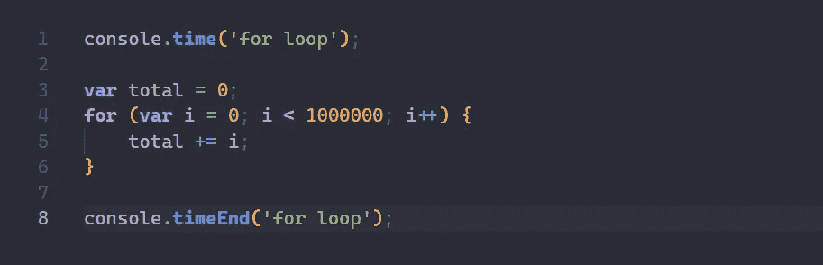
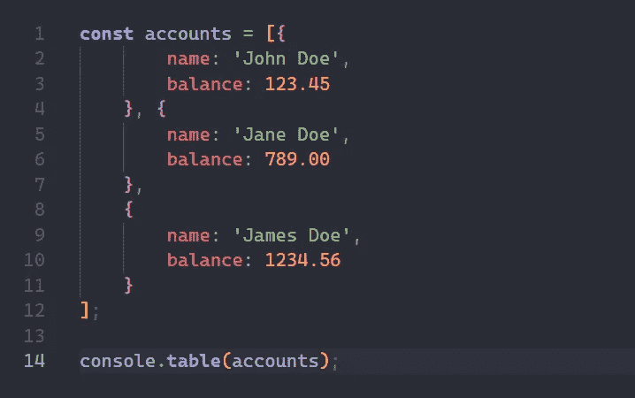
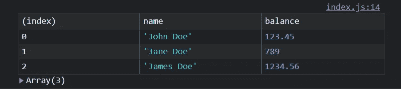
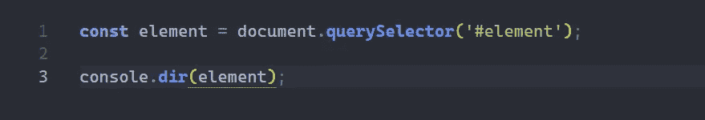
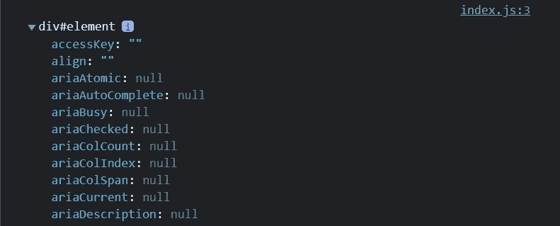
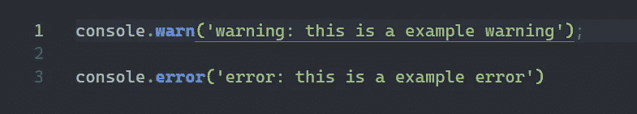
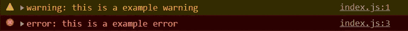
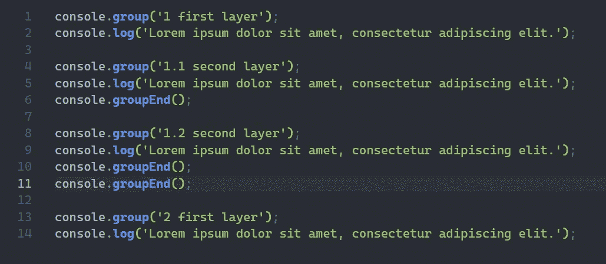
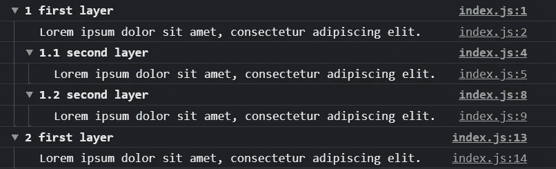
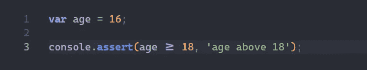

# 你不太可能知道的 6 个有用的 JavaScript 控制台方法

> 原文：<https://javascript.plainenglish.io/6-useful-javascript-console-methods-you-are-unlikely-to-know-of-85b8db049efd?source=collection_archive---------13----------------------->

## Java Script 语言

## 可以用作 console.log 替代方法的有用控制台方法


Photo by [Stephen Dawson](https://unsplash.com/@dawson2406?utm_source=medium&utm_medium=referral) on [Unsplash](https://unsplash.com?utm_source=medium&utm_medium=referral)

你很快就会厌倦每次都用同样的方式在控制台上登出同样的东西。没有合适的工具，调试会非常累人。因此，我列出了一系列可供选择的控制台方法，这些方法是普通 JavaScript 提供的，用来代替传统的`console.log`。

## #1 时间和结束时间

如果你想测量代码范围执行的时间，那么你可以使用`time`和`timeEnd`方法。如果你想记录算法的时间复杂度或者只是一般的代码范围，这些方法是很棒的。这些方法采用 1 个参数:*标签*，用于标识时间计数器及其结束计数器。

```
console.**time**('label name');
console.**timeEnd**('label name');
```



console: time & timeEnd methods

## #2 表

`table`方法非常适合注销一长串对象。这可以帮助您比通常的控制台日志记录更快地遍历数组，并有更好的概览；只需传递一个数组就可以了。在控制台中，您将看到一个表，每个属性作为一列，其中一个属性已经为数组中的对象索引创建了一列。



console: table method

## #3 目录

`dir`方法用于面向对象注销 HTML 元素。如果你使用这个方法，你可以看到每个元素的单独属性，而不用 HTML 元素显示标签和类，这不如 dir 方法清楚。



console: dir method

## #4 警告和错误

`warn`和`error`方法，顾名思义，是可以用来警告(例如，不赞成)或记录错误的方法，用特定的字符串作为警告/错误，以及在哪一行调用了该方法。



console: warn & error methods

## #5 组和组端

`group`和`groupEnd`方法用于在控制台中缩进和突出列表。有了这些方法，你可以创建一个有组织的列表，最终用户阅读和理解起来肯定比普通的`console.log`更清晰。您可以拥有任意多的层(例如书籍中的目录页)。group 方法将启动列表的缩进，而 group end 将向回突出特定的层。



console: group & group end methods

## #6 断言

`assert`方法用于检查传递给它的条件的真实性。该方法有两个参数:*条件* & *标签*。如果条件为假，控制台中将显示一个错误及其标签；如果条件通过，则什么都不会发生。这与其他编程语言中的单元测试非常相似。



console: assert method

## **结论**

我希望你喜欢你可以使用的替代方法列表，而不仅仅是简单的`console.log`。如果你从现在开始使用这些更好的方法，我会非常高兴，它们会帮助你未来的项目更快更有效。

*更多内容尽在* [***说白了. io***](https://plainenglish.io/) *。报名参加我们的* [***免费周报***](http://newsletter.plainenglish.io/) *。关注我们关于* [***推特***](https://twitter.com/inPlainEngHQ) *和*[***LinkedIn***](https://www.linkedin.com/company/inplainenglish/)*。加入我们的* [***社区***](https://discord.gg/GtDtUAvyhW) *。*